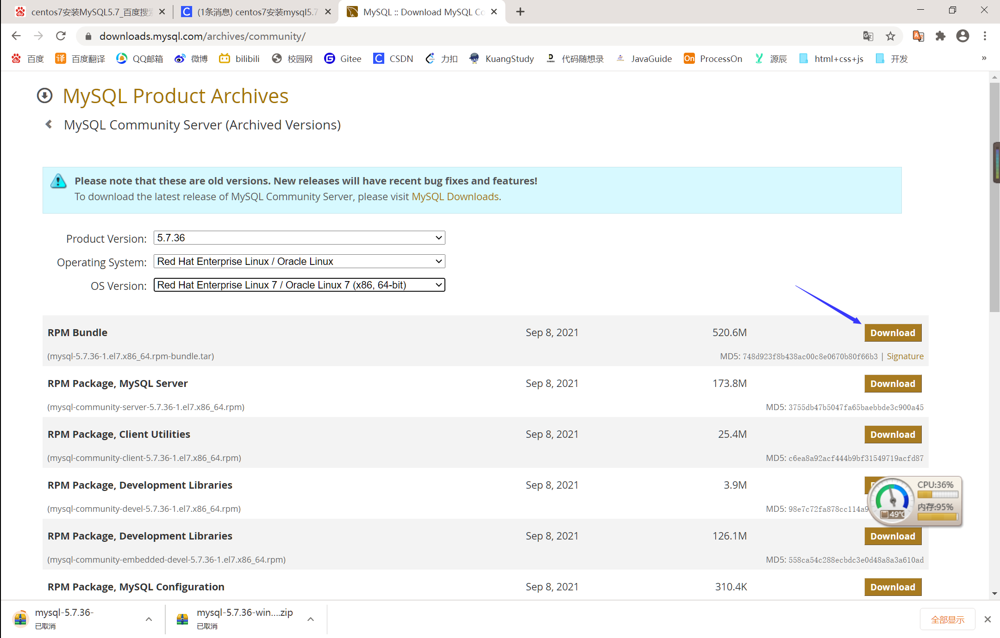
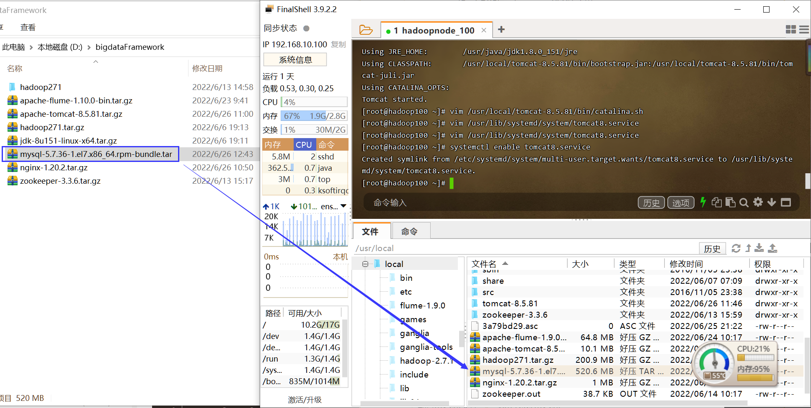
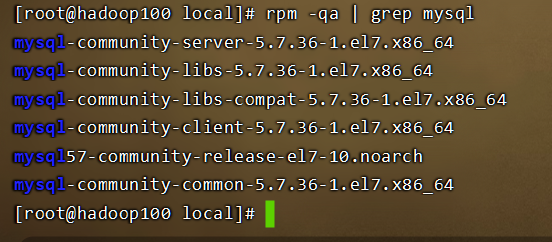
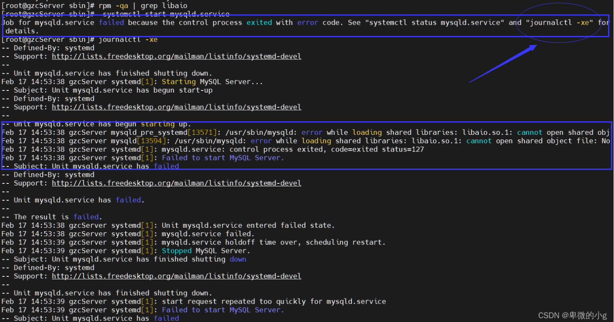
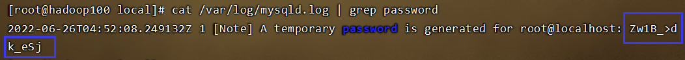
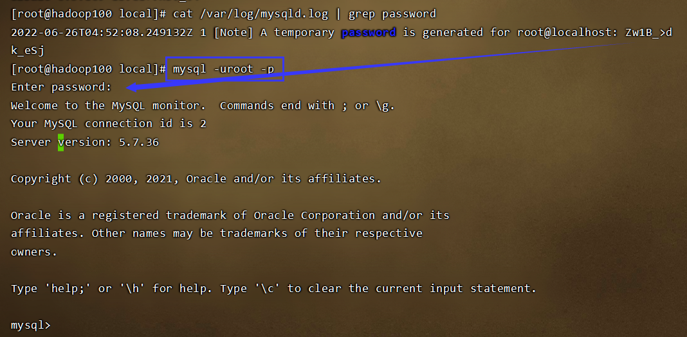
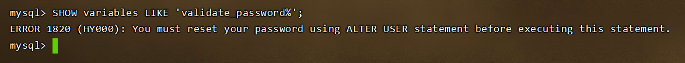
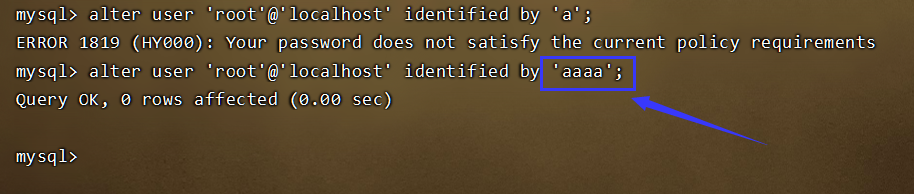
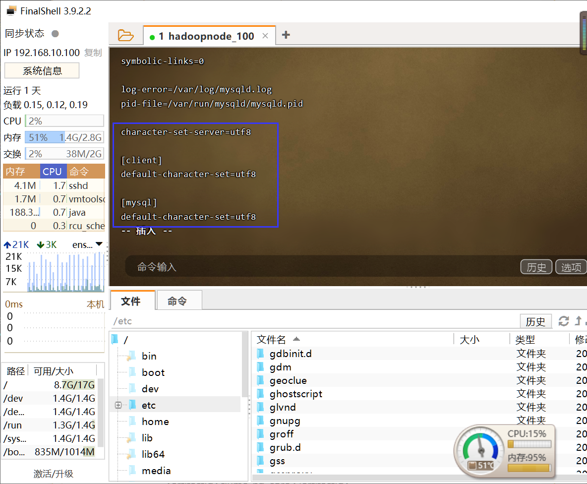

# Linux安装MySQL5

## 一、卸载Mysql或者Maridb

若Linux中安装了Mysql或者Maridb以下语句会有输出

```java
rpm -qa|grep mysql
rpm -qa|grep mariadb
```

卸载Mysql或者Maridb

```java
rpm -e --nodeps mysql-libs-5.1.73-7.el6.x86_64
rpm -e --nodeps mariadb-libs-5.5.56-2.el7.x86_64
```

## 二、下载，解压，重命名

### 1.下载

下载地址：[https://downloads.mysql.com/archives/community/](https://downloads.mysql.com/archives/community/)



### 2.上传



### 3.解压

```java
tar -xvf mysql-5.7.36-1.el7.x86_64.rpm-bundle.tar
```

## 三、安装MySQL

### 1.依次安装所需要的rpm包

如果出现报错则在上面命令最后加上`--force --nodeps`

```java
rpm -ivh mysql-community-common-5.7.36-1.el7.x86_64.rpm
rpm -ivh mysql-community-libs-5.7.36-1.el7.x86_64.rpm
rpm -ivh mysql-community-libs-compat-5.7.36-1.el7.x86_64.rpm
rpm -ivh mysql-community-client-5.7.36-1.el7.x86_64.rpm
rpm -ivh mysql-community-server-5.7.36-1.el7.x86_64.rpm
```

### 2.查看安装情况

```java
rpm -qa | grep mysql
```



## 四、启动MySQL

### 1.启动

```java
systemctl start mysqld.service
```


如果启动报错可以执行`journalctl -xe`指令查看错误信息

### 2.报错

若报错如下图



首先查看是否安装了libaio

```java
rpm -qa | grep libaio
```

若未安装则安装

```java
yum install -y libaio
```

再次启动MySQL即可

```java
systemctl start mysqld.service
```

## 五、设置新密码

### 1.查看初始密码

该初始密码需要记住，后面会用到

```java
cat /var/log/mysqld.log | grep password
```



### 2.使用初始密码登陆MySQL

```java
mysql -uroot -p
```



### 3.重置密码

①输入以下命令发现报错如下

```java
SHOW variables LIKE 'validate_password%';
```



②`exit`退出MySQL后修改配置文件

```java
vim /etc/my.cnf
    #添加密码验证插件
    plugin-load-add=validate_password.so
    #服务器在启动时加载插件，并防止在服务器运行时删除插件
    validate-password=FORCE_PLUS_PERMANENT
```

③重启MySQL后重新进入

```java
systemctl restart mysqld
mysql -uroot -p
```

④修改验证策略

```java
set global validate_password_policy=0;
```

⑤修改最短密码长度为1

```java
set global validate_password_length=1;
```

⑥设置新密码

```java
alter user 'root'@'localhost' identified by 'aaaa';
```



⑦`exit`退出MySQL后使用新密码登录

```
mysql -uroot -p
```

## 六、允许远程连接

### 1.关闭防火墙

查看防火墙是否关闭

```java
systemctl status firewalld.service
```

暂时关闭防火墙

```java
systemctl stop firewalld.service
```

永久关闭防火墙

```java
systemctl disable firewalld.service
```

### 2.设置MySQL远程连接权限

```java
mysql -uroot -p
show databases;
use mysql;
select user,host from user;
update user set host = '%' where user = 'root';//%为任意访问地址
flush privileges;//刷新权限，权限更新后刷新才会起作用
```

## 七、设置MySQL中文编码

### 1.修改配置文件

```
vim /etc/my.cnf
    character-set-server=utf8

    [client]
    default-character-set=utf8

    [mysql]
    default-character-set=utf8
```



### 2.重启MySQL

```java
systemctl restart mysqld
```

## 八、设置MySQL开机自启

```java
vim /etc/rc.local
	service mysqld start
```


> 参考文章：[https://blog.csdn.net/Dust_from_fire/article/details/122617673](https://blog.csdn.net/Dust_from_fire/article/details/122617673)


