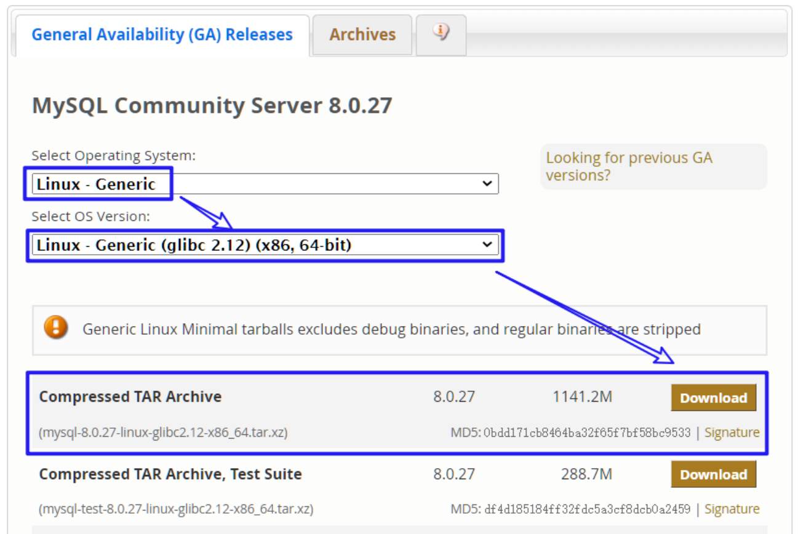
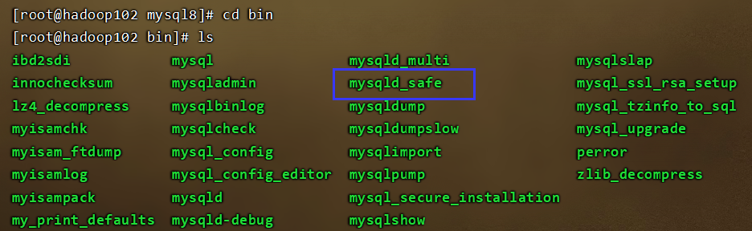
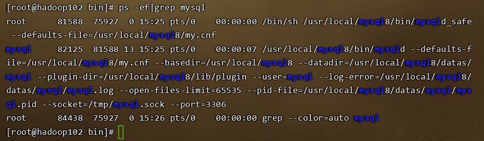
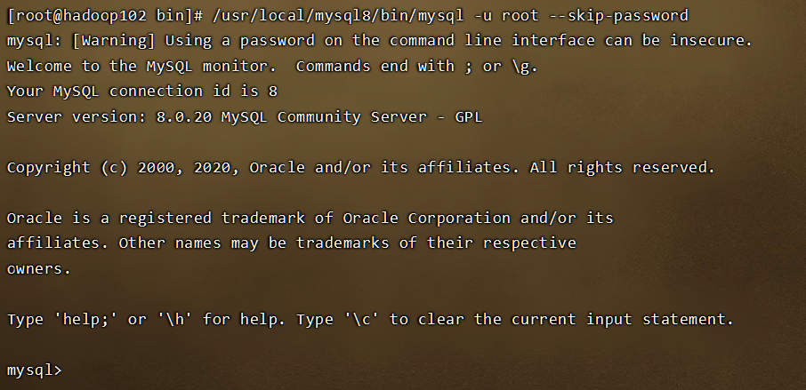
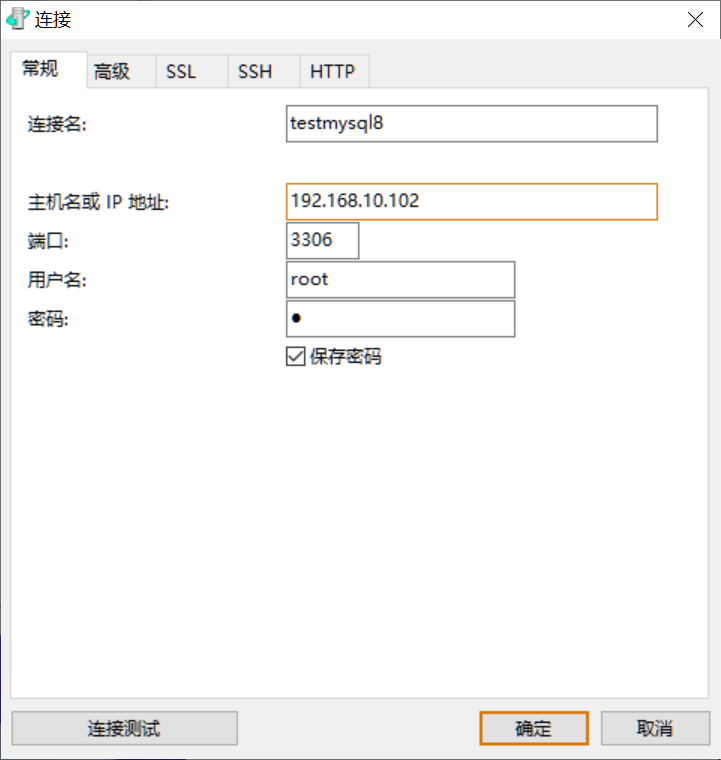
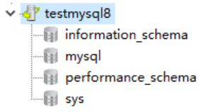

# Linux安装MySQL8

## 一、卸载MariaDB

查看是否安装MariaDB

```java
rpm -qa|grep mariadb
```

卸载MariaDB

```java
rpm -e --nodeps mariadb-libs-5.5.56-2.el7.x86_64
```

检查是否卸载完成

```java
rpm -qa|grep mariadb
```

## 二、下载，解压，重命名

### 1.下载

两种安装方式

#### 1.1.手动安装

下载地址：[https://dev.mysql.com/downloads/mysql/](https://dev.mysql.com/downloads/mysql/)



下载好后将压缩文件拖动到Linux的`/usr/local`目录下

#### 1.2.网络安装

```java
cd /usr/local
wget https://dev.mysql.com/get/Downloads/MySQL-8.0/mysql-8.0.20-linux-glibc2.12-x86_64.tar.xz
```

### 2.解压

后缀为`.tar.gz`的文件解压命令为`tar -zxvf 文件名`

后缀为`.tar.xz`的文件解压命令为`tar -Jxvf 文件名`

### 3.重命名

```java
mv 原文件夹名 mysql8
```

## 三、配置环境变量

```java
vim /etc/profile
    JAVA_HOME=/usr/java/jdk1.8.0_152
    JRE_HOME=/usr/java/jdk1.8.0_151/jre
    HADOOP_HOME=/usr/local/hadoop-2.7.1
    ZOOKEEPER_HOME=/usr/local/zookeeper-3.3.6
    FLUME_HOME=/usr/local/flume-1.9.0
    NGINX_HOME=/usr/local/nginx
    TOMCAT_HOME=/usr/local/tomcat-8.5.81
    MYSQL8_HOME=/usr/local/mysql8

    CLASSPATH=.:$JAVA_HOME/lib/dt.jar:$JAVA_HOME/lib/tools.jar:$JRE_HOME/lib
    PATH=$PATH:$JAVA_HOME/bin:$JRE_HOME/bin:$HADOOP_HOME/bin:$HADOOP_HOME/sbin:$ZOOKEEPER_HOME/bin:$FLUME_HOME/bin:$NGINX_HOME/sbin:$TOMCAT_HOME/bin:$MYSQL8_HOME/bin
    export PATH CLASSPATH JAVA_HOME JRE_HOME HADOOP_HOME ZOOKEEPER_HOME FLUME_HOME NGINX_HOME TOMCAT_HOME MYSQL8_HOME
source /etc/profile
```

## 四、创建用户和用户组

创建`mysql`用户组

```java
groupadd mysql
```

创建`mysql`系统用户，并指定用户组为mysql

```java
useradd -r -g mysql mysql
	-r：创建系统用户
	-g：指定用户组
```

## 五、指定数据目录

创建目录

```java
cd /usr/local/mysql8
mkdir datas
```

赋予权限

* 更改属主和数组

  ```java
  chown -R mysql:mysql /usr/local/mysql8/datas
  ```

* 更改模式		

  ```java
  chmod -R 750 /usr/local/mysql8/datas
  ```

## 六、初始化MySQL

### 1.配置参数

```java
cd /usr/local/mysql8
vim my.cnf
    [mysql]
    # 默认字符集
    default-character-set=utf8mb4
    [client]
    port       = 3306
    socket     = /tmp/mysql.sock

    [mysqld]
    port       = 3306
    server-id  = 3306
    user       = mysql
    socket     = /tmp/mysql.sock
    # 安装目录
    basedir    = /usr/local/mysql8
    # 数据存放目录
    datadir    = /usr/local/mysql8/datas/mysql
    log-bin    = /usr/local/mysql8/datas/mysql/mysql-bin
    innodb_data_home_dir      =/usr/local/mysql8/datas/mysql
    innodb_log_group_home_dir =/usr/local/mysql8/datas/mysql
    #日志及进程数据的存放目录
    log-error =/usr/local/mysql8/datas/mysql/mysql.log
    pid-file  =/usr/local/mysql8/datas/mysql/mysql.pid
    # 服务端使用的字符集默认为8比特编码
    character-set-server=utf8mb4
    lower_case_table_names=1
    autocommit =1

     ##################以上要修改的########################
    skip-external-locking
    key_buffer_size = 256M
    max_allowed_packet = 1M
    table_open_cache = 1024
    sort_buffer_size = 4M
    net_buffer_length = 8K
    read_buffer_size = 4M
    read_rnd_buffer_size = 512K
    myisam_sort_buffer_size = 64M
    thread_cache_size = 128

    #query_cache_size = 128M
    tmp_table_size = 128M
    explicit_defaults_for_timestamp = true
    max_connections = 500
    max_connect_errors = 100
    open_files_limit = 65535

    binlog_format=mixed

    binlog_expire_logs_seconds =864000

    # 创建新表时将使用的默认存储引擎
    default_storage_engine = InnoDB
    innodb_data_file_path = ibdata1:10M:autoextend
    innodb_buffer_pool_size = 1024M
    innodb_log_file_size = 256M
    innodb_log_buffer_size = 8M
    innodb_flush_log_at_trx_commit = 1
    innodb_lock_wait_timeout = 50
    transaction-isolation=READ-COMMITTED

    [mysqldump]
    quick
    max_allowed_packet = 16M

    [myisamchk]
    key_buffer_size = 256M
    sort_buffer_size = 4M
    read_buffer = 2M
    write_buffer = 2M

    [mysqlhotcopy]
    interactive-timeout
```

### 2.初始化

```java
mysqld --defaults-file=/usr/local/mysql8/my.cnf --basedir=/usr/local/mysql8/ --datadir=/usr/local/mysql8/datas/mysql --user=mysql --initialize-insecure
    defaults-file：指定配置文件（要放在–initialize前面）
    user：指定用户
    basedir：指定安装目录
    datadir：指定初始化数据目录
    intialize-insecure：初始化无密码
```

## 七、启动MySQL

### 1.查看MySQL的/bin下是否包含mysqld_safe



### 2.启动服务

完整命令

```java
/usr/local/mysql8/bin/mysqld_safe --defaults-file=/usr/local/mysql8/my.cnf &
```

加上环境变量后的命令

```java
mysqld_safe --defaults-file=/usr/local/mysql8/my.cnf &
```

### 3.查看是否启动成功

```java
ps -ef|grep mysql
```



## 八、设置新密码

### 1.登录MySQL

#### 1.1.无密码登录方式

```java
/usr/local/mysql8/bin/mysql -u root --skip-password
```



#### 1.2有密码登录方式

初始的随机密码在`/data/mysql8_data/mysql/mysql.log`中查看

```java
mysql -u root -p
password:随机密码
```

### 2.修改密码

```java
ALTER USER 'root'@'localhost' IDENTIFIED WITH mysql_native_password BY 'a';
```

### 3.刷新权限

```java
FLUSH PRIVILEGES;
```

## 九、允许远程连接

### 1.设置MySQL远程连接

```java
use mysql
update user set user.Host='%'where user.User='root';
flush privileges;
quit
```

### 2.Navicat测试





> 参考文章：[https://blog.csdn.net/weixin_42326851/article/details/123984601](https://blog.csdn.net/weixin_42326851/article/details/123984601)


