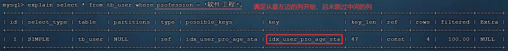
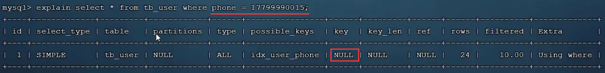

# MySQL进阶

## 一、存储引擎

### 1.MySQL体系结构

MySQL服务层共分为以下四层


### 2.存储引擎是什么？

引擎可理解为发动机，飞机和汽车可以使用同一引擎嘛？当然是不能的，飞机引擎和汽车引擎决定他们的发动方式

**存储引擎就是存储数据、建立索引、更新查询数据等技术的实现方式**，存储引擎是**基于表**的，而不是库，故又可被称为表类型

------

在创建表时通过关键字`ENGINE`指定存储引擎，SQL语句如下

```mysql
create table 表名(
	...
)ENGINE=INNODB;
```

查看当前数据库支持的存储引擎SQL语句是`show engines;`


### 3.存储引擎特点

#### 3.1.InnoDB

**InnoDB是高可靠和高性能的通用存储引擎**，MySQL5.5后是默认的存储引擎，其特点如下

* DML操作支持**事务**，满足ACID模型
* 支持**外键约束**，保证数据完整性和正确性
* **行级锁**，提高并发访问性能

每张以InnoDB为存储引擎的表都对应一个**表空间文件**`table_name.ibd`，用于**存储表结构、数据和索引**。参数`innodb_file_per_table`用于决定是否共享表空间文件，MySQL8中默认每张表对应一个表空间文件，通过`show variables like 'innodb_file_per_table'`可查询

InnoDB的逻辑存储结构如下


#### 3.2.MyISAM

MyISAM是MySQL早期的默认存储引擎，其特点如下

* 不支持事务，不支持外键
* 表级锁，不支持行级锁
* 访问速度快

每张以MyISAM为存储引擎的表都涉及三个文件，`xxx.sdi`存储表结构、`xxx.MYD`存储数据、`xxx.MYI`存储索引

#### 3.3.Memory

Memory会将表数据存于内存，由于受到硬件和断电的影响，所以只做临时表或缓存使用，默认`hash`索引，`xxx.sdi`用于存储表结构信息

Memory存于内存所以访问速度比较快，但不能存太大的表，且数据的安全性无法得到保障

### 4.存储引擎选择

存储引擎没有好坏之分，只需在合适的场景选择合适的引擎即可，根据不同引擎的特点适用场景各不相同

| 存储引擎 |                           适用场景                           |
| :------: | :----------------------------------------------------------: |
|  InnoDB  | 对数据完整性要求较高、并发场景下要求数据一致、包含很多更新和删除操作 |
|  MyISAM  | 以插入和查询操作为主、对数据完整性和并发一致性要求不高，但这种场景通常被`MongoDB`替代 |
|  Memory  | 访问速度快，常用于临时表及缓存，但这种场景通常被`Redis`替代  |

## 二、索引

### 1.索引是什么？

数据之外数据库系统还维护着满足特定查找算法的数据结构，**索引就是帮助MySQL高速获取数据的数据结构**

为什么需要索引呢？原来没有索引对`user`表执行`select * from user where age=45;`时会顺序的对比每个`age`是否为45，直到遍历完整张表，这种方式称为**全表扫描**，性能极低！那么有索引呢，以二叉树结构为例请看下图！只需对比三次就找到所需的数据


### 2.索引优缺点

|       优点       |                             说明                             |
| :--------------: | :----------------------------------------------------------: |
|  **检索效率高**  | 索引是帮助高速获取数据的数据结构，且降低数据库的IO成本(数据库的数据存于磁盘) |
| **排序成本降低** |               索引数据结构都有序，降低CPU消耗                |

|        缺点        |                             说明                             |
| :----------------: | :----------------------------------------------------------: |
|  **占用磁盘空间**  | 学习存储引擎可知表结构、数据和索引都存于磁盘(可忽略，磁盘很便宜) |
| **增删改效率降低** | 每次增删改数据的同时维护的索引数据结构也需要相应变化(可忽略，对与正常业务系统增删改很少) |

### 3.索引结构

#### 3.1.概述

通过MySQL体系结构图可知索引在存储引擎层实现，不同的存储引擎有不同的结构，主要包含以下几种

|     索引结构      |                             描述                             |  InnoDB   | MyISAM | Memory |
| :---------------: | :----------------------------------------------------------: | :-------: | :----: | :----: |
|  **B+Tree索引**   |            **最常见的索引**，大部分存储引擎都支持            |   支持    |  支持  |  支持  |
|     Hash索引      | 底层是哈希表，只有**精确匹配索引列的查询才有效，不支持范围查询** |  不支持   | 不支持 |  支持  |
|  R-Tree空间索引   | MyISAM存储引擎的特殊索引结构，主要用于地理空间数据类型，用得较少 |  不支持   |  支持  | 不支持 |
| Full-text全文索引 |                   建立倒排索引快速匹配文档                   | 5.6后支持 |  支持  | 不支持 |

#### 3.2.B+Tree索引

B+Tree是什么？为什么出现？让我们从二叉树开始步步升入

①二叉树指只有两个节点的树，二叉排序树在二叉树的基础上保证`左<根<右`，但**顺序插入时会形成链表**，若**数据量较大还会导致树的层级比较深**，检索速度减慢


②红黑树是特殊的二叉查找树，根据红黑规则自旋平衡该树，解决顺序插入时形成链表的问题，但红黑树本身也是二叉树，无法解决数据量大层级深的问题


> ①②中二叉树、二叉查找树、平衡二叉树和红黑树相关知识请跳转至[集合的Set数据结构部分](/Java基础/集合)

③**B树又称为多路平衡查找树，一个节点下可包含多个子节点**，解决二叉树层级深的问题，但B树中叶子节点和非叶子节点都可存放数据，但每页的大小有限，所以导致每页的键值减少，指针也减少，从而只能增加树的高度


> [数据结构可视化网站](https://www.cs.usfca.edu/~galles/visualization/Algorithms.html)

④**B+树所有的元素都会出现在叶子节点，数据也都存于叶子节点，其他非叶子节点只起到索引的作用，同时叶子节点会形成单向链表**，在B树基础上进一步降低树的层数


------

MySQL对B+树进行优化，在**原来B+树的基础上增加相邻叶子节点指针**，形成带有顺序指针的B+树，提高区间访问性能


#### 3.3.Hash索引

首先计算出每行数据的Hash值，然后取出需要建立索引的属性的值通过Hash函数在哈希表中做映射，哈希表中存储的数据为属性值与行哈希值


注意Hash索引**不支持范围查询**(`between`、`>`、`<`等)；**不可进行排序**；**不发生哈希冲突时检索一次就可**，效率常常比B+树高

#### 3.4.小小面试题

为什么InnoDB使用B+树，而不使用二叉树、B树、Hash索引呢？

* 二叉树存在无序问题
* 二叉排序树存在顺序插入形成单链表问题
* 平衡二叉树存在大量自旋问题
* 红黑树存在随数据量加大层级加深问题
* B树存在数据存于叶子节点和非叶子节点，导致层级层级还是加深问题
* Hash索引不可范围查询且不可排序

### 4.索引分类

|   分类   |                      说明                      |  关键字  |
| :------: | :--------------------------------------------: | :------: |
| 主键索引 |   主键列创建时就会创建的索引，**只能有一个**   | PRIMARY  |
| 唯一索引 |         避免某属性中的值重复，可以多个         |  UNIQUE  |
| 常规索引 |           快速定位特定数据，可以多个           | 无关键字 |
| 全文索引 | 查找文本中的关键字，而不是索引中的值，可以多个 | FULLTEXT |

InnoDB中根据索引存储形式又可分为两种

|   分类   |                             说明                             |                           选举规则                           |
| :------: | :----------------------------------------------------------: | :----------------------------------------------------------: |
| 聚集索引 | **数据与索引不分开，索引的叶子结点存放行数据，必须有，且只有一个** | **若存在主键则主键索引就是聚集索引，若不存在主键则第一个唯一索引就是聚集索引，若都不存在则InnoDB自动生成rowid作为隐藏聚集索引** |
| 二级索引 |  **数据与索引分开，索引的叶子结点存放对应主键，可以有多个**  |                                                              |

聚集索引与二级索引的存储结构如下图，若执行`select * from user where name = 'Arm';`是怎样寻找的呢？首先通过二级索引找到`Arm`节点下的数据，也就是主键`id`的值10，然后通过主键值到聚集索引下找到相应的行数据，此时发生**回表查询**；若是查找指定的主键则之间通过聚集索引即可，效率更高


### 5.索引语法

> [Linux安装MySQL5](/MySQL/Linux安装MySQL5)	|	[Linux安装MySQL8](/MySQL/Linux安装MySQL8)

创建索引：`create [unique|fulltext] index 索引名 on 表名(字段名...);`

> 联合索引即创建时有多个字段

查看索引：`show index from 表名;`

删除索引：`drop index 索引名 on 表名;`

### 6.SQL性能分析

#### 6.1.SQL执行频率

**SQL优化主要针对查询语句，其中索引优化占很大比重**。在优化之前需要**判断该DB何种语句的执行频率较高**，若是查询SQL频率较高则需要索引优化，若是增删改SQL频率较高则索引优化没必要

通过以下语句可查看数据库各种SQL的访问频次，其中下划线表示模糊匹配

```mysql
show global status like 'Com_______';
```

#### 6.2.慢查询日志

通过访问频次我们确认该数据库查询SQL的频率较高，但不知道具体哪条SQL需要优化，所以**慢查询日志可以帮助我们定位到具体执行效率较低的查询SQL**

**慢查询日志记录执行时间超过指定参数的SQL**，指定参数`long_query_time`默认10秒

慢查询日志默认未开启，通过`show variables like 'slow_query_log';`查看慢查询日志是否开启


开启慢查询日志需要在MySQL配置文件`my.cnf`中配置如下信息，配置完毕后重启MySQL再次查看慢查询日志是否开启

```mysql
# 开启MySQL慢查询日志
slow_query_log=1
# 设置慢查询日志记录时间为2秒
long_query_time=2
```

通过`cat /usr/local/mysql8/datas/mysql/localhost-slow.log`查看慢查询日志中记录的信息


#### 6.3.profile详情

执行频率只能判断什么SQL执行频率高，慢查询日志只能记录查询时间超过指定参数的查询语句，但实际有的不超过但接近指定参数的查询语句效率也是较低的，所以**profile详情可以帮助我们了解时间的耗费都去了哪里**

通过`select @@have_profiling;`查看当前MySQL是否支持profile操作


profiling默认关闭，通过`select @@profiling;`可查询，0表示未开启，通过`set profiling=1;`设置开启

profiling相关的命令如下

|                  命令                  |                       说明                        |                    图解                    |
| :------------------------------------: | :-----------------------------------------------: | :----------------------------------------: |
|            `show profiles;`            |           查看每条SQL语句的基本耗时情况           |  |
|   `show profile for query query_id;`   | 查看指定`query_id`的SQL语句各个阶段的基本耗时情况 |  |
| `show profile cpu for query query_id;` |      查看指定`query_id`的SQL语句CPU使用情况       |  |

#### 6.4.explain执行计划

前三种只是简单的通过执行时间的长短判定SQL语句执行效率，**通过explain或desc可获取MySQL如何执行查询语句的相关信息，包括查询语句执行过程中如何连接和连接顺序等**

语法格式是`explain select 字段列表 from 表名 where 条件;`，直接在查询语句前加上`explain`或`desc`关键字


每个参数代表的含义如下

* `id`表示查询序列号，`id`相同则执行顺序从上到下，`id`不同则值越大越先执行

  

  

* `type`表示连接类型，性能由好到差的连接类型依次是`NULL`、`system`、`const`、`eq_ref`、`ref`、`range`、`index`、`all`

  * `NULL`表示查询不涉及任何表，一般不太可能实现

    

  * `system`相当于访问系统表，根据主键索引或唯一索引进行访问出现`const`，使用非唯一性索引查询出现`ref`，`index`表示使用索引但还是会对整个索引树进行扫描

* `possible_key`表示该表可能用到的索引
* `key`表示该表实际用到的索引，为`NULL`表示没有使用索引
* `key_len`表示使用索引的最大字节数，并不是实际长度，在不损失精度的前提下越短越好
* `rows`表示执行查询的行数，不是准确值，只是预估
* `filtered`表示查询结果占读取行数的百分比，值越大越好
* `Extra`表示前面参数没有展示的其他额外信息

> 重点关注`type`、`possible_key`、`key`、`key_len`或`Extra`

### 7.索引使用

为什么使用索引？请看[视频](https://www.bilibili.com/video/BV1Kr4y1i7ru?p=79&spm_id_from=pageDriver&vd_source=8811945bf338927db8b1ca45a8f75a87)了解索引建立前后查询速度的明显差距，索引好是好，但是也不能滥用！我们提前建立好的`tb_user`表的索引如下


#### 7.1.索引失效情况

①**最左前缀法则**：该法则主要针对联合索引(索引关联多列)，指**查询中联合索引的最左列必须存在并且不跳过中间的列**，若最左列不存在则联合索引失效，若跳过中间的列则联合索引跳过部分后面的索引失效，请看如下案例理解

* 遵循联合索引最左前缀规则，联合索引不失效的情况，以下图解中"满足从最左边的列开始"改成"满足最左边的列存在"

  

  

  

  

* 不遵循联合索引最左前缀规则，联合索引失效的情况

  

  

  

②**范围查询法则**：该法则主要针对联合索引(索引关联多列)，指**查询中出现范围查询(<，>)则范围查询右侧的列索引失效**，请看如下案例理解，**尽量使用`>=`或`<=`规避该情况**


③**索引列运算法则**：**在索引列上执行运算导致索引失效**，请看如下案例理解

* 索引不失效情况

  

* 索引失效情况

  

④**字符串不加引号法则**：**字符串类型字段使用时不加引号则索引失效**




⑤**模糊查询法则**：**尾部模糊匹配索引不失效，头部模糊匹配索引失效**，请看如下案例理解

- 索引不失效情况

  

- 索引失效情况

  

  

⑥**或`or`连接条件法则**：**或`or`前用到索引但后没用到索引，则涉及到的索引失效**


⑦**数据分布影响**：若MySQL评估结果为使用索引比不使用还慢，则不使用索引

#### 7.2.SQL提示

若某条查询语句有多个索引都满足条件，那么究竟执行那条呢？MySQL会为我们选择好，但我就是想要执行指定索引怎么办？这就是SQL提示，指**在SQL语句中加入人为提示来达到优化目的**，该提示有如下几种

* `use index;`：建议使用哪个索引

  

* `ignore index;`：忽略使用哪个索引

  

* `force index;`：必须使用哪个索引

  

#### 7.3.覆盖索引

前面我们都在研究`where`后的查询条件，此时我们研究查询结果返回的列。**覆盖索引指查询使用到索引，并且查询需要返回的列在该索引中都已全部找到，即不会发生回表查询**，减少使用`select *`，尽量使用覆盖索引

* `using index condition`表示使用到索引，但发生回表查询，即先去二级索引查找主键后，再去聚集索引查
* `using where;using index`表示使用到索引，但是所需要的数据在该索引列都能被找到，不需要回表查询

#### 7.4.前缀索引

文本字符串内容有时会很长，若是全部内容用于建立索引，这会导致索引变得很大，查询时浪费大量磁盘IO，此时可以**取出部分字符串作为前缀存于索引中**，大量节省索引空间，前缀索引的语法格式如下，其中n表示前缀长度

```mysql
create index index_name on table_name(column_name(n))
```

前缀长度通过公式`不重复索引值(count(distinct substring(column_name,start_index,str_num))/总记录数(count(*))`求得，公式结果相同则选择前缀长度更小的

### 8.索引设计原则

①针对**数据量较大(上万)**且**查询频繁**的表建立索引

②针对**常作为查询条件`where`、排序`order by`、分组`group by`的字段**建立索引

③尽量选择**区分度高的列**建立索引，区分度越高效率越高，**尽量建立唯一索引**

④尽量使用**联合索引**，减少单列索引，达到覆盖索引效果，避免回表

⑤针对**较长字符串建立前缀索引**

⑥控制索引数量，并不是越多越好，影响增删改的效率

⑦若索引列确定不能为NULL，**尽量使用NOT NULL约束**，使MySQL优化器更好的确定哪个索引更有利于查询

## 三、SQL优化


## 四、视图&存储过程&触发器

视图是虚拟的表，与包含的数据表不同，视图只包含使用时动态检索数据的查询，不包含任何列或数据

**视图：**

是一种虚拟的表，具有和物理表相同的功能。可以对视图进行增，改，查，操作，试图通常是有一个表或者多个表的行或列的子集。对视图的修改会影响基本表。它使得我们获取数据更容易，相比多表查询。

**游标：**

是对查询出来的结果集作为一个单元来有效的处理。游标可以定在该单元中的特定行，从结果集的当前行检索一行或多行。可以对结果集当前行做修改。一般不使用游标，但是需要逐条处理数据的时候，游标显得十分重要。

**优点：**

1对数据库的访问，因为视图可以有选择性的选取数据库里的一部分。

2)用户通过简单的查询可以从复杂查询中得到结果。

3)维护数据的独立性，试图可从多个表检索数据。

4)对于相同的数据可产生不同的视图。

**缺点：**

性能：查询视图时，必须把视图的查询转化

视图
视图的作用，视图可以更改么？
创建视图： create view xxx as xxx

使用视图可以简化复杂的sql操作，隐藏具体的细节，保护数据;
视图创建后，可以使用与表相同的方式利用它们；
视图不能被索引，也不能有关联的触发器或默认值，如果视图本身内有order by则对视图再次order by将被覆盖。
对于某些视图，例如，未使用联结子查询分组聚集函数Distinct Union等，是可以对其更新的，对视图的更新将对基表进行更新；但是视图主要用于简化检索，保护数据，并不用于更新，而且大部分视图都不可以更新


## 五、锁

## 六、InnoDB引擎

## 七、MySQL管理