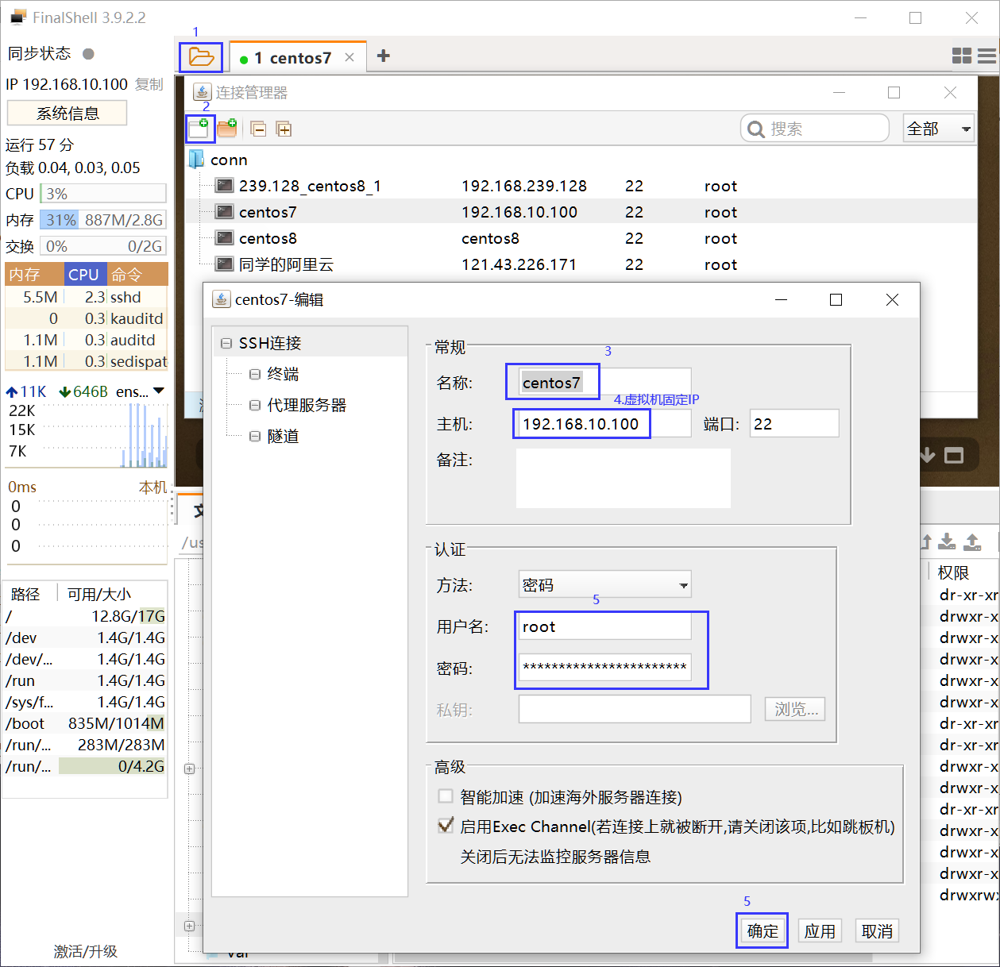
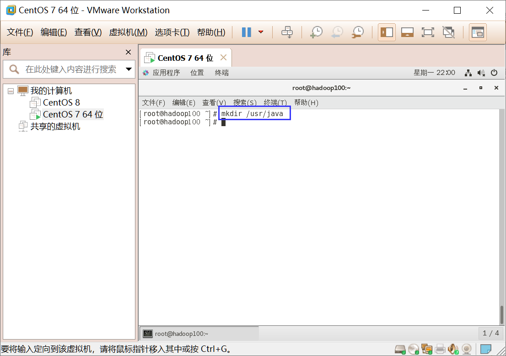
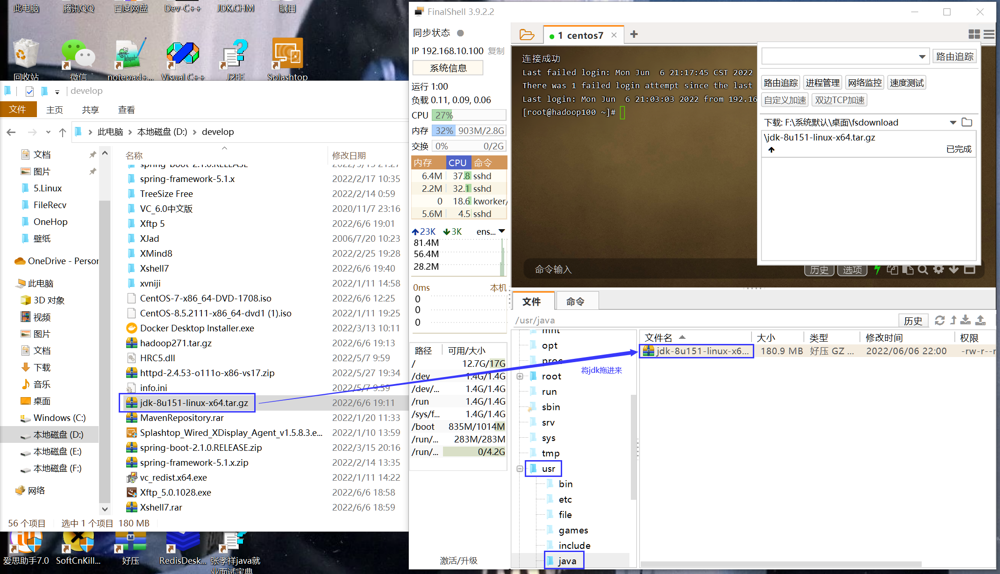
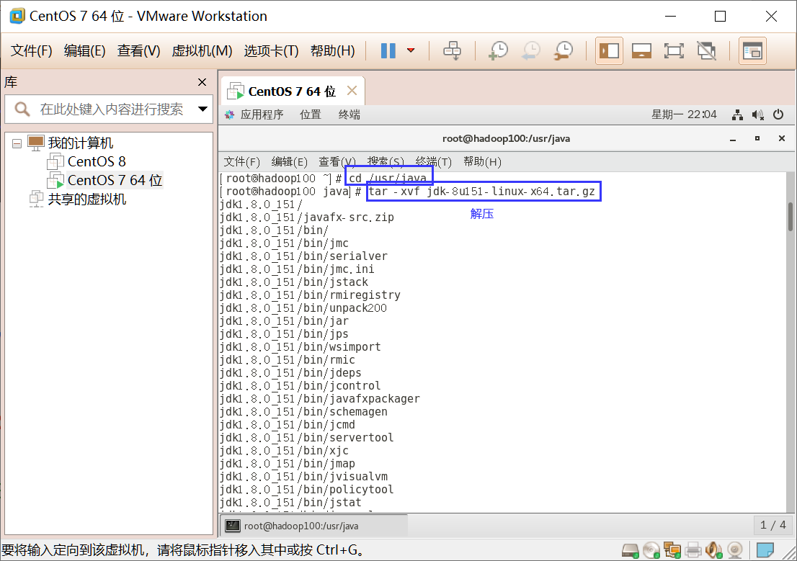
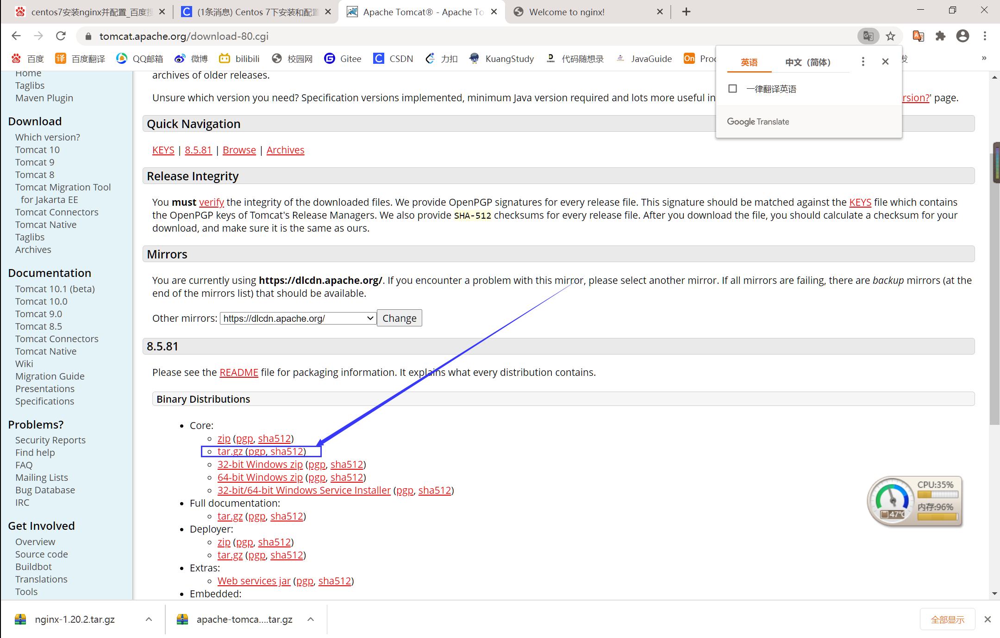
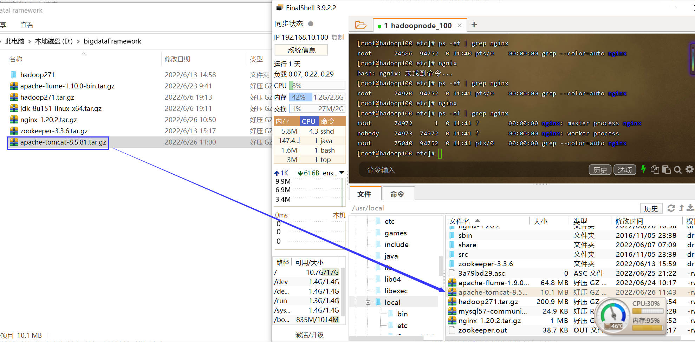
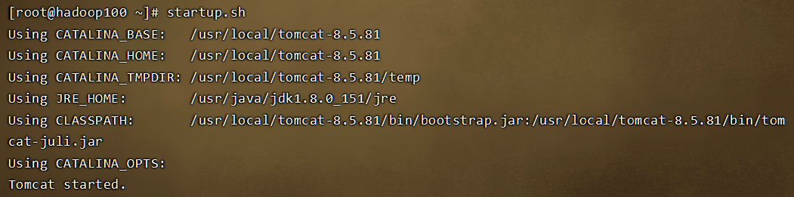
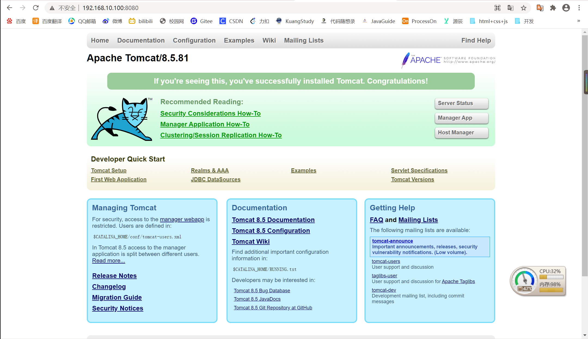
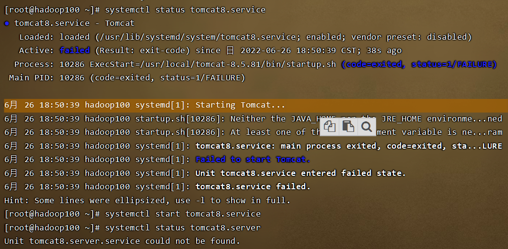

# Linux安装Tomcat

## 一、安装JDK8

### 1.删除openjdk

```java
rpm -qa | grep jdk
yum -y remove 
```


### 2.FinalShell连接虚拟机




### 3.上传JDK





### 4.解压



### 5.重命名

```java
mv jdk1.8.0_261/ jdk去重命名
```

### 6.配置环境变量

```java
vim /etc/profile
    JAVA_HOME=/usr/java/jdk1.8.0_151
    JRE_HOME=/usr/java/jdk1.8.0_151/jre
    PATH=$PATH:$JAVA_HOME/bin:$JRE_HOME/bin 
    CLASSPATH=.:$JAVA_HOME/lib/dt.jar:$JAVA_HOME/lib/tools.jar:$JRE_HOME/lib 
    export JAVA_HOME JRE_HOME PATH CLASSPATH
source /etc/profile
```

### 7.查看是否安装成功

```java
java -version java
```

## 二、安装Tomcat

### 1.上传，解压，重命名

①下载地址：[http://tomcat.apache.org/download-80.cgi](http://tomcat.apache.org/download-80.cgi)



②上传



③解压重命名

```java
tar -xvf apache-tomcat-8.5.81.tar.gz
mv apache-tomcat-8.5.81/ tomcat-8.5.81
```

### 2.配置环境变量

```java
vim /etc/profile
	JAVA_HOME=/usr/java/jdk1.8.0_152
    JRE_HOME=/usr/java/jdk1.8.0_151/jre
    HADOOP_HOME=/usr/local/hadoop-2.7.1
    ZOOKEEPER_HOME=/usr/local/zookeeper-3.3.6
    FLUME_HOME=/usr/local/flume-1.9.0
    NGINX_HOME=/usr/local/nginx
    TOMCAT_HOME=/usr/local/tomcat-8.5.81

    CLASSPATH=.:$JAVA_HOME/lib/dt.jar:$JAVA_HOME/lib/tools.jar:$JRE_HOME/lib
    PATH=$PATH:$JAVA_HOME/bin:$JRE_HOME/bin:$HADOOP_HOME/bin:$HADOOP_HOME/sbin:$ZOOKEEPER_HOME/bin:$FLUME_HOME/bin:$NGINX_HOME/sbin:$TOMCAT_HOME/bin
    export PATH CLASSPATH JAVA_HOME JRE_HOME HADOOP_HOME ZOOKEEPER_HOME FLUME_HOME NGINX_HOME TOMCAT_HOME
source /etc/profile
```

### 3.访问测试

启动Tomcat：`startup.sh`



Web访问地址[http://192.168.10.100:8080/](http://192.168.10.100:8080/)



## 三、设置开机自启

### 1.新建启动文件

```java
vim /usr/lib/systemd/system/tomcat8.service
    [Unit]
    Description=Tomcat
    After=syslog.target network.target remote-fs.target nss-lookup.target

    [Service]
    Type=oneshot
    ExecStart=/usr/local/tomcat-8.5.81/bin/startup.sh
    ExecStop=/usr/local/tomcat-8.5.81/bin/shutdown.sh
    ExecReload=/bin/kill -s HUP $MAINPID
    RemainAfterExit=yes

    [Install]
    WantedBy=multi-user.target
```

### 2.启动Tomcat

```java
systemctl enable tomcat8.service
```

### 3.其他Tomcat命令

启动Tomcat：`systemctl start tomcat8.service`

关闭Tomcat：`systemctl stop tomcat8.service `

重启Tomcat：`systemctl restart tomcat8.service`

## 四、错误解决

电脑异常关机之后，所有虚拟机都需要重启，重启后tomcat启动出现问题



解决步骤如下

```java
cd /usr/local/tomcat-8.5.81/bin
vim catalina.sh
    export JAVA_HOME=/usr/java/jdk1.8.0_151
    export JRE_HOME=/usr/java/jdk1.8.0_151/jre
systemctl start tomcat8.service
```

> 参考文章：[参考文章1](https://blog.csdn.net/javaee520/article/details/109609257?utm_medium=distribute.pc_relevant.none-task-blog-2~default~baidujs_baidulandingword~default-1-109609257-blog-124394214.pc_relevant_blogantidownloadv1&spm=1001.2101.3001.4242.2&utm_relevant_index=4)	[参考文章2](http://t.zoukankan.com/lei01-p-9911156.html)


