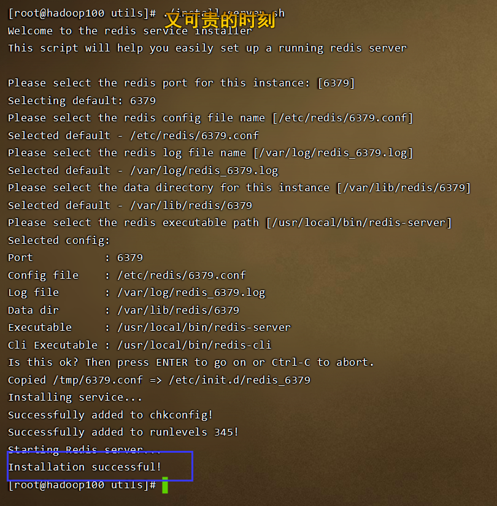
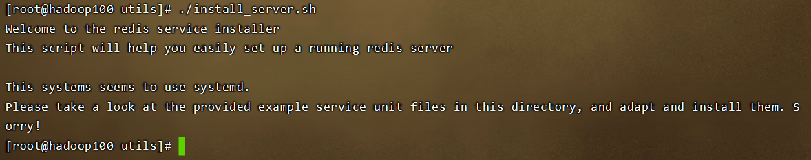
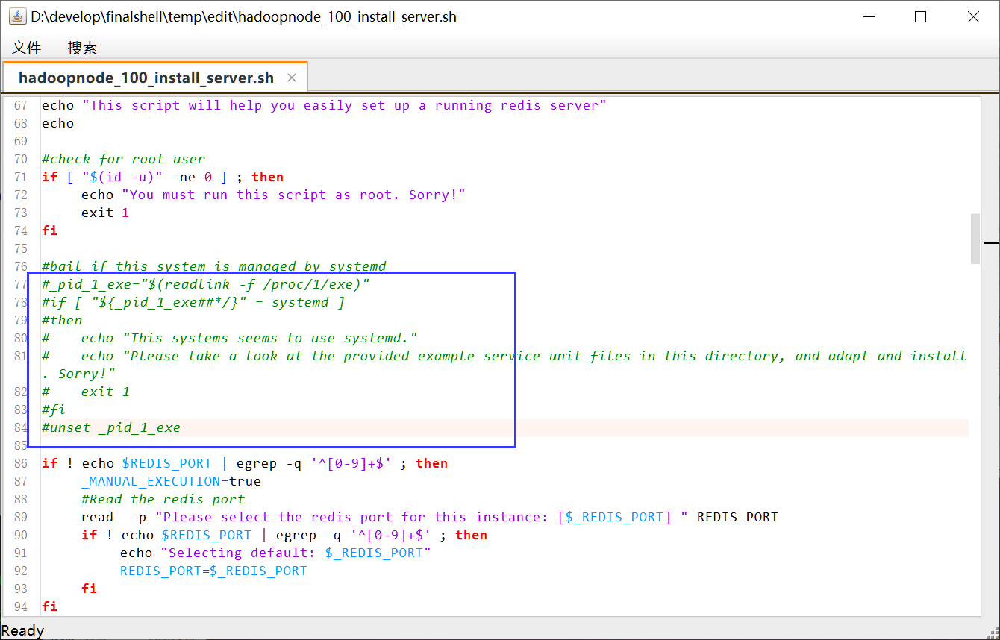
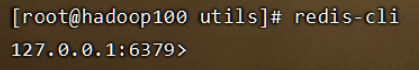
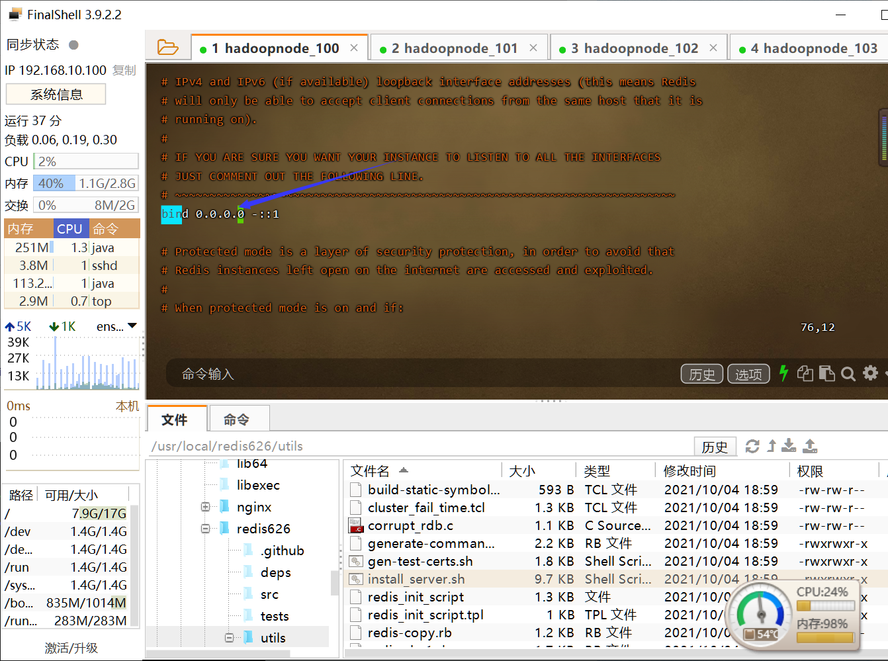

# Linux安装Redis

## 一、安装前准备

```
yum install centos-release-scl scl-utils-build
yum list all --enablerepo=‘centos-sclo-rh’
yum install -y devtoolset-8-toolchain
scl enable devtoolset-8 bash
gcc --version
```

## 二、下载，解压，重命名

```
cd /usr/local
wget https://download.redis.io/releases/redis-6.2.6.tar.gz
tar -xvf redis-6.2.6.tar.gz
mv redis-6.2.6 redis626
```

## 三、安装Redis

```
cd /usr/local/redis626
make && make install
```

## 四、启动Redis

### 1.正常启动

启动命令

```
cd /usr/local/redis626/utils
./install_server.sh
```

启动成功



### 2.启动情况报错

报错情况如下



注释图中代码，再次启动



## 五、查看启动情况

```
systemctl status redis_6379.service
```

若未启动则重新启动

```
systemctl restart redis_6379.service
```

## 六、启动自带的redis-cli客户端



## 七、设置允许远程连接

```
vim /etc/redis/6379.conf
```



```
systemctl restart redis_6379.service
```


