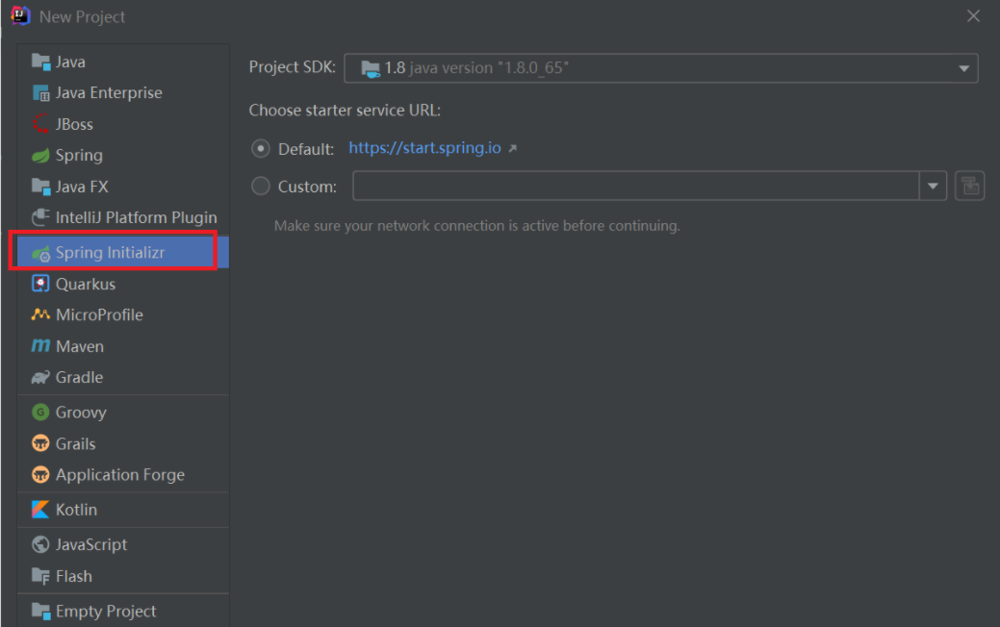
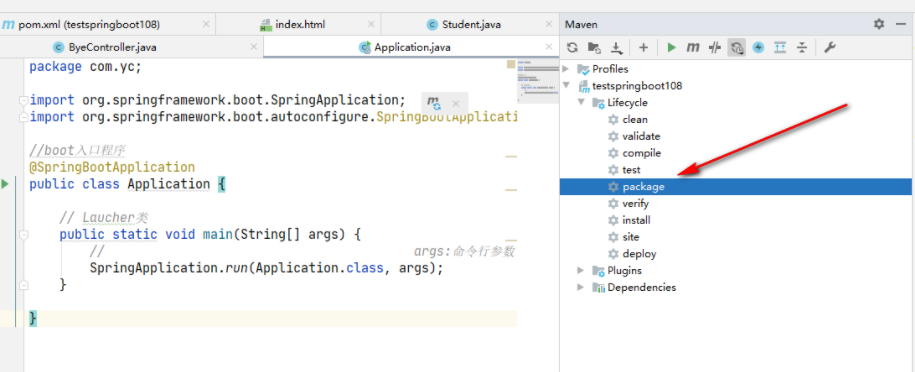
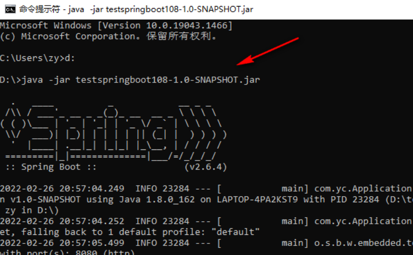
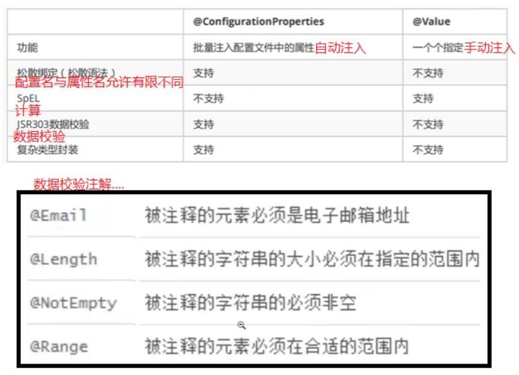

# SpringBoot

## 一、SpringBoot是什么？

原来有繁琐的配置信息需要整合，SpringBoot则**约定配置，去繁从简**，用于简化Spring应用的开发，重点在于自动装配原理

------

Spring、SpringMVC、SpringBoot有什么区别？这是一个面试题！！

- Spring是整个Spring全家桶的基础，最重要的概念的IOC和DI
- SpringMVC提供分离式的方法开发Web应用，使开发Web应用变得简单
- SpringBoot最重要的就是约定配置、去繁从简、自动装配

## 二、HelloSpringBoot

### 1.自动化工具



### 2.pom.xml

```java
<!--父依赖，依赖第三方jar包的版本-->
<parent>
    <groupId>org.springframework.boot</groupId>
    <artifactId>spring-boot-starter-parent</artifactId>
    <version>2.6.4</version><!--springboot依赖的包的版本-->
</parent>

<dependencies>
    <!--springboot-web项目-->
    <dependency>
        <groupId>org.springframework.boot</groupId>
        <artifactId>spring-boot-starter-web</artifactId>
    </dependency>
</dependencies>
```

### 3.配置入口类

```java
@SpringBootApplication//配置类，也可以另外写，也可以用@Import
public class Application {
    public static void main(String[] args) {
        //启动springboot，args命令行参数,会扫描同级目录的内容
        SpringApplication.run(Application.class, args);
    }
}
```

### 4.控制类

```java
@Controller//restful api  
//1.请求方式多 get post head delete...
//2.请求响应的数据都当成json
public class Hello {

    //springmvc注解
    @RequestMapping("/")//请求映射
    //斜杠代表网站的根目录,请求地址http://localhost:8080 
    @ResponseBody//文本注解：当成文本数据，否则认为是页面的名字
    public String sayHello() {
        return "hello";
    }
}
```

```java
@RestController//相当于@Controller+@ResponseBody
public class Bye {
    @RequestMapping(method = {RequestMethod.GET, RequestMethod.POST}, value = {"/bye", "/gun"})
    public Map<String, Object> bye(String name, int age, HttpSession session) {
    	//写参数就可以自动注入请求参数***
        System.out.println(session.getId());
        Map<String, Object> map = new HashMap<>();
        map.put("code", 1);
        Student student = new Student();
        student.setName(name);
        student.setAge(age);
        map.put("obj", student);
        return map;
    }

    @GetMapping("/byeGet")
    //只有get方法可以访问到
    public String byeGet() {
        return "byeGet";
    }
}
```

### 5.项目发布

①pom.xml

```java
<build>
	 <plugins>
	       <plugin>
	           <groupId>org.springframework.boot</groupId>
	           <artifactId>spring-boot-starter-parent</artifactId>
	       </plugin>
	   </plugins>
</build>
```

②package





## 三、配置

### 1.YAML配置文件

Spring启动类支持YAML作为属性配置文件，与传统的properties配置文件的区别是YAML是层级结构，而properties是平级结构

YAML的缩进使用空格，缩进表示层级关系，其实空格的数量不重要，**同层的配置左对齐即可**，**大小写敏感**，支持的数据结构如下

①**对象**：键值对形式，对象的行内格式为`object: {key1: value1,key2: value2}`，行外格式如下

```java
object:
 key1: value1
 key2: value2
```

②**数组**：行内格式为`arrays: [value1,value2]`，行外格式如下

```java
arrays:
 value1
 value2
```

③**字面量**：不可再分的值，字符串默认不加`""`，`''`

- `""`：不会转义特殊字符，即`\n`会换行
- `''`：会转义特殊字符，即`\n`被当成普通字符

④**多文档**：一个`yml`内可包含多个配置文档，使用`-----`隔开即可

### 2.配置注解

#### 2.1.@ConfigurationProperties

自动导入默认配置文件**application.yml或application.properties**

①实体类

```java
@Component
@Data
@ConfigurationProperties(prefix = "product")//配置前缀
public class Product {
    private String pname;
    private Double price;
    private Boolean isUsed;//两个单词一般用-分割
    private Date manDate;
    private List<String> types;//相当数组
    private Map<String, String> attributes;//相当对象
    private Address address;//相当对象
}
```

②application.yml

```java
product:
  pname: apple${random.int(12)}//随机生成值
  price: 3000
  is-used: true
  man-date: 2022/03/06
  type:
    - 消费手机${product.pname}//引用前面已经出现过的值
    - 手机
    - 移动设备
  attributes: {'color': 'white','com-type': '5G'}
  address:
    province: 湖南省
    city: 长沙
```

③application.properties

```java
product.pname=apple
product.price=3000
product.is-used=true
product.man-date=2022/03/06
product.type=消费手机,手机,移动设备
product.attributes.color=white
product.attributes.com-type=5G
product.address.province=湖南省
product.address.city=长沙
```

#### 2.2.@PropertySource

`@Configuration+@PropertySource+@Value`配合使用，导入自定义的`properties`配置文件

①实体类

```java
@Configuration
@PropertySource(value = "classpath:db.properties")
public class DbCon{
    @Value("${db.driver_name}")
    private String driver_name;
    @Value("${db.url}")
    private String url;
    @Value("${db.username}")
    private String username;
    @Value("${db.password}")
    private String password;
}
```

②db.properties

```java
db.driver_name=oracle.jdbc.driver.OracleDriver
db.url=jdbc:oracle:thin:@//localhost:1521/orcl
db.username=scott
db.password=a
```

#### 2.3.@ConfigurationProperties与@Value区别



#### 2.4.@ImportResource

**@ImportResource导入外部传统的Spring的XML文件**，@Import用于引入外部配置类，注意区分，同时注意@SpringBootApplication只能扫描到同级或子级的配置类，请看去下实现

```java
//随便放在什么类上
@ImportResource(locations = {"classpath:beans.xml"})
```

```java
<?xml version="1.0" encoding="UTF-8"?>
<beans xmlns="http://www.springframework.org/schema/beans"
       xmlns:xsi="http://www.w3.org/2001/XMLSchema-instance"
       xsi:schemaLocation="http://www.springframework.org/schema/beans http://www.springframework.org/schema/beans/spring-beans.xsd">

    <bean id="banana" class="com.yc.bean.Banana"></bean>
</beans>
```

### 3.Profiles

#### 3.1.Profiles是什么？

Profiles用于多环境的配置与部署，**主要作用是限定配置文件起作用的时机**，该时机包括Dev开发环境、Test测试环境、Prod生产

#### 3.2.Profiles配置文件命名与激活

Profiles限定配置文件生效时机时，命名规则为`application-{profile}.properties`或`application-{profile}.yml`，其中`profile`部分则为具体的生效环境，如`test`、`prod`、`pre-prod`

> 系统默认配置为`application.properties`或`application.yml`

------

Profiles配置文件的激活方式也是多种多样，大致分为以下四种，优先级从上到下依次降低

|  激活方式  |                             说明                             |
| :--------: | :----------------------------------------------------------: |
|    注解    |    `@Profiles("test")`激活`application-test.yml`配置文件     |
|    配置    | 配置`spring: profiles: active: test`激活`application-test.yml`配置文件 |
| 虚拟机参数 | `-Dspring.profiles.active = prod`激活`application-prod.yml`配置文件 |
| 命令行参数 | `--spring.profiles.active = prod`激活`application-prod.yml`配置文件 |

### 4.配置文件优先级

配置文件是**追加式的**，不冲突的配置追加，冲突的配置选择优先级高的


外部配置文件的加载顺序如下

①命令行参数

②`java:comp/env`的JNDI属性

③Java系统属性，即`System.getProperties()`

④操作系统环境变量

⑤`RandomValuePropertySource`配置的`random.*`属性

⑥JAR包外部的`application-{profile}.properties`或`application-{profile}.yml`带`spring.profile`配置项

⑦JAR包内部的`application-{profile}.properties`或`application-{profile}.yml`带`spring.profile`配置项

⑧JAR包外部的`application.properties`或`application.yml`不带`spring.profile`配置项

⑨JAR包内部的`application.properties`或`application.yml`不带`spring.profile`配置项

⑩`@Configuration`注解类上的`@PropertySource`

⑪`SpringApplication.setDefaultProperties`指定的默认属性

### 5.Druid数据源配置步骤

#### 5.1.pom.xml

```java
<dependency>
 	<groupId>com.alibaba</groupId>
    <artifactId>druid</artifactId>
    <version>1.2.8</version>
</dependency>

<dependency>
    <!--自动化配置类-->
    <groupId>org.springframework.boot</groupId>
    <artifactId>spring-boot-autoconfigure</artifactId>
</dependency>
```

#### 5.2.application.yml

```java
spring:
  datasource:
    url: jdbc:mysql://localhost:3306/res?characterEncoding=utf-8  #3306连本机
    username: root
    password: xbzz7789
    driver-class-name: com.mysql.jdbc.Driver

	#指定数据源类型
    type: com.alibaba.druid.pool.DruidDataSource

	#初始化大小
    initialSize: 5
    #最小值
    minIdle: 5
    #最大值
    maxActive: 20
    #最大等待时间，配置获取连接等待超时，时间单位都是毫秒ms
    maxWait: 60000
    #配置间隔多久才进行一次检测，检测需要关闭的空闲连接
    timeBetweenEvictionRunsMillis: 60000
    #配置一个连接在池中最小生存的时间
    minEvictableIdleTimeMillis: 300000
    validationQuery: SELECT 1 FROM DUAL
    testWhileIdle: true
    testOnBorrow: false
    testOnReturn: false
    poolPreparedStatements: true
    #配置监控统计拦截的filters，去掉后监控界面sql无法统计，
    #'wall'用于防火墙，SpringBoot中没有log4j，我改成了log4j2
    filters: stat,wall,log4j2
    #最大PSCache连接
    maxPoolPreparedStatementPerConnectionSize: 20
    useGlobalDataSourceStat: true
    #通过connectProperties属性来打开mergeSql功能；慢SQL记录
    connectionProperties: druid.stat.mergeSql=true;druid.stat.slowSqlMillis=500
#    # 配置StatFilter
#    web-stat-filter:
#      #默认为false，设置为true启动
#      enabled: true
#      url-pattern: "/*"
#      exclusions: "*.js,*.gif,*.jpg,*.bmp,*.png,*.css,*.ico,/druid/*"
#    #配置StatViewServlet
#    stat-view-servlet:
#      url-pattern: "/druid/*"
#      #允许那些ip
#      allow: 127.0.0.1
#      login-username: admin
#      login-password: 123456
#      #禁止那些ip
#      deny: 192.168.1.102
#      #是否可以重置
#      reset-enable: true
#      #启用
#      enabled: true
```

#### 5.3.DruidConfig

```java
@Configuration
public class DruidConfig {
    @Bean
    @ConfigurationProperties(prefix = "spring.datasource")
    public DataSource getDataSource() {
        return new DruidDataSource();
    }

    @Bean
    public ServletRegistrationBean druidStatViewServlet() {
        //ServletRegistrationBean提供类的进行注册
        ServletRegistrationBean servletRegistrationBean = new ServletRegistrationBean(new StatViewServlet(), "/druid/*");

        //初始化参数
        //白名单
        servletRegistrationBean.addInitParameter("allow", "127.0.0.1");

        //IP黑名单（同时存在deny优先于allow）
        //如果满足deny，会提示
        servletRegistrationBean.addInitParameter("deny", "192.168.1.73");

        //登录查看信息的账号密码
        servletRegistrationBean.addInitParameter("loginUsername", "admin");
        servletRegistrationBean.addInitParameter("loginPassword", "123456");
        servletRegistrationBean.addInitParameter("resetEnable", "false");
        return servletRegistrationBean;
    }

    @Bean
    public FilterRegistrationBean druidStatFilter() {
        FilterRegistrationBean filterRegistrationBean = new FilterRegistrationBean(new WebStatFilter());
        //添加过滤规则
        filterRegistrationBean.addUrlPatterns("/*");
        //添加需要忽略的格式信息
        filterRegistrationBean.addInitParameter("exclusions", "#.js,*.gif,*.jpg,*.png,*.css,*.ico,/druid/*");
        return filterRegistrationBean;
    }
}
```

## 四、Starter

### 1.Starter是什么？

Starter是自动配置的实现，常常将业务代码之外的功能配置模块封装到Starter中，配置项复用时只需在`pom.xml`中引用该Starter依赖，SpringBoot就可自动扫描要加载的配置并装配

### 2.封装Starter

#### 2.1.流程图


#### 2.2.添加自动化配置依赖

```java
<!--父容器，同一版本-->
<parent>
    <groupId>org.springframework.boot</groupId>
    <artifactId>spring-boot-starter-parent</artifactId>
    <version>2.4.5</version>
    <relativePath/>
</parent>

<dependencies>
    <!--自动化配置类-->
    <dependency>
        <groupId>org.springframework.boot</groupId>
        <artifactId>spring-boot-autoconfigure</artifactId>
    </dependency>

	<!--非必须-->
    <dependency>
        <groupId>org.projectlombok</groupId>
        <artifactId>lombok</artifactId>
        <version>1.18.20</version>
        <scope>provided</scope>
    </dependency>
</dependencies>
```

#### 2.3.SPI机制添加类全路径

添加位置为`META-INF/spring.factories`，添加内容如下

```java
org.springframework.boot.autoconfigure.EnableAutoConfiguration=\
  com.yc.ConnectionAutoConfiguration
```

#### 2.4.ConnectionAutoConfiguration

```java
//配置类
@Configuration
//加载属性文件类
@EnableConfigurationProperties(ConnectionProperties.class)
//条件注解
@ConditionalOnClass({Driver.class, IDBHelper.class})
public class ConnectionAutoConfiguration {
    @Bean
    public IDBHelper idbHelper() {
        return new IDBHelperImpl();
    }
}
```

#### 2.5.ConnectionProperties

```java
@Data
//自动配置类
@ConfigurationProperties(prefix = "yc.connection")
public class ConnectionProperties {
    private String url;
    private String username;
    private String password;
}
```

#### 2.6.获取数据库连接

```java
public interface IDBHelper {
    public Connection getCon();
}

```

```java
public class IDBHelperImpl implements IDBHelper {
    @Autowired
    private ConnectionProperties properties;

    @Override
    public Connection getCon() {
        Connection con = null;
        try {
            con = DriverManager.getConnection(properties.getUrl(), properties.getUsername(), properties.getPassword());
        } catch (SQLException throwables) {
            throwables.printStackTrace();
        }
        return con;
    }
}

```

#### 2.7.打包

点击Maven生命周期中的`install`打包，打包后的JAR命名规范是`xxx-spring-boot-starter`

#### 2.8.使用

需要使用该Starter的项目中引入该JAR依赖，根据Starter封装好的配置前缀编写配置yml文件，@Autowired自动注入Starter中的类即可

## 五、Actuator

Actuator名为监控器，配置后可通过路径查看监控内容，路径如下


Actuator配置比较简单，只需添加依赖和编写yml

```java
<dependency>
	<groupId>org.springframework.boot</groupId>
	<artifactId>spring-boot-starter-actuator</artifactId>
</dependency>

```

```java
#打开actuator中端口用于监控，默认情况这些端点都没有开放
management:
  endpoints:
    web:
      exposure:
        include: "*"  #在yml中 * 是特殊意义的关键字，加""

```

## 六、Security

服务端有许多服务信息需要**增强安全性**，配置也比较简单

```java
<dependency>
	<groupId>org.springframework.boot</groupId>
	<artifactId>spring-boot-starter-security</artifactId>
</dependency>

```

```java
spring:
  security:
    user:
      name: admin #安全机制：增加登录
      password: a
      roles:
        - USER

```

```java
@EnableWebSecurity
public class SecurityConfig extends WebSecurityConfigurerAdapter {
    //授权
    @Override //链式编程
    protected void configure(HttpSecurity http) throws Exception {
        //关闭csrf
        http.csrf().disable();//关闭csrf(csrf:攻击者盗用你的信息，以你的名义发送恶意请求)

        http.authorizeRequests()
                .antMatchers("/").permitAll()//首页允许所有人访问
                .antMatchers("/level1/**").hasRole("vip1")//只有指定角色才能访问
                .antMatchers("/level2/**").hasRole("vip2")
                .antMatchers("/level3/**").hasRole("vip3");

        //开启登录页面 --> 没有权限自动跳转
        http.formLogin();
        //super.configure(http);

        //开启注销功能
        http.logout().logoutSuccessUrl("/");
    }

    //认证
    @Override
    protected void configure(AuthenticationManagerBuilder auth) throws Exception {
        auth.inMemoryAuthentication().passwordEncoder(new BCryptPasswordEncoder())//这只密码加密，不加密则报错，因为不加密则不安全
                .withUser("zhangsan").password(String.valueOf(new BCryptPasswordEncoder().encode("aa"))).roles("vip1", "vip2")
                .and()//拼接多个认证信息
                .withUser("lisi").password(String.valueOf(new BCryptPasswordEncoder().encode("aa"))).roles("vip3");

    }
}

```

以上提到的关闭CSRF原理如下


