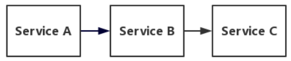
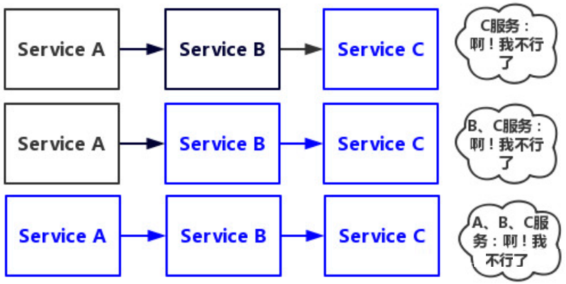
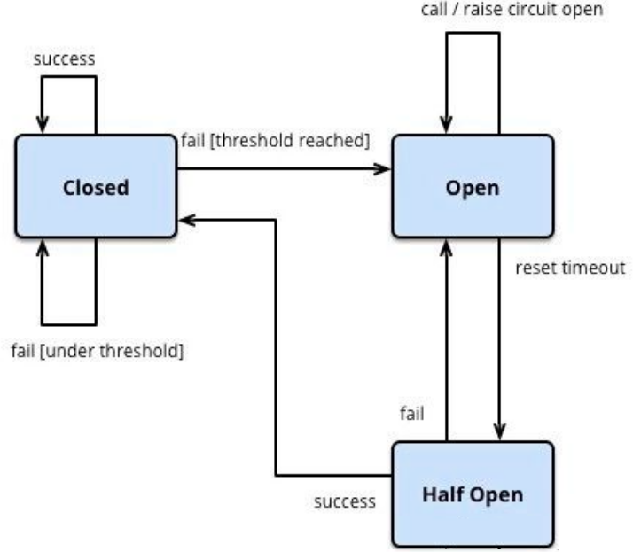
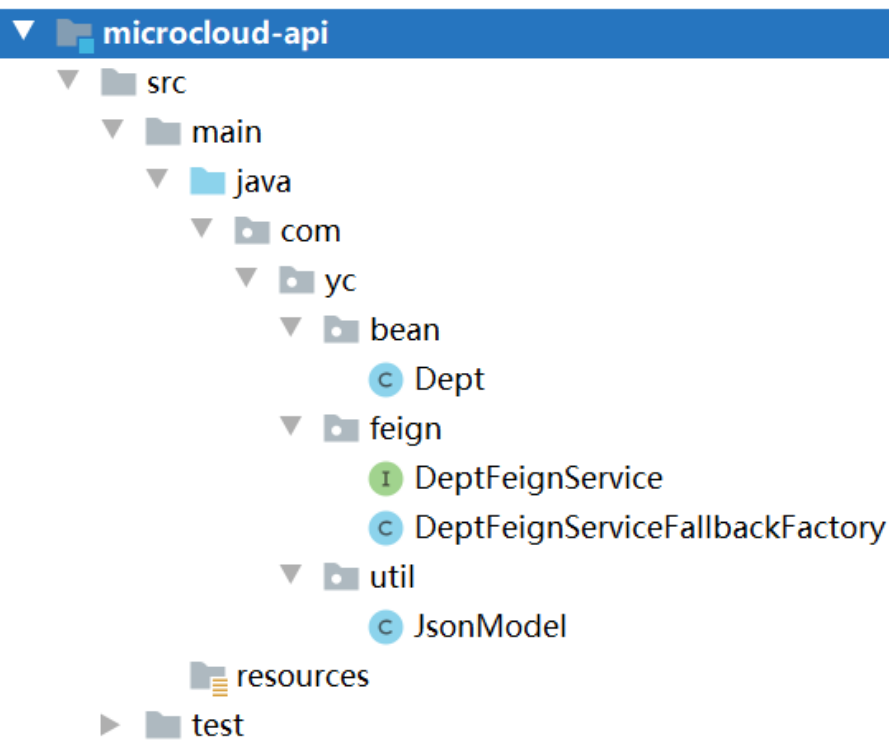
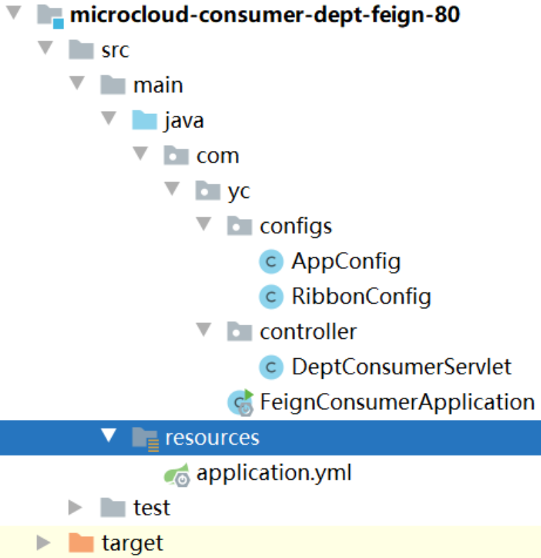
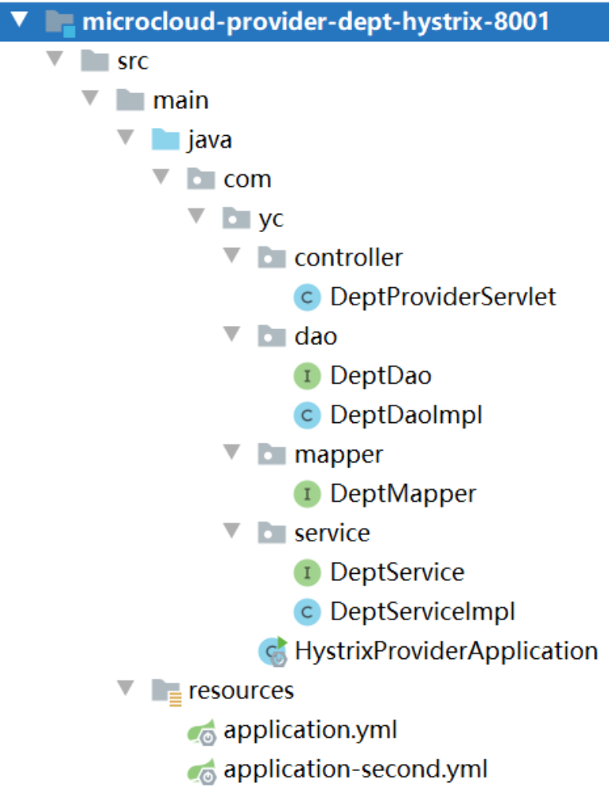
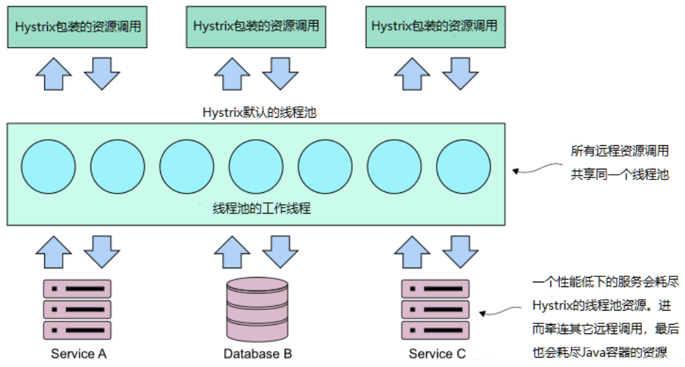
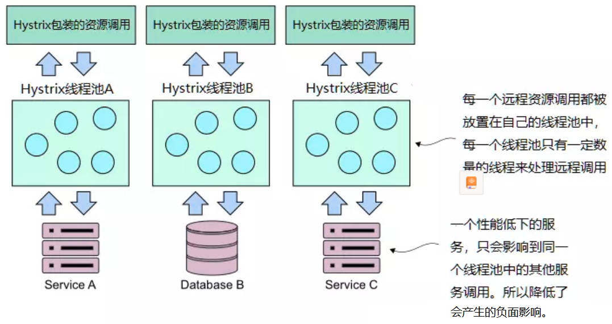

# Hystrix

## 一、Hystrix概述

**微服务架构通常是高度分布式的，必须防止单个服务中的问题级联暴露给服务消费者**，原理图如下


## 二、服务雪崩

### 1.雪崩过程

**服务雪崩指链路中某个服务失败导致整个服务失败**，流程大致如下

①若存在某条服务调用链如下图



②此时Service A的流量波动很大，流量总是会突然性增加，这种情况下就算Service A能抗住压力，Service B和Service C也不一定能抗住压力，若Service C因扛不住压力变得不可用，那么Service B的请求会被阻塞，等到Service B的资源被慢慢耗尽也会变得不可用，同样Service A也会变得不可用，导致整条服务调用链不可用



### 2.雪崩三阶段

①服务不可用：服务可能因为硬件故障、程序Bug、缓存击穿、用户大量请求等导致服务不可用

②服务调用端重试加大流量：用户不断的重试

③服务调用者不可用：同步等待造成的资源耗尽

### 3.雪崩解决

①应用扩容：加服务器、升级硬件

②流量控制：限流、关闭重试机制

③缓存预加载

④**服务降级**：当下游服务因某种原因突然变得不可用，则上游服务主动调用本地降级逻辑，避免卡顿，迅速返回给用户；当下游服务因某种原因突然变得响应过慢，则下游服务主动停掉一些不太重要的业务，释放出服务器资源，增加响应速度

⑤**服务熔断**：当下游服务因某种原因突然变得不可用或响应过慢，上游服务为保证自己整体服务的可用性，将不再继续调用目标服务，而是直接返回快速释放资源，若目标服务情况好转则恢复调用，**断路器模式**是服务熔断的很好的实现

## 三、断路器模式

### 1.断路器原理

**断路器监控远程服务调用，若长时间过长则断路器会中断该调用，若对某服务的调用失败次数足够多则断路器使后来的调用快速失败**，原理图如下



**断路器模式最初处于Closed状态，若失败次数足够多则断路器模式变为Open状态，到达Reset Timeout约定时间后进入到Half Open状态，Half Open状态时会尝试放行部分请求，若这些请求成功则进入Closed状态，失败则还是进入Open状态**

### 2.常用配置

①设置滑动窗口大小，默认20：`circuitBreaker.requestVolumeThreshold`

②设置断路器再次检测时间，默认5000ms：`circuitBreaker.sleepWindowInMilliseconds`

③设置错误率，默认50%：`circuitBreaker.errorThresholdPercentage`

若使用以上默认配置参数，则意思是当20个请求中有50%失败时断路器就会打开，此时再调用此服务将会直接返回失败，直到5s后重新检测20个请求中是否有50%失败，若有则断路器继续打开，否则将断路器模式关闭

### 3.断路器配置

Hello断路器在HelloFeign基础上进行改进，断路器是服务消费端的技术

#### 3.1.修改Feign

①目录结构



②pom.xml

```java
//feign含有Hystrix包
<dependency>
	<groupId>org.springframework.cloud</groupId>
	<artifactId>spring-cloud-starter-openfeign</artifactId>
</dependency>
```

③修改Feign接口

```java
@FeignClient(name = "MICROCLOUD-PROVIDER-DEPT", fallbackFactory = DeptFeignServiceFallbackFactory.class)
public interface DeptFeignService {

    @RequestMapping("/provider/addDept") //映射到服务提供方的地址
    public JsonModel addDept(@RequestBody Dept dept);

    @RequestMapping("/provider/findById/{id}")
    public JsonModel findById(@PathVariable("id") Long id);

    @RequestMapping("/provider/findAll")
    public JsonModel fingAll();
}
```

④编写FallbackFactory类

```java
//feign接口调用的回退处理类
@Component
public class DeptFeignServiceFallbackFactory implements FallbackFactory<DeptFeignService> {
    @Override
    public DeptFeignService create(Throwable throwable) {
        return new DeptFeignService() {
            @Override
            public JsonModel addDept(Dept dept) {
                JsonModel jsonModel = new JsonModel();
                jsonModel.setCode(-1);
                jsonModel.setData("消费端端addDept不可用");
                return jsonModel;
            }

            @Override
            public JsonModel findById(Long id) {
                JsonModel jsonModel = new JsonModel();
                jsonModel.setCode(-1);
                jsonModel.setData("消费端端findById不可用");
                return jsonModel;
            }

            @Override
            public JsonModel fingAll() {
                JsonModel jsonModel = new JsonModel();
                jsonModel.setCode(-1);
                jsonModel.setData("消费端端fingAll不可用");
                return jsonModel;
            }
        };
    }
}
```

#### 3.2.修改服务消费端

①目录结构



②pom.xml

```java
<dependency>
    <groupId>org.springframework.cloud</groupId>
    <artifactId>spring-cloud-starter-openfeign</artifactId>
</dependency>
```

③application.yml

```java
feign:
  hystrix:
    enabled: true
```

## 四、后备模式

Hello后备模式新建模块`microcloud-provider-dept-hystrix-8001`编写，为了区分之前的服务提供者，后备模式是服务提供端的技术

### 1.目录结构



### 2.pom.xml

```java
<dependency>
 	<groupId>org.springframework.cloud</groupId>
    <artifactId>spring-cloud-starter-netflix-hystrix</artifactId>
</dependency>
```

### 3.修改DeptProviderServlet

```java
@RestController
@RequestMapping("/provider")
public class DeptProviderServlet {
    @Autowired
    private DeptService deptService;

    @RequestMapping("/findAll")
    @HystrixCommand(fallbackMethod = "getMethodCallback")//后备方法名，必须是当前类中某方法名
    //当Hystrix检测请求长时间没有响应时,执行fallbackMethod绑定的当前类同方法名的方法
    public JsonModel fingAll(JsonModel jsonModel) {
        List<Dept> list = this.deptService.fingAll();
        jsonModel.setCode(1);
        jsonModel.setData(list);
        return jsonModel;
    }

    //后备模式时回调的方法
    public JsonModel getMethodCallback(JsonModel jsonModel) {
        //服务降级
        jsonModel.setCode(-1);
        jsonModel.setData("服务降级，服务查找缓慢");
        return jsonModel;
    }
}
```

### 4.启动类添加注解@EnableCircuitBreaker

```java
@SpringBootApplication
@MapperScan("com.yc.mapper")
@EnableEurekaClient //服务启动后自动注册到eureka
@EnableCircuitBreaker//启用断路器
//@SpringCloudApplication//一注解多用
public class HystrixProviderApplication {
    public static void main(String[] args) {
        SpringApplication.run(HystrixProviderApplication.class, args);
    }
}
```

## 五、舱壁模式

### 1.舱壁原理

微服务架构中，通常需要调用多个微服务完成某个特定任务，这些调用默认使用的是同一个线程，但使用的同一个线程也会带来相应问题，即性能较低的服务会霸占Java容器中绝大多数线程，而其它性能正常的服务请求则需要等待该线程资源释放，这将导致整个Java容器会崩溃



舱壁模式将远程调用隔离在各个远程调用自己的线程池中，因此单个调用性能出问题的服务能得到控制，不至于导致Java容器崩溃



### 2.舱壁模式配置

Hello舱壁模式新建模块`microcloud-provider-dept-hystrix-8001`编写，为了区分之前的服务提供者，舱壁模式是服务提供端的技术

①pom.xml

```java
<dependency>
	<groupId>org.springframework.cloud</groupId>
	<artifactId>spring-cloud-starter-netflix-hystrix</artifactId>
</dependency>
```

②修改DeptProviderServlet

```java
@RestController
@RequestMapping("/provider")
public class DeptProviderServlet {
    @Autowired
    private DeptService deptService;

    @RequestMapping("/findAll")
    @HystrixCommand(fallbackMethod = "getMethodCallback",//后备方法名，必须是当前类中某方法名
            //当Hystrix检测请求长时间没有响应时,执行fallbackMethod绑定的当前类同方法名的方法
            threadPoolKey = "productGetIdServiceThreadPool",//线程池标识，Hystrix会新建线程池，按照默认配置初始化该线程池
            threadPoolProperties = {//接收@HystrixProperty数组,用于配置新建的线程池
                    @HystrixProperty(name = "coreSize", value = "10"),
                    @HystrixProperty(name = "maxQueueSize", value = "10")
                    //应对线程池繁忙情况,当超过该容量,其他请求会迅速失败返回,直到又有空闲位置
                    //maxQueueSize=-1时Hystrix使用SynchronousQueue实现该队列(同步队列),意味着线程池繁忙时不再接收其它请求,直接迅速失败返回,粗略理解为该队列不存在
                    //maxQueueSize>1时Hystrix创建LinkedBlockingQueue
                    //Hystrix允许使用SizeRejectionThreshold动态变更队列容量，但该属性只有在maxQueueSize的value>0时才生效
                    //maxQueueSize属性的值只能在线程池初始化时设置
                    //netflix对线程池大小的建议: 每秒处理请求的峰值 × 99%平均响应时间 + 缓冲线程数
            }
    )
    public JsonModel fingAll(JsonModel jsonModel) {
        List<Dept> list = this.deptService.fingAll();
        jsonModel.setCode(1);
        jsonModel.setData(list);
        return jsonModel;
    }
}
```

③启动类添加注解@EnableCircuitBreaker

```java
@SpringBootApplication
@MapperScan("com.yc.mapper")
@EnableEurekaClient //服务启动后自动注册到eureka
@EnableCircuitBreaker//启用断路器
//@SpringCloudApplication//一注解多用
public class HystrixProviderApplication {
    public static void main(String[] args) {
        SpringApplication.run(HystrixProviderApplication.class, args);
    }
}
```


