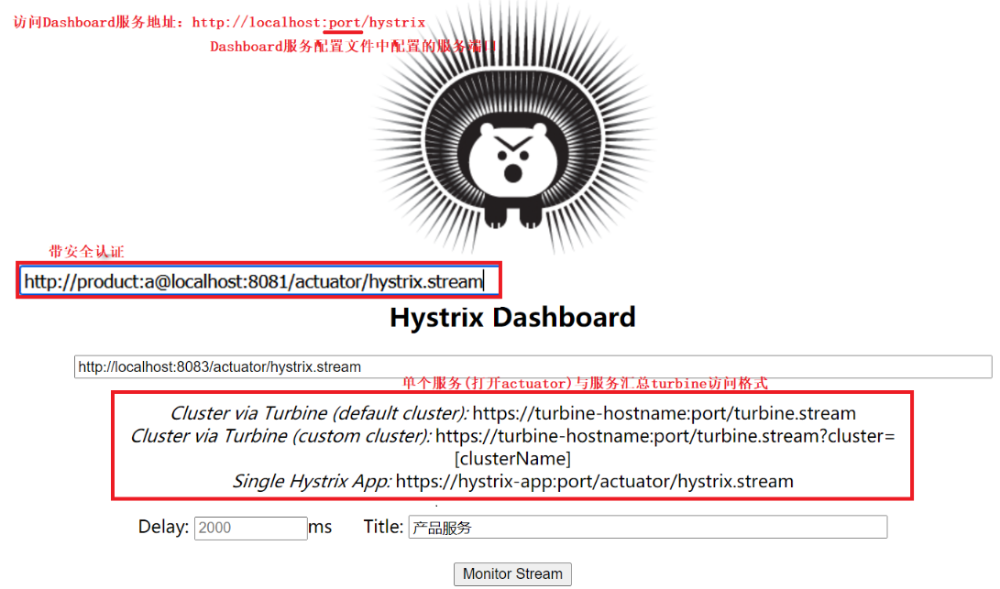
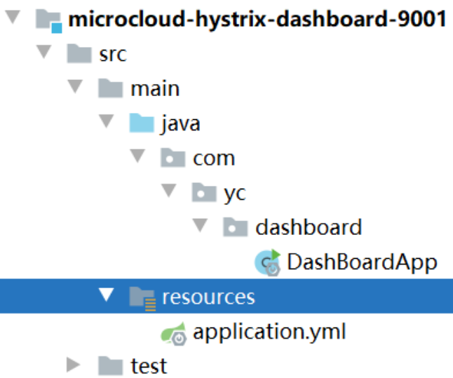
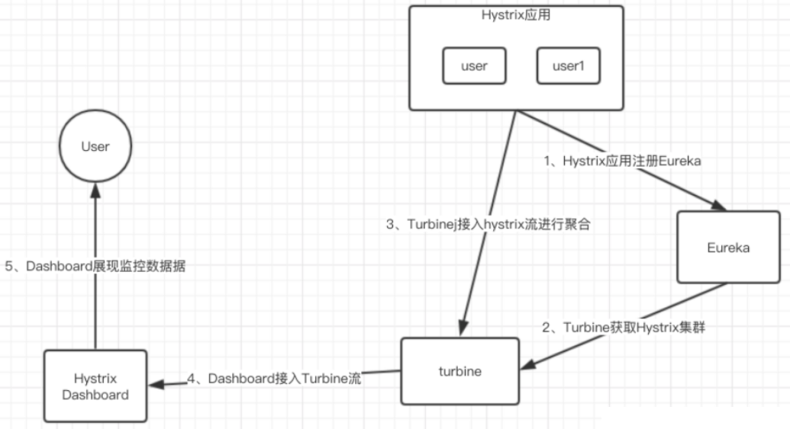

# Turbine

## 一、Dashboard

### 1.Dashboard理论

Dashboard用于记录HystrixCommand和HystrixObservableCommand实例在执行过程中的重要信息，对系统运维十分重要

**记录到的信息以滚动时间窗与桶结合的方式进行汇总，并在内存中驻留一段时间**，以供内部或外部使用

在分布式系统中有很多实例要运维和监控，这样就要开启多个窗口来监控，所以可以利用Turbine和Dashboard结合来对集群进行监控



### 2.Dashboard配置

新建Dashboard单独服务模块`microcloud-hystrix-dashboard-9001`

#### 2.1.目录结构



#### 2.2.pom.xml

```java
<dependency>
    <groupId>org.springframework.cloud</groupId>
    <artifactId>spring-cloud-starter-netflix-hystrix</artifactId>
</dependency>
<dependency>
    <groupId>org.springframework.cloud</groupId>
    <artifactId>spring-cloud-starter-netflix-hystrix-dashboard</artifactId>
</dependency>
```

#### 2.3.application.yml

```java
server:
  port: 9001  #http://localhost:9001/hystrix
hystrix:
  dashboard:
    proxy-stream-allow-list: localhost
```

#### 2.4.启动类

```java
@SpringBootApplication
@EnableHystrixDashboard
public class DashBoardApp {
    public static void main(String[] args) {
        SpringApplication.run(DashBoardApp.class,args);
    }
}
```

在`microcloud-provider-dept-hystrix-8001`添加Actuator配置后可监控到信息，不会就去Eureka中看

## 二、Turbine

### 1.Turbine理论

集群监控端点`http://turbine-hostname:port/turbine.stream`，Trubine汇集监控信息并将聚合后的信息提供给Dashboard，原理图如下



### 2.Turbine配置

新建Turbine单独服务模块`microcloud-turbine-7777`

#### 2.1.pom.xml

```java
<dependency>
	<groupId>org.springframework.cloud</groupId>
	<artifactId>spring-cloud-starter-netflix-turbine</artifactId>
</dependency>
```

#### 2.2.application.yml

```java
server:
  port: 7777

eureka: #turbine需要通过eureka获取服务列表，所以需要配置eureka
  client:
    register-with-eureka: false
    service-url:
      defaultZone: http://eureka1:7001/eureka/,http://eureka2:7002/eureka/,http://eureka3:7003/eureka/

turbine:
  app-config: MICROCLOUD-PROVIDER-DEPT #需要收集信息的服务名(eureka中的服务)
  cluster-name-expression: new String("default")
  combine-host-port: true #同主机上的服务通过主机名和端口号的组合来进行区分，默认以host来区分
```

#### 2.3.启动类

```java
@SpringBootApplication
@EnableTurbine
public class TurbineApp {
    public static void main(String[] args) {
        SpringApplication.run(TurbineApp.class,args);
    }
}
```


