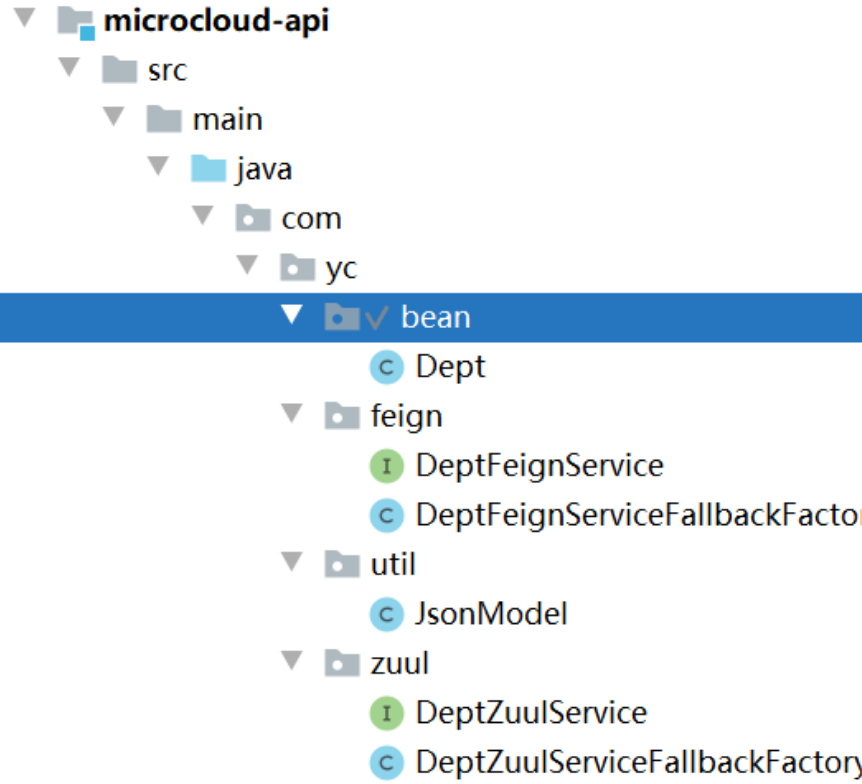

# Zuul

## 一、Zuul概述

Zuul用于将外部请求转发到具体微服务实例上，是统一访问入口的基础，Zuul将自身注册到Eureka并获取注册表

## 二、Zuul配置

### 1.基础配置

新建Zuul单独服务模块`microcloud-zuul-9527`

#### 1.1.目录结构


#### 1.2.pom.xml

```java
<!--/routes返回所有路由规则-->
<!--ribbon+hystrix-->
<dependency>
    <groupId>org.springframework.cloud</groupId>
    <artifactId>spring-cloud-starter-netflix-zuul</artifactId>
</dependency>

<!--zuul需要获取所有服务信息，需要通过eureka客户端访问eureka服务端-->
<dependency>
    <groupId>org.springframework.cloud</groupId>
    <artifactId>spring-cloud-starter-netflix-eureka-client</artifactId>
</dependency>

<!--zuul中依赖actuator，用于监控zuul服务状态-->
<dependency>
    <groupId>org.springframework.boot</groupId>
    <artifactId>spring-boot-starter-actuator</artifactId>
</dependency>
```

#### 1.3.application.yml

```java
server:
  port: 9527

eureka:
  application:
    name: microcloud-zuul-1
  client:
    service-url:
      defaultZone: http://eureka1:7001/eureka/,http://eureka2:7002/eureka/,http://eureka3:7003/eureka/
    register-with-eureka: true  #注册到eureka
    fetch-registry: true  #获取服务中的注册信息

spring:
  application:
    name: microcloud-zuul

#开启actuator监控端口
management:
  endpoints:
    web:
      exposure:
        include: '*'  #'routes'

#zuul服务路由配置
  #原来的访问路径：http://localhost:9527/microcloud-provider-dept(小写应用名)/provider/findAll(请求路径)
zuul:
  ignored-services: '*' #隐藏所有应用名,不可以直接通过应用名访问,只可通过routes设置的映射访问
  routes: #注册服务到zuul
    microcloud-provider-dept: /provider/**  #应用名：映射地址 -> 访问地址http://localhost:9527/provider(映射)/provider/findAll(请求路径)
    #映射的不同写法
    #dept.path: /provider/** #映射地址
    #dept.serviceId: microcloud-provider-dept #应用名

  prefix: /prefix  #路由前缀 —> 访问地址http://localhost:9527/prefix(路由前缀)/provider(映射)/provider/findAll(请求路径)
```

#### 1.4.启动类

```java
@SpringBootApplication
@EnableZuulProxy
public class ZuulAppConfig {
    public static void main(String[] args) {
        SpringApplication.run(ZuulAppConfig.class, args);
    }
}
```

### 2.Zuul在Feign生成调用

Zuul在HelloHystrix基础上进行改进

#### 2.1.修改公共模块

①目录结构



②DeptZuulService

```java
//修改Feign应用名为zuul的
@FeignClient(name = "MICROCLOUD-ZUUL", fallbackFactory = DeptZuulServiceFallbackFactory.class)
public interface DeptZuulService {
    @RequestMapping("/prefix/provider/provider/addDept") //映射到服务提供方的地址,注意改成自己配置routes
    public JsonModel addDept(@RequestBody Dept dept);

    @RequestMapping("/prefix/provider/provider/findById/{id}")
    public JsonModel findById(@PathVariable("id") Long id);

    @RequestMapping("/prefix/provider/provider/findAll")
    public JsonModel fingAll();
}
```

③DeptZuulServiceFallbackFactory

```java
//feign接口调用的回退处理类
@Component
public class DeptZuulServiceFallbackFactory implements FallbackFactory<DeptZuulService> {
    @Override
    public DeptZuulService create(Throwable throwable) {
        return new DeptZuulService() {
            @Override
            public JsonModel addDept(Dept dept) {
                JsonModel jsonModel = new JsonModel();
                jsonModel.setCode(-1);
                jsonModel.setData("zuul-消费端端addDept不可用");
                return jsonModel;
            }

            @Override
            public JsonModel findById(Long id) {
                JsonModel jsonModel = new JsonModel();
                jsonModel.setCode(-1);
                jsonModel.setData("zuul-消费端端findById不可用");
                return jsonModel;
            }

            @Override
            public JsonModel fingAll() {
                JsonModel jsonModel = new JsonModel();
                jsonModel.setCode(-1);
                jsonModel.setData("zuul-消费端端fingAll不可用");
                return jsonModel;
            }
        };
    }
}
```

#### 2.2.新建Zuul模块

新建模块`microcloud-consumer-dept-zuulfeign-80`，为了区分`microcloud-consumer-dept-feign-80`模块

①目录结构


②DeptConsumerServlet 

```java
@RestController
@RequestMapping("/consumer")
public class DeptConsumerServlet {

    /*@Autowired
    private DeptFeignService deptFeignService;*/
    @Autowired
    private DeptZuulService deptZuulService;

    @RequestMapping("/addDept")
    public JsonModel addDept(@RequestBody Dept dept) {
        //return this.deptFeignService.addDept(dept);
        return this.deptZuulService.addDept(dept);
    }

    @RequestMapping("/findById/{id}")
    public JsonModel findById(@PathVariable("id") Long id) {
        //return this.deptFeignService.findById(id);
        return this.deptZuulService.findById(id);
    }

    @RequestMapping("/findAll")
    public JsonModel fingAll() {
        //return this.deptFeignService.fingAll();
        return this.deptZuulService.fingAll();
    }
}
```

③启动类

```java
@SpringBootApplication(exclude = DataSourceAutoConfiguration.class)
@EnableEurekaClient
@EnableFeignClients("com.yc.zuul")//feign接口所在的包
public class ZuulFeignConsumerApplication {
    public static void main(String[] args) {
        SpringApplication.run(ZuulFeignConsumerApplication.class, args);
    }
}
```

### 3.Zuul过滤器

#### 3.1.目录结构


#### 3.2.application.yml

```java
#zuul服务路由配置
  #原来的访问路径：http://localhost:9527/microcloud-provider-dept(小写应用名)/provider/findAll(请求路径)
zuul:
  ignored-services: '*' #隐藏所有应用名,不可以直接通过应用名访问,只可通过routes设置的映射访问
  routes: #注册服务到zuul
    #microcloud-provider-dept: /provider/**  #应用名：映射地址 -> 访问地址http://localhost:9527/provider(映射)/provider/findAll(请求路径)
    #映射的不同写法
    dept.path: /provider/** #映射地址
    dept.serviceId: microcloud-provider-dept #应用名

  prefix: /prefix  #路由前缀 —> 访问地址http://localhost:9527/prefix(路由前缀)/provider(映射)/provider/findAll(请求路径)

  PreLogFilter:
    pre:
      disable: true #关闭过滤
  sensitive-headers: #保留authorization
```

#### 3.3.AuthorizedRequestFilter

```java
@Component
public class AuthorizedRequestFilter extends ZuulFilter {
    @Override //过滤器类型，有pre,routing,post,error四种
    public String filterType() {
        //相当pre
        return FilterConstants.PRE_TYPE;
    }

    @Override //过滤器优先级，数字越小优先级越高
    public int filterOrder() {
        return 0;
    }

    @Override //是否过滤，true表示过滤
    public boolean shouldFilter() {
        return true;
    }

    @Override //自定义过滤逻辑，当shouldFilter返回true时会执行
    public Object run() throws ZuulException {
        //获取当前请求的上下文
        RequestContext currentContext = RequestContext.getCurrentContext();
        //认证原始信息
        String auth = "product:a";
        //加密处理
        byte[] encodeAuth = Base64.getEncoder().encode(auth.getBytes(Charset.forName("US-ASCII")));
        String authHeader = "Basic" + new String(encodeAuth);
        //敏感头 过滤
        currentContext.addOriginResponseHeader("Authorization", authHeader);
        return null;
    }
}
```


