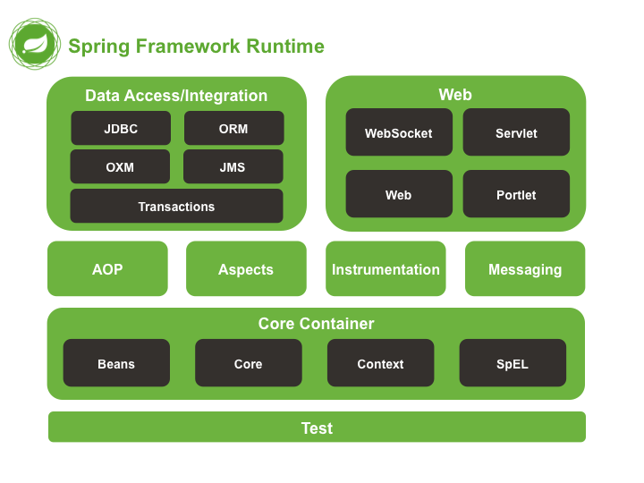

# SpringFramework

## 一、SpringFramework概述

### 1.什么是SpringFramework？

Spring框架一般指的都是SpringFramework，SpringFramework是很多模块的集合，是**轻量级**Java开发框架，**目的是提高开发人员的开发效率和系统的可维护性，其核心思想是不造重复的轮子，开箱即用！核心功能是IOC、DI、AOP**

### 2.为什么会出现SpringFramework？

原来普通Java项目多态创建类的方式是`Fu f = new Zi1()`，若此时扩充子类`zi2()`、`Zi3()`，若需要改变多态是必须要改变`new`，不满足开闭原则，即主动权在程序员手中


此时加入`set()`方法，为`Fu f`赋值，无论扩充多少子类，都只看用户为`set()`传入的参数是什么，即主动权在用户手中


二者的区别如下


### 3.列举一些重要模块



**Spring Core**：核心模块，其他功能基本都依赖于该模块，主要支持IOC

**Spring AOP**：提供面向切面的编程实现

**Spring Test**：支持常用测试框架

**Spring Aspects**：支持Aspects的集成

**Spring Data Access/Integration**：该模块由5个模块组成

* **Spring JDBC**：支持数据库访问，屏蔽不同数据库的差异
* **Spring TX**：支持事务
* **Spring ORM**：支持Hibernate等ORM框架
* **Spring OXM**：支持Castor等OXM框架
* **Spring JMS**：Java消息服务

**Spring Web**：由**Spring Web**、**Spring WebMVC**、**Spring WebSocket**、**Spring WebFlux**

### 4.Spring&Spring MVC&Spring Boot的关系

**Spring**包含很多模块，最重要的是SpringCore，它提供IOC的支持

**Spring MVC**主要用于快速构建MVC框架的Web应用，核心思想是将业务逻辑、数据、显示部分分开组成代码

**Spring Boot**旨在简化Spring的配置，不与要XML或Java显示配置，真正做到开箱即用！

## 二、HelloSpring

```java
public class Hello {
    public Hello() {
        System.out.println("Hello构造方法");
    }
    public void sayHello() {
        System.out.println("hello");
    }
}
```

### 1.XML配置方案

①spring.xml

```java
<?xml version="1.0" encoding="UTF-8"?>
<beans xmlns="http://www.springframework.org/schema/beans"
       xmlns:xsi="http://www.w3.org/2001/XMLSchema-instance"
       xsi:schemaLocation="http://www.springframework.org/schema/beans
        https://www.springframework.org/schema/beans/spring-beans.xsd">

    <!--配置ICO -- class:类的全路径 -- id:名

        容器：Map<String,对象>
            取值：get("id名")
    -->
    <bean id="h" class="com.yc.test1.Hello" lazy-init="true" scope="prototype"></bean>
</beans>
```

②HelloTest

```java
public class HelloTest {
    public static void main(String[] args) {
        //1.原来
        Hello hello1 = new Hello();
        hello1.sayHello();
        System.out.println("=============================");

        //2.xml方法
        //ClassPathXmlApplicationContext：类路径下查xml文件，创建管理容器IOC
        ApplicationContext context = new ClassPathXmlApplicationContext("spring.xml");

        //默认勤快加载，如何懒加载？？lazy-init="true" 懒加载，但仍然是单例-->1.4.4
        Hello hello2 = context.getBean("h", Hello.class);
        hello2.sayHello();
        System.out.println("=============================");
        Hello hello3 = (Hello) context.getBean("h");
        hello3.sayHello();
		System.out.println("=============================");
		System.out.println(hello2 + "==" + hello3);//相同
		System.out.println("=============================");
		
        //默认创建对象是单实例，如何实现多实例？？scope="prototype" -->1.5
        Hello hello4 = (Hello) context.getBean("h");
        Hello hello5 = (Hello) context.getBean("h");
        System.out.println(hello4 + "==" + hello5);//相同
    }
}
```

### 2.注解配置方案

①pom.xml


②AppConfig

```java
@Configuration//配置类，相当于xml文件中的配置
//@Scope("singleton/prototype")//单例或多例 
//@Lazy(true/false)//懒加载
public class AppConfig{
    //<bean id="h" class="com.yc.test1.Hello" lazy-init="true" scope="prototype"></bean>
    @Bean //创建hello的bean，并以h为名字id
    public Hello h() {
        return new Hello();
    }
}
```

③HelloTest

```java
public class HelloTest {
    //容器只用创建一次
    static ApplicationContext context;

    @BeforeClass
    public static void initClass() {
        //AnnotationConfigApplicationContext：基于注解，创建管理容器IOC
        context = new AnnotationConfigApplicationContext(AppConfig.class);
    }

    @Test
    public void testIOC() {
        Hello hello2 = context.getBean("h", Hello.class);
        hello2.sayHello();
		System.out.println("=============================");

        Hello hello3 = (Hello) context.getBean("h");
        hello3.sayHello();
    }

    @Test
    public void testProcessor() {
        String[] beanName = context.getBeanDefinitionNames();//获取spring托管的bean
        //spring自己还会托管一些bean
        for (String bn : beanName) {
            System.out.println(bn);//h被托管
            //注意配置类也会被托管
        }
    }
}
```

## 三、IOC/DI

### 1.什么是IOC/DI？

IOC全称Inversion Of Control，译为控制反转，**思想是将原本在程序中手动创建对象的控制权交给Spring框架**，手动创建对象的控制权即控制，交给外部框架即反转，**IOC容器实际上就是`Map<key,value>`👀**，Map中存放的是各种对象

DI全称Dependency Injection，译为依赖注入，**思想是对象所有属性由Spring注入**，说白了就是`set()`由Spring容器执行

**IOC/DI将对象间复杂的依赖关系交给IOC，并由IOC完成注入**，很大程度简化应用开发，将应用从复杂的依赖关系中抽离，这样创建对象时，**我们完全不用管对象是如何被创建的，只需要写好配置文件和注解即可**

### 2.托管Bean到Spring容器

我们知道IOC/DI都依赖于Spring容器管理对象间复杂的依赖和注入属性值，所以需要被管理的对象肯定需要托管到Spring容器，测试方法如下，托管方式请看标题

```java
//容器只用创建一次
static ApplicationContext context;
@BeforeClass
public static void initClass() {
    //AnnotationConfigApplicationContext：基于注解，创建管理容器IOC
    context = new AnnotationConfigApplicationContext(AppConfig3.class);
}
@Test
public void testProcessor() {
    //获取spring托管的bean
    String[] beanName = context.getBeanDefinitionNames();
    for (String bn : beanName) {
        System.out.println(bn);
    }
}
```

#### 2.1.@Configuration+@Bean

`@Configuration+@Bean`将在单独的配置类中托管相应的Bean，适用于第三方Bean，即托管别人写的Bean，注意**配置类也会被托管**

```java
@Configuration
public class AppConfig {
    @Bean//创建Hello类的Bean，并以h为id
    public Hello h() {
        return new Hello();
    }
}
```

#### 2.2.@Component+@ComponentScan

`@Component`是托管注解，表示这是托管类，需要被Spring托管，**`@Repository`、`@Service`、`@Controller`注解是`@Component`的具体业务场景**，分别用于DAO层、业务层、控制层，该注解适用于托管自己写的类

`@ComponentScan`**配置于启动类**，用于扫描`@Component`注解，并将`@Component`的类托管，该注解含以下几种重要参数

* `basePackages`：指定扫描的类路径，默认全部扫描
* `beanId`：指定托管类的id
* `useDefaultFilters`：默认过滤器
* `includeFilters`：扫描哪些注解，`includeFilters = {@ComponentScan.Filter(type = FilterType.ANNOTATION, value = {Component.class})}`表示扫描`@Component`，包含`@Repository`、`@Service`、`@Controller`
* `excludeFilters`：不扫描哪些注解，例`excludeFilters = {@ComponentScan.Filter(type = FilterType.ANNOTATION, value = {Service.class, Repository.class})})`

接下来看具体如何配置

①Hello托管类

```java
@Component(value = "h")//id默认是类名的小写hello，但通过value="h"配置后id为h
public class Hello {
    public Hello() {
        System.out.println("Hello构造方法");
    }
    public void sayHello() {
        System.out.println("hello");
    }
}
```

②AppConfig启动类

```java
@Configuration
@ComponentScan(basePackages = {"com.yc.test1", "com.yc.test2"})
public class AppConfig {   }
```

#### 2.3.@Import

`@Import`中直接指定需要托管的类的`.class`文件，id默认为全路径名，与`@Configuration`配合使用，使用方法有如下三种

①托管`.class`

```java
@Configuration
@Import({Hello.class})
public class AppConfig {   }
```

②ImportSelector接口提供导入的规则，可以写逻辑语句

```java
@Configuration
//Pear托管，而不是PearImportSelector，PearImportSelector只提供逻辑语句
@Import({Hello.class,PearImportSelector.class})
public class AppConfig {   }
```

```java
public class PearImportSelector implements ImportSelector {
    @Override
    public String[] selectImports(AnnotationMetadata importingClassMetadata) {
        //importingClassMetadata：类的原信息
        System.out.println("selectImport：" + importingClassMetadata.toString());

        return new String[]{Pear.class.getName()};
    }
}
```

③ImportBeanDefinitionRegistrar接口

```java
@Import({FruitNameImportBeanDefinitionRegistrar.class})
public class AppConfig3 {   }
```

```java
//判断Hello是否托管，如果托管则将Grape托管，并修改beanid
public class FruitNameImportBeanDefinitionRegistrar implements ImportBeanDefinitionRegistrar {
    //registerBeanDefinitions：注册bean的定义
    //importingClassMetadata：注解原信息
    //BeanDefinitionRegistry：bean的注册项
    @Override
    public void registerBeanDefinitions(AnnotationMetadata importingClassMetadata, BeanDefinitionRegistry registry) {
        //判断Grape是否托管
        boolean bean = registry.containsBeanDefinition("com.yc.test1.Hello");
        //改beanid
        if (bean) {
            //bean定义项
            RootBeanDefinition d = new RootBeanDefinition(Grape.class);
            registry.registerBeanDefinition("grape", d);
        }
    }
}
```

#### 2.4.FactoryBean

①创建工厂Bean，实现FactoryBean接口

```java
public class OrangeFactoryBean implements FactoryBean<Orange> {
    @Override//获取实例
    public Orange getObject() throws Exception {
        return new Orange();
    }
    @Override//实例的类型
    public Class<?> getObjectType() {
        return Orange.class;
    }
    @Override//是否是单例
    public boolean isSingleton() {
        return true;
    }
}
```

②托管工厂Bean

```java
@Configuration
public class AppConfig3 {
    @Bean//托管工厂
    public FactoryBean<Orange> orangeFactoryBean() {
        return new OrangeFactoryBean();
    }
}
```

③取产品&工厂

```java
取产品：context.getBean("orangeFactoryBean");
取工厂：context.getBean("&orangeFactoryBean");
```

#### 2.5.@Conditional

`@Conditional`是条件注解，用于添加判断逻辑，决定当前类是否被托管，配置方法如下

①编写条件类，实现`Condition`接口，重写`matches()`，若该方法返回`true`则托管该类，否则不托管

```java
public class SystemCondition implements Condition {
    @Override
    public boolean matches(ConditionContext context, AnnotatedTypeMetadata metadata) {
        //判断之前操作系统的类型 
        Environment env = context.getEnvironment();
        String os = env.getProperty("os.name");
        if (os.contains("Linux")) {
            return true;
        }
        return false;
        //-Dos.name=Linux(VM options) 测试
    }
}
```

②添加`@Conditional`在需要被托管的类上，那么托管`Strawberry`类之前会先进入`SystemCondition`类判断是否可以被托管

```java
@Conditional(SystemCondition.class)
@Component
public class Strawberry {   }
```

### 3.DI注解@Value

`@Value`有三种使用方法，如下

①注入普通值

```java
@Value("oracle.jdbc.driver.OracleDriver")
private String driver;//取出""对应的Val给该属性
```

②`spEL`注入，支持运算

```java
@Value("#{T(java.lang.Runtime).getRuntime().availableProcessors()}")
private int minCons;
@Value("#{T(java.lang.Runtime).getRuntime().availableProcessors()*2}")
private int maxCons;
```

③注入配置文件中配置的值

```javascript
db.username=root
db.password=a
```

```java
@Value("${db.username}")//$占位符
private String username;
@Value("${db.password}")//参数在配置文件中配置的Key
private String password;//取出Key对应的Val给该属性
```

```java
@Configuration
@ComponentScan(basePackages = {"com.yc.test4"})
@PropertySource({"classpath:db.properties"})//添加配置文件，yml配置文件不需要
public class AppConfig4 {  }
```

### 4.IOC注解

#### 4.1.@Autowired+@Qualifier

`@Autowired`装配该类的初始值，即`new`

`@Qualifier`明确注入的Bean，即明确`new`哪个实现类，**使用在属性上**

```java
@Autowired
@Qualifier("custDaoOracleImpl")
private CustDao custDao;
//CustDao是接口，custDaoOracleImpl与custDaoMysqlImpl是其的两个实现类
```

#### 4.2.@Autowired+@Primary

`@Autowired`装配该类的初始值，即`new`

`@Primary`明确注入Bean的优先级，当有多个实现类时，优先`new`使用该注解的实现类，**使用在类上**

```java
@Autowired
private CustDao custDao;
//CustDao是接口，custDaoOracleImpl与custDaoMysqlImpl是其的两个实现类
```

```java
@Primary
public class CustDaoOracleImpl implements CustDao {...}
```

#### 4.3.@Inject+@Name

`@Inject`类似于`@Autowired`，`@Name`类似于`@Qualifier`，使用前需要导包

```java
<dependency>
 	<groupId>javax.inject</groupId>
    <artifactId>javax.inject</artifactId>
    <version>1</version>
</dependency> 
```

```java
@Inject
@Name("custDaoOracleImpl")
private CustDao custDao;
//CustDao是接口，custDaoOracleImpl与custDaoMysqlImpl是其的两个实现类
```

#### 4.4.@Resource

`@Resource(name)`相当于`@Autowired+@Qualifier`

```java
@Resource(name = "custDaoOracleImpl")
private CustDao custDao;
```

#### 4.5.@Required

`@Required`是一种安全机制，避免空指针异常，必须要注入，否则报错

```java
private CustDao custDao;
@Required
public void setCustDao(CustDao custDao) {
   this.custDao = custDao;
}
```

### 5.IOC/DI源码之初始化时完成什么工作

#### 5.1.源码分析准备

Spring容器在启动时初始化的注解是怎么加载的？请运行`AnnotationStart`查看输出结果，探究结果中的内容如何被加载

```java
@Configuration
public class AppConfig {
}
```

```java
@Configuration
public class AnnotationStart {
	public static void main(String[] args) {
		//ApplicationContext含多个接口，每个接口实现不同功能--->单一职责原则
		ApplicationContext ac = new AnnotationConfigApplicationContext(Appconfig.class,AnnotationStart.class);

		String[] beanNames = ac.getBeanDefinitionNames();
		for (String beanName : beanNames) {
			System.out.println(beanName);
		}
	}
}
```

```java
//内置Bean，自己没有配置是如何被加载的？
org.springframework.context.annotation.internalConfigurationAnnotationProcessor
org.springframework.context.annotation.internalAutowiredAnnotationProcessor
org.springframework.context.annotation.internalCommonAnnotationProcessor
org.springframework.context.event.internalEventListenerProcessor
org.springframework.context.event.internalEventListenerFactory
//手动配置的Bean，如何被扫描？
appconfig
annotationStart
```

以`AnnotationConfigApplicationContext`为入口，一探究竟

```java
public AnnotationConfigApplicationContext(Class<?>... componentClasses) {
    this();//调用无参构造函数	*<1>*
    register(componentClasses);
    refresh();
}
```

#### 5.2.内置Bean如何被加载？

`this()`源代码如下，一步步深入

```java
public AnnotationConfigApplicationContext() {
    super();//创建Bean工厂，先不进入看这个方法干了什么，到达关键处讲解，先记住有这个

    //AnnotatedBeanDefinitionReader	*<1>*	添加好所有内置Bean的list
    this.reader = new AnnotatedBeanDefinitionReader(this);

    this.scanner = new ClassPathBeanDefinitionScanner(this);
}
```

进入`AnnotatedBeanDefinitionReader`

```java
//传入的是this，而this是AnnotationConfigApplicationContext，AnnotationConfigApplicationContext和BeanDefinitionRegistry有何关系呢？？？请看下图1可知，是父子关系
public AnnotatedBeanDefinitionReader(BeanDefinitionRegistry registry) {
    this(registry, getOrCreateEnvironment(registry));
    //getOrCreateEnvironment	*<2>*	返回标准环境变量
    
    //this	*<8>*	添加好所有内置Bean的list
}
```

①进入`getOrCreateEnvironment`

```java
private static Environment getOrCreateEnvironment(BeanDefinitionRegistry registry) {
    Assert.notNull(registry, "BeanDefinitionRegistry must not be null");
	
    //registry是不是EnvironmentCapable的实例？？查看图2发现是，进入if
    if (registry instanceof EnvironmentCapable) {
        //getEnvironment	*<3>*	返回标准环境变量
        return ((EnvironmentCapable) registry).getEnvironment();
    }
    return new StandardEnvironment();
}
```

```java
public interface EnvironmentCapable {
    //这是一个抽象方法，应进入其具体的实现类AbstractApplicationContext	*<4>*	获取到标准环境变量
	Environment getEnvironment();
}
```

```java
@Override
public ConfigurableEnvironment getEnvironment() {
    //若environment为空就创建，不为空就直接返回
    if (this.environment == null) {
        //createEnvironment	*<5>*	返回标准环境变量
        this.environment = createEnvironment();
    }
    return this.environment;
}
```

```java
protected ConfigurableEnvironment createEnvironment() {
    //StandardEnvironment	*<6>*	创建标准环境变量后返回，标准环境变量包含系统环境变量和系统属性
    return new StandardEnvironment();
}
```

```java
//看到StandardEnvironment上的注释部分提示，环境变量由系统属性和系统环境变量组成
AbstractEnvironment#getSystemProperties() system properties//获取系统属性，Java虚拟机中的变量，可以用idea自己设置
AbstractEnvironment#getSystemEnvironment() system environment variables//获取系统环境变量，高级系统设置中设置的环境变量
    
//二者有什么区别呢？？请接着向下看	*<7>*
```

```java
//1.测试代码
public class Enviroment {
	public static void main(String[] args) {
		//env 系统环境变量
		Map<String, String> map = System.getenv();
		for (Map.Entry entry : map.entrySet()) {
			System.out.println(entry.getKey() + ":" + entry.getValue());
		}
		System.out.println(map);
		//map.put("testpro","123");//不能修改

		System.out.println();
		System.out.println("-------------------------------------");
		System.out.println();

		//Properties  系统属性，系统默认属性或自己通过-D传入
		Properties p = System.getProperties();
		p.forEach((k, v) -> {
			System.out.println(k + ":" + v);
		});
		//p.put("testpro", "123");//可以修改
	}
}
-------------------------------------
2.高级系统设置中新建变量名为allenv，变量值为a的环境变量；IDEA的JVM中配置-Dallpro=b，接着运行测试代码查看控制台的输出
	发现系统环境变量中未输出allenv:a，而系统属性中输出allpro:b，这是为什么呢？我想是IDEA没有刷新，将IDEA关闭后再次刷新发现allenv:a被输出
-------------------------------------
3.放开第一句代码的注释，查看控制台输出发现报错UnsupportedOperationException，可以点入getenv中查看返回值，发现返回的Map被final修，所以系统环境变量不能被修改
	放开第二句代码的注释，查看控制台输出发现没有报错，所以系统属性可以修改
-------------------------------------
4.总结env与Properties的区别：
	级别不同：env是全局的，属于整个操作系统，而properties只对Java平台有效
	可修改性不同：在运行时，env不能改变，properties可以改变
-------------------------------------
5.继续向下看
```

```java
//我们知道系统环境变量调用getEnv和getProperties，那么体现在源码何处？
//从*<6>*进入StandardEnvironment，发现其无参构造中啥也没干，实际隐藏super()，所以调用父类的无参构造，点击AbstractEnvironment	*<8>*
//OK到这开始往回退，*<n>*后面接着讲解代码的作用，直接退到*<6>*
```

```java
//可变属性资源文件
private final MutablePropertySources propertySources = new MutablePropertySources();
public AbstractEnvironment() {
    //注意到此处方法customizePropertySources的调用没有使用this，所以根据多态的特性应该是调用子类重写的方法StandardEnvironment	*<9>*	两属性已被添加到propertySources，即可变资源属性文件
    customizePropertySources(this.propertySources);
}
```

```Java
//StandardEnvironment的customizePropertySources被调用
@Override
protected void customizePropertySources(MutablePropertySources propertySources) {
    //传入一个空的属性文件propertySources

    //getSystemProperties *<10>*	获取到系统属性并包装成PropertiesPropertySource
    propertySources.addLast(
        new PropertiesPropertySource(SYSTEM_PROPERTIES_PROPERTY_SOURCE_NAME, getSystemProperties()));

    //getSystemEnvironment	*<11>*	获取到环境变量并包装成SystemEnvironmentPropertySource
    propertySources.addLast(
        new SystemEnvironmentPropertySource(SYSTEM_ENVIRONMENT_PROPERTY_SOURCE_NAME, getSystemEnvironment()));
}
```

```java
@Override
@SuppressWarnings({"rawtypes", "unchecked"})
public Map<String, Object> getSystemProperties() {
    try {
        return (Map) System.getProperties();//注意此句话，获取系统属性并返回
    } catch (AccessControlException ex) {
        return (Map) new ReadOnlySystemAttributesMap() {
            @Override
            @Nullable
            protected String getSystemAttribute(String attributeName) {
                try {
                    return System.getProperty(attributeName);
                } catch (AccessControlException ex) {
                    if (logger.isInfoEnabled()) {
                        logger.info("Caught AccessControlException when accessing system property '" +
                                    attributeName + "'; its value will be returned [null]. Reason: " + ex.getMessage());
                    }
                    return null;
                }
            }
        };
    }
}
//OK到这开始往回退，*<n>*后面接着讲解代码的作用，直接退到*<10>*
```

```java
@Override
@SuppressWarnings({"rawtypes", "unchecked"})
public Map<String, Object> getSystemEnvironment() {
    if (suppressGetenvAccess()) {
        return Collections.emptyMap();
    }
    try {
        return (Map) System.getenv();//注意此句话，获取环境变量并返回
    } catch (AccessControlException ex) {
        return (Map) new ReadOnlySystemAttributesMap() {
            @Override
            @Nullable
            protected String getSystemAttribute(String attributeName) {
                try {
                    return System.getenv(attributeName);
                } catch (AccessControlException ex) {
                    if (logger.isInfoEnabled()) {
                        logger.info("Caught AccessControlException when accessing system environment variable '" +
                                    attributeName + "'; its value will be returned [null]. Reason: " + ex.getMessage());
                    }
                    return null;
                }
            }
        };
    }
}
//OK到这开始往回退，*<n>*后面接着讲解代码的作用，直接退到*<11>*
```

②进入`this`

```java
//registry就是this，environment是标准环境变量
public AnnotatedBeanDefinitionReader(BeanDefinitionRegistry registry, Environment environment) {
    Assert.notNull(registry, "BeanDefinitionRegistry must not be null");
    Assert.notNull(environment, "Environment must not be null");
    
    this.registry = registry;

    //ConditionEvaluator	*<12>*	创建解析@Conditional条件注解的解析器  
    this.conditionEvaluator = new ConditionEvaluator(registry, environment, null);
    
    //registerAnnotationConfigProcessors注册注解的配置解析器	*<13>*	添加好所有内置Bean的list
    AnnotationConfigUtils.registerAnnotationConfigProcessors(this.registry);
}
```

```java
//类上的注释Internal class used to evaluate {@link Conditional} annotations.意思为这是内部类，用于解析注解Conditional条件注解
public ConditionEvaluator(@Nullable BeanDefinitionRegistry registry,
                          @Nullable Environment environment, @Nullable ResourceLoader resourceLoader) {
    this.context = new ConditionContextImpl(registry, environment, resourceLoader);
}
//OK到这开始往回退，*<n>*后面接着讲解代码的作用，直接退到*<12>*
```

```java
public static void registerAnnotationConfigProcessors(BeanDefinitionRegistry registry) {
    //registerAnnotationConfigProcessors	*<14>*	添加好所有内置Bean的list
    registerAnnotationConfigProcessors(registry, null);
}
```

```java
//关键来了！！！！！
public static Set<BeanDefinitionHolder> registerAnnotationConfigProcessors(
    BeanDefinitionRegistry registry, @Nullable Object source) {

    //unwrapDefaultListableBeanFactory	*<15>*	创建BeanFactory，BeanFactory中封装一些关于Bean的操作(获取Bean、管理Bean、存储Bean)
    DefaultListableBeanFactory beanFactory = unwrapDefaultListableBeanFactory(registry);

    //BeanFactory不等于空就进入if，此处进入if
    if (beanFactory != null) {
        //getDependencyComparator用于获取依赖对象的比较器，AnnotationAwareOrderComparator是注解解析的排序器，为什么需要这样？？存在注解@Order，@Priority，接口Ordered等会存在比较或者优先执行的情况，所以需要比较顺序
        
        //getDependencyComparator	*<17>*	返回的是空，所以instanceof返回false，!false=true，进入if
        if (!(beanFactory.getDependencyComparator() instanceof AnnotationAwareOrderComparator)) {
            //INSTANCE	*<18>*	相当于创建AnnotationAwareOrderComparator实例，并设置于BeanFactory
            beanFactory.setDependencyComparator(AnnotationAwareOrderComparator.INSTANCE);
        }

        //存在@Autowire、@Qualifier、@Lazy等注解需要装配，此处的if也是用于比较，创建实例，并设置于BeanFactory，就不深入查看
        if (!(beanFactory.getAutowireCandidateResolver() instanceof ContextAnnotationAutowireCandidateResolver)) {
            //ContextAnnotationAutowireCandidateResolver是自动装配候选项的解析器
            beanFactory.setAutowireCandidateResolver(new ContextAnnotationAutowireCandidateResolver());
        }
    }
    //以上一整个if(beanFactory != null)内为BeanFactory装配了注解解析排序器和自动装配候选项解析器，接着往下看

    Set<BeanDefinitionHolder> beanDefs = new LinkedHashSet<>(8);

    //判断有没有internalConfigurationAnnotationProcessor，该注解是不是有一点此曾相识，没错请回到5.1源码分析准备的输出结果部分查看，这不就是我们需要的内置Bean，下面的if判断都是这样滴
    //containsBeanDefinition	*<19>*	返回false，!false=true，进入if
    if (!registry.containsBeanDefinition(CONFIGURATION_ANNOTATION_PROCESSOR_BEAN_NAME)) {
        //ConfigurationClassPostProcessor用于解析@Configuration注解
        RootBeanDefinition def = new RootBeanDefinition(ConfigurationClassPostProcessor.class);
        def.setSource(source);
        
        //registerPostProcessor	*<23>*	注册Bean到Bean工厂并返回BeanDefinitionHolder实例
        //add将返回的BeanDefinitionHolder添加到beanDefs的list中
        beanDefs.add(registerPostProcessor(registry, def, CONFIGURATION_ANNOTATION_PROCESSOR_BEAN_NAME));
    }

    //以下if内操作大同小异，用于注册不同的注解解析器，不详细讲解
    
    //@Autowired	internalAutowiredAnnotationProcessor
    if (!registry.containsBeanDefinition(AUTOWIRED_ANNOTATION_PROCESSOR_BEAN_NAME)) {
        RootBeanDefinition def = new RootBeanDefinition(AutowiredAnnotationBeanPostProcessor.class);
        def.setSource(source);
        beanDefs.add(registerPostProcessor(registry, def, AUTOWIRED_ANNOTATION_PROCESSOR_BEAN_NAME));
    }

    //@PostConstruct、@PreDestroy、@Resource，可通过CommonAnnotationBeanPostProcessor上的注解查看
    if (jsr250Present && !registry.containsBeanDefinition(COMMON_ANNOTATION_PROCESSOR_BEAN_NAME)) {
        RootBeanDefinition def = new RootBeanDefinition(CommonAnnotationBeanPostProcessor.class);
        def.setSource(source);
        beanDefs.add(registerPostProcessor(registry, def, COMMON_ANNOTATION_PROCESSOR_BEAN_NAME));
    }

    //PersistenceAnnotationBeanPostProcessor.
    if (jpaPresent && !registry.containsBeanDefinition(PERSISTENCE_ANNOTATION_PROCESSOR_BEAN_NAME)) {
        RootBeanDefinition def = new RootBeanDefinition();
        try {
            def.setBeanClass(ClassUtils.forName(PERSISTENCE_ANNOTATION_PROCESSOR_CLASS_NAME,
                                                AnnotationConfigUtils.class.getClassLoader()));
        } catch (ClassNotFoundException ex) {
            throw new IllegalStateException(
                "Cannot load optional framework class: " + PERSISTENCE_ANNOTATION_PROCESSOR_CLASS_NAME, ex);
        }
        def.setSource(source);
        beanDefs.add(registerPostProcessor(registry, def, PERSISTENCE_ANNOTATION_PROCESSOR_BEAN_NAME));
    }

    //internalEventListenerProcessor
    if (!registry.containsBeanDefinition(EVENT_LISTENER_PROCESSOR_BEAN_NAME)) {
        RootBeanDefinition def = new RootBeanDefinition(EventListenerMethodProcessor.class);
        def.setSource(source);
        beanDefs.add(registerPostProcessor(registry, def, EVENT_LISTENER_PROCESSOR_BEAN_NAME));
    }

    //internalEventListenerFactory
    if (!registry.containsBeanDefinition(EVENT_LISTENER_FACTORY_BEAN_NAME)) {
        RootBeanDefinition def = new RootBeanDefinition(DefaultEventListenerFactory.class);
        def.setSource(source);
        //registerPostProcessor 多一层包装，支持别名
        beanDefs.add(registerPostProcessor(registry, def, EVENT_LISTENER_FACTORY_BEAN_NAME));
    }

    return beanDefs;//返回添加好所有内置Bean的list
}
```

```java
@Nullable
private static DefaultListableBeanFactory unwrapDefaultListableBeanFactory(BeanDefinitionRegistry registry) {
    
    //registry是不是DefaultListableBeanFactory的实例？？查看图3发现是，进入if
    if (registry instanceof DefaultListableBeanFactory) {
        return (DefaultListableBeanFactory) registry;//此处做一个类型转换后直接返回
    } else if (registry instanceof GenericApplicationContext) {
        //registry是不是GenericApplicationContext的实例？？查看图4发现是，进入if
        //发现返回的是get出来的ListableBeanFactory，那在哪里创建的呢？	*<16>*	无参构造中new出来，那么无参构造又是什么时候调用？？注意到AnnotationConfigApplicationContext的构方法的super调用父类的构造时创建，即super进入GenericApplicationContext构造，此处还有一个非常重要的知识点，5.3节讲解
        return ((GenericApplicationContext) registry).getDefaultListableBeanFactory();
    } else {
        return null;
    }
}
//OK到这开始往回退，*<n>*后面接着讲解代码的作用，直接退到*<15>*
```

```java
public GenericApplicationContext() {
    this.beanFactory = new DefaultListableBeanFactory();//DefaultListableBeanFactory的无参构造中new出来
}
//OK到这开始往回退，*<n>*后面接着讲解代码的作用，直接退到*<16>*
```

```java
@Nullable
public Comparator<Object> getDependencyComparator() {
    return this.dependencyComparator;//此处返回的是空值
}
//OK到这开始往回退，*<n>*后面接着讲解代码的作用，直接退到*<17>*
```

```java
public static final AnnotationAwareOrderComparator INSTANCE = new AnnotationAwareOrderComparator();//new了一个实例
//OK到这开始往回退，*<n>*后面接着讲解代码的作用，直接退到*<18>*
```

```java
//进入实现类AbstractApplicationContext	*<20>*
boolean containsBeanDefinition(String beanName);
```

```java
@Override
public boolean containsBeanDefinition(String beanName) {
    //containsBeanDefinition	*<21>*	返回false
    return getBeanFactory().containsBeanDefinition(beanName);
}
//OK到这开始往回退，*<n>*后面接着讲解代码的作用，直接退到*<19>*
```

```java
//进入实现类DefaultListableBeanFactory	*<22>*
boolean containsBeanDefinition(String beanName);
```

```java
@Override
public boolean containsBeanDefinition(String beanName) {
    Assert.notNull(beanName, "Bean name must not be null");
    
    //beanDefinitionMap只是被new了，但是是空的，所以这波返回false
    return this.beanDefinitionMap.containsKey(beanName);
}
//OK到这开始往回退，*<n>*后面接着讲解代码的作用，直接退到*<21>*
```

```java
private static BeanDefinitionHolder registerPostProcessor(
    BeanDefinitionRegistry registry, RootBeanDefinition definition, String beanName) {

    definition.setRole(BeanDefinition.ROLE_INFRASTRUCTURE);
    //将Bean以<Bean名,实例>的形式注册到Bean工厂中，托管Bean
    registry.registerBeanDefinition(beanName, definition);
    return new BeanDefinitionHolder(definition, beanName);
}
//OK到这开始往回退，*<n>*后面接着讲解代码的作用，直接退到*<23>*
```

#### 5.3.手动配置的Bean如何被加载？（TODO）

`this()`源代码如下，一步步深入，此处涉及**SPI、反射**的知识

```java
public AnnotationConfigApplicationContext() {
    super();//创建Bean工厂	*<1>*

    this.reader = new AnnotatedBeanDefinitionReader(this);

    //ClassPathBeanDefinitionScanner
    this.scanner = new ClassPathBeanDefinitionScanner(this);
}
```

①进入`super`

```java
public GenericApplicationContext() {
    //DefaultListableBeanFactory	*<2>*
    this.beanFactory = new DefaultListableBeanFactory();
}
```

```java
public DefaultListableBeanFactory() {
    //我们学习过Java基础，知道构造方法执行之前会先执行static块，此时5.2中提到的关键点就要来了！！进入静态块	*<3>*
    super();
}
```

```java
//类一加载到虚拟就就会运行一次静态块
static {
    try {
         //用来支持@Inject，@Name注解，这两个注解需要手动导包jsr330  该jar包可能没得   就catch让这个为空
        javaxInjectProviderClass = 
            ClassUtils.forName("javax.inject.Provider", DefaultListableBeanFactory.class.getClassLoader());
        //ClassUtils是反射的帮助类，是一种反射字节码技术
        
    } catch (ClassNotFoundException ex) {//用户可能不需要jsr330.jar，若用户没有导入该jar，则catch处理，设置javaxInjectProviderClass为空
        // JSR-330 API not available - Provider interface simply not supported then. 表示暂时不支持SPI机制，那么什么是SPI机制？？？为什么出现SPI机制？？
        //SPI：Service Provider Interface，服务发现机制，通过ClassPath下的META-INF/services文件夹查找文件(文件名就是接口全路径)，自动加载文件中所定义的类(文件的内容就是类的全路径)
        //在try块中我们发现通过"javax.inject.Provider"全路径反射技术加载Provider类，类的路径是写死的！！非常不灵活，不容易扩展，所以出现SPI，5.4中具体讲解！！！      
        javaxInjectProviderClass = null;
    }
}
```


#### 5.4.SPI

5.3中我们了解到`JSR-330`实际不支持SPI机制，那么支持SPI机制是怎样的呢？？

SPI全称`Service Provider Interface`，服务发现机制，**通过ClassPath下的META-INF/services文件夹查找文件，文件名就是接口全路径，自动加载文件中所定义的类，文件的内容就是类的全路径**

##### 接下来通过一个小案例模拟SPI过程

①定义一个接口，接口内定义一个方法

```java
public interface SPIService {
    public void sayHello();
}
```

②定义实现类，现在我想通过SPI机制加载该实现类应该怎么做？接着向下看

```java
public class SPIServiceImpl1 implements SPIService {
    @Override
    public void sayHello() {
        System.out.println("hello-SPIServiceImpl1");
    }
}
```

```java
public class SPIServiceImpl2 implements SPIService {
    @Override
    public void sayHello() {
        System.out.println("hello-SPIServiceImpl2");
    }
}
```

```java
public class SPIServiceImpl3 implements SPIService {
    @Override
    public void sayHello() {
        System.out.println("hello-SPIServiceImpl3");
    }
}
```

③在`resources.MATE-INF.services`下建立以接口全路径`com.yc.SPI.SPIService`命名的文件，文件内容为接口实现类的全路径


④两套核心实现代码

```java
public class Main {
    public static void main(String[] args) {
        //两种获取服务的方式

        //1.sun.misc.Service包下的Service.provider，传入接口的.class文件，自动去META-INF/service/接口名下找到所有的实现类，返回一个迭代器
        //providers ***
        Iterator<SPIService> providers = Service.providers(SPIService.class);
        while (providers.hasNext()) {
            SPIService spi = providers.next();//可以根据条件取
            spi.sayHello();
        }

        //2.java.util.ServiceLoader包下的ServiceLoader.load
        ServiceLoader<SPIService> loader = ServiceLoader.load(SPIService.class);
        Iterator<SPIService> iterator = loader.iterator();
        while (iterator.hasNext()) {
            SPIService spi = iterator.next();//可以根据条件取
            spi.sayHello();
        }
    }
}
```

⑤输出结果

```java
hello-SPIServiceImpl1
hello-SPIServiceImpl2
hello-SPIServiceImpl3
hello-SPIServiceImpl1
hello-SPIServiceImpl2
hello-SPIServiceImpl3
```

##### 以上我们了解到SPI的具体过程，那么有没有实际应用？MySql的Driver实际通过SPI机制加载

①导入MySql的jar

```java
<dependency>
	<groupId>mysql</groupId>
    <artifactId>mysql-connector-java</artifactId>
    <version>5.1.49</version>
</dependency>
```

②原来连接数据库的代码如下

```java
public class Mysql {
    public static void main(String[] args) throws ClassNotFoundException, SQLException {
        Class.forName("com.mysql.jdbc.Driver");
        Connection con = DriverManager.getConnection("jdbc:mysql://localhost:3306/mysql?characterEncoding=utf8&useSSL=false&serverTimezone=UTC&rewriteBatchedStatements=true", "root", "xbzz7789");
        System.out.println(con);
    }
}
-------------------------------------------------
com.mysql.jdbc.JDBC4Connection@306a30c7
```

③现在通过SPI机制加载，意味着不需要手工写`Class.forName("com.mysql.jdbc.Driver");`，那么`Driver`到底是怎么被加载的呢？当然是通过SPI，先看看满不满足SPI机制需要的特定目录结构


④在小案例的④中我们知道有两种方式自动去META-INF/service/接口名下找到所有的实现类，那么代码体现在何处？？注释`Class.forName("com.mysql.jdbc.Driver");`，以`getConnection`为入口查看源码

```java
@CallerSensitive
public static Connection getConnection(String url,
                                       String user, String password) throws SQLException {
    java.util.Properties info = new java.util.Properties();

    if (user != null) {
        info.put("user", user);
    }
    if (password != null) {
        info.put("password", password);
    }
	//以上将用户名和密码存于Properties类型实例中
    
    //getCallerClass是调用器，指向调用getConnection的调用者
    //getConnection	*<1>*
    return (getConnection(url, info, Reflection.getCallerClass()));
}
```

```java
private static Connection getConnection(
    String url, java.util.Properties info, Class<?> caller) throws SQLException {
    
    //从当前类获取类加载器
    ClassLoader callerCL = caller != null ? caller.getClassLoader() : null;
    
    synchronized(DriverManager.class) {//为DriverManager添加类锁
        //若当前类加载不到类加载器，那么从当前线程取，反正需要一个类加载器
        if (callerCL == null) {
            callerCL = Thread.currentThread().getContextClassLoader();
        }
    }

    if(url == null) {//若url为空则抛出异常
        throw new SQLException("The url cannot be null", "08001");
    }

    println("DriverManager.getConnection(\"" + url + "\")");
    SQLException reason = null;

    //此处出现了一个未有过的registeredDrivers被迭代，那么registeredDrivers在哪里被创建呢？？
    //我们是通过DriverManager.getConnection静态方式调用，那么在此之前静态块一定被执行，走着！发现在全局变量中被new，但是此时还是为空啊，所以还是跌去静态块	*<2>*	迭代加载出的驱动类
    for(DriverInfo aDriver : registeredDrivers) {
        // If the caller does not have permission to load the driver then
        // skip it.
        if(isDriverAllowed(aDriver.driver, callerCL)) {
            try {
                println("    trying " + aDriver.driver.getClass().getName());
                Connection con = aDriver.driver.connect(url, info);
                if (con != null) {
                    // Success!
                    println("getConnection returning " + aDriver.driver.getClass().getName());
                    return (con);
                }
            } catch (SQLException ex) {
                if (reason == null) {
                    reason = ex;
                }
            }

        } else {
            println("    skipping: " + aDriver.getClass().getName());
        }

    }

    // if we got here nobody could connect.
    if (reason != null)    {
        println("getConnection failed: " + reason);
        throw reason;
    }

    println("getConnection: no suitable driver found for "+ url);
    throw new SQLException("No suitable driver found for "+ url, "08001");
}
```

```java
static {
    //loadInitialDrivers	*<3>*	通过SPI技术加载每个接口实现类
    loadInitialDrivers();
    println("JDBC DriverManager initialized");
}
```

```java
private static void loadInitialDrivers() {
    String drivers;
    try {
        drivers = AccessController.doPrivileged(new PrivilegedAction<String>() {
            public String run() {
                //System.getProperty眼熟啵？在5.2获取标准环境变量中讲解到
                //首先会从系统属性中读取驱动，所以驱动也可以通过-Djdbc.drivers=com.mysql.cj.drivers.Driver配置
                return System.getProperty("jdbc.drivers");
            }
        });
    } catch (Exception ex) {
        drivers = null;
    }
    //若系统属性中没有加载到，接着向下走

    AccessController.doPrivileged(new PrivilegedAction<Void>() {
        public Void run() {

            //眼熟？没错，终于到达关键点！这不就是方式2嘛
            ServiceLoader<Driver> loadedDrivers = ServiceLoader.load(Driver.class);
            Iterator<Driver> driversIterator = loadedDrivers.iterator();

            try{
                //若有多个驱动就一个个迭代
                while(driversIterator.hasNext()) {
                    driversIterator.next();
                }
            } catch(Throwable t) {
                // Do nothing
            }
            return null;
        }
    });

    println("DriverManager.initialize: jdbc.drivers = " + drivers);

    //第一个try-catch中若未从系统属性中加载出对应驱动，则此处会进入if直接返回
    if (drivers == null || drivers.equals("")) {
        return;
    }
    
    //最后迭代完毕通过:分割
    String[] driversList = drivers.split(":");
    println("number of Drivers:" + driversList.length);
    for (String aDriver : driversList) {
        try {
            println("DriverManager.Initialize: loading " + aDriver);
            //反射技术加载每一个驱动
            Class.forName(aDriver, true,
                          ClassLoader.getSystemClassLoader());
        } catch (Exception ex) {
            println("DriverManager.Initialize: load failed: " + ex);
        }
    }
}
```

##### 通过以上分析我们了解到SPI机制依赖的方法，那么接下来将更深入方法内部进行源码分析

①`Service.providers`为入口

```java
Iterator<SPIService> providers = Service.providers(SPIService.class);//providers	*<1>*
while (providers.hasNext()) {//根据多态原则，实际调用的是LazyIterator.hasNext()	*<5>*
    SPIService spi = providers.next();//next	*<6>*	返回实例化的接口实现类
    spi.sayHello();
}
```

```java
public static <S> Iterator<S> providers(Class<S> var0) throws ServiceConfigurationError {
    //当前线程的类加载器
    ClassLoader var1 = Thread.currentThread().getContextClassLoader();
    //providers(接口字节码文件，当前线程类加载器)	*<2>*
    return providers(var0, var1);
}
```

```java
//该方法返回的是迭代器
public static <S> Iterator<S> providers(Class<S> var0, ClassLoader var1) throws ServiceConfigurationError {
    //LazyIterator是Service的私有静态内部类，是Iterator的实现类，进入其构造方法	*<3>*
    return new Service.LazyIterator(var0, var1);
    //Java基础部分就学习过迭代器，其中必定有两个方法，即hasNext、next，那么接下来就进入这两个方法一探究竟	*<4>*
}
```

```java
private static class LazyIterator<S> implements Iterator<S> {
    Class<S> service;
    ClassLoader loader;
    Enumeration<URL> configs;//枚举：约定配置路径下有多个类
    Iterator<String> pending;
    Set<String> returned;
    String nextName;//迭代器下一个S的name
    
    private LazyIterator(Class<S> var1, ClassLoader var2) {
        this.configs = null;
        this.pending = null;
        this.returned = new TreeSet();
        this.nextName = null;
        //实际只给两个变量赋初值
        this.service = var1;	//接口字节码文件
        this.loader = var2;	//当前线程类加载器
    }
    //此处省略hasNext、next方法
}
//OK到这开始往回退，*<n>*后面接着讲解代码的作用，直接退到*<2>*
```

```java
//判断有没有下一个，同时设置配置文件中的类名(一个一个设置)
public boolean hasNext() throws ServiceConfigurationError {
    if (this.nextName != null) {//不为空表示还有下一个
        return true;
    } else {
        //configs是一个枚举，考虑到配置文件中有多个类情况(一行就是一个url)
        if (this.configs == null) {//刚刚开始时为空，进入if，第二次进入时不会再进入if
            try {
                //var1不就是SPI机制的规范！！！
                String var1 = "META-INF/services/" + this.service.getName();
                if (this.loader == null) {//若类加载器为空
                    //通过类加载器获取资源文件 
                    this.configs = ClassLoader.getSystemResources(var1);
                } else {
                    //通过类加载器获取系统资源文件，config是一个枚举类型，方便于枚举每一行接口实现类，此处先不深入看是如何枚举的
                    this.configs = this.loader.getResources(var1);
                }
            } catch (IOException var2) {
                Service.fail(this.service, ": " + var2);
            }
        }

        //pending也是一个迭代器，第一次时为空，所以进入if，第二次进入时不会再进入if
        while(this.pending == null || !this.pending.hasNext()) {
            if (!this.configs.hasMoreElements()) {//判断是否有next，第一次不进入if，因为枚举有多个地址
                return false;
            }

            //parse(接口字节码文件，枚举下一个元素，Set)，也是一个迭代器
            this.pending = Service.parse(this.service, (URL)this.configs.nextElement(), this.returned);
        }

        //设置下一个接口实现类的名字
        this.nextName = (String)this.pending.next();
        return true;
    }
}
//OK到这开始往回退，*<n>*后面接着讲解代码的作用，直接退到*<5>*
```

```java
public S next() throws ServiceConfigurationError {
    if (!this.hasNext()) {//有下一个返回true，不进入if
        throw new NoSuchElementException();
    } else {
        //获取在hasNext内设置的接口实现类全路径名nextName
        String var1 = this.nextName;
        //nextName设置为空，等待下一次hasNext时再设置nextName
        this.nextName = null;
        Class var2 = null;

        try {
            //通过反射加载接口实现类
            var2 = Class.forName(var1, false, this.loader);
        } catch (ClassNotFoundException var5) {
            Service.fail(this.service, "Provider " + var1 + " not found");
        }

        if (!this.service.isAssignableFrom(var2)) {
            Service.fail(this.service, "Provider " + var1 + " not a subtype");
        }

        try {
            //cast	*<7>*	返回实例化的接口实现类
            return this.service.cast(var2.newInstance());
        } catch (Throwable var4) {
            Service.fail(this.service, "Provider " + var1 + " could not be instantiated", var4);
            return null;
        }
    }
}
//OK到这开始往回退，*<n>*后面接着讲解代码的作用，直接退到*<6>*
```

```java
public T cast(Object obj) {//obj通过反射将接口实现类实例化
    if (obj != null && !isInstance(obj))
        throw new ClassCastException(cannotCastMsg(obj));
    return (T) obj;//返回实例化的接口实现类
}
//OK到这开始往回退，*<n>*后面接着讲解代码的作用，直接退到*<7>*
```

```java
//此处贴出LazyIterator完整代码
private static class LazyIterator<S> implements Iterator<S> {
    Class<S> service;
    ClassLoader loader;
    Enumeration<URL> configs;
    Iterator<String> pending;
    Set<String> returned;
    String nextName;

    private LazyIterator(Class<S> var1, ClassLoader var2) {
        this.configs = null;
        this.pending = null;
        this.returned = new TreeSet();
        this.nextName = null;
        this.service = var1;
        this.loader = var2;
    }

    public boolean hasNext() throws ServiceConfigurationError {
        if (this.nextName != null) {
            return true;
        } else {
            if (this.configs == null) {
                try {
                    String var1 = "META-INF/services/" + this.service.getName();
                    if (this.loader == null) {
                        this.configs = ClassLoader.getSystemResources(var1);
                    } else {
                        this.configs = this.loader.getResources(var1);
                    }
                } catch (IOException var2) {
                    Service.fail(this.service, ": " + var2);
                }
            }

            while(this.pending == null || !this.pending.hasNext()) {
                if (!this.configs.hasMoreElements()) {
                    return false;
                }

                this.pending = Service.parse(this.service, (URL)this.configs.nextElement(), this.returned);
            }

            this.nextName = (String)this.pending.next();
            return true;
        }
    }

    public S next() throws ServiceConfigurationError {
        if (!this.hasNext()) {
            throw new NoSuchElementException();
        } else {
            String var1 = this.nextName;
            this.nextName = null;
            Class var2 = null;

            try {
                var2 = Class.forName(var1, false, this.loader);
            } catch (ClassNotFoundException var5) {
                Service.fail(this.service, "Provider " + var1 + " not found");
            }

            if (!this.service.isAssignableFrom(var2)) {
                Service.fail(this.service, "Provider " + var1 + " not a subtype");
            }

            try {
                return this.service.cast(var2.newInstance());
            } catch (Throwable var4) {
                Service.fail(this.service, "Provider " + var1 + " could not be instantiated", var4);
                return null;
            }
        }
    }

    public void remove() {
        throw new UnsupportedOperationException();
    }
}
```

②`ServiceLoader.load`为入口

```java
ServiceLoader<SPIService> loader = ServiceLoader.load(SPIService.class);//load	*<1>*
Iterator<SPIService> iterator = loader.iterator();
while (iterator.hasNext()) {
    SPIService spi = iterator.next();//可以根据条件取
    spi.sayHello();
}
```

```java
public static <S> ServiceLoader<S> load(Class<S> service) {
    //当前线程的类加载器
    ClassLoader cl = Thread.currentThread().getContextClassLoader();
    //load(接口字节码文件，当前线程类加载器)	*<2>*
    return ServiceLoader.load(service, cl);
}
```

```java
//load函数自己new了自己？到底干了啥？？
public static <S> ServiceLoader<S> load(Class<S> service,
                                        ClassLoader loader)
{
    //ServiceLoader	*<3>*
    return new ServiceLoader<>(service, loader);
}
```

```java
private ServiceLoader(Class<S> svc, ClassLoader cl) {
    //断言
    service = Objects.requireNonNull(svc, "Service interface cannot be null");
    //类加载器
    loader = (cl == null) ? ClassLoader.getSystemClassLoader() : cl;
    //上下文
    acc = (System.getSecurityManager() != null) ? AccessController.getContext() : null;
    reload();//*<4>*
}
```

```java
public void reload() {
	//清空缓存，系统运行过程中jar包中间的类只加载一次，保存于LinkedHashMap providers中
	providers.clear();
	//这不就是上面看到的迭代器嘛！同样含有hasNext和next方法，只是多包装一层hasNextService和nextService，逻辑都差不多，不讲了	*<5>*
	lookupIterator = new LazyIterator(service, loader);
}
```

```java
//少几个参数的初始化而已
private LazyIterator(Class<S> service, ClassLoader loader) {
    this.service = service;
    this.loader = loader;
}
```

```java
//此处贴出LazyIterator完整代码
private class LazyIterator implements Iterator<S>{
    Class<S> service;
    ClassLoader loader;
    Enumeration<URL> configs = null;
    Iterator<String> pending = null;
    String nextName = null;

    private LazyIterator(Class<S> service, ClassLoader loader) {
        this.service = service;
        this.loader = loader;
    }

    private boolean hasNextService() {
        if (nextName != null) {
            return true;
        }
        if (configs == null) {
            try {
                String fullName = PREFIX + service.getName();
                if (loader == null)
                    configs = ClassLoader.getSystemResources(fullName);
                else
                    configs = loader.getResources(fullName);
            } catch (IOException x) {
                fail(service, "Error locating configuration files", x);
            }
        }
        while ((pending == null) || !pending.hasNext()) {
            if (!configs.hasMoreElements()) {
                return false;
            }
            pending = parse(service, configs.nextElement());
        }
        nextName = pending.next();
        return true;
    }

    private S nextService() {
        if (!hasNextService())
            throw new NoSuchElementException();
        String cn = nextName;
        nextName = null;
        Class<?> c = null;
        try {
            c = Class.forName(cn, false, loader);
        } catch (ClassNotFoundException x) {
            fail(service,
                 "Provider " + cn + " not found");
        }
        if (!service.isAssignableFrom(c)) {
            fail(service,
                 "Provider " + cn  + " not a subtype");
        }
        try {
            S p = service.cast(c.newInstance());
            providers.put(cn, p);
            return p;
        } catch (Throwable x) {
            fail(service,
                 "Provider " + cn + " could not be instantiated",
                 x);
        }
        throw new Error();          // This cannot happen
    }

    public boolean hasNext() {
        if (acc == null) {
            return hasNextService();
        } else {
            PrivilegedAction<Boolean> action = new PrivilegedAction<Boolean>() {
                public Boolean run() { return hasNextService(); }
            };
            return AccessController.doPrivileged(action, acc);
        }
    }

    public S next() {
        if (acc == null) {
            return nextService();
        } else {
            PrivilegedAction<S> action = new PrivilegedAction<S>() {
                public S run() { return nextService(); }
            };
            return AccessController.doPrivileged(action, acc);
        }
    }

    public void remove() {
        throw new UnsupportedOperationException();
    }

}
```

## 四、生命周期回调方法

### 1.@Bean(initMethod = “初始化方法名”, destroyMethod = “销毁方法名”)

```java
@Component("p")
public class Person {
    public Person() {
        System.out.println("person的构造方法");
    }
    public void a() {
        System.out.println("a是初始化操作");
    }
    public void b() {
        System.out.println("b是销毁操作");
    }
}
```

```java
@Configuration
@ComponentScan("com.yc.test6")
public class AppConfig6 {
	//注释这一段，也会调用构造方法以及初始化方法
    @Bean(initMethod = "a", destroyMethod = "b")
    public Person p() {
        return new Person();
    }
}
```

```java
static ApplicationContext context;
@BeforeClass
public static void initClass() {
    context = new AnnotationConfigApplicationContext(AppConfig6.class);
}
@Test
public void testShow1() {
    Person person = context.getBean("p", Person.class);
    System.out.println(person);

    //测试销毁
    ((AnnotationConfigApplicationContext) context).close();
}
---------------------------------------------
person的构造方法
a是初始化操作
com.yc.test6.Person@4facf68f
b是销毁操作
```

### 2.@PostConstruct+@PreDestroy

顾名思义，构造后+销毁前

```java
@Component("p")
public class Person {
    public Person() {
        System.out.println("person的构造方法");
    }
    @PostConstruct//争对自己的类
    public void a() {
        System.out.println("a是初始化操作");
    }
    @PreDestroy
    public void b() {
        System.out.println("b是销毁操作");
    }
    
    @Value("hello")
	private String name;
    public void setName(String n) {
    	System.out.println("setName");
        this.name = n;
    }
}
---------------------------------------------
person的构造方法
setName//属性的设置实际上是在初始化之前，构造方法之后完成的
a是初始化操作
com.yc.test6.Person@4facf68f
b是销毁操作
```

### 3.InitializingBean+DisposableBean接口

接口InitializingBean实现`afterPropertiesSet()`，调用时间与@PostConstruct相同；接口DisposableBean实现`destroy()`，调用时间与@PreDestroy相同

```java
@Component
public class Apple implements InitializingBean, DisposableBean{
    public Apple() {
        System.out.println("Apple构造");
    }

    private String name;
    @Value("苹果")
    public void setName(String name) {
        System.out.println("setName方法");
        this.name = name;
    }

    @Override
    public void afterPropertiesSet() throws Exception {
        System.out.println("构造方法之后：afterPropertiesSet");
    }

    @Override
    public void destroy() throws Exception {
        System.out.println("销毁：destroy");
    }
}
---------------------------------------------
Apple构造
setName方法
构造方法之后：afterPropertiesSet
销毁：destroy
```

### 4.init()+destroy()

直接在类中实现这两个方法即可，即方法名使用这两，**约定重于配置**

### 5.接口Lifecycle


### 6.BeanPostProcessor

```java
@Component("apple")
public class Apple {
    public Apple() {
        System.out.println("Apple-构造方法");
    }

    private String name;
    @Value("苹果")
    public void setName(String name) {
        System.out.println("Apple-setName方法");
        this.name = name;
    }
    @PostConstruct
    public void after() {
        System.out.println("Apple-初始化方法");
    }
    @PreDestroy
    public void destroy() {
        System.out.println("Apple-destroy");
    }
}
```

```java
@Component("person")
public class Person {
    public Person() {
        System.out.println("Person-构造方法");
    }

    private String name;
    @Value("张三")
    public void setName(String name) {
        System.out.println("Person-setName方法");
        this.name = name;
    }
    @PostConstruct
    public void after() {
        System.out.println("Person-初始化方法");
    }
    @PreDestroy
    public void destroy() {
        System.out.println("Person-destroy");
    }
}
```

```java
@Component
public class MyBeanPostProcessor implements BeanPostProcessor {
    //初始化前
    @Override
    public Object postProcessBeforeInitialization(Object bean, String beanName) throws BeansException {
        System.out.println(beanName + "初始化前：BeforeInitialization");
        return bean;
    }
    //初始化后
    @Override
    public Object postProcessAfterInitialization(Object bean, String beanName) throws BeansException {
        System.out.println(beanName + "初始化后：AfterInitialization");
        return bean;
    }
}
```

```java
@Configuration
@ComponentScan("com.yc.test8")
public class AppConfig8 {  }
```

```java
public class testAppConfig8 {
    static ApplicationContext context;
    @BeforeClass
    public static void initClass() {
        context = new AnnotationConfigApplicationContext(AppConfig8.class);
    }

    @Test
    public void testShow1() {
        ((AnnotationConfigApplicationContext) context).close();
    }
}
---------------------------------------------
appConfig8初始化前：BeforeInitialization
appConfig8初始化后：AfterInitialization
Apple-构造方法
Apple-setName方法
apple初始化前：BeforeInitialization
Apple-初始化方法
apple初始化后：AfterInitialization
Person-构造方法
Person-setName方法
person初始化前：BeforeInitialization
Person-初始化方法
person初始化后：AfterInitialization
Person-destroy
Apple-destroy
```

## 五、测试

### 1.普通@Test

```java
public class Test1 {
    static ApplicationContext ac;
    
    @BeforeClass
    public static void init() {
        ac = new AnnotationConfigApplicationContext(AppConfig.class);
    }
    @Test
    public void show_Test() {
        ...
    }
}
```

### 2.自动注入

`@RunWith+@ContextConfiguration+@Autowired`，需要导包，`ApplicationContext`容器通过`@RunWith+@ContextConfiguration`注解已经创建好，自动注入即可

```java
@RunWith(value = SpringJUnit4ClassRunner.class)//导包
@ContextConfiguration(classes = {AppConfig.class})//加载配置文件
public class Test2 {
    @Autowired
    private ApplicationContext ac;
    @Autowired
    private Container c;
    @Autowired
    private Random r;

    @Test
    public void show_Test() {
        ...
    }
}
```

## 六、AOP

### 1.动态代理

静态代理代理的目标类是确定的，每个目标类都要创建对应的代理类，非常不灵活，所以出现动态代理

动态代理可以代理任意目标类，更加灵活，不用为每个目标类都创建代理类，从JVM角度，动态代理在运行期生成类字节码，动态代理又分为一下几种

①JDK面向接口

```java
1.回调器：实现InvocationHandler接口，定义目标target类，目标类是一个接口实现类
	public class CustomInvocationHandler implements InvocationHandler {
	    private Object target;//目标类引用
	    public CustomInvocationHandler(Object target) {this.target = target;}
	
	    //生成代理对象，代理接口中所有方法
	    //(类加载器/字节码加载器，目标类所有接口，激活时的回调处理器)
	    public Object createInstance() {
	        return Proxy.newProxyInstance(this.getClass().getClassLoader(),
	                target.getClass().getInterfaces(), this);
	    }
	
	    //实现一个接口  对目标类生成代理对象
	    //感知到客户端调用被代理的方法，自动回调invoke()，激活对应方法
	    @Override
	    public Object invoke(Object proxy, Method method, Object[] args) throws Throwable {
	        System.out.println("Before invocation");
	        Object retVal = method.invoke(target, args);
	        //相当于调用了目标类的sayHello()   target.method(args)
	        System.out.println("After invocation");
	        return retVal;
	    }
	}
2.Hello接口
	public interface Hello {
	    public void sayHello(String name);
	    public void bye();
	}
3.HelloImpl接口实现类
	public class HelloImpl implements Hello {
	    @Override
	    public void sayHello(String name) {
	        System.out.println("Hello:" + name);
	    }
	    @Override
	    public void bye() {
	        System.out.println("bye");
	    }
	}
4.测试类
	public class TestMain {
	    public static void main(String[] args) {
	        //保存生成的字节码文件 com.sun... -->为源码解读做准备
	        System.getProperties().put("sun.misc.ProxyGenerator.saveGeneratedFiles", "true");
	
	        CustomInvocationHandler handler = new CustomInvocationHandler(new HelloImpl());
	
	        //生成代理类对象 $Proxy -->生成字节码的时机：运行期由jdk动态代理来生成字节码，编译块，运行慢(动态代理机制)
	        Hello proxy = (Hello) handler.createInstance();
	        //自动激活invoke
	        proxy.sayHello("hhhh");//$proxy0.sayHello()
	        proxy.bye();
	    }
	}
```

②CGLIB面向继承

```java
1.使用前导入jar包
	<dependency>
		<!--asm 字节码生成  框架-->
		<groupId>cglib</groupId>
		<artifactId>cglib</artifactId>
		<version>3.3.0</version>
	</dependency>
2.方法拦截器：实现MethodInterceptor接口，定义目标target类
	public class MyInterceptor implements MethodInterceptor {
	    //生成代理对象
	    public Enhancer enhancer = new Enhancer();
	    //目标对象
	    private Object target;
	
	    public MyInterceptor(Object target) {this.target = target;}
	
	    //获取一个代理对象
	    public Object createInstance() {
	    	enhancer.setClassLoader(this.target.getClassLoader());
	        enhancer.setSuperclass(this.target.getClass());
	        //设置被代理方法时的回调
	        enhancer.setCallback(this);
	        //生成代理对象
	        return enhancer.create();
	    }
	
	    //自动回调
	    @Override
	    public Object intercept(Object o, Method method, Object[] objects, MethodProxy methodProxy) throws Throwable {
	        System.out.println("Before invocation");
	        //目标方法
	        Object result = methodProxy.invokeSuper(target, objects);
	        System.out.println("After invocation");
	        return result;
	    }
	}
3.HelloImpl：未实现接口
	public class HelloImpl {
	    public void sayHello(String name) {
	        System.out.println("Hello:" + name);
	    }
	    public void bye() {
	        System.out.println("bye");
	    }
	}
4.测试类
	public class TestMain {
	    public static void main(String[] args) {
	        //保存生成的字节码文件 com.sun...
	        System.getProperties().put("sun.misc.ProxyGenerator.saveGeneratedFiles", "true");
	
	        CustomInvocationHandler handler = new CustomInvocationHandler(new HelloImpl());
	
	        Hello proxy = (Hello) handler.createInstance();
	        proxy.sayHello("hhhh");
	        proxy.bye();
	    }
	}
```

### 2.什么是AOP？

AOP指面向切面编程，其中有几个重要的概念，如下

* **Aspect** ：功能模块切入多个类中
* **Advice**：切入点上的行为，即新功能
* **Target** ：目标类，待增强功能的类
* **Proxy** ：代理类，目标类+切面类生成新类，实际调用的也是该类中的方法
* **Pointcut** ：切入点，新功能切入的点
* **JoinPoint** ：执行点，与切入点匹配

### 3.AOP思想


### 4.AOP的使用

①导包

```java
<dependency>
	<groupId>org.aspectj</groupId>
    <artifactId>aspectjweaver</artifactId>
    <version>1.9.8</version>
</dependency>
```

②代理类，即配置类，加上注解`@EnableAspectJAutoProxy`，将自动检测@Aspect

```java
@Configuration
@ComponentScan("com.yc.aspectj1")
//自动检测@Aspect
@EnableAspectJAutoProxy
public class AppConfig { }
```

③切面类

`@Aspect`用于切面类上，此注解与`@Component`一起使用；`@Pointcut("execution(* transfer(..))")`是切入点表达式，用于方法之上，格式是`execution(modifiers-pattern? ret-type-pattern declaring-type-pattern?name-pattern(param-pattern) throws-pattern?)`；`@Before/@Around/…`描述切入点位置，`@Before`表示前置增强，参数`JoinPoint`，`@Around`表示环绕增强，即方法某部分先执行，某部分后执行，参数`ProceedingJoinPoint`，返回Object

```java
@Aspect//切面类
@Component
public class MyAspectj {
    @Pointcut("execution(* com.yc.aspectj1.UserImpl.add(..))")
    public void a() {
    }

    //1.前置增强，借助@Pointcut的实现方式
    @Before("com.yc.aspectj1.MyAspectj.a()")
    public void before() {
        System.out.println("===before===");
    }

    //2.后置增强，不借助@Pointcut的实现方式
    @After("execution(* com.yc.aspectj1.UserImpl.add(..))")
    public void after() {
        System.out.println("===after===");
    }

    @Around("execution(* com.yc.aspectj1.UserImpl.add(..))")
    public void around(ProceedingJoinPoint joinPoint) throws Throwable {
        System.out.println("===around 前===");
        Object obj = joinPoint.proceed();//执行方法
        System.out.println("===around 后===");
    }
}
-------------------------------------------------
public interface IUser {
    public void add();
}
-------------------------------------------------
@Component("user")
public class UserImpl implements IUser {
    @Override
    public void add() {
        System.out.println("添加用户1");
        System.out.println("添加用户2");
        System.out.println("添加用户3");
        System.out.println("添加用户4");
    }
}
-------------------------------------------------
public class Test {
    public static void main(String[] args) {
        ApplicationContext context = new AnnotationConfigApplicationContext(AppConfig.class);
        //ClassCastException: com.sun.proxy.$Proxy18 cannot be cast to com.yc.aspectj1.UserImpl ----> 取出接口类型
        IUser user = (IUser) context.getBean("user");
        user.add();
    }
}
```

结果如下


### 5.合并切入点

```java
@Pointcut("execution(public * *(..))")
private void anyPublicOperation() {} 

@Pointcut("within(com.xyz.myapp.trading..*)")
private void inTrading() {} 

@Pointcut("anyPublicOperation() && inTrading()")//某包下的所有public方法
private void tradingOperation() {} 
```

### 6.AOP源码

测试代码

```java
//保存生成的字节码文件 com.misc...
System.getProperties().put("sun.misc.ProxyGenerator.saveGeneratedFiles", "true");
CustomInvocationHandler handler = new CustomInvocationHandler(new HelloImpl());

//生成代理类对象 $Proxy0 
Hello proxy = (Hello) handler.createInstance();//createInstance	*<1>*
//自动激活invoke
proxy.sayHello("hhhh");//$proxy0.sayHello()	*<1>*
proxy.bye();
```

```java
public Object createInstance() {
	//newProxyInstance	*<2>*
	return Proxy.newProxyInstance(CustomInvocationHandler.class.getClassLoader(),
			target.getClass().getInterfaces(),
			this);
}
```

```java
@CallerSensitive
public static Object newProxyInstance(ClassLoader loader,Class<?>[] interfaces,InvocationHandler h)throws IllegalArgumentException{
	//h不能为空
	Objects.requireNonNull(h);

	final Class<?>[] intfs = interfaces.clone();
	final SecurityManager sm = System.getSecurityManager();
	if (sm != null) {
		checkProxyAccess(Reflection.getCallerClass(), loader, intfs);
	}
	//以上是数据校验部分，安全机制

	//生成字节码部分(类加载器，接口)	*<3>*
	Class<?> cl = getProxyClass0(loader, intfs);

	/*
	 * Invoke its constructor with the designated invocation handler.
	 */
	try {
		if (sm != null) {
			checkNewProxyPermission(Reflection.getCallerClass(), cl);
		}

		final Constructor<?> cons = cl.getConstructor(constructorParams);
		final InvocationHandler ih = h;
		if (!Modifier.isPublic(cl.getModifiers())) {
			AccessController.doPrivileged(new PrivilegedAction<Void>() {
				public Void run() {
					cons.setAccessible(true);
					return null;
				}
			});
		}
		return cons.newInstance(new Object[]{h});
	} catch (IllegalAccessException|InstantiationException e) {
		throw new InternalError(e.toString(), e);
	} catch (InvocationTargetException e) {
		Throwable t = e.getCause();
		if (t instanceof RuntimeException) {
			throw (RuntimeException) t;
		} else {
			throw new InternalError(t.toString(), t);
		}
	} catch (NoSuchMethodException e) {
		throw new InternalError(e.toString(), e);
	}
}	
```

```java
private static Class<?> getProxyClass0(ClassLoader loader,Class<?>... interfaces) {
	//代理的接口数量不能超过65535个
	if (interfaces.length > 65535) {
		throw new IllegalArgumentException("interface limit exceeded");
	}

    //proxyClassCache是什么？？？proxyClassCache是容器，代码对象的缓存<类加载器，接口数组，前两项对应的字节码对象>
    //private static final WeakCache<ClassLoader, Class<?>[], Class<?>> proxyClassCache = new WeakCache<>(new KeyFactory(), new ProxyClassFactory());
	//JDK对代理进行了缓存，如果已经存在对应的代理类，则直接返回，否则才会创建代理  
	//实际调用的是WeakCache类的get方法	*<4>*
	return proxyClassCache.get(loader, interfaces);
}
```

```java
public V get(K key, P parameter) {
    Objects.requireNonNull(parameter);
    expungeStaleEntries();

    //组合后转键 (类加载器，接口数组)
    Object cacheKey = CacheKey.valueOf(key, refQueue);

    //通过cacheKey建在map中获取valuesMap实例，valuesMap中存的又是map
    ConcurrentMap<Object, Supplier<V>> valuesMap = map.get(cacheKey);

    //键为空，为空就自己创建一个存入
    if (valuesMap == null) {
        ConcurrentMap<Object, Supplier<V>> oldValuesMap
            = map.putIfAbsent(cacheKey,valuesMap = new ConcurrentHashMap<>());
        if (oldValuesMap != null) {
            valuesMap = oldValuesMap;
        }
    }

    //apply	*<5>*
    //传键+参数 ****
    Object subKey = Objects.requireNonNull(subKeyFactory.apply(key, parameter));
    //根据键找有没有对应的接口
    Supplier<V> supplier = valuesMap.get(subKey);
    Factory factory = null;

    while (true) {//找所有的接口
        if (supplier != null) {
            // supplier might be a Factory or a CacheValue<V> instance
            V value = supplier.get();//取值
            if (value != null) {
                return value;//取到值就返回
            }
        }
        //没有value继续往后走

        if (factory == null) {//判断有无工厂
            //创建对象的工厂
            factory = new Factory(key, parameter, subKey, valuesMap);
        }

        if (supplier == null) {
            supplier = valuesMap.putIfAbsent(subKey, factory);
            if (supplier == null) {
                // successfully installed Factory
                supplier = factory;
            }
            // else retry with winning supplier
        } else {
            if (valuesMap.replace(subKey, supplier, factory)) {
                // successfully replaced
                // cleared CacheEntry / unsuccessful Factory
                // with our Factory
                supplier = factory;
            } else {
                // retry with current supplier
                supplier = valuesMap.get(subKey);
            }
        }
    }
}
```

```java
private static final class ProxyClassFactory implements BiFunction<ClassLoader, Class<?>[], Class<?>>{
    // prefix for all proxy class names
    private static final String proxyClassNamePrefix = "$Proxy";

    // next number to use for generation of unique proxy class names
    private static final AtomicLong nextUniqueNumber = new AtomicLong();

    //生成Proxy0字节码(类加载器+接口)
    @Override
    public Class<?> apply(ClassLoader loader, Class<?>[] interfaces) {

        //有几个接口就生成几个代理
        Map<Class<?>, Boolean> interfaceSet = new IdentityHashMap<>(interfaces.length);

        //循环每一个接口
        for (Class<?> intf : interfaces) {
            /*
					 * Verify that the class loader resolves the name of this
					 * interface to the same Class object.
					 */
            Class<?> interfaceClass = null;
            try {
                //取接口的反射字节码
                interfaceClass  = Class.forName(intf.getName(), false, loader);
            } catch (ClassNotFoundException e) {
            }

            if (interfaceClass != intf) {
                throw new IllegalArgumentException(
                    intf + " is not visible from class loader");
            }
            /*
					 * Verify that the Class object actually represents an
					 * interface.
					 */
            if (!interfaceClass.isInterface()) {
                throw new IllegalArgumentException(
                    interfaceClass.getName() + " is not an interface");
            }
            /*
					 * Verify that this interface is not a duplicate.
					 */
            if (interfaceSet.put(interfaceClass, Boolean.TRUE) != null) {
                throw new IllegalArgumentException(
                    "repeated interface: " + interfaceClass.getName());
            }


            //----------------------以上是寻找接口，取接口中的东西(方法)

        }

        //代理的包($Proxy0存放在哪个包下)
        String proxyPkg = null;     // package to define proxy class in
        //public final
        int accessFlags = Modifier.PUBLIC | Modifier.FINAL;

        //循环每一个接口
        for (Class<?> intf : interfaces) {
            //获取接口修饰符
            int flags = intf.getModifiers();
            if (!Modifier.isPublic(flags)) {
                accessFlags = Modifier.FINAL;
                String name = intf.getName();
                int n = name.lastIndexOf('.');
                String pkg = ((n == -1) ? "" : name.substring(0, n + 1));
                if (proxyPkg == null) {
                    proxyPkg = pkg;
                } else if (!pkg.equals(proxyPkg)) {
                    throw new IllegalArgumentException(
                        "non-public interfaces from different packages");
                }
            }
        }
        //------------------拼接包名

        //如果没有公共代理的包，则使用默认包名com.sun.proxy
        if (proxyPkg == null) {
            // if no non-public proxy interfaces, use com.sun.proxy package
            proxyPkg = ReflectUtil.PROXY_PACKAGE + ".";
        }

        //getAndIncrement()：从0开始，每次加1(先获取，再加1)
        long num = nextUniqueNumber.getAndIncrement();
        //生成代理类名
        String proxyName = proxyPkg + proxyClassNamePrefix + num;

        //generateProxyClass生成代理对象(类名，接口，访问权限) ，返回字节码(将来需要写到本地，所以返回字节码)
        //generateProxyClass ****
        byte[] proxyClassFile = ProxyGenerator.generateProxyClass(proxyName, interfaces, accessFlags);

        try {
            //包装成字节码对象 - 本地方法
            return defineClass0(loader, proxyName,proxyClassFile, 0, proxyClassFile.length);
        } catch (ClassFormatError e) {
            /*
					 * A ClassFormatError here means that (barring bugs in the
					 * proxy class generation code) there was some other
					 * invalid aspect of the arguments supplied to the proxy
					 * class creation (such as virtual machine limitations
					 * exceeded).
					 */
            throw new IllegalArgumentException(e.toString());
        }
    }
}
```


```java

```


```java

-----------------------------------------------------------------------------------

    -----------------------------------------------------------------------------------

    -----------------------------------------------------------------------------------

    -----------------------------------------------------------------------------------

    -----------------------------------------------------------------------------------
    
-----------------------------------------------------------------------------------
    //(类名，接口，访问权限(public,final...))
    public static byte[] generateProxyClass(final String var0, Class<?>[] var1, int var2) {
    ProxyGenerator var3 = new ProxyGenerator(var0, var1, var2);

    //生成字节码文件  ****
    final byte[] var4 = var3.generateClassFile();

    //字节码已经生成，问是否保存  System.getProperties().put("sun.misc.ProxyGenerator.saveGeneratedFiles", "true");
    //saveGeneratedFiles****
    if (saveGeneratedFiles) {
        //安全状态下开始存盘，AccessController权限验证，安全机制
        AccessController.doPrivileged(new PrivilegedAction<Void>() {
            public Void run() {
                try {
                    //截取.的索引
                    int var1 = var0.lastIndexOf(46);
                    Path var2;
                    if (var1 > 0) {
                        //找路径
                        Path var3 = Paths.get(var0.substring(0, var1).replace('.', File.separatorChar));
                        //创建目录
                        Files.createDirectories(var3);
                        //解析  ****  有兴趣可以看解析字节码
                        var2 = var3.resolve(var0.substring(var1 + 1, var0.length()) + ".class");
                    } else {
                        //直接解析
                        var2 = Paths.get(var0 + ".class");
                    }

                    Files.write(var2, var4, new OpenOption[0]);
                    return null;
                } catch (IOException var4x) {
                    throw new InternalError("I/O exception saving generated file: " + var4x);
                }
            }
        });
    }

    return var4;//返回字节码
}
-----------------------------------------------------------------------------------
    //GetBooleanAction ***
    boolean saveGeneratedFiles = (Boolean)AccessController.doPrivileged(new GetBooleanAction("sun.misc.ProxyGenerator.saveGeneratedFiles"));
-----------------------------------------------------------------------------------
    public GetBooleanAction(String var1) {
    this.theProp = var1;
}
public Boolean run() {
    //getBoolean ***
    return Boolean.getBoolean(this.theProp);
}
-----------------------------------------------------------------------------------
    public static boolean getBoolean(String name) {
    boolean result = false;
    try {
        //通过name获取系统属性
        result = parseBoolean(System.getProperty(name));
    } catch (IllegalArgumentException | NullPointerException e) {
    }
    return result;
}
-----------------------------------------------------------------------------------
    private byte[] generateClassFile() {
    //任何一个类都有此三方法
    this.addProxyMethod(hashCodeMethod, Object.class);
    this.addProxyMethod(equalsMethod, Object.class);
    this.addProxyMethod(toStringMethod, Object.class);
    //var1所有接口
    Class[] var1 = this.interfaces;
    //var2接口数量
    int var2 = var1.length;

    int var3;
    Class var4;
    for(var3 = 0; var3 < var2; ++var3) {
        //var4接口名
        var4 = var1[var3];
        //var5接口中所有方法
        Method[] var5 = var4.getMethods();
        //var6方法数量
        int var6 = var5.length;

        for(int var7 = 0; var7 < var6; ++var7) {
            //var8方法名
            Method var8 = var5[var7];
            this.addProxyMethod(var8, var4);
        }
    }

    //取出所有方法到迭代器
    Iterator var11 = this.proxyMethods.values().iterator();

    List var12;
    //一个个取出方法
    while(var11.hasNext()) {
        var12 = (List)var11.next();
        //检查返回值类型
        checkReturnTypes(var12);
    }

    Iterator var15;
    try {
        //产生当前对象的构造方法
        this.methods.add(this.generateConstructor());
        var11 = this.proxyMethods.values().iterator();

        while(var11.hasNext()) {
            var12 = (List)var11.next();
            var15 = var12.iterator();

            while(var15.hasNext()) {
                //创建代理方法
                ProxyGenerator.ProxyMethod var16 = (ProxyGenerator.ProxyMethod)var15.next();
                //配置属性
                this.fields.add(new ProxyGenerator.FieldInfo(var16.methodFieldName, "Ljava/lang/reflect/Method;", 10));
                this.methods.add(var16.generateMethod());
            }
        }
        //静态方法
        this.methods.add(this.generateStaticInitializer());
    } catch (IOException var10) {
        throw new InternalError("unexpected I/O Exception", var10);
    }

    //限定数量 
    if (this.methods.size() > 65535) {
        throw new IllegalArgumentException("method limit exceeded");
    } else if (this.fields.size() > 65535) {
        throw new IllegalArgumentException("field limit exceeded");
    } else {
        //拼接&Proxy0
        this.cp.getClass(dotToSlash(this.className));
        this.cp.getClass("java/lang/reflect/Proxy");
        var1 = this.interfaces;
        var2 = var1.length;

        for(var3 = 0; var3 < var2; ++var3) {
            var4 = var1[var3];
            this.cp.getClass(dotToSlash(var4.getName()));
        }

        //将当前类设置成只读
        this.cp.setReadOnly();
        ByteArrayOutputStream var13 = new ByteArrayOutputStream();
        DataOutputStream var14 = new DataOutputStream(var13);

        try {
            //顺序输出流
            var14.writeInt(-889275714);//不是数字，前面定义了大量常量
            var14.writeShort(0);
            var14.writeShort(49);//49是两个值相加的结果
            this.cp.write(var14);
            var14.writeShort(this.accessFlags);//访问权限
            var14.writeShort(this.cp.getClass(dotToSlash(this.className)));//类名
            var14.writeShort(this.cp.getClass("java/lang/reflect/Proxy"));
            var14.writeShort(this.interfaces.length);//接口
            Class[] var17 = this.interfaces;
            int var18 = var17.length;

            //循环接口
            for(int var19 = 0; var19 < var18; ++var19) {
                Class var22 = var17[var19];
                var14.writeShort(this.cp.getClass(dotToSlash(var22.getName())));
            }

            var14.writeShort(this.fields.size());
            var15 = this.fields.iterator();

            //循环属性
            while(var15.hasNext()) {
                ProxyGenerator.FieldInfo var20 = (ProxyGenerator.FieldInfo)var15.next();
                var20.write(var14);
            }

            var14.writeShort(this.methods.size());
            var15 = this.methods.iterator();

            //循环方法
            while(var15.hasNext()) {
                ProxyGenerator.MethodInfo var21 = (ProxyGenerator.MethodInfo)var15.next();
                var21.write(var14);
            }

            var14.writeShort(0);
            //以字节数字形式返回
            return var13.toByteArray();
        } catch (IOException var9) {
            throw new InternalError("unexpected I/O Exception", var9);
        }
    }
}

```


```java
//sayHello调用的是$proxy0中的sayHello
public final void sayHello(String var1) throws  {
	try {
		//super.h指的是什么？？？super去父类Proxy中查看
		super.h.invoke(this, m3, new Object[]{var1});
		//super.h=InvocationHandler对象,自动调用invoke方法
		//this:$proxy0代理对象
		//m3($proxy0全局变量):Class.forName("com.yc.jdkproxy.Hello").getMethod("sayHello", Class.forName("java.lang.String"));
		//new Object[]{var1}:实参，当成Object数组
	} catch (RuntimeException | Error var3) {
		throw var3;
	} catch (Throwable var4) {
		throw new UndeclaredThrowableException(var4);
	}
}
```

```java
public $Proxy0(InvocationHandler var1) throws  {
    super(var1);//调用父类有参构造  *<2>*
}
```

```java
protected Proxy(InvocationHandler h) {
    Objects.requireNonNull(h);
    this.h = h;//h是传入的InvocationHandler对象
}
```

## 七、JDBC

### 1.基本操作

①导包

```java
<dependency>
	<groupId>org.springframework</groupId>
	<artifactId>spring-jdbc</artifactId>
	<version>5.3.15</version>
	<!--默认作用域 compile-->
</dependency>
```

②连接数据库

```java
@Configuration
@ComponentScan
public class AppConfig {
    public static void main(String[] args) throws SQLException {
        ApplicationContext ac = new AnnotationConfigApplicationContext(AppConfig.class);
       
        DataSource ds = (DataSource) ac.getBean("dataSource");
        Connection con = ds.getConnection();
        System.out.println(con);
    }
    
    @Bean
    public DataSource dataSource() {
        DriverManagerDataSource dataSource = new DriverManagerDataSource();
        dataSource.setDriverClassName("oracle.jdbc.driver.OracleDriver");
        dataSource.setUrl("jdbc:oracle:thin:@//localhost:1521/orcl");
        dataSource.setUsername("scott");
        dataSource.setPassword("a");
        return dataSource;
    }
}
```

③注入`jdbcTemplate`

```java
public JdbcTemplate jdbcTemplate;
@Autowired
public void init(DataSource dataSource) {
    this.jdbcTemplate = new JdbcTemplate(dataSource);
}
```

④增

```java
@Override
public void addOpRecord(OpRecord opRecord) {
    this.jdbcTemplate.update("insert into oprecord values(seq_oprecord.nextval,?,?,sysdate)", opRecord.getAccountid(), opRecord.getOpmoney());
}
----------------------------------------------
@Override
public Integer addAccount(double money) {
    String sql = "insert into account values (seq_account.nextval, ?)";

    KeyHolder keyHolder = new GeneratedKeyHolder();

    jdbcTemplate.update(con -> {
        PreparedStatement pstmt = con.prepareStatement(sql, new String[]{"accountid"});
        pstmt.setObject(1, String.valueOf(money));
        return pstmt;
    }, keyHolder);
    return keyHolder.getKey().intValue();
}
```

⑤删

```java
this.jdbcTemplate.update( "delete from t_actor where id = ?",actorId);
```

⑥改

```java
@Override
public int updateAccount(Account account) {
    int result = jdbcTemplate.update("update account set balance=balance+? where accountid=?", account.getBalance(), account.getAccountid());
    return result;
}
```

⑦查

```java
1.查寻出一条结果，并将结果保存到表对应类中
	@Override
	public Account findAccount(Integer accountid) {
	    Account account = this.jdbcTemplate.queryForObject("select * from account where accountid=" + accountid, (rs, rowNum) -> {
	        Account newAccount = new Account();
	        newAccount.setAccountid(rs.getInt(1));
	        newAccount.setBalance(rs.getDouble(2));
	        return newAccount;
	    });
	    return (Account) account;
	}
------------------------------------------------
2.查寻出多条结果，并将结果保存到表对应类中
	public List<OpRecord> findOpRecord(Integer accountid) {
	   List<OpRecord> list = this.jdbcTemplate.query("select * from oprecord where accountid=" + accountid, (rs, rowNum) -> {
	       //将查询返回的结果设置到OpRecord类中
	       OpRecord opRecord = new OpRecord();
	       opRecord.setId(rs.getInt(1));
	       opRecord.setAccountid(rs.getInt(2));
	       opRecord.setOpmoney(rs.getDouble(3));
	       opRecord.setOptime(rs.getString(4));
	       return opRecord;
	   });
	   return list;
	}
```

### 2.事务操作

①导包

```java
<dependency>
    <groupId>org.springframework</groupId>
    <artifactId>spring-tx</artifactId>
</dependency>
```

②托管DataSourceTransactionManager，有数据源才有事务管理器

```java
@Bean//不同DataSource有不同事务管理器
public DataSourceTransactionManager jdbcTransactionManager(DataSource dataSource) {
   DataSourceTransactionManager jdbcTransactionManager = new DataSourceTransactionManager(dataSource);
   return jdbcTransactionManager;
}
```

③在需要事务管理的类或方法加事务管理注解

```java
@Transactional(transactionManager = "jdbcTransactionManager")//事务管理器
//参数看源码可知，此处提出传播机制、隔离级别、超时时间、允许回滚的异常比较重要，其中隔离级别通过修改数据库的会话隔离级别实现——参数请看面试补充部分
```

④配置类加注解

```java
@EnableTransactionManagement//事务管理器
```

### 3.补充数据库事务

#### 3.1.特性ACID

* **原子性**：事务是统一整体，同时成功或同时失败
  * DB内操作`rollback+savepoint+commit`
  * Java操作`connection.setAutoCommit()`、`connection.commit()`、`connection.rollback()`

* **一致性**：事务执行完毕后，所有数据的状态是一致的
* **隔离性**：事物之间是互不干扰、相互隔离的
* **持久性**：事务一旦提交，对数据库的改变是持久的

#### 3.2.事务问题

* **脏读**：某事务读到另一事务未提交的事务
* **幻读**：同一事务进行两次查询操作，第二次查到第一次未出现的，即更新操作
* **不可重复读**：同一事务对同一数据重复读两次，两次的结果不同，即修改操作
* **丢失更新**：两个事务同时更新同一数据，先提交或撤销的事务被后提交或撤销的事务覆盖

#### 3.3.事务隔离级别

* **读未提交**：一个事务可以访问其他事务未提交的插入数据，一个事务可以访问其他事务未提交的更新数据，但一旦事务开始写则不允许其他事务同时开始写，但可以读，防止丢失更新
* **读已提交**：一个事务可以访问其他事务已提交的插入数据，一个事务可以访问其他事务已提交的更新数据，但未提交的写事务会禁止其他事务，防止脏读
* **可重复读**：一个事务可以访问其他事务已提交的插入数据，但一个事务不可以访问其他事务未提交的更新数据，读取数据的事务会禁止写事务，但写事务会禁止其他所有事务，防止脏读和不可重复读
* **可串行化**：事务序列化执行，事务只能一个接着一个的执行，不能并发，防止幻读和不可重复读

### 4.@Transactional参数

#### 4.1.传播机制

传播机制用于解决业务层方法之间互相调用的事务问题，当事务方法被另一个事务方法调用时，必须指定事务应该如何传播，例如：方法可能继续在现有事务中运行，也可能开启一个新事务，并在自己的事务中运行

- **TransactionDefinition.PROPAGATION_REQUIRED**：默认传播机制，如果当前存在事务，则加入该事务；如果当前没有事务，则创建一个新的事务
- **TransactionDefinition.PROPAGATION_REQUIRES_NEW**：创建一个新的事务，如果当前存在事务，则把当前事务挂起，即不管外部方法是否开启事务，`Propagation.REQUIRES_NEW`修饰的内部方法会新开启自己的事务，且开启的事务相互独立，互不干扰
- **TransactionDefinition.PROPAGATION_NESTED**：如果当前存在事务，则创建一个事务作为当前事务的嵌套事务来运行；如果当前没有事务，则该取值等价于`TransactionDefinition.PROPAGATION_REQUIRED`
- **TransactionDefinition.PROPAGATION_MANDATORY**：如果当前存在事务，则加入该事务；如果当前没有事务，则抛出异常

- **TransactionDefinition.PROPAGATION_SUPPORTS**：如果当前存在事务，则加入该事务；如果当前没有事务，则以非事务的方式继续运行
- **TransactionDefinition.PROPAGATION_NOT_SUPPORTED**：以非事务方式运行，如果当前存在事务，则把当前事务挂起
- **TransactionDefinition.PROPAGATION_NEVER**：以非事务方式运行，如果当前存在事务，则抛出异常。

#### 4.2.隔离级别

- **TransactionDefinition.ISOLATION_DEFAULT**：默认隔离级别，MySQL默认采用的`REPEATABLE_READ`隔离级别Oracle默认采用的 `READ_COMMITTED` 隔离级别
- **TransactionDefinition.ISOLATION_READ_UNCOMMITTED**：最低的隔离级别，使用这个隔离级别很少，因为它允许读取尚未提交的数据变更，**可能会导致脏读、幻读或不可重复读**
- **TransactionDefinition.ISOLATION_READ_COMMITTED**：允许读取并发事务已经提交的数据，**可以阻止脏读，但是幻读或不可重复读仍有可能发生**
- **TransactionDefinition.ISOLATION_REPEATABLE_READ**：对同一字段的多次读取结果都是一致的，除非数据是被本身事务自己所修改，**可以阻止脏读和不可重复读，但幻读仍有可能发生**
- **TransactionDefinition.ISOLATION_SERIALIZABLE**：最高的隔离级别，完全服从ACID的隔离级别，所有的事务依次逐个执行，这样事务之间就完全不可能产生干扰，也就是说，**该级别可以防止脏读、不可重复读以及幻读**，但是这将严重影响程序的性能，通常情况下也不会用到该级别

#### 4.3.rollbackFor

类中抛出参数中设置的异常就会回滚，数据库里面的数据也会回滚，默认遇到`RuntimeException`时才会回滚，加上`rollbackFor=Exception.class`可以让事务在遇到非运行时异常时也回滚

## 八、面试题补充

### 1.Spring 框架中用到了哪些设计模式？

- **工厂设计模式** : Spring使用工厂模式通过`BeanFactory`、`ApplicationContext`创建Bean对象
- **代理设计模式** : Spring AOP功能的实现
- **单例设计模式** : Spring 中的Bean默认都是单例的
- **模板方法模式** : Spring中`jdbcTemplate`以Template结尾的对数据库操作的类使用到了模板模式
- **包装器设计模式** : 我们的项目需要连接多个数据库，而且不同的客户在每次访问中根据需要会去访问不同的数据库。这种模式让我们可以根据客户的需求能够动态切换不同的数据源。
- **观察者模式:** Spring事件驱动模型就是观察者模式很经典的一个应用
- **适配器模式** : Spring AOP的增强或通知(Advice)使用到了适配器模式


