# CSS

## 一、CSS是什么？

网页实际上是一个**多层的结构**，通过CSS可以分别为网页的每一个层来设置样式，而最终我们能看到的只是网页的最上边一层，总之**CSS(层叠样式表)用来设置网页中元素的样式**，即内容与外观分离，灵活修改网页外观和同一网站的风格

## 二、CSS工作流程

以下是浏览器加载网页的简化流程，而不同的浏览器在处理这些文件时可能有不同的方式，但以下几个步骤基本都会出现

①**浏览器加载HTML文件，并解析HTML文件为DOM**(Document Object Model)树，DOM是文件在计算机内存中的表现形式，*标记语言的每个元素、属性以及每段文字都对应DOM的节点*


②**浏览器拉取该HTML相关的外部资源**，如图片、视频、CSS样式等，JavaScript则会稍后进行处理

③**浏览器加载到CSS文件后解析成CSSOM树**


④**合并DOM树和CSSOM树成一颗渲染树**


⑤浏览器通过内核(WEBKIT)计算将渲染树的每个节点转换成屏幕上的实际像素

> 遇到无法解析的CSS浏览器会直接跳过，而不是报错

## 三、CSS创建方式

### 1.内联样式

**标签内部通过`style`属性来设置元素的内联样式**，但**行内样式只能对一个标签生效**，若多个标签都需要该样式，那么则每个标签都需要复制一个，非常不方便，所以出现内部样式表和外部样式表，注意开发时最好不要使用行内样式，难以维护！

```html
<p style="background-color: bisque">内联样式（行内样式）</p>
```

### 2.内部样式表

**将样式编写到`head`中的`style`标签里，然后通过CSS的选择器来选中元素并为其设置各种样式可以同时为多个标签设置样式**，但内部样式只会对当前HTML起作用，即**只对一个网页起作用**

```html
<head>
    <style>
        p {
            background-color: plum;
        }
    </style>
</head>

<body>
    <p>内部样式表</p>
</body>
```

### 3.外部样式表

**可以将CSS样式编写到一个外部的CSS文件中，然后通过`link`标签来引入外部的CSS文件**，外部CSS文件只需要引入就可复用。将样式编写到外部的CSS文件中可以利用到浏览器的**缓存机制**，从而加快网页的加载速度，提高用户的体验

```html
<head>
    <link rel="stylesheet" href="./css/test.css">
</head>
```

>  **优先级：行内 > 内部 > 外部 > 默认**

## 四、选择器

### 1.选择器是什么？

通过选择器可以选中页面的指定元素，为指定元素添加指定样式，选择器所选择的元素叫做选择器的对象

### 2.通配选择器

通配选择器用于选中页面中的所有元素，语法是`*{}`

```css
<head>
    <style>
        * {
            color: skyblue;
        }
    </style>
</head>

<body>
	<h1>通配选择器*{}</h1>
</body>
```

### 3.元素选择器

元素选择器也叫类型选择器、标签选择器，用于根据标签名来选中指定的元素，语法是`ElementName{}`

```css
<head>
    <style>
        div {
            color: cornflowerblue;
        }
    </style>
</head>

<body>
	<div>元素选择器ElementName{}</div>
</body>
```

### 4.类选择器

类选择器根据元素的`class`属性值来选中指定的元素，语法是`.ClassName{}`。**👀`class`属性值可以重复**，通过`class`属性可为元素设置分组，**同一个元素可同时指定多个`class`属性值**

```css
<head>
    <style>
        .class-selector1 {
            color: aquamarine;
        }

        .class-selector2 {
            border: 1px solid black;
        }
    </style>
</head>

<body>
	<div class="class-selector1 class-selector2">类选择器ClassName{}</div>
</body>
```

### 5.ID选择器

ID选择器根据元素的`id`属性值来选中指定的元素，语法是`#idname{}`。**👀`id`属性值不可重复，同一个元素不可同时指定多个`id`属性值**

```css
<head>
    <style>
        #id-selector1 {
            color: chartreuse;
        }
    </style>
</head>

<body>
	<div id="id-selector1">ID选择器IdName{}</div>
</body>
```

### 6.属性选择器

属性选择器根据元素的属性值来选中指定的元素，语法主要有如下几类

①`[属性名]`：选择含有指定属性的元素

```html
<head>
    <style>
        [style] {
            border: 1px solid black;
        }
    </style>
</head>

<body>
	<div style="color: plum">属性选择器：①`[属性名]`：选择含有指定属性的元素</div>
</body>
```

②`[属性名="属性值"]`：选择含有指定属性和属性值的元素

```html
<head>
    <style>
        [style="background-color:cornflowerblue;color: black"] {
            border: 5px solid black;
        }
    </style>
</head>

<body>
	<div style="background-color:cornflowerblue;color: black">
      属性选择器：③`[属性名^="属性值"]`：选择属性值以指定值开头的元素
    </div>
</body>
```

③`[属性名^="属性值"]`：选择属性值以指定值开头的元素

```html
<head>
    <style>
        [style^='fon'] {
            border: 5px solid black;
        }
    </style>
</head>

<body>
	<div style="font-size: 30px">属性选择器：③`[属性名^="属性值"]`：选择属性值以指定值开头的元素</div>
</body>
```

④`[属性名$="属性值"]`：选择属性值以指定值结尾的元素

```html
<head>
    <style>
        [style$='0px'] {
            border: 5px solid black;
        }
    </style>
</head>

<body>
	<div style="font-size: 30px">属性选择器：④`[属性名$='属性值']`：选择属性值以指定值结尾的元素</div>
</body>
```

⑤`[属性名*="属性值"]`：选择属性值中含有某值的元素

```html
<head>
    <style>
        [style*='si'] {
            border: 5px solid black;
        }
    </style>
</head>

<body>
	<div style="font-size: 30px">属性选择器：⑤`[属性名*='属性值']`：选择属性值中含有某值的元素</div>
</body>
```

### 7.复合选择器

*复合选择器中任意选择器存在语法错误将会导致整条规则被忽略*

①交集选择器：选中同时包含所有选择器的元素，语法是`选择器1选择器2选择器3选择器n{}`，注意**交集选择器中如果有元素选择器则必须使用元素选择器开头**

```css
<head>
    <style>
        div#intersection-id-selector1.intersection-class-selector1 {
            background-color: aquamarine;
        }
    </style>
</head>

<body>
	<div id="intersection-id-selector1" class="intersection-class-selector1">
      交集选择器：选择器1选择器2选择器3选择器n{}(交集选择器中如果有元素选择器则必须使用元素选择器开头)
    </div>
</body>
```

②并集选择器：选中包含其中任意选择器的元素，语法是`选择器1,选择器2,选择器3,选择器n{}`

```css
<head>
    <style>
        #intersection-id-selector2, .intersection-class-selector2 {
            background-color: aquamarine;
        }
    </style>
</head>

<body>
	<div id="intersection-id-selector2">
      并集选择器：选择器1,选择器2,选择器3,选择器n{}
    </div>
    <div class="intersection-class-selector2 other-class">
      并集选择器：选择器1,选择器2,选择器3,选择器n{}
    </div>
</body>
```

### 8.关系选择器

①子元素选择器：选中父元素下的子元素，*子元素指父元素下的相邻一级元素*，语法是`父元素 > 子元素{}`

```html
<head>
    <style>
        .relation-selector1-fu > .relation-selector1-zi {
            color: plum;
        }
    </style>
</head>

<body>
	<div class="relation-selector1-fu" style="border: 3px solid darkred;padding: 9px">
      <div class="relation-selector1-zi" style="border: 3px solid red;padding: 9px">
        level2
        <span class="relation-selector1-zi" style="border: 3px solid coral;margin: 3px">level3.1</span>
        <span class="relation-selector1-zi" style="border: 3px solid coral;margin: 3px">level3.2</span>
      </div>
    </div>
</body>
```

②后代元素选择器：选中祖先元素下的所有元素，*后代元素指祖先元素下的所有元素*，语法是`祖先 后代{}`

```html
<head>
    <style>
        .relation-selector2-gfu .relation-selector2-zi {
            color: plum;
        }
    </style>
</head>

<body>
	<div class="relation-selector2-gfu" style="border: 3px solid darkred;padding: 9px">
      <div class="relation-selector2-zi" style="border: 3px solid red;padding: 9px">
        level2
        <span class="relation-selector2-zi" style="border: 3px solid coral;margin: 3px">level3.1</span>
        <span class="relation-selector2-zi" style="border: 3px solid coral;margin: 3px">level3.2</span>
      </div>
    </div>
</body>
```

③兄弟元素选择器：*兄弟元素指拥有相同父元素的元素*，存在两种兄弟元素选择器，语法分别是`前一个 + 下一个{}`、`前一个 ~ 下一组{}`，其中**下一个就只有一个，下一组可以不连续**

```html
<head>
    <style>
        .relation-selector3-bro1 + div {
            color: black;
            font-size: 40px;
        }

        .relation-selector3-bro2 ~ div {
            color: black;
            font-size: 40px;
        }
    </style>
</head>

<body>
	<!--`前一个 + 下一个{}`-->
    <div style="border: 3px solid darkred;padding: 9px">
      <div style="border: 3px solid red;padding: 9px;margin-top: 4px">bro0</div>
      <div class="relation-selector3-bro1" style="border: 3px solid red;padding: 9px;margin-top: 4px">bro1</div>
      <div style="border: 3px solid red;padding: 9px;margin-top: 4px">bro2</div>
      <div style="border: 3px solid red;padding: 9px;margin-top: 4px">bro3</div>
      <p style="border: 3px solid red;padding: 9px;margin-top: 4px">bro4</p>
      <div style="border: 3px solid red;padding: 9px;margin-top: 4px">bro5</div>
    </div>
    <!--`前一个 ~ 下一组{}`-->
    <div style="border: 3px solid darkred;padding: 9px">
      <div style="border: 3px solid red;padding: 9px;margin-top: 4px">bro0</div>
      <div class="relation-selector3-bro2" style="border: 3px solid red;padding: 9px;margin-top: 4px">bro1</div>
      <div style="border: 3px solid red;padding: 9px;margin-top: 4px">bro2</div>
      <div style="border: 3px solid red;padding: 9px;margin-top: 4px">bro3</div>
      <p style="border: 3px solid red;padding: 9px;margin-top: 4px">bro4</p>
      <div style="border: 3px solid red;padding: 9px;margin-top: 4px">bro5</div>
    </div>
</body>
```

### 9.伪类选择器

伪类即为不存在的类，用于描述某元素的特殊状态，例如鼠标移入、鼠标点击等。**伪类语法是`selector:伪类动作{}`，函数式伪类可添加`()`来定义参数**，添加伪类的元素称为锚元素，咱就是说伪类真的多！积累学习


①元素显状态伪类：`:fullscreen`匹配当前处于全屏模式的元素

②树结构伪类：`:root`匹配文档根元素，`:empty`匹配除空白字符外无子元素的元素

③函数式伪类：`:is()`匹配与参数列表中存在的选择器匹配的元素，`:not()`匹配参数列表中未出现的任何元素，`:where()`优先级，`:has()`匹配与参数列表锚定的元素的相对选择器相匹配的元素

④伪类真是多！需要用的时候慢慢学吧

|         伪类          |  说明  |
| :-------------------: | :----: |
|       `:active`       |        |
|      `:any-link`      |        |
|      `:autofill`      |        |
|       `:blank`        | 实验性 |
|      `:checked`       |        |
|      `:current`       | 实验性 |
|      `:default`       |        |
|      `:defined`       |        |
|       `:dir()`        | 实验性 |
|      `:disabled`      |        |
|       `:empty`        |        |
|      `:enabled`       |        |
|       `:first`        |        |
|    `:first-child`     |        |
|   `:first-of-type`    |        |
|     `:fullscreen`     |        |
|       `:future`       | 实验性 |
|       `:focus`        |        |
|   `:focus-visible`    |        |
|    `:focus-within`    |        |
|       `:has()`        | 实验性 |
|        `:host`        |        |
|   `:host-context()`   | 实验性 |
|       `:hover`        |        |
|   `:indeterminate`    |        |
|      `:in-range`      |        |
|      `:invalid`       |        |
|        `:is()`        |        |
|       `:lang()`       |        |
|     `:last-child`     |        |
|    `:last-of-type`    |        |
|        `:left`        |        |
|        `:link`        |        |
|     `:local-link`     | 实验性 |
|   `:modal` (en-US)    |        |
|       `:not()`        |        |
|    `:nth-child()`     |        |
| `:nth-col()` (en-US)  | 实验性 |
|  `:nth-last-child()`  |        |
|   `:nth-last-col()`   | 实验性 |
| `:nth-last-of-type()` |        |
|   `:nth-of-type()`    |        |
|     `:only-child`     |        |
|    `:only-of-type`    |        |
|      `:optional`      |        |
|    `:out-of-range`    |        |
|                       |        |
|                       |        |
|                       |        |


- [`:past` (en-US)](https://developer.mozilla.org/en-US/docs/Web/CSS/:past) 实验性
- [`:picture-in-picture`](https://developer.mozilla.org/zh-CN/docs/Web/CSS/:picture-in-picture)
- [`:placeholder-shown`](https://developer.mozilla.org/zh-CN/docs/Web/CSS/:placeholder-shown)
- [`:paused` (en-US)](https://developer.mozilla.org/en-US/docs/Web/CSS/:paused)
- [`:playing` (en-US)](https://developer.mozilla.org/en-US/docs/Web/CSS/:playing)

R

- [`:read-only`](https://developer.mozilla.org/zh-CN/docs/Web/CSS/:read-only)
- [`:read-write`](https://developer.mozilla.org/zh-CN/docs/Web/CSS/:read-write)
- [`:required`](https://developer.mozilla.org/zh-CN/docs/Web/CSS/:required)
- [`:right`](https://developer.mozilla.org/zh-CN/docs/Web/CSS/:right)
- [`:root`](https://developer.mozilla.org/zh-CN/docs/Web/CSS/:root)

S

- [`:scope`](https://developer.mozilla.org/zh-CN/docs/Web/CSS/:scope)
- `:state()` 实验性

T

- [`:target`](https://developer.mozilla.org/zh-CN/docs/Web/CSS/:target)
- [`:target-within` (en-US)](https://developer.mozilla.org/en-US/docs/Web/CSS/:target-within) 实验性

U

- [`:user-invalid` (en-US)](https://developer.mozilla.org/en-US/docs/Web/CSS/:user-invalid) 实验性

V

- [`:valid`](https://developer.mozilla.org/zh-CN/docs/Web/CSS/:valid)
- [`:visited`](https://developer.mozilla.org/zh-CN/docs/Web/CSS/:visited)

W

- [`:where()`](https://developer.mozilla.org/zh-CN/docs/Web/CSS/:where)


优先级调整伪类匹配与提供的列表中的任何选择器匹配的任何元素，但不添加任何优先级权重


- `:first-child` 第一个子元素
- `:last-child` 最后一个子元素
- `:nth-child(n)` 选中第n个子元素，n的范围0到正无穷
  - 2n或even：选中偶数位的元素
  - 2n+1或odd：选中奇数位的元素

- `:first-of-type` 同类型中的第一个子元素
- `:last-of-type` 同类型中的最后一个子元素
- `:nth-of-type(n)` 选中同类型中的第n个子元素
- `:not()` 否定伪类，将符合条件的元素从选择器中去除


**备注：** 相较于伪类，[伪元素](https://developer.mozilla.org/zh-CN/docs/Web/CSS/Pseudo-elements)可用于设置元素*特定部分*的样式。


- 

* ```css
/* ul下所有li，黑色 */
  ul>li {
      color: black;
  }
  /* ul下第偶数个li，黄色 */
  ul>li:nth-child(2n) {
      color: yellow;
  }
  /* ul下第奇数个li，绿色 */
  ul>li:nth-child(odd) {
      color: green;
  }
  /* ul下第一个li，红色 */
  ul>li:first-child {
      color: red;
  }
  /* ul下最后一个li，黄色 */
  ul>li:last-child {
      color: orange;
  }
  ```
  
  

* `:link` 未访问的链接

* `:visited` 已访问的链接

  - 由于隐私的原因，所以`visited`这个伪类只能修改链接的颜色

* `:hover` 鼠标悬停的链接

* `:active` 鼠标点击的链接

  ```css
  /* unvisited link */
  a:link {
    color: red;
  }
  /* visited link */
  a:visited {
    color: yellow;
  }
  /* mouse over link */
  a:hover {
    color: green;
  }
  /* selected link */
  a:active {
    color: blue;
  }
  ```

  

### 10.伪元素选择器

伪元素表示页面中一些特殊的并不真实的存在的元素，伪元素使用`::`开头

* `::first-letter` 表示第一个字母

* `::first-line` 表示第一行

* `::selection` 表示选中的内容

* `::before` 元素的开始

* `::after` 元素的最后

  * `::before`和`::after`必须结合`content`属性来使用

  ```css
  /* 段落首字母设置大小为30px */
  p::first-letter{
      font-size: 30px;
  }
  /* 段落第一行设置为黄色背景 */
  p::first-line{
      background-color: yellow;
  }
  /* 段落选中的部分变绿色 */
  p::selection{
      background-color: green；
  }
  /* div前加上内容 */
  div::before{
      content: 'BEFORE';
      color: red;
  }
  /* div后加上内容 */
  div::after{
      content: 'AFTER';
      color: blue;
  }
  ```

  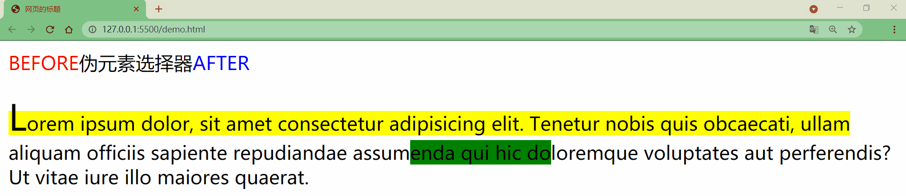

### 11.选择器优先级

当我们通过不同的选择器选中相同的元素，并且为相同的样式设置不同的值时，此时就发生了样式的冲突，发生样式冲突时用哪个样式由选择器的权重(优先级)决定选择器的权重，如果优先级计算后相同，此时则优先使用靠下的样式

|     选择器     |    权重    |
| :------------: | :--------: |
|    内联样式    | 1, 0, 0, 0 |
|    ID选择器    | 0, 1, 0, 0 |
| 类和伪类选择器 | 0, 0, 1, 0 |
|   元素选择器   | 0, 0, 0, 1 |
|   通配选择器   | 0, 0, 0, 0 |
|   继承的样式   | 没有优先级 |

可以在某一个样式的后边添加`!important`，则此时该样式会获取到最高的优先级，甚至超过内联样式，注意在开发中一定要慎用！

```css
<style>
    #box1{
        background-color: orange;
    }
    div{
        background-color: yellow;
    }
    .red{
        background-color: red;
    }
</style>

<div id="box1" class="red" style="background-color: skyblue;">选择器的权重</div>
```


## 三、继承&层叠&优先级

### 1.继承

**继承指设置在父元素上的CSS属性被子元素继承**，注意并不是所有属性都能被继承，例如`width`。以`color`为例，MDN的[形式定义](https://developer.mozilla.org/zh-CN/docs/Web/CSS/color#%E5%BD%A2%E5%BC%8F%E5%AE%9A%E4%B9%89)标出该实现是否可以被继承

------

CSS为控制继承提供了五个特殊的通用属性值，每个CSS属性都接收这些值

|     属性值     |                             说明                             |
| :------------: | :----------------------------------------------------------: |
|   `inherit`    |               开启继承，使父子元素该属性值相同               |
|   `initial`    |      初始值，最好使用其他关键字替代，因为初始值并不确定      |
|    `revert`    |                     还原成浏览器默认样式                     |
| `revert-layer` |                  重置为在上一个层叠层中的值                  |
|    `unset`     | 重置为自然值，若属性是自然继承那么是`inherit`，否则是`initial` |

```html
<ul id='inherit' style="color: green">
    <li id="inherit1">Default <a href="#">link</a> color</li>
    <!--继承父类，即inherit2的颜色，而inherit2继承自ul-->
    <li id="inherit2">Inherit the <a href="#" style="color: inherit">link</a> color</li>
    <li id="inherit3">Initial the <a href="#" style="color: initial">link</a> color</li>
    <li id="inherit4">Revert the <a href="#" style="color: revert">link</a> color</li>
    <li id="inherit5">Unset the <a href="#" style="color: unset">link</a> color</li>
</ul>
```


------

CSS提供`all`属性用于重设(几乎所有)属性值，它的值可以是`inherit`、`initial`、`revert`或`unset`，测试HTML如下

```html
<div id="all-default">default</div>
<div id="all-inherit">inherit</div>
<div id="all-initial">initial</div>
<div id="all-revert">revert</div>
<div id="all-unset">unset</div>

<style>
    div {
        margin-top: 5px;
        background-color: skyblue;
        border: 5px solid cornflowerblue;
    }

    #all-inherit {
        all: inherit;
    }

    #all-initial {
        all: initial;
    }

    #all-revert {
        all: revert;
    }

    #all-unset {
        all: unset;
    }
</style>
```


### 2.层叠

样式表层叠简单来说就是**CSS规则的顺序很重要**，当应用两条同级别的规则到同一元素时**靠后的规则起作用**

### 3.优先级

冲突规则中靠后元素起作用并不是绝对的，还需要看优先级！优先级决定CSS规则的使用顺序，一般地**越具体、范围越小的CSS规则优先级越高**

浏览器如何计算优先级？本质上不同类型的选择器有不同的分数值，把这些分数相加就得到特定选择器的权重，例如ID选择器是百位、类选择器是十位、元素选择器是个位，若选择器包含ID选择器则百位加一，依次类推。`*`、`+`、`>`、`~`、`:where()`选择器不会影响优先级，`:not()`和`:is()`等伪类本身对优先级无影响，但参数会带来影响，优先级最大的参数将作为该伪类的优先级

|                  选择器                   |  ID  |  类  | 元素 | 优先级 |
| :---------------------------------------: | :--: | :--: | :--: | :----: |
|                   `h1`                    |  0   |  0   |  1   | 0-0-1  |
|          `h1 + p::first-letter`           |  0   |  0   |  3   | 0-0-3  |
| `li > a[href*="en-US"] > .inline-warning` |  0   |  2   |  2   | 0-2-2  |
|               `#identifier`               |  1   |  0   |  0   | 1-0-0  |
|       `button:not(#mainBtn, .cta)`        |  1   |  0   |  1   | 1-0-1  |


这里发生了什么？首先，我们先看看最上面的选择器规则，你会发现，我们已经把优先级计算出来放在最前面的注释里。

- 前面两个选择器都是链接背景颜色的样式——第二个赢了使得背景变成蓝色，因为它多了一个 ID 选择器：优先级 2-0-1 vs. 1-0-1。
- 第三四个选择器都是链接文本颜色样式——后者赢了使得文本变成白色，因为它虽然少一个元素选择器，但是多了一个类选择器。所以优先级是 1-1-3 vs. 1-0-4。
- 第 5 到 7 个选择器都是鼠标悬停时链接边框样式。第六个显然输给了第五个，优先级是 0-2-3 vs. 0-2-4——少了个元素选择器。第七个，比第五第六都高——子选择器数量相同，但是有一个元素选择器变成类选择器。所以最后优先级是 0-3-3 vs. 0-2-3 和 0-2-4。

```
/* 1. specificity: 1-0-1 */
#outer a {
    background-color: red;
}
        
/* 2. specificity: 2-0-1 */
#outer #inner a {
    background-color: blue;
}

/* 3. specificity: 1-0-4 */
#outer div ul li a {
    color: yellow;
}

/* 4. specificity: 1-1-3 */
#outer div ul .nav a {
    color: white;
}

/* 5. specificity: 0-2-4 */
div div li:nth-child(2) a:hover {
    border: 10px solid black;
}

/* 6. specificity: 0-2-3 */
div li:nth-child(2) a:hover {
    border: 10px dashed black;
}

/* 7. specificity: 0-3-3 */
div div .nav:nth-child(2) a:hover {
    border: 10px double black;
}

a {
    display: inline-block;
    line-height: 40px;
    font-size: 20px;
    text-decoration: none;
    text-align: center;
    width: 200px;
    margin-bottom: 10px;
}

ul {
    padding: 0;
}

li {
    list-style-type: none;
}          


<div id="outer" class="container">
    <div id="inner" class="container">
        <ul>
            <li class="nav"><a href="#">One</a></li>
            <li class="nav"><a href="#">Two</a></li>
        </ul>
    </div>
</div>
    
```

内联样式`!important`用于修改特定属性的值，能够覆盖普通规则的层叠

```
#winning {
    background-color: red;
    border: 1px solid black;
}
    
.better {
    background-color: gray;
    border: none !important;
}
    
p {
    background-color: blue;
    color: white;
    padding: 5px;
}           
    
    
    <p class="better">This is a paragraph.</p>
<p class="better" id="winning">One selector to rule them all!</p>
    
```

 覆盖 `!important` 唯一的办法就是另一个 `!important` 具有相同*优先级*而且顺序靠后，或者更高优先级


## 四、长度单位

### 1.像素

①像素

显示器屏幕实际上是由一个一个的小点构成的，小点即单位色块，即像素，`分辨率 = 水平方向像素 * 垂直方向像素`


②屏幕分辨率

例如屏幕分辨率是1920×1080，则该屏幕水平方向有1920个像素，垂直方向有1080个像素，不同屏幕的像素大小是不同的，也就是说像素大小不像我们现行的长度单位那样有着固定的国际标准，所以**同样的像素大小在不同的设备上显示效果是不一样的，像素越小的屏幕显示的效果越清晰**

③图像分辨率

例如图片分辨率是300x200，则该图片在屏幕上按1:1缩放时，水平方向有300个像素，垂直方向有200个像素点，图片分辨率越高，1:1缩放时面积越大；图片分辨率越低，1:1缩放时面积越小，**同一台设备像素大小是不变的，那把图片放大超过100%时占的像素点就多了，但是图像也会变得模糊**


### 2.百分比

也可以将属性值设置为相对于其父元素属性的百分比，可以**使子元素跟随父元素的改变而改变**

### 3.em

em是**相对于元素的字体大小来计算的**，`1em = <self>.font-size`，也就说em值会根据元素本身的字体大小的改变而改变

### 4.rem

rem是**相对于根元素的字体大小来计算**，`1em = <root>.font-size`，也就说rem值会根据根元素的字体大小的改变而改变

```html
<style>
    * {
        font-size: 24px;
    }
    
    .box1{
        width: 200px; 
        height: 200px;
        background-color: orange;
    }

    .box2{
        width: 50%; 
        height: 50%; 
        background-color: aqua;
    }
    
    .box3{
        font-size: 20px;
        width: 10em;
        height: 10em;
        background-color: greenyellow;
    }
    
    .box4 {
        font-size: 20px;
        width: 10rem; /*当时用rem时，不管怎么改本元素的font-size都是不会变的。需要定义root元素的font-size才可以 */
        height: 10rem;
        background-color: red;
    }
</style>

<div class="box1">
    <div class="box2"></div>
</div>

<div class="box3"></div>

<div class="box4"></div>
```


> 铺满屏幕时可使用`min-height: calc(100%);`

## 五、颜色单位

在介绍CSS的颜色单位之前，我们首先来了解下光的三原色，因为CSS的颜色单位就是按照光的三原色来调和的

> 科普下光的三原色和颜料的三原色的区别
>
> * **颜料三原色**(CMYK)：品红、黄、青(天蓝)，色彩三原色可以混合出所有颜料的颜色，同时相加为黑色，黑白灰属于无色系
> * **光学三原色**(RGB)：红、绿、蓝(靛蓝)，光学三原色混合后组成显示屏显示颜色，三原色同时相加为白色，白色属于无色系中的一种

### 1.RGB

RGB通过三原色的不同浓度来调配出不同的颜色，语法是`RGB(red, green, blue)`，范围在`0 ~ 255(0% ~ 100%)`之间

RGB还存在一种十六进制写法，语法为`#RRGGBB`，颜色的范围在`00 ~ ff`之间，如果颜色两位两位重复可以进行简写，如`#aabbcc => #abc`

### 2.RGBA

RGBA就是在RGB的基础上增加了一个A表示不透明度，`1`表示完全不透明，`0`表示完全透明，`.5`半透明

> 取渐变色的网站：[CSS Gradient](https://cssgradient.io/)

## 六、盒模型

### 1.文档流

网页是一个多层的结构，通过CSS可以分别为每一层来设置样式，作为用户来讲只能看到最顶上一层，**层中最底下一层称为文档流**

文档流是网页的基础，我们所创建的元素默认都是在文档流中进行排列，元素一般存在两个状态，即在文档流中和不在文档流中(脱离文档流)，那么元素为什么需要在文档流中呢？

### 2.盒子模型

网页设计中常听的属性名**内容(content)、内边距(padding)、边框(border)、外边距(margin)👀**， CSS盒子模型都具备这些属性

CSS将页面中的所有元素都设置为了一个矩形的盒子，将元素设置为矩形的盒子后，对页面的布局就变成将不同的盒子摆放到不同的位置

每个盒子由内容(content)、内边距(padding)、边框(border)、外边距(margin)组成，如下图


#### 2.1.内容区

元素中的所有的子元素和文本内容都在内容区中，`width`和`height`设置排列内容区的宽度和高度

```css
.box1{
    width: 200px; 
    height: 200px; 
    background-color: #bfa;
}
```


#### 2.2.边框

边框属于盒子边缘，边框里边属于盒子内部，出了边框都是盒子的外部，**边框的大小会影响到整个盒子的大小**

- `border-width` 边框的宽度，默认3px
  - `border-top-width` 上边框的宽度
  - `border-right-width` 右边框的宽度
  - `border-bottom-width` 下边框的宽度
  - `border-left-width` 左边框的宽度
- `border-color` 边框的颜色，默认使用color的颜色值
  - `border-top-color` 上边框的颜色
  - `border-right-color` 右边框的颜色
  - `border-bottom-color` 下边框的颜色
  - `border-left-color` 左边框的颜色
- `border-style` 边框的样式，没有默认值
  - `border-top-style` 上边框的样式
  - `border-right-style` 右边框的样式
  - `border-bottom-style` 下边框的样式
  - `border-left-style` 左边框的样式

```css
.box1{
    border-width: 10px;
    border-color: red;
    /* 
    	solid  实线 
    	dotted 点状虚线 
    	dashed 虚线 
    	double 双线 
    */
    border-style: solid;
}
```


以上几种边框的样式或其他衍生出来的写法都可以指定各个方向边框的情况，设定几个值就决定了对应方向的宽度、颜色或样式

- 四个值：`上 右 下 左`
- 三个值：`上 左右 下`
- 两个值：`上下 左右`
- 一个值：`上下左右`

以上顺序不用死记，记住**其顺序是按顺时针方向设置的，剩下的可以由矩形的对称性推导出来**

以上边框样式的设置关键字可简写成如下几种，关键字内的值没有顺序

- `border-top` 上边框的宽度、颜色和样式
- `border-right` 右边框的宽度、颜色和样式
- `border-bottom` 下边框的宽度、颜色和样式
- `border-left` 左边框的宽度、颜色和样式

```css
.box1{ 
	border: 10px red solid;
}
```

#### 2.3.内边距

内边距也叫填充，是内容区和边框之间的空间

- `padding-top` 上内边距
- `padding-right` 右内边距
- `padding-bottom`下内边距
- `padding-left` 左内边距

**内边距的设置会影响到盒子的大小，背景颜色会延伸到内边距上**

```html
<style>
    .outer{
        width: 200px;
        height: 200px;
        border: 10px orange solid;
        padding-right: 100px;
        padding-bottom: 100px;
        padding-left: 100px;
    }

    .inner {
        width: 200px;
        height: 200px;
        background-color: greenyellow;
    }
</style>

<div class="outer">
    <div class="inner"></div>
</div>
```


可以看出，当内外`div`宽度和高度一样时，由于`outer`设置了一个`padding`属性，其盒子大小被撑大了

盒子可见框的大小，由内容区、内边距和边框共同决定，所以在计算盒子大小时，需要将这三个区域加到一起计算

#### 2.4.外边距

外边距也叫空白边，位于盒子的最外围，是添加在边框外周围的空间，空白边使盒子之间不会紧凑地连接在一起，是CSS布局的一个重要手段，**外边距的大小不会影响可见框的大小**，但是外边距会影响盒子的位置和占用空间

- `margin-top` 上外边距，设置正值元素自身向下移动，设置负值元素自身向上移动
- `margin-right` 右外边距，设置正值其右边的元素向右移动，设置负值其右边的元素向左移动，但上述说法并不准确，对于块元素设置`margin-right`不会产生任何效果
- `margin-bottom` 下外边距，设置正值其下边的元素向下移动，设置负值其下边的元素向上移动，但对于块元素会存在垂直方向上的边距重叠问题
- `margin-left` 左外边距，设置正值元素自身向右移动，设置负值元素自身向左移动

**我们设置的左和上外边距则会移动元素自身，而设置下和右外边距会移动其他元素**

```css
.box1 {
    width: 200px;
    height: 200px;
    background-color: #bfa;
    border: 10px orange solid;

    margin-top: 100px;
    margin-right: 100px;
    margin-bottom: 100px;
    margin-left: 100px;
}
```


### 3.块元素

块元素会在页面中独占一行，**默认宽度是父元素的全部**，即把父元素撑满，**默认高度是被内容撑开的**，即高度就是子元素的高度

### 4.行内元素

行内元素**不会独占页面的一行**，只占自身的大小，**默认宽度和高度都是被内容撑开，不支持设置高度和宽度，设了高度和宽度也没用，不会生效**

行内元素在页面中左向右水平排列，如果一行之中不能容纳下所有的行内元素，则元素会换到第二行继续自左向右排列

行内元素不支持设置高度和宽度，即使设置也是无效的

#### 4.1.行内元素设置padding

```css
.s1 {
    /* 下方的div元素并没有因span设置了padding属性，而受到位置上的影响 */
    padding: 100px;
    background-color: yellow;
}

.box1 {
    width: 200px;
    height: 200px;
    background-color: #bfa;
}
```


#### 4.2.行内元素设置border

行内元素可以设置`border`，垂直方向的`border`不会影响页面的布局

```css
.s1 {
    border: 10px orange solid;
    background-color: yellow;
}

.box1 {
    width: 200px;
    height: 200px;
    background-color: #bfa;
}
```


#### 4.3.行内元素设置margin

行内元素可以设置`margin`，垂直方向的`margin`不会影响页面的布局

```css
.s1 {
    margin: 100px;
    background-color: yellow;
}

.box1 {
    width: 200px;
    height: 200px;
    background-color: #bfa;
}
```


#### 4.4.行内元素设置display

`display`用来设置元素显示的类型

- `inline`将元素设置为**行内元素**，不可为其设置宽高，大小靠元素撑起来
- `block`将元素设置为**块元素**，可以为其设置宽高，独占一行

```css
.s1 {
    margin: 100px;
    background-color: yellow;
    /* 将行内元素设置为块元素 */
    display: block; 
}
```


- `inline-block`将元素设置为**行内块元素**行内块，既可以设置宽度和高度又不会独占一行

```css
.s1 {
    margin: 100px;
    background-color: yellow;
    /* 将行内元素设置为行内块元素，兼顾行内元素和块元素的特点 */
    display: inline-block; 
}
```


- `table`将元素设置为一个表格
- `none`元素不在页面中显示，**原来属于s1的位置也没有了**，`visibility`解决

```css
.s1 {
    margin: 100px;
    background-color: yellow;
    /* 将行内元素设置为none：不显示 */
    display: none; 
}
```


#### 4.5.visibility设置元素的显示状态

- `visible`默认值，元素在页面中正常显示
- `hidden`元素在页面中隐藏不显示，但是**依然占据页面的位置**

```css
.s1 {
    margin: 100px;
    background-color: yellow;
    display: block;
    visibility: hidden; 
}
```


### 5.盒子大小box-sizing

默认情况下，盒子可见框的大小由内容区、内边距和边框共同决定，`width`和`height`指的是内容区、内边距和边框的总大小，`box-sizing`用来设置盒子尺寸的计算方式

```css
.box {
    width: 200px;
    height: 200px;
    background-color: yellow;
    border: 10px red solid;
    /* box-sizing: content-box; */
    box-sizing: border-box;
}
```

* `content-box`默认值，宽度和高度用来设置内容区的大小

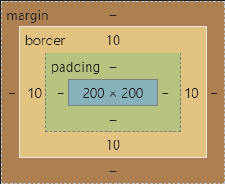

* `border-box` 宽度和高度用来设置整个盒子可见框的大小


### 6.轮廓outline

`outline`用来设置元素的轮廓线，用法和`border`一模一样，但轮廓和边框不同点是**轮廓不会影响到可见框的大小**

①边框

```css
.box {
    width: 200px;
    height: 200px;
    background-color: yellow;
    border: 10px red solid;
}
```


②轮廓

```css
.box {
    width: 200px;
    height: 200px;
    background-color: yellow;
}

.box:hover {
    outline: 10px red solid;
}
```


### 7.阴影box-shadow

`box-shadow`用来设置元素的阴影效果，阴影不会影响页面布局

- 第一个值：水平偏移量，设置阴影的水平位置，正值向右移动，负值向左移动
- 第二个值：垂直偏移量，设置阴影的垂直位置，正值向下移动，负值向上移动
- 第三个值：阴影的模糊半径
- 第四个值：阴影的颜色

```css
.box {
    width: 200px;
    height: 200px;
    background-color: yellow;
    box-shadow: 10px 10px orange;
}
```


```css
box-shadow: 10px 10px 5px orange;
```


```css
box-shadow: 10px 10px 5px rgba(0, 0, 0, .2);
```


### 8.圆角border-radius

`border-radius`属性使一个元素的外边框边缘的角变圆，可设置一个**半径**来做圆角，或者设置两个**半径**来做椭圆角，`border-radius`可以分别指定四个角的圆角，同样不需要死记硬背，只要记住遵循顺时针方向和矩形中心点对称原则

* 四个值：左上 右上 右下 左下
* 三个值：左上 右上/左下 右下
* 两个值：左上/右下 右上/左下
* 一个值：左上/右上/右下/左下

`radius`可以分别指定四个方向

* `border-top-left-radius`
* `border-top-right-radius`
* `border-bottom-left-radius`
* `border-bottom-right-radius`

```css
border-radius: 20px;
```


```css
border-top-right-radius: 50px 100px;
```


**圆**的原理很简单，就是绘制正方形，并将四个圆角半径设置为正方形的一半

```css
.box {
    width: 200px;
    height: 200px;
    background-color: yellow;
    border-radius: 50%;
}
```


**椭圆**只需要对上述样式对一点点的改动，设置`width`和`height`属性不相等即可

```css
.box {
    width: 300px;
    height: 200px;
    background-color: yellow;
    border-radius: 50%;
}
```


### 9.水平方向布局

#### 9.1.水平布局

元素在其父元素中水平方向的位置由`margin-left`、`border-left`、`padding-left`、`width`、`padding-right`、`border-right`、`margin-right`属性共同决定

一个元素在其父元素中，水平布局必须要满足等式`margin-left + border-left + padding-left + width + padding-right + border-right + margin-right = 其父元素的宽度`，以上等式必须满足，如果相加结果使等式不成立则称为**过渡约束**

#### 9.2.过渡约束

若出现过度约束，浏览器会怎么办呢？

若七个值中没有`auto`，则浏览器会自动调整`margin-right`值以使等式满足，比如`100 + 0 + 0 + 200 + 0 + 0 + 0 = 800 ==> 100 + 0 + 0 + 200 + 0 + 0 + 500 = 800`

这七个值中有三个值可以设置为`auto`，即`width`、`margin-left`、`maring-right`，如果这七个值中有`auto`的情况，则会自动调整`auto`值以使等式成立

* 如果某个值为`auto`，则会自动调整`auto`的那个值以使等式成立
  * `200 + 0 + 0 + auto + 0 + 0 + 200 = 600 ==> 200 + 0 + 0 + 400 + 0 + 0 + 200 = 800`
  * `auto + 0 + 0 + 200 + 0 + 0 + 200 = 600 ==> 400 + 0 + 0 + 200 + 0 + 0 + 200 = 800`
  * `200 + 0 + 0 + 200 + 0 + 0 + auto = 600 ==> 200 + 0 + 0 + 200 + 0 + 0 + 400 = 800`

* 如果宽度为`auto`，则宽度会调整到最大，其他`auto`的外边距会自动设置为0
  * `auto + 0 + 0 + auto + 0 + 0 + 200 = 600 ==> 0 + 0 + 0 + 600 + 0 + 0 + 200 = 800`
  * `200 + 0 + 0 + auto + 0 + 0 + auto = 600 ==> 200 + 0 + 0 + 600 + 0 + 0 + 0 = 800`
  * `auto + 0 + 0 + auto + 0 + 0 + auto = 600 ==> 0 + 0 + 0 + 800 + 0 + 0 + 0 = 800`

* 如果外边距都为`auto`，则`auto`的外边距会自动均分以使等式成立
  * `auto + 0 + 0 + 200 + 0 + 0 + auto = 600 ==> 300 + 0 + 0 + 200 + 0 + 0 + 300 = 800`

```html
<style>
    .box1 {
        width: 200px;
        height: 200px;
        background-color: #bfa;
        border: 10px orange solid;
        /* 下列条件等价于 margin: 0 auto */
        margin-left: auto;
        margin-right: auto;
    }
</style>
<div class="box1"></div>
```


### 10.垂直方向布局

#### 10.1.元素溢出overflow

子元素是在父元素的内容区中排列的，**如果子元素的大小超过了父元素，则子元素会从父元素中溢出**，使用`overflow/overflow-x/overflow-y`属性来设置父元素如何处理溢出的子元素，可选值为`visible/hidden/scroll/auto`

* `visible` 溢出内容会在父元素外部位置显示，默认值
* `hidden` 溢出内容会被裁剪，不会显示
* `scroll` 生成两个滚动条，通过滚动条来查看完整的内容
* `auto` 根据需要生成滚动条

```html
<style>
    .box1 {
        width: 200px;
        height: 200px;
        background-color: #bfa;
        overflow: auto;/*依次修改值visible-hidden-scroll-auto，其效果如下图*/
    }
</style>
<div class="box1">
    Lorem ipsum dolor sit amet consectetur adipisicing elit. Asperiores aspernatur illo inventore
    deleniti laudantium quaerat excepturi sed quidem tempore? Eaque, cumque porro. Fuga quam error cupiditate quasi
    eveniet in numquam!
</div>
```

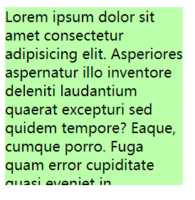

#### 10.2.边距折叠

相邻的**垂直方向外边距**会发生重叠现象

##### 10.2.1.兄弟元素边距折叠

**兄弟元素间的相邻，垂直外边距会取两者之间的较大值，若一正一负则取两者之间的和**，但请看如下实例图，两者都为正，按理说两者间的距离应该为100，为什么会是125？？这就和页面缩放比例有关系了，**兄弟元素之间的外边距的重叠对于开发是有利的，所以我们不需要进行处理**

```css
.box1,.box2{ 
    width:200px; 
    height:200px; 
    font-size:100px;
}

.boxl{
    background-color: #bfa;
    /*设置一个下外边距*/
    margin-bottom: 100px;
}

.box2{
    background-color: orange;
    /*设置一个上外边距*/
    margin-top: 100px;
}
```


##### 10.2.2.父子元素边距折叠

**父子元素间相邻外边距，子元素会传递给父元素**，父子外边距的折叠会影响到页面的布局，必须要进行处理

```css
.box3{
width：200px;
    height:200px;
    background-color: #bfa;
}

.box4{
    width: 100px; 
    height: 100px;
    background-color: orange; 
    /* margin-top: 100px; */
}
```


父子元素边界重叠问题如何处理？？

* 处理方式一

  * 转换思路，通过改变父元素的内top边距，但这样虽然位置正确了，但是高度却被撑大了

  ```css
  .box3 {
      width: 200px;
      height: 200px;
      background-color: #bfa;
      padding-top: 100px; /* 不调整子元素的margin，而是转而调整父元素的padding */
  }
  
  .box4 {
      width: 100px;
      height: 100px;
      background-color: orange;
      /* margin-top: 100px; */
  }
  ```

  

  * 计算并手动调整父元素高度

  ```css
  .box3 {
      width: 200px;
      height: 100px; /* height: 200px; */
      background-color: #bfa;
      padding-top: 100px; 
  }
  
  .box4 {
      width: 100px;
      height: 100px;
      background-color: orange;
  }
  ```

  

* 处理方式二

  * 仍然保留子元素的`margin-top`属性，但是给父元素加一个上边框，由于`1px`的边框，所以父元素盒子的高度也增加了`1px`

  ```css
  .box3 {
      width: 200px;
      height: 200px;
      background-color: #bfa;
      border-top: 1px rebeccapurple solid; /* 在父元素上加一个border-top（上边框） */
  }
  
  .box4 {
      width: 100px;
      height: 100px;
      background-color: orange;
      margin-top: 100px; /* 不删除，保留 */
  }
  ```

  

  * 手动调整父元素的高度，同时让边框颜色与父元素盒子颜色保持一致，But子元素也往下移动了`1px`的距离

  ```css
  .box3 {
      width: 200px;
      height: 199px; /* height: 200px; */
      background-color: #bfa;
      border-top: 1px #bfa solid; 
  }
  
  .box4 {
      width: 100px;
      height: 100px;
      background-color: orange;
      margin-top: 100px;
  }
  ```

  

#### 10.3.脱离文档流

上述处理方式二中，加入上边框则子元素的外边距不在传递给父元素，这是为什么？应该是`border`让元素脱离了文档流，即`margin`塌陷

> `margin`子元素远离父元素边框，如果父盒子没有设置`border`，那么他的子元素无法利用`margin-top`来远离父元素的上边框，而是使子元素和父元素一起往下移动

## 七、浮动float

### 1.什么是浮动？

通过浮动可以使一个元素向其父元素的左侧或右侧移动，**即脱离文本流，释放所占空间**，使用`float`属性来设置于元素的浮动，利用`clear:both`清除左右浮动

- `none` 默认值，元素不浮动
- `left` 元素向左浮动
- `right` 元素向右浮动

**注意元素设置浮动以后，水平布局的等式便不需要强制成立**

### 2.浮动的特点

①浮动元素会完全脱离文档流，不再占据文档流中的位置，所以元素下边的还在文档流中的元素会自动向上移动，**文字只会环绕于浮动元素周围**


②设置浮动以后，元素会向父元素的左侧或右侧移动

③浮动元素默认不会从父元素中移出

```html
<style>
    .box1 {
        width: 100px;
        height: 100px;
        background-color: orange;
        float: left;
    }

    .box2 {
        width: 200px;
        height: 200px;
        background-color: red;
    }
</style>

<div class="box1"></div>
<div class="box2"></div>
```


④浮动元素向左或向右移动时，不会超过前边的浮动元素，先来后到的顺序

```html
<style>
    .box1 {
        width: 300px;
        height: 300px;
        background-color: orange;
        float: left;
    }

    .box2 {
        width: 400px;
        height: 400px;
        background-color: red;
        float: left;
    }

    .box3 {
        width: 300px;
        height: 300px;
        background-color: yellow;
        float: right;
    }
</style>

<div class="box1"></div>
<div class="box2"></div>
<div class="box3"></div>
```


⑤如果浮动元素的上边是一个没有浮动的块元素，则浮动元素无法上移

```html
<style>
    .box1 {
        width: 200px;
        height: 200px;
        background-color: orange;
    }

    .box2 {
        width: 200px;
        height: 200px;
        background-color: red;
        float: left;
    }
</style>

<div class="box1"></div>
<div class="box2"></div>
```

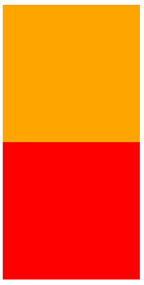

### 3.脱离文档流的特点

#### 3.1.块元素

脱离文档流以后，块元素不再独占页面的一行，块元素的宽度和高度默认都被内容撑开

```html
<style>
    .box1 {
        background-color: orange;
        /* float: left; */
    }
</style>

<div class="box1">hello</div>
```


#### 3.2.行内元素

行内元素脱离文档流以后会，特点和块元素一样

```html
<style>
    span {
        width: 200px;
        height: 200px;
        background-color: orange;
        float: left;
    }
</style>

<span>I am a Span</span>
```


### 4.高度塌陷

在浮动布局中，父元素的高度默认是被子元素撑开的，当子元素浮动后，其会完全脱离文档流，子元素从文档流中脱离将会无法撑起父元素的高度，导致父元素的高度丢失，父元素高度丢失以后，其下的元素会自动上移，导致页面的布局混乱，**[解决方法](https://blog.csdn.net/qq_35925558/article/details/117373466)**


### 5.浮动样式练习

整体布局


```html
<!-- 页眉 -->
<header></header>
<!-- 主体 -->
<main>
    <!-- 左边栏 -->
    <nav></nav>
    <!-- 中心 -->
    <article>
        <!-- 内容上 -->
        <div class="top"></div>
        <!-- 内容下 -->
        <div class="bottom">
            <!-- 内容左 -->
            <div class="left"></div>
            <!-- 内容中 -->
            <div class="middle"></div>
            <!-- 内容右 -->
            <div class="right"></div>
        </div>
    </article>
    <!-- 右边栏 -->
    <aside></aside>
</main>
<!-- 页脚 -->
<footer></footer>
```

```css
/* 公共部分 */
header,
main,
footer {
    width: 1000px;
    margin: 10px auto;
}

main nav,
main article,
main aside {
    float: left;
    /* 虽然设置浮动了，但整体大小是被内容撑开的，所以设置一个高度 */
    height: 100%;
}

.bottom .left,
.bottom .middle,
.bottom .right {
    float: left;
    width: 220px;
    height: 100%;
}

/* ==========整体布局-上========== */
header {
    height: 100px;
    background-color: silver;
}

/* ==========整体布局-中========== */
main {
    height: 400px;
    background-color: #bfa;
}


/* ------左边栏------ */
main nav {
    width: 150px;
    background-color: red;
}

/* ------中心------ */
main article {
    width: 680px;
    background-color: green;
    margin: 0 10px;
}

/* ---上--- */
article .top {
    height: 190px;
    background-color: yellow;
    margin-bottom: 10px;
}

/* ---下--- */
article .bottom {
    height: 200px;
    background-color: orange;
}


/* 左 */
.bottom .left {
    background-color: lightblue;
}

/* 中 */
.bottom .middle {
    background-color: gray;
    margin: 0 10px;
}

/* 右 */
.bottom .right {
    background-color: wheat;
}

/* ------右边栏------ */
main aside {
    width: 150px;
    background-color: blue;
}

/* ==========整体布局-下========== */
footer {
    height: 100px;
    background-color: tomato;
}
```

最终效果


## 八、定位position

定位是一种更加高级的布局手段，通过定位可以将元素摆放到页面的任意位置，使用`position`属性来设置定位

|   可选值   |               含义               | 是否脱离文档流，空间是否释放 | 是否改变元素性质 | 是否提升元素层级 |                            参考系                            |
| :--------: | :------------------------------: | :--------------------------: | :--------------: | :--------------: | :----------------------------------------------------------: |
|  `static`  | 不开启定位，元素是静止的，默认值 |                              |                  |                  |                                                              |
| `relative` |        开启元素的相对定位        |        不脱离、不释放        |      不改变      |       提升       |                     相对于自己的初始位置                     |
| `absolute` |        开启元素的绝对定位        |          脱离、释放          |       改变       |       提升       | 相对于最近`position`的祖先元素，若无则相对于`body`，即包含块 |
|  `fixed`   |        开启元素的固定定位        |          脱离、释放          |       改变       |       提升       |                      参照于浏览器的视口                      |
|  `sticky`  |        开启元素的粘滞定位        |          脱离、释放          |       改变       |       提升       |                      参照于浏览器的视口                      |

### 1.相对定位relative

当元素开启相对定位以后，可以**通过偏移量来设置元素的位置**，如果不设置偏移量元素，则元素不会发生任何变化

| offset属性 |             含义             |
| :--------: | :--------------------------: |
|   `top`    | 定位元素和定位位置的上边距离 |
|  `bottom`  | 定位元素和定位位置的下边距离 |
|   `left`   | 定位元素和定位位置的左侧距离 |
|  `right`   | 定位元素和定位位置的右侧距离 |

定位元素垂直方向的位置由`top`和`bottom`两个属性控制，通常情况下只会使用其中之一

* top值越大，定位元素越靠下
* bottom值越大，定位元素靠上

定位元素水平方向的位置由`left`和`right`两个属性控制，通常情况下只会使用其中之一

* left越大，定位元素越靠右
* right越大，定位元素越靠左


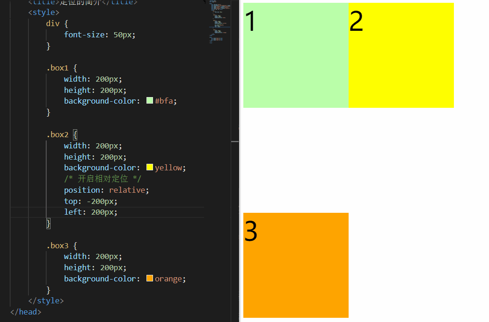

若上述案例中三个`div`使用的都是相对定位会怎样？？可以看到覆盖关系是`box3 >> box2 >> box1`


再稍微调整上述案例中三个`div`的位置，发现覆盖关系变成了`box2 >> box3 >> box1`，**在页面文档流中越靠下的元素开启相对定位后，其层级越高**


相对定位是**参照于元素在文档流中的位置进行定位的**，可以理解为**相对于自身原始位置**

相对定位**不会改变元素的性质**，即块还是块、行内还是行内，把相对定位认为是元素的**灵魂出窍**，其位置发生改变以后，布局并没有产生影响，因为它的肉体仍然占据着原来的那个位置，只是其灵魂内容发生了移动，**行内元素也可以设置相对位置**


相对定位**只会移动自身的布局位置**，而不会对已存在的其他元素产生任何影响

### 2.绝对定位absolute

当元素开启绝对定位以后，可以**通过偏移量来设置元素的位置**

绝对定位是**参照于其包含块**，包含块就是离**当前元素最近的开启定位的祖先块元素**，如果所有的祖先元素都没有开启定位，则`html(根元素、初始包含块)`就是它的包含块,上述的条件是开启定位，也就是说只要`position`不是`static`那么就满足了其成为包含块的必要条件

```html
<body>
    <!-- 如果box1开启定位，则box2的包含块是box1，否则就是body -->
    <div class="box1">
        <div class="box2"></div>
    </div>

    <!-- 如果box3开启定位，则em的包含块是box3，否则就是body -->
    <div class="box3">
        <span>
            <em>hello</em>
        </span>
    </div>
</body>
```

绝对定位使元素提升一个层级，使元素从文档流中脱离，**改变元素的性质**，即行内变成块，块的宽高被内容撑开，


#### 2.1.水平方向的布局

之前说过，水平方向的布局等式`margin-left + border-left + padding-left + width + padding-right + border-right + margin-right = 其父元素的宽度`，使用绝对定位后等式变为`left + margin-left + border-left + padding-left + width + padding-right + border-right + margin-right + right = 其父元素的宽度`，**等式不成立时发生过度约束**，当发生过度约束时

* 如果9个值中没有`auto`，则自动调整`right`值以使等式满足，之前7个值是`margin-right`
* 如果9个值中有`auto`，则自动调整`auto`的值以使等式满足，可设置`auto`的值有`margin-left`、`margin-right` 、`width`、`left`、`right`，其中`left`和`right`的值默认是`auto`，所以如果没有设置`left`和`right`，当等式不满足时则会自动调整这两个值

#### 2.2.水平居中

```html
<style>
    .box1 {
        width: 500px;
        height: 500px;
        background-color: #bfa;
        position: relative;
    }

    .box2 {
        width: 100px;
        height: 100px;
        background-color: orange;
        /* 左右外边距设置为auto */
        margin-left: auto;
        margin-right: auto;
        /* 绝对定位 */
        position: absolute;
        left: 0;
        right: 0;
    }
</style>

<div class="box1">
    <div class="box2"></div>
</div>
```

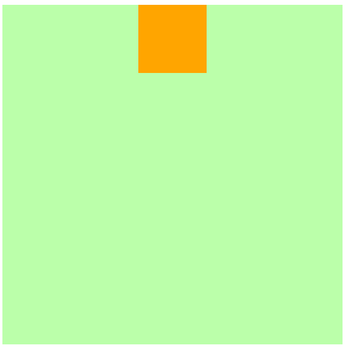

#### 2.3.垂直方向的布局

垂直方向布局的等式的也必须要满足`top + margin-top + border-top + padding-top + height + padding-bottom + border-bottom + margin-bottom + top = 其父元素的高度`

#### 2.4.垂直居中

```html
<style>
    .box1 {
        width: 500px;
        height: 500px;
        background-color: #bfa;
        position: relative;
    }

    .box2 {
        width: 100px;
        height: 100px;
        background-color: orange;
        /* 左右外边距设置为auto */
        margin-top: auto;
        margin-bottom: auto;
        /* 绝对定位 */
        position: absolute;
        top: 0;
        bottom: 0;
    }
</style>

<div class="box1">
    <div class="box2"></div>
</div>
```

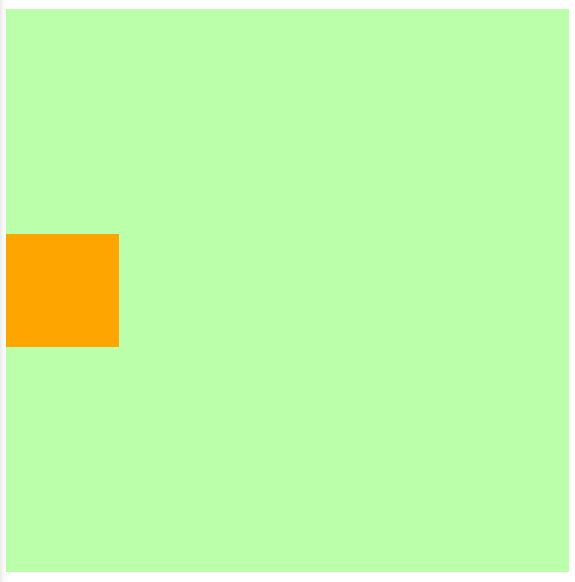

#### 2.5.水平垂直居中

```html
<style>
    .box1 {
        width: 500px;
        height: 500px;
        background-color: #bfa;
        position: relative;
    }

    .box2 {
        width: 100px;
        height: 100px;
        background-color: orange;
        /* 左右外边距设置为auto */
        margin: auto;
        /* 绝对定位 */
        position: absolute;
        top: 0;
        bottom: 0;
        left: 0;
        right: 0;
    }
</style>

<div class="box1">
    <div class="box2"></div>
</div>
```


### 3.固定定位fixed

固定定位也是一种绝对定位，所以固定定位的大部分特点都和绝对定位一，唯一不同的是**固定定位永远参照于浏览器的视口进行定位，不会随网页的滚动条滚动**


### 4.粘滞定位sticky

如下图看到，右侧边栏部分在一定的情况下是固定的，滚动到上方一定位置开始发生变动


粘滞定位和相对定位的特点基本一致，不同的是粘滞定位可以在元素到达某个位置时将其固定5. 几种定位的对比

### 5.元素层级z-index

对于开启了定位元素，可以通过`z-index`属性来指定元素的层级，`z-index`需要一个整数作为参数，**值越大元素的层级越高，元素的层级越高越优先显示**，如果元素的层级一样，则优先显示靠下的元素，祖先的元素的层级再高，也不会盖住后代元素

```html
<style>
    div {
        font-size: 40px;
    }

    .box1 {
        width: 200px;
        height: 200px;
        background-color: #bfa;
        position: absolute;
        top: 0;
        left: 0;
    }

    .box2 {
        width: 200px;
        height: 200px;
        background-color: orange;
        position: absolute;
        top: 50px;
        left: 50px;
    }

    .box3 {
        width: 200px;
        height: 200px;
        background-color: salmon;
        position: absolute;
        top: 100px;
        left: 100px;
    }

    .box4 {
        width: 100px;
        height: 100px;
        background-color: skyblue;
        position: absolute;
        bottom: 0;
        left: 0;
    }
</style>

<div class="box1">1</div>
<div class="box2">2</div>
<div class="box3">3
    <div class="box4">4</div>
</div>
```

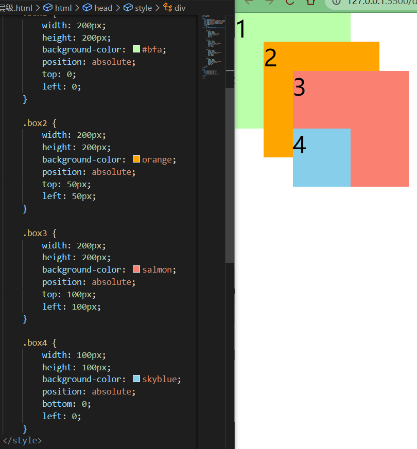

## 九、字体

### 1.字体相关样式

`color`用来设置字体颜色，`font-size`字体的大小，当然字体的属性并不止这些，请上[菜鸟教程](https://www.runoob.com/css/css-font.html)

`font`可以设置字体相关的所有属性，其中某些值可以不写，会用默认值

```
font: font-style font-variant font-weight font-size/line-height font-family
```

### 2.font-family

`font-family`指定字体的类别，浏览器会自动使用该类别下的字体，可以同时指定多个字体，多个字体间使用`,`隔开，字体生效时优先使用第一个，第一个无法使用则使用第二个，以此类推

### 3.@font-face

除了可以使用系统自带的字体样式外，还可以在服务器端自定义字体位置，`@font-face`可以将服务器中的字体直接提供给用户去使用

```css
@font-face {
    /* 指定字体名字 */
    font-family: 'myFont1';
    /* 服务器中字体路径 */
    src: url('/font/ZCOOLKuaiLe-Regular.woff'),
        url('/font/ZCOOLKuaiLe-Regular.otf'),
        url('/font/ZCOOLKuaiLe-Regular.ttf') format('truetype');/* 指定字体格式，一般不写 */
}

p {
    font-size: 30px;
    color: salmon;
    font-family: myFont1;
}
```

使用服务器端字体时注意以下问题

* **加载速度**：受网络速度影响，可能会出现字体闪烁一下变成最终的字体
* **版权**：有些字体是商用收费的，需要注意
* **字体格式**：字体格式也有很多种，未必兼容，可能需要指定多个

### 4.图标字体

在网页中经常需要使用一些图标，可以通过图片来引入图标，但是图片大小本身比较大，并且非常的不灵活，所以在使用图标时，我们还可以将图标直接设置为字体，然后通过@font-face的形式来对字体进行引入，这样我们就可以通过**使用字体的形式来使用图标**，[fontawesome](https://fontawesome.com/)下载解压完毕之后，直接将css和webfonts移动到项目中即可使用

```html
<link rel="stylesheet" href="/font/fontawesome/css/all.css">
<style>
    i {
        color: green;
    }

    .fa-venus-mars,
    .fa-mars-double {
        color: red;
    }

    .fa-html5 {
        color: #E34D22;
    }

    .fa-css3 {
        color: blue;
    }

    .fa-js {
        color: #D1B514;
    }
</style>

<!-- 大小 -->
<i class="fab fa-weixin fa-lg"></i>
<i class="fab fa-weixin fa-2x"></i>
<i class="fab fa-weixin fa-3x"></i>
<br>

<!-- 边框 -->
<i class="fab fa-weixin fa-2x fa-border"></i>
<br>

<!-- 旋转 -->
<i class="fab fa-weixin fa-2x  fa-rotate-90 "></i>
<!-- 水平对称 -->
<i class="fab fa-weixin fa-2x fa-flip-horizontal "></i>
<!-- 垂直对称 -->
<i class="fab fa-weixin fa-2x fa-flip-vertical "></i>
<br>

<!-- 动画 -->
<i class="fa fa-venus-mars fa-3x fa-spin"></i>
<i class="fa fa-mars-double  fa-3x fa-pulse"></i>
<br>

<!-- 列表 -->
<ul class="fa-ul">
    <li><i class="fa-li fa fa-check-square"></i>can be used</li>
    <li><i class="fa-li fa fa-spinner fa-spin"></i>as bullets</li>
    <li><i class="fa-li fa fa-square"></i>in lists</li>
</ul>
<br><br><br>

<!-- 组合 -->
<span class="fa-stack fa-lg">
    <i class="fab fa-html5 fa-stack-1x fa-10x"></i>
    <i class="fab fa-css3 fa-stack-1x fa-4x"></i>
    <i class="fab fa-js fa-stack-1x fa-2x"></i>
</span>
```


**图标字体还可以通过伪元素来设置**，找到要设置图标的元素通过`::before`或`::after`选中，在`content`中设置字体的编码，设置字体的样式

```html
fab：font-family: 'Font Awesome 5 Brands';
fas：font-family: 'Font Awesome 5 Free';
font-weight：900;
```

```html
<style>
    .poem {
        width: 200px;
        height: 300px;
        margin: auto;
    }

    li {
        list-style: none;
        margin-left: -40px;
    }

    li::before {
        content: '\f130';
        /* font-family: 'Font Awesome 5 Brands'; */
        font-family: 'Font Awesome 5 Free';
        font-weight: 900;
        margin-right: 10px;
        color: gray;
    }
</style>

<div class="poem">
    <h1>武陵春·春晚</h1>
    <p> [宋] 李清照</p>
    <ul>
        <li>风住尘香花已尽，</li>
        <li>日晚倦梳头。</li>
        <li>物是人非事事休，</li>
        <li>欲语泪先流。</li>
        <li>闻说双溪春尚好，</li>
        <li>也拟泛轻舟。</li>
        <li>只恐双溪舴艋舟，</li>
        <li>载不动、许多愁。</li>
    </ul>
</div>
```


**图标字体还可以通过实体来设置**，即`&#x图标编码;`

```html
<i class="fas">&#xf025;</i>
```

### 5.iconfont

[iconfont](https://www.iconfont.cn/)是阿里的一个图标字体库，海量图标库，图标字体非常丰富

* `iconfont`需要添加购物车后再添加至项目然后下载，下载包中有`demo.html`，详细介绍了使用方式
* `iconfont`也提供了一种在线方式，直接在我的项目中选择在线链接可以复制出一份`@font-face`的css代码

```html
<!-- <link rel="stylesheet" href="/font/iconfont/iconfont.css"> -->
<style>
    i.iconfont {
        font-size: 100px;
    }

    p::before {
        content: '\e811';
        font-family: 'iconfont';
        font-size: 50px;
    }
    
    /* 3、通过在线连接：这里link和@font-face择其一即可  */
    @font-face {
        font-family: 'iconfont';
        /* Project id 2580407 */
        src: url('//at.alicdn.com/t/font_2580407_c0kpuhebb7r.woff2?t=1622373966454') format('woff2'),
            url('//at.alicdn.com/t/font_2580407_c0kpuhebb7r.woff?t=1622373966454') format('woff'),
            url('//at.alicdn.com/t/font_2580407_c0kpuhebb7r.ttf?t=1622373966454') format('truetype');
    }
</style>

<!-- 1、通过字符实体设置 -->
<i class="iconfont">&#xe810;</i>
<i class="iconfont">&#xe811;</i>
<i class="iconfont">&#xe812;</i>
<i class="iconfont">&#xe813;</i>

<!-- 2、通过伪元素设置 -->
<p>Lorem ipsum, dolor sit amet consectetur adipisicing elit. Totam deserunt tempore fugit quos eaque, ipsa rerum
    suscipit iure cumque aspernatur esse cupiditate nihil quas nulla odit? Sequi accusantium labore maiores.</p>
```


### 6.行高line-height

文字占有的实际高度，可以通过`line-height`来设置行高，行高经常还用来设置文字的行间距，即`行间距 = 行高 - 字体大小`

字体框就是字体存在的格子，设置`font-size`实际上就是在设置字体框的高度，行高会在字体框的上下平均分配
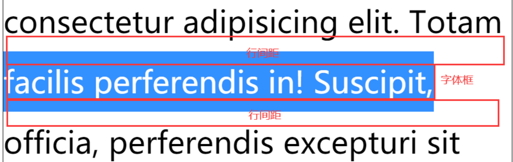

### 7.文本对齐方式

#### 7.1.水平对齐text-align

| `text-align`属性值 | 对齐方式说明 |
| :----------------: | :----------: |
|       `left`       |   左侧对齐   |
|      `right`       |   右侧对齐   |
|      `center`      |   居中对齐   |
|     `justify`      |   两端对齐   |

#### 7.2.垂直对齐vertical-align

| `vertical-align` 属性值 | 对齐方式说明 |
| :---------------------: | :----------: |
|       `baseline`        |   基线对齐   |
|          `top`          |   顶部对齐   |
|        `bottom`         |   底部对齐   |
|        `middle`         |   居中对齐   |

#### 7.3.文本其他属性补充

* `text-decoration` 划线
* `text-indent` 首行缩进
* `text-shadow` 阴影(颜色 水平 垂直 模糊效果距离)

## 十、背景

- `background-color` 设置背景颜色
- `background-image` 设置背景图片
  - 如果背景图片大小小于元素，则背景图片会自动在元素中平铺将元素铺满
  - 如果背景图片大小大于元素，则背景图片一部分会无法完全显示
  - 如果背景图片大小等于元素，则背景图片会直接正常显示

> 可以同时设置背景图片和背景颜色，这样背景颜色将会成为图片的背景色

* `background-repeat` 设置背景图片的重复方式

  * `repeat` 默认值，背景图片沿着x轴和y轴双方向重复

  * `repeat-x` 背景图片沿着x轴方向重复

  * `repeat-y` 背景图片沿着y轴方向重复

  * `no-repeat` 背景图片不重复

* `background-position` 设置背景图片的位置
  * 通过`top`、`left`、`right`、`bottom`、`center`几个表示方位的词来设置背景图片的位置，使用方位词时必须要**同时指定两个值**，如果只写一个则第二个默认就是`center`
  * 通过偏移量来指定背景图片的位置，即水平方向偏移量、垂直方向变量

* `background-clip` 设置背景的范围

  * `border-box` 默认值，背景会出现在边框的下边

  * `padding-box` 背景不会出现在边框，只出现在内容区和内边距

  * `content-box` 背景只会出现在内容区

- `background-origin` 背景图片的偏移量计算的原点
  - `border-box` 背景图片的变量从边框处开始计算
  - `padding-box` 默认值，`background-position`从内边距处开始计算
  - `content-box` 背景图片的偏移量从内容区处计算

* `background-size` 设置背景图片的大小
  * 第一个值表示宽度，第二个值表示高度，如果只写一个，则第二个值默认是`auto`
  * `cover` 图片的比例不变，将元素铺满
  * `contain` 图片比例不变，将图片在元素中完整显示

* `background-attachment` 背景图片是否跟随元素移动
  * `scroll` 默认值，背景图片会跟随元素移动
  * `fixed` 背景会固定在页面中，不会随元素移动

* `backgound` 背景相关的简写属性，所有背景相关的样式都可以通过该样式来设置，且该样式没有顺序要求，也没有哪个属性是必须写的

> 注意`background-size`必须写在`background-position`的后边，并且使用`/`隔开，即`background-position/background-size`；`background-origin`、`background-clip`中`origin`要在`clip`的前边

```css
.box1 {
    height: 500px;
    width: 500px;
    border: 10px red double;
    padding: 10px;
    background: #bfa url("assets/dlam.png") no-repeat 100px 100px/200px padding-box content-box;
}
```


## 十一、雪碧图与渐变

### 1.雪碧图CSS-Sprite

**雪碧图**指将多个小图片统一保存到一个大图片中，利用背景图的偏移`background-position`来显示响应的图片，降低请求的次数，加快访问速度，有效避免图片闪烁问题，提升用户的体验，**雪碧图的使用步骤如下**

* 确定需要使用的图标，并测量图标大小
* 为该图标创建一个元素，如`div`
* 将雪碧图设置为该元素的背景，图标大小设置为元素大小
* 设置图片偏移量以显示正确的图片


```css
a:link {
    display: block;
    width: 93px;
    height: 29px;
    background: url("assets/背景/练习2-背景/btn.png");
    /* 默认值，可以不设置 */
    background-position: 0 0;
}

a:hover {
    /* 设置水平方向的一个偏移量；注意是向左移动，所以是负值 */
    background-position: -93px 0;
}

a:active {
    /* 设置水平方向的一个偏移量；注意是向左移动，所以是负值 */
    background-position: calc(-93px*2) 0;
}
```


### 2.渐变

通过渐变可以设置一些复杂的背景颜色，可以实现从一个颜色向其他颜色过渡的效果，渐变是图片，需要通过`background-image`来设置

#### 2.1.线性渐变

线性渐变指颜色沿着一条直线发生变化`linear-gradient()`

```css
# 红色在开头，黄色在结尾，中间是过渡区域
background-image: linear-gradient(red, yellow);
```

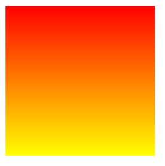

①线性渐变的开头第一个参数可以指定一个渐变的**方向**，即`to left`、`to right`、`to bottom`、`to top`

```css
background-image: linear-gradient(to left, red, yellow);
background-image: linear-gradient(to right, red, yellow);
background-image: linear-gradient(to top, red, yellow);
background-image: linear-gradient(to bottom, red, yellow);
```

②线性渐变的开头第一个参数可以指定一个渐变的**度数**，即`deg`

```css
background-image: linear-gradient(45deg, red, yellow);
```


③线性渐变的开头第一个参数可以指定一个渐变的**圈**，即`turn` 

```css
background-image: linear-gradient(0.4turn, red, yellow);
```

④渐变可以同时指定多个颜色，多个颜色默认情况下平均分布，也可以手动指定渐变的分布情况

------

`repeating-linear-gradient()`可以平铺的线性渐变，默认情况下跟`linear-gradient(red, yellow)`效果一样，我们稍作改动

```css
background-image: repeating-linear-gradient(red 0px, yellow 50px);
```

由于我们设置的`div`宽高为`200px`，所以会有4次重复的渐变效果


所以默认情况下，下列几种写法是一致的，效果相同

```css
background-image: linear-gradient(red, yellow);
background-image: repeating-linear-gradient(red, yellow);
/* 因为我们设置的div盒子的宽高为200px，所以这里[height]=200px */
background-image: repeating-linear-gradient(red 0, yellow [height]); 
```

#### 2.2.径向渐变

`radial-gradient()`径向渐变，放射性的效果，默认情况下径向渐变的形状根据元素的形状来计算的

* `正方形 --> 圆形`


* `长方形 --> 椭圆形`

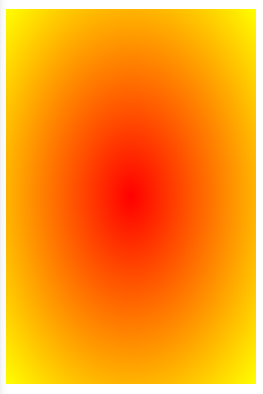

默认情况下，`circle`和`ellipse`是自动适配盒子的，也可以手动指定径向渐变的形状

```css
background-image: radial-gradient(circle, red, yellow);
```

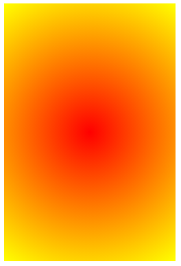

也可以指定渐变的位置，即`top`、`right`、`left`、`center`、`bottom`

```css
background-image: radial-gradient(at left, red, yellow);
```


也可以指定渐变的大小，即`closest-side`近边、`farthest-side`远边、`closest-corner`近角、`farthest-corner`远角

```css
background-image: radial-gradient(100px 60px, red, yellow);
```


同时对其形状、大小和位置进行指定，即`radial-gradient(形状/大小 at 位置, 颜色 位置, 颜色 位置, 颜色 位置)`

```css
background-image: radial-gradient(circle at 50px 100px, red 50px, yellow 100px);
```


类似于线性渐变，径向渐变也有对应的`repeat`属性

```css
background-image: repeating-radial-gradient(circle at 50px 100px, red 50px, yellow 100px);
```


> 浏览器一般会存在默认样式，这样的话会对CSS中自定义样式存在一定的影响，清除标签的默认样式放于clearall.css文档中


> 更多的可参考[过渡与动画](https://blog.csdn.net/qq_35925558/article/details/118162428)、[平移、旋转与缩放](https://blog.csdn.net/qq_35925558/article/details/118253369)、[菜鸟教程](https://www.runoob.com/css/css-tutorial.html)


> 小练习[HTML+CSS之禅意花园效果模仿](/前端/HTML+CSS禅意花园练习)


