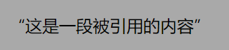
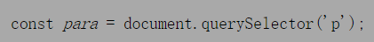
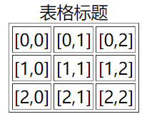

# HTML

## 一、什么是HTML？

HTML(Hyper Text Markup Language)**超文本标记语言**，使用**标签**的形式来标识网页中不同的组成部分，超文本指的就是**超链接**，使用超链接的形式来实现页面间的跳转

HTML是不严格的语言，**不区分大小写**；不需要编译，通过浏览器个直接运行，更多可参考[菜鸟教程](https://www.runoob.com/html/html-tutorial.html)

W3C又称万维网联盟，是国际中立性标准机构，W3C标准包括结构化标准(HTML、XML)、表现标准(CSS)和行为标准(DOM、JS)

## 二、HTML5基本架构

```html
<!DOCTYPE html><!--文档声明，声明当前网页的版本-->
<html><!--html容器根标签，网页中的所有内容都要写根标签里边-->
	<head><!--网页头部标签：设置网页相关信息，头部的内容不会在网页中出现，用于帮助浏览器或搜索引擎解析网页-->
		<mate charset="utf-8"><!--mate标签用于规定网页元数据，此处是规定编码格式，防止乱码-->
		<meta name="keywords" content="gg,hh" /><!--搜索时的关键字-->
		<title>标题</title><!--title中的内容会显示在浏览器的标题栏，搜索引擎会主要根据title中的内容来判断网页的主要内容-->
	</head>
	<body><!--body是htm1的子元素，表示网页的主体，网页中所有的可见内容都应该写在body里-->
		<i><b>hello word</b></i>
	</body>
</html>
```

## 三、字符实体

**HTML中不能直接书写一些特殊符号时需要使用字符实体代替**，请看如下两段`p`标记在网页的效果实际相同，多个空格实际无意义

```html
<p>这是 一段 文字</p>
<p>这是       一段    文字</p>
```

常见的字符实体如下

|  实体名称  | 显示结果 |   描述   |
| :--------: | :------: | :------: |
|  `&nbsp;`  |   ` `    |   空格   |
|   `&gt;`   |    >     |  大于号  |
|   `&lt;`   |    <     |  小于号  |
|  `&amp;`   |    &     |    与    |
|  `&copy;`  |    ©     |   版权   |
|  `&reg;`   |    ®     | 注册商标 |
| `&trade;`  |    ™     |   商标   |
| `&times;`  |    ×     |   乘号   |
| `&divide;` |    ÷     |   除号   |
| `&iquest;` |    ¿     |  倒问号  |

更多的字符实体可参考[菜鸟教程](https://www.runoob.com/html/html-tutorial.html)

## 四、head标签

### 1.概述

`<head>`内的**内容并不会在页面中被渲染**，`<head>`内包含`<title>`、指向CSS的连接`<link>`、指向自定义图标和其他元数据等信息

### 2.title元素

不要混淆`<title>`和`<h1>`二者的概念，`h1`在`<body>`内出现且其内容会在页面中渲染，而`<title>`出现位置如下图


### 3.meta元素

`<meta>`用于添加元数据，**元数据是描述数据的数据**，并不是给用户看的，可设的元数据如下

①指定文档中字符的编码

```html
<meta charset="utf-8">
```

②添加作者

```html
<meta name="author" content="ChenJieYaYa"/>
```

③添加描述信息以及关键字，以京东网站为例，右键单击选择`查看网页源代码`，看到`head`标签下的`meta`标签如下

```html
<meta name="description" content="京东JD.COM-专业的综合网上购物商城,销售家电、数码通讯、电脑、家居百货、服装服饰、母婴、图书、食品等数万个品牌优质商品.便捷、诚信的服务，为您提供愉悦的网上购物体验!"/>
<meta name="Keywords" content="网上购物,网上商城,手机,笔记本,电脑,MP3,CD,VCD,DV,相机,数码,配件,手表,存储卡,京东"/>
```


④`http-equiv`提供的信息相当于HTTP头所能提供的信息

* `refresh`指定页面重新加载秒数及重定向URL

```html
<!-- Redirect page after 3 seconds -->
<meta http-equiv="refresh" content="3;url=https://www.mozilla.org">
```


* `content-type`用于声明文档的MIME类型和字符编码，如果指定则`content`属性必须有`text/html; `
* `default-style`设置默认的CSS样式表集的名称
* `content-security-policy`为当前页面定义内容策略，**内容策略主要指定允许的服务器来源和脚本端点**，防范跨站脚本攻击

### 4.link元素

①添加自定义图标

```html
<link rel="icon" href="./img/title.png" type="images/x-ico">
```


②引用CSS和JavaScript

```html
<link rel="stylesheet" href="./css/clearall.css">
<link rel="script" href="./js/index.js">
```

## 五、语义标签

### 1.块级元素

**块级元素独占一行**，此处只给出部分，某些后面会详细介绍

|                      标签                      |  作用  |                             描述                             |                    图解                    |
| :--------------------------------------------: | :----: | :----------------------------------------------------------: | :----------------------------------------: |
| `<h1>`、`<h2>`、`<h3>`、`<h4>`、`<h5>`、`<h6>` |  标题  | 一共六级标题，从`h1~h6`重要性递减，`h1`在网页中的重要性仅次于`title`标签，一般情况下一个页面中只会有一个`h1` |  |
|                   `<hgroup>`                   | 标题组 |          多层次的标题，它将一组`<h1>~<h6>`元素分组           |                                            |
|                     `<p>`                      |  段落  |                                                              |  |
|                 `<blockquote>`                 | 块引用 |            缩进后显示文本，`cite`属性表示引文来源            |  |

### 2.内联元素

内联元素又称行内元素，**行内元素不独占一行，主要用来包裹文字**，一般情况下会在块级元素中放行内元素，而不会在行内元素中放块级元素，此处只介绍部分

|    标签    |   作用   |                             描述                             |                    图解                    |
| :--------: | :------: | :----------------------------------------------------------: | :----------------------------------------: |
|   `<q>`    | 行内引用 |                       文本被双引号包裹                       |  |
|   `<br>`   |   换行   |                                                              |                                            |
|   `<em>`   |   强调   | `<em>`元素可以嵌套，每一级嵌套表示更高的强调程度，`<i>`元素效果与它相同，不过`<i>`不属于语义标签 |  |
| `<strong>` |   重要   | 表示重要性、严肃性或紧迫性，浏览器通常以粗体字呈现内容，`<b>`元素效果与它相同，不过`<b>`不属于语义标签 |  |

> `<hr>`表示分隔线，`<u>`表示下划线

### 3.空元素

并不是所有的标签都拥有开始标签、结束标签和内容，某些标签只是标签，用于在该**空元素处插入或嵌入某些内容**，例如``

## 六、列表

### 1.有序列表Ordered

使用`ol`标签来创建有序列表，使用`li`表示列表项，例如

```html
<ol>
    <li>Mix flour, baking powder, sugar, and salt.</li>
    <li>In another bowl, mix eggs, milk, and oil.</li>
    <li>Stir both mixtures together.</li>
    <li>Fill muffin tray 3/4 full.</li>
    <li>Bake for 20 minutes.</li>
</ol>
```


### 2.无序元素Unordered

使用`ul`标签来创建无序列表，使用`li`表示列表项

```html
<ul>
    <li>Milk</li>
    <li>Cheese
        <ul>
            <li>Blue cheese
                <ul>
                    <li>Sweet blue cheese</li>
                    <li>Sour blue cheese</li>
                </ul>
            </li>
            <li>Feta</li>
        </ul>
    </li>
</ul>
```


### 3.定义列表

使用`dl`标签来创建定义列表，使用`dt`表示定义的内容，使用`dd`来对内容进行解释说明

```html
<dl>
    <dt>Beast of Bodmin</dt>
    <dd>A large feline inhabiting Bodmin Moor.</dd>

    <dt>Morgawr</dt>
    <dd>A sea serpent.</dd>

    <dt>Owlman</dt>
    <dd>A giant owl-like creature.</dd>
</dl>
```


## 七、超链接

### 1.概述

**超链接可以让我们从一个页面跳转到其他页面，或者是当前页面的其他的位置**；使用`a`标签来定义超链接，`href`属性指定跳转的目标路径URL；**URL可以是**HTML文件、文本文件、图像、视频等**可以在网络上保存的任何内容**

### 2.基本使用

`<a>`的基本使用方法如下

```html
<a href="https://www.baidu.com/">百度</a>一下，你就知道
```

`<a>`标签的`title`属性会在鼠标悬停`<a>`标签时作为提示信息

```html
<a href="https://www.baidu.com/" title="提示信息">百度</a>一下，你就知道
```


`<a>`标签的`download`属性为下载资源提供默认文件名，注意当被下载的资源不再浏览器中打开时生效

```html
<a href="https://dldir1.qq.com/qqfile/qq/PCQQ9.6.9/QQ9.6.9.28856.exe" download="QQ啊">下载QQ</a>
```

`<a>`标签的`href`内部加上`mailto`和`tel`前缀分别可以发送邮件以及拨打电话，详细使用如下

```html
<a href="mailto:">Email不指定收件人</a>
<a href="mailto:example1@outlook.com">Email指定一位收件人</a>
<a href="mailto:example@outlook.com,example2@outlook.com">Email指定两位收件人</a>
<a href="mailto:example1@outlook.com?cc=example2@mozilla.org">Email通过cc指定抄送</a>
<a href="mailto:nowhere@mozilla.org?cc=nobody@mozilla.org&amp;subject=This%20is%20the%20subject">Email通过subject指定主题</a>

<a href="tel:+123456789">Phone</a>
```

### 3.外部地址

```html
<ul>
  <li><a href="https://www.baidu.com">Website</a></li>
  <li><a href="mailto:example@outlook.com">Email</a></li>
  <li><a href="tel:+123456789">Phone</a></li>
</ul>
```


### 4.内部地址

当我们需要跳转一个服务器内部的页面时，一般我们都会使用相对路径，会以`./`或`../`开头

- `./` 表示当前文件所在目录，可以省略不写
- `../`表示当前文件所在目录的上一级目录

```html
<a href="./test1.html">超链接1</a><br>
<a href="../test2.html">超链接2</a><br>
<a href="./test3/test3.html">超链接3</a><br>
<a href="../test4/test4.html">超链接4</a>
```


### 5.新建页面

`target`属性用来指定超链接打开的位置可选值

- `_self`在当前页面中打开超链接，默认值
- `_blank`在新建页面中打开超链接

```html
<a href="./test1.html">超链接1——默认</a><br>
<a href="./test1.html" target="_self">超链接1——当前页面</a><br>
<a href="./test1.html" target="_blank">超链接1——新建页面</a><br>
```


### 6.锚点跳转

> 可以使用`javascript:void(0);`来作为`href`的属性，此时点击这个超链接什么也不会发生

`#`作为超链接的路径的占位符使用，将超链接的`href`属性设置为`#XXX`，使得点击超链接以后页面不会发生跳转，而是转到当前页面的指定位置，其中`XXX`为目标定位元素(锚点)的`id`值，若未指定`XXX`的值则默认回到顶部

```html
<p> 汉皇重色思倾国，御宇多年求不得。</p>
<p> 杨家有女初长成，养在深闺人未识。 </p>
<p> 天生丽质难自弃，一朝选在君王侧。 </p>
<p><a id="Anchor1" href="#Anchor2"> 回眸一笑百媚生，六宫粉黛无颜色。</a></p>
<p> 春寒赐浴华清池，温泉水滑洗凝脂。 </p>
<p> 侍儿扶起娇无力，始是新承恩泽时。 </p>
<p> 云鬓花颜金步摇，芙蓉帐暖度春宵。 </p>
<p> 春宵苦短日高起，从此君王不早朝。 </p>
<p> 承欢侍宴无闲暇，春从春游夜专夜。 </p>
<p><a id="Anchor2" href="#Anchor3"> 后宫佳丽三千人，三千宠爱在一身。</a></p>
<p> 金屋妆成娇侍夜，玉楼宴罢醉和春。 </p>
<p> 姊妹弟兄皆列土，可怜光彩生门户。 </p>
<p> 遂令天下父母心，不重生男重生女。 </p>
<p> 骊宫高处入青云，仙乐风飘处处闻。 </p>
<p> 缓歌慢舞凝丝竹，尽日君王看不足。 </p>
<p> 渔阳鼙鼓动地来，惊破霓裳羽衣曲。 </p>
<p> 九重城阙烟尘生，千乘万骑西南行。 </p>
<p> 翠华摇摇行复止，西出都门百余里。 </p>
<p> 六军不发无奈何，宛转蛾眉马前死。 </p>
<p> 花钿委地无人收，翠翘金雀玉搔头。 </p>
<p> 君王掩面救不得，回看血泪相和流。 </p>
<p> 黄埃散漫风萧索，云栈萦纡登剑阁。 </p>
<p> 峨嵋山下少人行，旌旗无光日色薄。 </p>
<p> 蜀江水碧蜀山青，圣主朝朝暮暮情。 </p>
<p> 行宫见月伤心色，夜雨闻铃肠断声。 </p>
<p> 天旋地转回龙驭，到此踌躇不能去。 </p>
<p> 马嵬坡下泥土中，不见玉颜空死处。 </p>
<p> 君臣相顾尽沾衣，东望都门信马归。 </p>
<p> 归来池苑皆依旧，太液芙蓉未央柳。 </p>
<p> 芙蓉如面柳如眉，对此如何不泪垂。 </p>
<p> 春风桃李花开夜，秋雨梧桐叶落时。 </p>
<p> 西宫南苑多秋草，落叶满阶红不扫。 </p>
<p> 梨园弟子白发新，椒房阿监青娥老。 </p>
<p> 夕殿萤飞思悄然，孤灯挑尽未成眠。 </p>
<p><a id="Anchor3" href="#Anchor4"> 迟迟钟鼓初长夜，耿耿星河欲曙天。 </a></p>
<p> 鸳鸯瓦冷霜华重，翡翠衾寒谁与共。 </p>
<p> 悠悠生死别经年，魂魄不曾来入梦。 </p>
<p> 临邛道士鸿都客，能以精诚致魂魄。 </p>
<p> 为感君王辗转思，遂教方士殷勤觅。 </p>
<p> 排空驭气奔如电，升天入地求之遍。 </p>
<p> 上穷碧落下黄泉，两处茫茫皆不见。 </p>
<p> 忽闻海上有仙山，山在虚无缥渺间。 </p>
<p> 楼阁玲珑五云起，其中绰约多仙子。 </p>
<p> 中有一人字太真，雪肤花貌参差是。 </p>
<p> 金阙西厢叩玉扃，转教小玉报双成。 </p>
<p> 闻道汉家天子使，九华帐里梦魂惊。 </p>
<p> 揽衣推枕起徘徊，珠箔银屏迤逦开。 </p>
<p> 云鬓半偏新睡觉，花冠不整下堂来。 </p>
<p><a id="Anchor4" href="#Anchor5"> 风吹仙袂飘飖举，犹似霓裳羽衣舞。 </a></p>
<p> 玉容寂寞泪阑干，梨花一枝春带雨。 </p>
<p> 含情凝睇谢君王，一别音容两渺茫。 </p>
<p> 昭阳殿里恩爱绝，蓬莱宫中日月长。 </p>
<p> 回头下望人寰处，不见长安见尘雾。 </p>
<p> 惟将旧物表深情，钿合金钗寄将去。 </p>
<p> 钗留一股合一扇，钗擘黄金合分钿。 </p>
<p> 但令心似金钿坚，天上人间会相见。 </p>
<p> 临别殷勤重寄词，词中有誓两心知。 </p>
<p> 七月七日长生殿，夜半无人私语时。 </p>
<p><a id="Anchor5" href="#Anchor6"> 在天愿作比翼鸟，在地愿为连理枝。 </a></p>
<p> 天长地久有时尽，此恨绵绵无绝期。 </p>

<!-- Heading to link to -->
<a href="#">回到顶部</a>
```


## 八、文本格式

大部分文本格式在语义标签部分已介绍过，此处接上

### 1.引用

①块引用`<blockquote>`：若块级内容从其他地方被引用则需块引用被包裹，`cite`属性表示引文来源

```html
<blockquote cite="https://developer.mozilla.org/en-US/docs/Web/HTML/Element/blockquote">
    这是一段被引用的内容
</blockquote>
```


②行内引用`<q>`

```html
<q>这是一段被引用的内容</q>
```



### 2.引文

```html
<cite>这是引文</cite>
```


### 3.缩略语

缩略语`<abbr>`的`title`提供缩写的解释

```html
这是一段缩略语，<abbr title="缩略的内容">缩略内容</abbr>在这里
```


### 4.标记联系方式

`<address>`只用于标记HTML文档编写人的联系方式，不表示其他任何内容

```html
<address>
    <p>这是我的联系方式呀</p>
</address>
```

### 5.上标和下标

上标`<sup>`和下标`<sub>`表示方程中常用的小子部分

```html
X<sup>2</sup>Y<sup>3</sup>
X<sub>2</sub>Y<sub>3</sub>
```


### 6.计算机代码

①`<code>`用于标记计算机通用代码

```html
<code>const para = document.querySelector('p');
    para.onclick = function() {
    alert('hhh');
    }</code>
```


②`<pre>`用于保留空白字符，即缩进或多余的空白

```html
<pre>const para = document.querySelector('p');
    para.onclick = function() {
    alert('hhh');
    }</pre>
```


③`<var>`用于标记具体变量名

```html
<code>const <var>para</var> = document.querySelector('p');</code>
```



④`<kbd>`用于标记输入电脑的键盘值

```html
复制快捷键<kbd>Ctrl+C</kbd>
```


⑤`<samp>`用于标记计算机程序的输出

```html
<samp>PING mozilla.org (63.245.215.20): 56 data bytes
    64 bytes from 63.245.215.20: icmp_seq=0 ttl=40 time=158.233 ms</samp>
```


### 7.标记时间和日期

世界上有许多种书写日期的格式，不同的格式不容易被电脑识别，`<time>`元素允许**附上清晰的、可被机器识别的时间/日期**

```html
<!-- 标准简单日期 -->
<time datetime="2016-01-20">20 January 2016</time>
<br>
<!-- 只包含年份和月份-->
<time datetime="2016-01">January 2016</time>
<br>
<!-- 只包含月份和日期 -->
<time datetime="01-20">20 January</time>
<br>
<!-- 只包含时间，小时和分钟数 -->
<time datetime="19:30">19:30</time>
<br>
<!-- 还可包含秒和毫秒 -->
<time datetime="19:30:01.856">19:30:01.856</time>
<br>
<!-- 日期和时间 -->
<time datetime="2016-01-20T19:30">7.30pm, 20 January 2016</time>
<br>
<!-- 含有时区偏移值的日期时间 -->
<time datetime="2016-01-20T19:30+01:00">7.30pm, 20 January 2016 is 8.30pm in France</time>
<br>
<!-- 调用特定的周 -->
<time datetime="2016-W04">The fourth week of 2016</time>
```

## 九、布局标签

|    标签    |                             描述                             |
| :--------: | :----------------------------------------------------------: |
| `<header>` |                       网页的头部，页眉                       |
|  `<nav>`   |                         网页的导航栏                         |
|  `<main>`  | 网页的主体部分，**一个页面中只会有一个`main`，且直接位于`<body>`下，最好不要将`<main>`嵌入其他元素中** |
| `<aside>`  |               网页的侧边栏，常嵌套在`<main>`中               |
| `<footer>` |                       网页的底部，页脚                       |

其中主内容`<main>`中还可有各种子内容区段

|    标签     |                            描述                             |
| :---------: | :---------------------------------------------------------: |
| `<article>` |                       包裹独立的文章                        |
| `<section>` | 独立的区块，可按功能分块，以上标签都无法表示时使用`section` |
|   `<div>`   |         块元素，没有任何的语义，就用来表示一个区块          |
|  `<span>`   |     行内元素，没有任何的语义，一般用于在网页中选中文字      |


## 十、多媒体嵌入

### 1.图片

#### 1.1.图片标签

``标签是**自结束标签**，这种元素属于**替换**元素，即它**无需包含文本内容和结束标签**，``包含的属性如下

|       属性        |                             描述                             |                    图解                    |
| :---------------: | :----------------------------------------------------------: | :----------------------------------------: |
|       `src`       |           指定外部图片的路径，类似于`<a>`的`href`            |                                            |
|       `alt`       | 指当图片无法显示时的描述，**若该图片被嵌套于超链接中发生跳转动作，最好是加上图片描述，以便图片加载失败时还可以跳转** |  |
| `width`、`height` | 分别指图片的宽高，**宽度和高度中如果只修改了一个则另一个会等比例缩放** |                                            |
|      `title`      |                    鼠标移入图片的提示信息                    |  |

> 图片路径一般不使用URL，而是将图片与HTML放在同一服务器下，**若使用URL则需要通过DNS重新寻找IP地址**

图片的格式主要与如下几类，图片效果一样的则选文件小的，图片效果不一样的则选图片效果好的；**尽可能的兼顾和平衡图片效果和文件大小**

|  图片类型   |                             说明                             |
| :---------: | :----------------------------------------------------------: |
| `jpeg(jpg)` |        支持的颜色比较丰富、不支持透明效果、不支持动图        |
|    `gif`    |          支持的颜色比较单一、支持简单透明、支持动图          |
|    `png`    |    支持的颜色丰富、支持复杂透明、不支持动图、专为网页而生    |
|   `webp`    | 谷歌新推出的专门用来表示网页中的图片的一种格式，具备其他图片格式的所有优点，而且文件还特别的小，缺点是兼容性不好 |
|  `base64`   | 图片使用`base64`编码，这样可以将图片转换为字符，通过字符的形式来引入图片 |

注意**大多数图片是有版权的**，不要在你的网页上使用一张未授权的图片，就算授权也最好不要直接通过URL指向该图片，其一是因为需要重新DNS寻找IP，其二是因为该图片可能被原作者修改而导致自己的网站发生变化

------

若需要给图片一个标题怎么办？当然可以使用``和`<p>`标签配合，但二者在语义上是没有联系的，**H5提供`<figcaption>`和`<figure>`使标题和图片产生联系，`<figcaption>`内是`<figure>`内内容的文字描述**

```html
<figure>
    
    <figcaption>图片的标题</figcaption>
</figure>
```


#### 1.2.背景图片

背景图片不同于``，``属于HTML添加图片，而背景图片指通过CSS将图片嵌入网站，通过`background-image`实现

```html
<div class="bg-test" style="width: 300px;height: 300px;border: darkgray 1px solid"></div>

<style>
    .bg-test {
        background-image: url("./img/title.png");
    }
</style>
```


#### 1.3.响应式图片

①`srcset`和`sizes`属性

`srcset`定义**允许浏览器选择的图像集**，及每个**图像集的大小**，格式是`文件名 图像固有宽度(w)`

`sizes`定义**媒体条件**并指定何种媒体条件下**选择哪个图片尺寸**，格式是`媒体条件 图像将填充的槽宽度`，槽宽度单位可以是`px`、`em`或`vw`，但不会是`%`

`srcset`和`sizes`属性的逻辑执行过程如下，`sizes`最后一个槽宽度指当没有任何媒体条件为真时会选择它

- **浏览器查看设备宽度，并检查`sizes`列表中哪个媒体条件为真**
- **查看图像将填充的槽宽度，加载`srcset`列表中引用的最接近所选的槽大小的图像**

```html
<!--若浏览器以视窗宽度为480来加载页面，那么(max-width: 480px)媒体条件为真，因此440px的槽会被选择，所以./img/title.png将被加载-->

```

但这种方式的缺点是可能会造成空间上的浪费且老旧浏览器不支持

#### 5.2.srcset和x语法

若访问页面的设备具有标准/低分辨率显示，即一个设备像素表示一个 CSS 像素，则`elva-fairy-320w.jpg`会被加载(1x 是默认值)；如果设备有高分辨率，即两个或更多的设备像素表示一个 CSS 像素，则`elva-fairy-640w.jpg` 会被加载

```html


<style>
    img {
        width: 320px;
    }
</style>
```

#### 5.2.picture标签

`<picture>`让我们能继续满足老式浏览器的需要，`<picture>`和`<video>`及`<audio>`类似，使用方式如下，其中`<source>`的`media`属性表示一个媒体条件，`srcset`属性包含要显示图片的路径， `</picture>`之前必须正确提供``元素以及它的`src`和`alt`属性，否则不会有图片显示，该``会被作为后备方案

```html
<picture>
    <source media="(min-width: 400px)" srcset="./img/jpg.jpg">
    <source media="(min-width: 800px)" srcset="./img/title.png">
    
</picture>
```

### 2.视频&音频

#### 2.1.视频

`<video>`标签用来向页面中引入一个外部的视频文件，`src`属性用于指向外部文件，`controls`属性表示是否允许用户控制播放

```html
<video src="./img/2.mp4" controls></video>
```

但是视频存在许多格式，并不是所有格式都能被浏览器支持，可**通过`<source>`在`<video>`下指定不同格式的视频文件**，浏览器会选择与自身codec相匹配的媒体格式。`<source>`中的`type`属性建议设置，设置后浏览器通过检查该属性迅速判断并跳过不支持的格式，若未设置则浏览器会尝试加载每个文件，直到找到能正确播放的媒体文件为止

```html
<video controls>
  <source src="./img/2.mp4" type="video/mp4">
  <source src="./img/2.webm" type="video/webm">
</video>
```

除了上述`src`和`controls`属性外，其他属性如下

|       属性        |                             描述                             |
| :---------------: | :----------------------------------------------------------: |
| `width`、`height` |                           视频宽高                           |
|    `autoplay`     |                           自动播放                           |
|      `loop`       |                           循环播放                           |
|      `muted`      |                         默认关闭声音                         |
|     `poster`      | 视频封面URL，常用于广告，若设置`autoplay`则看不到`poster`效果 |
|     `preload`     | 用于缓冲较大文件，`none`表示不缓冲，`auto`表示页面加载后缓存媒体文件，`metadata`表示仅缓冲文件的元数据 |

#### 2.2.音频

`<audio>`和`<video>`使用上只存在些许差别，例如`<audio>`不支持`width`、`height`和`poster`属性，不存在视觉效果

```html
<audio src="./img/1.mp3" controls></audio>

<audio controls>
    <source src="./img/1.mp3" type="audio/mp3">
    <source src="./img/1.ogg" type="audio/ogg">
</audio>
```

#### 2.3.重新播放媒体

可以在Javascript中调用 `load()`方法来重置媒体

```html
<div>
    <video id="load-test" src="./img/2.mp4" controls height="300px"></video>
    <input type="button" value="重新播放" onclick="load_test()">
</div>

<script>
    function load_test() {
        const videoDom = document.getElementById('load-test');
        videoDom.load();
    }
</script>
```

#### 2.4.音轨增删事件

当音轨被添加或删除时可以通过监听相关事件来侦测到

```html
<script>
    const videoDom = document.querySelector('video');
    videoDom.audioTracks.onaddtrack = function(event) {
		audioTrackAdded(event.track);
    };
</script>
```

#### 2.5.显示音轨文本

某些人看不到听不懂视频和音频内容怎么办？`<track>`标签可以解决该问题

**👀`<track>`标签让`.vtt`后缀文件与HTML媒体一起工作，使用`srclang`属性告知浏览器通过什么语言显示音轨文本，`kind`属性指定类型**，三种类型如下

- `subtitles`：添加翻译字幕
- `captions`：添加同步描述，帮助不能理解的人理解媒体内容
- `timed descriptions`：文字转为音频

典型的 WebVTT 文件如下

```
WEBVTT

1
00:00:22.230 --> 00:00:24.606
第一段字幕

2
00:00:30.739 --> 00:00:34.074
第二段

  ...
```

`<track>`标签需放在`<audio>`或`<video>`标签当中，所有`<source>`标签之后使用

```html
<video controls>
    <source src="example.mp4" type="video/mp4">
    <source src="example.webm" type="video/webm">
    <track kind="subtitles" src="subtitles_en.vtt" srclang="en">
</video>
```

### 3.其他嵌入技术

#### 3.1.iframe

`<iframe>`实现**将整个Web文档页嵌入到另一个网页**，很适合将第三方内容嵌入到你的网站，例如嵌入地图、在线视频提供商的视频等

```html
<iframe src="https://www.baidu.com/"></iframe>
<iframe src="https://www.baidu.com/" width="200px" height="200px"></iframe>
<iframe src="https://www.baidu.com/" allowfullscreen></iframe>
<iframe src="https://www.baidu.com/" frameborder="10"></iframe>
```


`<iframe>`的属性如下

|       属性        |                             描述                             |
| :---------------: | :----------------------------------------------------------: |
|       `src`       | 指向要嵌入文档的URL，为提高访问速度，建议在主内容完成加载后使用JS设置`src` |
| `width`、`height` |                             宽高                             |
| `allowfullscreen` |                        设置为全屏模式                        |
|   `frameborder`   | 设置`<iframe>`的边框，值为0表示删除边框，但建议通过CSS设置边框 |
|     `sandbox`     | 高版本浏览器支持，该属性用于提高安全性设置，给当前`iframe`进行权限限制 |

`<iframe>`常常被黑客作为攻击目标(攻击向量)，例如**单向劫持**(黑客将隐藏的`iframe`嵌入到你的文档并使用它来捕获用户的交互，即用户名密码等敏感信息)是一种常见的`iframe`攻击，我们只在必要时才使用`<iframe>`，为保证安全性你可以

- **使用HTTPS**：HTTPS是HTTP的加密版本，它减小远程内容在传输过程中被篡改的机会，同时防止嵌入式内容访问父文档内容，注意HTTPS需要安全证书，这可能有点贵！
- **使用`sandbox`属性**：`sandbox`属性值请前往[🔗链接](https://developer.mozilla.org/zh-CN/docs/Web/HTML/Element/iframe#attr-sandbox)，注意不要同时添加`allow-scripts`和`allow-same-origin`，否则嵌入式内容可绕过阻止站点执行脚本的同源安全策略，并使用JavaScript完全关闭沙盒
- **配置CSP指令**：CSP指内容安全策略，它提供一组HTTP标头

> [沙盒](https://en.wikipedia.org/wiki/Sandbox_(computer_security))指允许包含在盒内的代码以适当的方式执行或用于测试，但不能对其他代码库造成任何损坏的容器。黑客诱导你直接访问`iframe`之外的恶意内容则沙盒无法提供保护，若某些内容可能是恶意的可保证这些内容从不同的域向主站点提供服务

#### 3.2.object&embed

`<object>`和`<embed>`元素是嵌入多种类型的外部内容的通用嵌入工具，现在基本不会使用到

|                                |                `object`                 |          `embed`          |
| :----------------------------: | :-------------------------------------: | :-----------------------: |
|         嵌入内容的路径         |                 `data`                  |           `src`           |
|       嵌入内容的媒体类型       |                 `type`                  |          `type`           |
|              宽高              |            `width`、`height`            |     `width`、`height`     |
|  名称和值，将插件作为参数提供  | 单标签`<param>`元素，包含在内`<object>` |      `ad`、`hoc`属性      |
| 独立的HTML作为不可用资源的回退 |    包含在元素`<object>`之后`<param>`    | `<noembed>`已过时，不支持 |

### 4.矢量图

#### 4.1.矢量图是什么？

我们常见的`.png`、`.jpg`、`.bmp`和`.gif`格式的图都叫做位图，**位图文件使用像素网格定义**，当放大此类图片时图片的边缘可能会失真，即出现类似马赛克的感觉

**矢量图使用算法定义**，矢量图文件中包含图形和路径的概念，电脑可根据这两个概念计算出该矢量图在屏幕中渲染时该呈现的样子， [SVG](https://developer.mozilla.org/zh-CN/docs/Glossary/SVG)是用于Web的矢量图形。与位图不同的是**矢量图即使放大也不会失真，且矢量图相较于位图拥有更小的体积，不会存储每个像素信息**


#### 4.2.SVG是什么？

SVG矢量图文件本质**由XML语言组成，标记图形，而不是内容**。可通过`<circle>`或`<rect>`等标签来定义SVG内的元素，简单实例如下，此处不详细讲解SVG的使用方法

```html
<!-- 圆 -->
<svg xmlns="http://www.w3.org/2000/svg" version="1.1">
    <!-- cx表示圆心的x坐标，cy表示圆心的y轴坐标 r表示半径 -->
    <circle cx="50" cy="50" r="40" fill='red'/>
</svg>

<!-- 直线 -->
<svg xmlns="http://www.w3.org/2000/svg" version="1.1">
    <line x1="0" y1="0" x2="200" y2="200" style="stroke:rgb(255,0,0);stroke-width:2"/>
</svg>
```

SVG通过手工编码很容易实现，大多数人使用[Inkscape](https://inkscape.org/en/)或[Illustrator](https://en.wikipedia.org/wiki/Adobe_Illustrator)等矢量图形编辑器编辑，SCG图像的每个标签可单独通过CSS或JS控制，这意味着通过CSS或JS可控制矢量图的部分元素，但SVG图容易变得复杂，导致浏览器处理SVG图的事件边长，且某些旧版本浏览器尚未支持SVG

#### 4.3.SVG嵌入网页

①直接复制SVG源码嵌入，但该方式容易导致代码过长，且该SVG无法复用难以维护

```html
<svg t="1669551977407" class="icon" viewBox="0 0 1024 1024" version="1.1" xmlns="http://www.w3.org/2000/svg"
     p-id="5091" width="200" height="200">
    <path d="M512 512m-320 0a320 320 0 1 0 640 0 320 320 0 1 0-640 0Z" fill="#1296db" p-id="5092"></path>
</svg>
```

②``方式使SVG失去本身可编辑的特点，通过CSS设置背景方式也会使SVG失去本身可编辑的特点

```html

```

③`<iframe>`方式可设置iframe大小与图片大小一致，同时去除边框

```html
<iframe src="./img/svg.svg" width="200" height="200" style="border: none;"></iframe>
```

④`<object>`方式

```html
<object data="./img/svg.svg" type="image/svg+xml"></object>
```

⑤`<embed>`方式

```html
<embed src="./img/svg.svg" type="image/svg+xml">
```

## 十一、表格

### 1.基础表格

`<table>`标签内`<tr>`表示表格中的行，`<tr>`内使用`<td>`表示单元格

```html
<table>
    <tr>
        <td>[0,0]</td>
        <td>[0,1]</td>
        <td>[0,2]</td>
    </tr>
    <tr>
        <td>[1,0]</td>
        <td>[1,1]</td>
        <td>[1,2]</td>
    </tr>
    <tr>
        <td>[2,0]</td>
        <td>[2,1]</td>
        <td>[2,2]</td>
    </tr>
</table>
```


`<th>`的用法和`td`是相同的，只是`<th>`在视觉和语义上都表示表格的标题

```html
<table>
    <tr>
        <th>&nbsp;</th>
        <th>列一</th>
        <th>列二</th>
        <th>列三</th>
    </tr>
    <tr>
        <th>行一</th>
        <td>[0,0]</td>
        <td>[0,1]</td>
        <td>[0,2]</td>
    </tr>
    <tr>
        <th>行二</th>
        <td>[1,0]</td>
        <td>[1,1]</td>
        <td>[1,2]</td>
    </tr>
    <tr>
        <th>行三</th>
        <td>[2,0]</td>
        <td>[2,1]</td>
        <td>[2,2]</td>
    </tr>
</table>
```


合并单元格常使用`rowspan`表示纵向合并单元格数，`colspan`表示横向合并单元格数，`border`为表格加上边框方便观察

```html
<table border="1">
    <tr>
        <th>&nbsp;</th>
        <th>列一</th>
        <th>列二</th>
        <th>列三</th>
    </tr>
    <tr>
        <th>行一</th>
        <td colspan="2">[0,0]</td>
        <td>[0,1]</td>
    </tr>
    <tr>
        <th>行二</th>
        <td rowspan="2">[1,0]</td>
        <td>[1,1]</td>
        <td>[1,2]</td>
    </tr>
    <tr>
        <th>行三</th>
        <td>[2,1]</td>
        <td>[2,2]</td>
    </tr>
</table>
```


### 2.列样式

`<colgroup>`和`<col>`可达到定义相同列样式的效果，`<colgroup>`被定义于`<table>`标签下，`<col>`按顺序表示每列，其中`span`属性表示列数量

```html
<table border="1">
    <colgroup>
        <col style="background-color: darkgray" span="2">
        <col style="width: 100px">
        <col style="background-color: plum">
    </colgroup>
    <tr>
        <th>&nbsp;</th>
        <th>列一</th>
        <th>列二</th>
        <th>列三</th>
    </tr>
    <tr>
        <th>行一</th>
        <td>[0,0]</td>
        <td>[0,1]</td>
        <td>[0,2]</td>
    </tr>
    <tr>
        <th>行二</th>
        <td>[1,0]</td>
        <td>[1,1]</td>
        <td>[1,2]</td>
    </tr>
    <tr>
        <th>行三</th>
        <td>[2,0]</td>
        <td>[2,1]</td>
        <td>[2,2]</td>
    </tr>
</table>
```


### 3.高级表格

`<caption>`为表格添加标题

```html
<table border="1">
    <caption>表格标题</caption>
    <tr>
        <td>[0,0]</td>
        <td>[0,1]</td>
        <td>[0,2]</td>
    </tr>
    <tr>
        <td>[1,0]</td>
        <td>[1,1]</td>
        <td>[1,2]</td>
    </tr>
    <tr>
        <td>[2,0]</td>
        <td>[2,1]</td>
        <td>[2,2]</td>
    </tr>
</table>
```




表结构复杂时可将表格分成三个部分，即头部`<thead>`常表示表格第一行、主体`<tbody>`常表示表格主体、底部`<tfoot>`常表示表格的最后一行

```html
<table border="1">
    <thead>
        <tr>
            <th>&nbsp;</th>
            <th>thead1</th>
            <th>thead2</th>
            <th>thead3</th>
        </tr>
    </thead>
    <tfoot style="font-weight: bold;">
        <tr>
            <td colspan="4">合计</td>
        </tr>
    </tfoot>
    <tbody style="font-style: italic;font-size: 90%;">
        <tr>
            <th>行一</th>
            <td>[0,0]</td>
            <td>[0,1]</td>
            <td>[0,2]</td>
        </tr>
        <tr>
            <th>行二</th>
            <td>[1,0]</td>
            <td>[1,1]</td>
            <td>[1,2]</td>
        </tr>
        <tr>
            <th>行三</th>
            <td>[2,0]</td>
            <td>[2,1]</td>
            <td>[2,2]</td>
        </tr>
    </tbody>
</table>
```


### 4.scope属性

```html
<table border="1">
    <thead>
        <tr>
            <th></th>
            <th></th>
            <th colspan="3" scope="colgroup">列组标题1</th>
            <th colspan="2" scope="colgroup">列组标题2</th>
        </tr>
        <tr>
            <th></th>
            <th></th>
            <th scope="col">1列一</th>
            <th scope="col">1列二</th>
            <th scope="col">1列三</th>
            <th scope="col">2列一</th>
            <th scope="col">3列二</th>
        </tr>
    </thead>
    <tbody>
        <tr>
            <th rowspan="2" scope="rowgroup">行组标题1</th>
            <th scope="row">1行一</th>
            <td>一[0,0]</td>
            <td>一[0,1]</td>
            <td>一[0,2]</td>
            <td>二[0,0]</td>
            <td>二[0,1]</td>
        </tr>
        <tr>
            <th scope="row">1行二</th>
            <td>一[1,0]</td>
            <td>一[1,1]</td>
            <td>一[1,2]</td>
            <td>二[1,0]</td>
            <td>二[1,1]</td>
        </tr>
        <tr>
            <th rowspan="2" scope="rowgroup">行组标题2</th>
            <th scope="row">2行一</th>
            <td>一[2,0]</td>
            <td>一[2,1]</td>
            <td>一[2,2]</td>
            <td>二[2,0]</td>
            <td>二[2,1]</td>
        </tr>
        <tr>
            <th scope="row">2行二</th>
            <td>一[3,0]</td>
            <td>一[3,1]</td>
            <td>一[3,2]</td>
            <td>二[3,0]</td>
            <td>二[3,1]</td>
        </tr>
    </tbody>
</table>
```

`scope`属性可通过`id`和`headers`代替实现

```html
<table border="1">
    <thead>
        <tr>
            <th></th>
            <th></th>
            <th colspan="3" id="colgroup1">列组标题1</th>
            <th colspan="2" id="colgroup2">列组标题2</th>
        </tr>
        <tr>
            <th></th>
            <th></th>
            <th id="col11">1列一</th>
            <th id="col12">1列二</th>
            <th id="col13">1列三</th>
            <th id="col21">2列一</th>
            <th id="col22">3列二</th>
        </tr>
    </thead>
    <tbody>
        <tr>
            <th rowspan="2" id="rowgroup1">行组标题1</th>
            <th id="row11">1行一</th>
            <td headers="colgroup1 col11 row11">一[0,0]</td>
            <td headers="colgroup1 col12 row11">一[0,1]</td>
            <td headers="colgroup1 col13 row11">一[0,2]</td>
            <td headers="colgroup2 col21 row11">二[0,0]</td>
            <td headers="colgroup2 col22 row11">二[0,1]</td>
        </tr>
        <tr>
            <th id="row12">1行一</th>
            <td headers="colgroup1 col11 row12">一[1,0]</td>
            <td headers="colgroup1 col12 row12">一[1,1]</td>
            <td headers="colgroup1 col13 row12">一[1,2]</td>
            <td headers="colgroup2 col21 row12">二[1,0]</td>
            <td headers="colgroup2 col22 row12">二[1,1]</td>
        </tr>
        <tr>
            <th rowspan="2" id="rowgroup2">行组标题2</th>
            <th id="row21">2行一</th>
            <td headers="colgroup1 col11 row21">一[2,0]</td>
            <td headers="colgroup1 col12 row21">一[2,1]</td>
            <td headers="colgroup1 col13 row21">一[2,2]</td>
            <td headers="colgroup2 col21 row21">二[2,0]</td>
            <td headers="colgroup2 col22 row21">二[2,1]</td>
        </tr>
        <tr>
            <th id="row22">2行一</th>
            <td headers="colgroup1 col11 row22">一[3,0]</td>
            <td headers="colgroup1 col12 row22">一[3,1]</td>
            <td headers="colgroup1 col13 row22">一[3,2]</td>
            <td headers="colgroup2 col21 row22">二[3,0]</td>
            <td headers="colgroup2 col22 row22">二[3,1]</td>
        </tr>
    </tbody>
</table>
```

### 5.表格样式示例

```html
<table>
    <tr>
        <td>学号</td>
        <td>姓名</td>
        <td>性别</td>
        <td>年龄</td>
        <td>地址</td>
    </tr>
    <tr>
        <td>1</td>
        <td>孙悟空</td>
        <td>男</td>
        <td>18</td>
        <td>花果山</td>
    </tr>
    <tr>
        <td>2</td>
        <td>猪八戒</td>
        <td>男</td>
        <td>28</td>
        <td>高老庄</td>
    </tr>
    <tr>
        <td>3</td>
        <td>沙和尚</td>
        <td>男</td>
        <td>38</td>
        <td>流沙河</td>
    </tr>
    <tr>
        <td>4</td>
        <td>唐僧</td>
        <td>男</td>
        <td>16</td>
        <td>女儿国</td>
    </tr>
    <tr>
        <td>1</td>
        <td>孙悟空</td>
        <td>男</td>
        <td>18</td>
        <td>花果山</td>
    </tr>
    <tr>
        <td>2</td>
        <td>猪八戒</td>
        <td>男</td>
        <td>28</td>
        <td>高老庄</td>
    </tr>
    <tr>
        <td>3</td>
        <td>沙和尚</td>
        <td>男</td>
        <td>38</td>
        <td>流沙河</td>
    </tr>
    <tr>
        <td>4</td>
        <td>唐僧</td>
        <td>男</td>
        <td>16</td>
        <td>女儿国</td>
    </tr>
    <tr>
        <td>4</td>
        <td>唐僧</td>
        <td>男</td>
        <td>16</td>
        <td>女儿国</td>
    </tr>
    <tr>
        <td>1</td>
        <td>孙悟空</td>
        <td>男</td>
        <td>18</td>
        <td>花果山</td>
    </tr>
    <tr>
        <td>2</td>
        <td>猪八戒</td>
        <td>男</td>
        <td>28</td>
        <td>高老庄</td>
    </tr>
    <tr>
        <td>3</td>
        <td>沙和尚</td>
        <td>男</td>
        <td>38</td>
        <td>流沙河</td>
    </tr>
    <tr>
        <td>4</td>
        <td>唐僧</td>
        <td>男</td>
        <td>16</td>
        <td>女儿国</td>
    </tr>
</table>
```

```css
table {
    width: 50%;
    margin: 0 auto;
    border: 1px black solid;

    /* border-spacing：指定边框之间的距离；边框之间虽然没有距离了，但是实际上是两条边框的和，看起来是变粗了 */
    /* border-spacing: 0; */

    /*border-collapse:collapse；设置边框的合并；真正的将两条边框合并成一条边框 */
    border-collapse: collapse;
    
    /* 默认情况下元素在td中是垂直居中的，可以通过vectical-align来修改 */
    vertical-align: middle;
    text-align: center;
}

/* 如果表格中没有使用tbody而是直接使用tr，那么浏览器会自动创建一个tbody，并且将tr全都放到tbody中
   所以说，tr不是table的子元素 */
tbody tr:nth-child(odd) {
    background-color: rgb(211, 216, 188);
}

td {
    border: 1px black solid;
}
```


## 十二、表单

表单用于将本地的数据提交给远程的服务器，与后端控制层相关，表示一个整体，一个页面可含多个表单

```html
<form action="表单要提交的服务器的地址" method="get默认，post...">

    <label for="input的名字，用来表示这个label是那个input的"></label> for：<br>
    <hr>

    <input name="h1" type="hidden" value=""/>：隐藏域，不显示在网页中<br>
    <input name="t1" type="text" value="默认值" maxlength="文本输入的最大长度" placeholder=""/>：普通文本框，显示默认值value，最多可以输入maxlength，输入时自动消失的默认值<br>
    <input name="p1" type="password" maxlength="文本输入的最大长度"/>：隐藏输入的文本框（密码），最多可以输入maxlength<br>
    <hr>

    <input name="r1" type="radio" value="男" checked="true"/>男
    <input name="r1" type="radio" value="女"/>女<br>
    单选按钮（注意按钮的name要一样，一样表示在同一个分组中，否则可以多选） checked：默认选择
    <hr>

    <input name="c1" type="checkbox" value="11"/>篮球
    <input name="c1" type="checkbox" value="22"/>足球<br>
    多选按钮（name一样表示在同一个分组中）
    <hr>

    <input type="reset" value="重置"/>：重置按钮，点击后所有内容重置
    <br>
    <input type="submit" value="提交"/>：提交按钮，点击后所有内容提交
    <br>
    <input type="button" value="普通"/>：普通按钮，功能可通过js自己写
    <br>
    <hr>

    <input name="f1" type="file"/>：选择文件
    <hr>

    <textarea name="ar1" rows="行数" cols="列数"></textarea>：多行文本
    <hr>

    <select name="s1">：下拉列表
        <option value="">下拉选项1</option><!--下拉选项-->
        <option value="">下拉选项2</option>
        <option value="">下拉选项3</option>
    </select>
</form>
```

> 更多的可参考[MDN](https://developer.mozilla.org/zh-CN/docs/Web/HTML/Element)、[菜鸟教程](https://www.runoob.com/html/html-tutorial.html)


