# IDEA

## 一、安装指南

[转载\]安装指南：[https://forestcat.blog.csdn.net/article/details/109803997](https://forestcat.blog.csdn.net/article/details/109803997)

## 二、建JavaWeb项目

### 1.建项

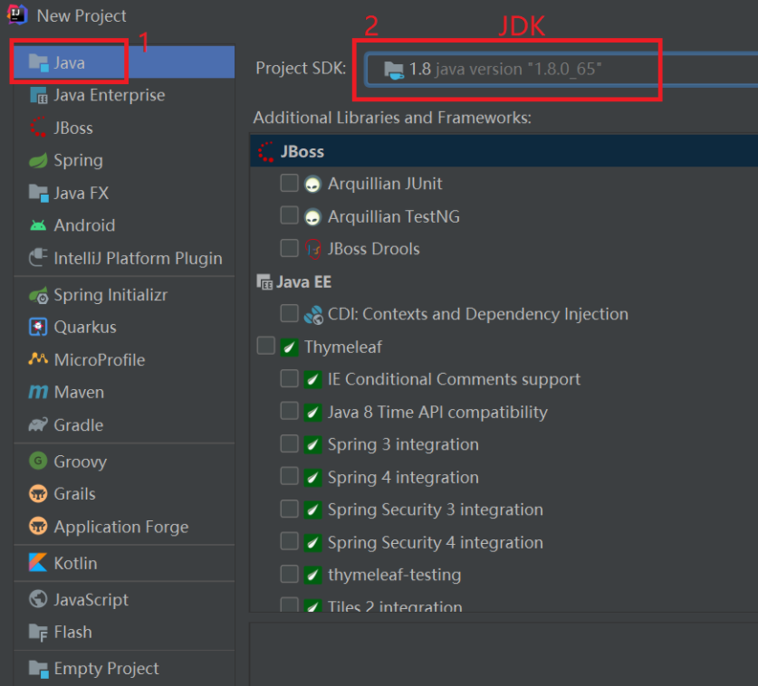

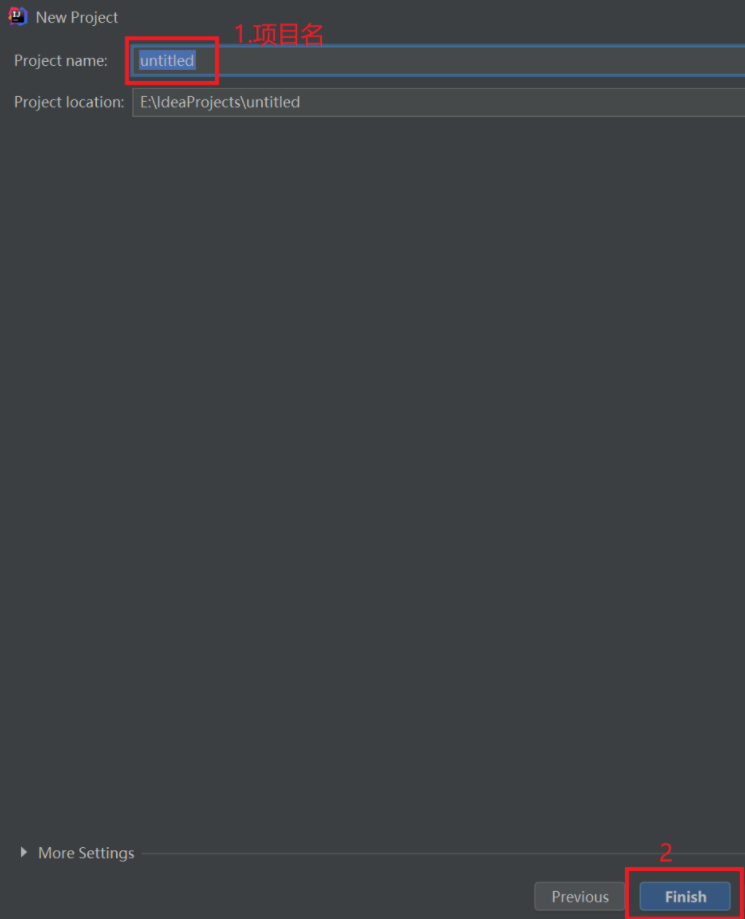

### 2.建模块

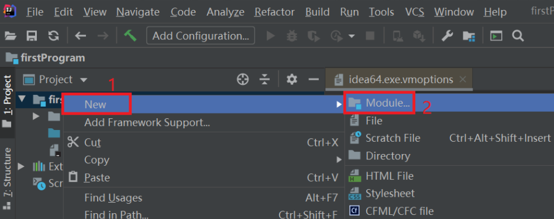

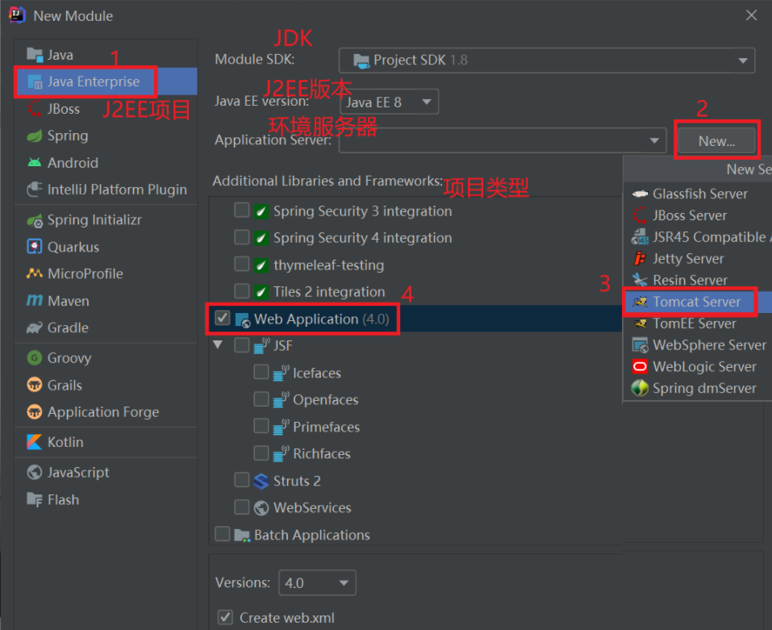

### 3.建文件

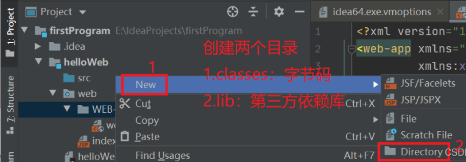

### 4.建包

### 5.建类

创建普通Java类

创建Servlet类

### 6.项目架构配置

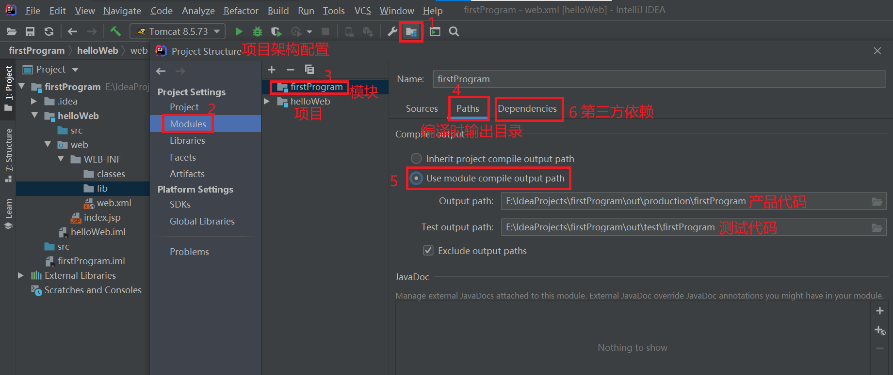

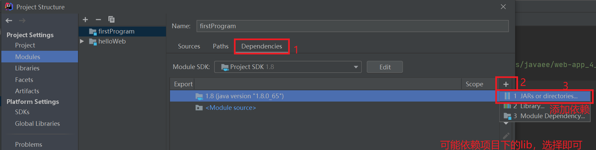

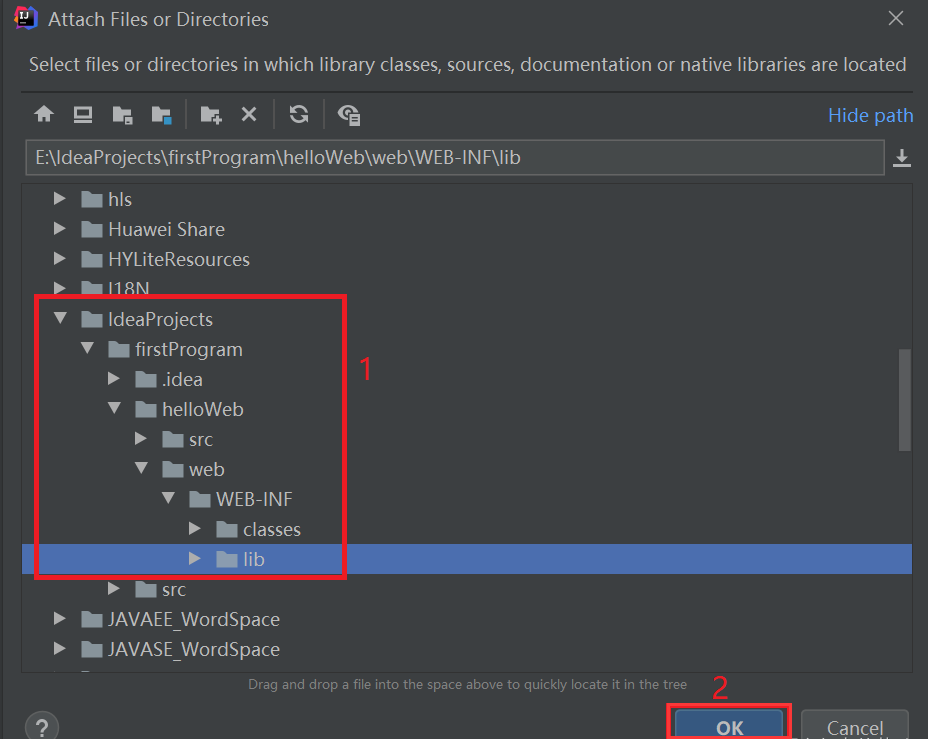

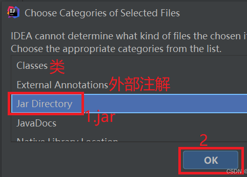

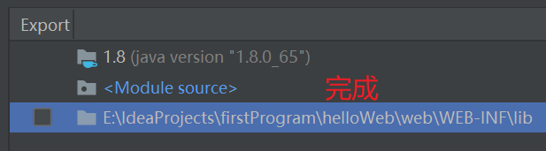

### 7.手动添加服务器

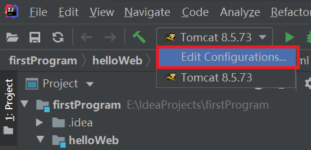

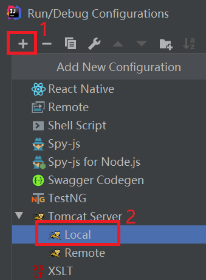

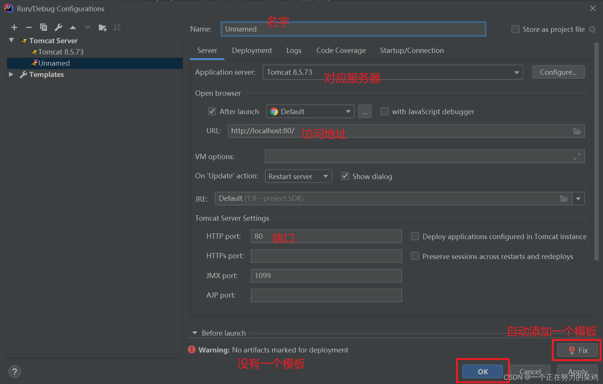

### 8.启动项目

不要多次启动相同端口的服务器，最好每个模块创建一个相同名字的服务器Tomcat，[解决控制台中文乱码问题](https://blog.csdn.net/amingccc/article/details/86503180)

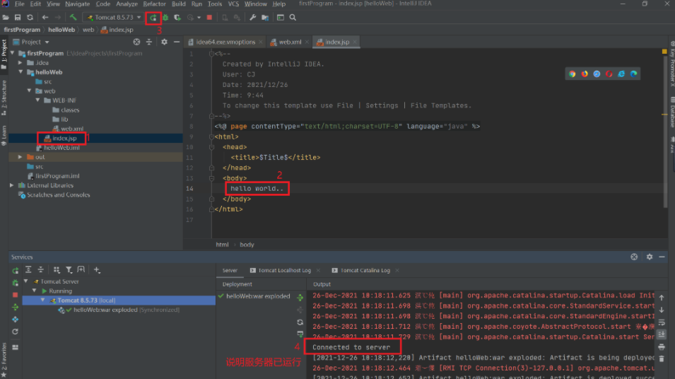

## 三、其他操作

### 1.重写

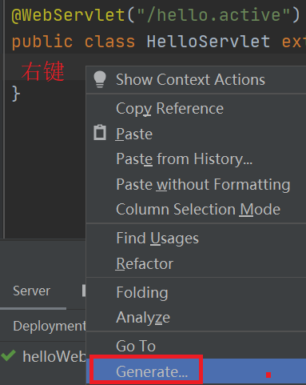

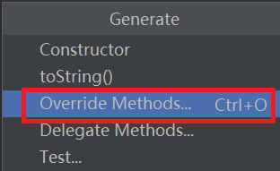

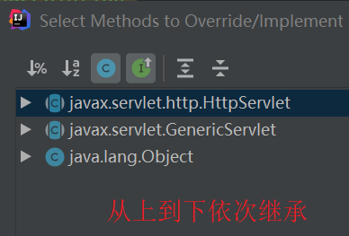

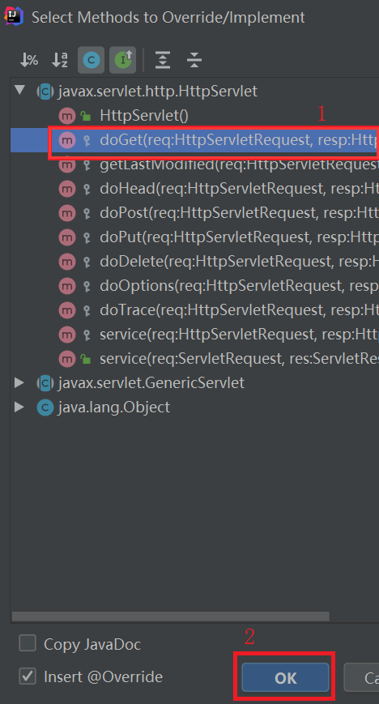

## 四、安装插件

### 1.

