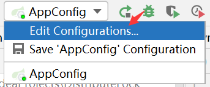

# 分步式锁

## 一、分步式锁概述

### 1.为什么需要分步式锁

对于**单机应用**，所有的请求被分配到当前服务器的JVM内部，然后被映射成OS内的线程，单机对共享变量进行多线程同步，使用Java多线程的18般武艺进行处理完全没问题！后来随着业务发展，需要扩展成集群，将应用部署到不同机器，然后负载均衡，这就变成**多机场景**，即分步式系统


上图可以看到变量A分布于JVM1、JVM2、JVM3三个JVM中，**如何保证对变量A操作的可见性？如何保证变量A在三台JVM的一致性？如何保证三台JVM在对变量A操作的原子性？等**，这都是分步式场景需要考虑的问题，**且分步式系统多线程，单系统内部也多线程**，为了解决这些问题需要一种**跨JVM的互斥机制**，**分布式锁**就诞生了

> 分步式场景CAP理论：任何一个分布式系统都无法同时满足**一致性(Consistency)、可用性(Availability)和分区容错性(Partition tolerance)**，最多只能同时满足两项
>
> 所以很多系统在设计之初就要对这三者做出取舍，在互联网领域的绝大多数的场景中都需要**牺牲强一致性**来换取系统的高可用性，系统往往只需要**保证最终一致性**，只要这个最终时间是在用户可以接受的范围内即可

### 2.分布式锁应该具备哪些条件？

* 互斥，方法同一时间只能被一个机器的一个线程执行
* 高可用、高性能的获取锁和释放锁
* 可重入
* 锁失效机制，防止死锁
* 非阻塞锁，即没有获取到锁将直接返回获取锁失败

### 3.分布式锁的三种实现方式

这三种实现方式有利有弊，**没有最好只有更合适**

* 基于数据库实现分布式锁
* 基于缓存(Redis)实现分布式锁
* 基于Zookeeper实现分布式锁

## 二、测试场景布置

### 1.场景模拟

模拟**抢票**场景，票放在**Redis中通过String类型的自减**实现抢票，若对象复杂可使用Hash类型，**必须防止超买超卖**，同时一步步提升性能，从单机无锁开始一步步向上升级

### 2.场景布置

#### 2.1.新建项目并导包

```java
<parent>
    <groupId>org.springframework.boot</groupId>
    <artifactId>spring-boot-starter-parent</artifactId>
    <version>2.7.0</version>
</parent>

<dependencies>
    <dependency>
        <groupId>org.projectlombok</groupId>
        <artifactId>lombok</artifactId>
    </dependency>

    <dependency>
        <groupId>org.springframework.boot</groupId>
        <artifactId>spring-boot-starter-web</artifactId>
    </dependency>

    <dependency>
        <groupId>org.springframework.boot</groupId>
        <artifactId>spring-boot-starter-data-redis</artifactId>
        <version>2.7.0</version>
    </dependency>
</dependencies>
```

#### 2.2.启动类

```java
@SpringBootApplication
public class AppConfig {
    public static void main(String[] args) {
        SpringApplication.run(AppConfig.class, args);
    }
}
```

#### 2.3.配置文件

application.yml

```java
server:
  port: 8081

spring:
  redis:
    host: localhost #Redis服务器地址
    port: 6379 #Redis服务器连接端口
    database: 0 #Redis数据库索引（默认为0）
    jedis:
      pool:
        max-active: -1 #连接池最大连接数（使用负值表示没有限制）
        max-wait: -1 #连接池最大阻塞等待时间（使用负值表示没有限制）
    timeout: 5000 #连接超时时间（毫秒）
    #连接池中的最大空闲连接
    #spring.redis.jedis.pool.max-idle=8
    # 连接池中的最小空闲连接
    #spring.redis.jedis.pool.min-idle=0

logging:
  level:
    org.apache.zookeeper: off #关闭日志
```

#### 2.4.Redis添加goods键

```
C:\Users\CJ>docker exec -it redis /bin/bash
root@7c89add39495:/data# redis-cli
127.0.0.1:6379> set goods 100
OK
127.0.0.1:6379> get goods
"100"
```

#### 2.5.测试工具AB测

```
D:\develop\apacheAB\Apache24\bin>ab.exe -n 100 -c 20 http://localhost:8081/secKill
```

## 三、单机无锁

### 1.代码

```java
package com.yc.Test01_OneNoLock;

import org.springframework.beans.factory.annotation.Autowired;
import org.springframework.beans.factory.annotation.Value;
import org.springframework.data.redis.core.StringRedisTemplate;
import org.springframework.web.bind.annotation.RequestMapping;
import org.springframework.web.bind.annotation.RestController;

@RestController
public class TicketController {
    @Value("${server.port}")
    private int port;

    @Autowired
    StringRedisTemplate stringRedisTemplate;

    @RequestMapping("/secKill")
    public String secKill() throws Exception {
        try {
            //取出票的数量
            int num = Integer.parseInt(stringRedisTemplate.opsForValue().get("goods"));
            if (num > 0) {//还有票
                stringRedisTemplate.boundValueOps("goods").decrement();
                System.out.println("服务器: " + port + " 抢票成功 " + num);
                return "服务器: " + port + " 抢票成功 " + num;
            } else {//无票
                System.out.println("服务器: " + port + " 抢票失败 ");
                return "服务器: " + port + " 抢票失败 ";
            }
        } catch (Exception e) {
            e.printStackTrace();
            return "异常";
        }
    }
}
```

### 2.启动服务并使用AB测

```
D:\develop\apacheAB\Apache24\bin>ab.exe -n 100 -c 20 http://localhost:8081/secKill
```

截取部分抢票结果，明显发现同一张票出现严重的超买超卖

```
服务器: 8081 抢票成功 100
服务器: 8081 抢票成功 99
服务器: 8081 抢票成功 99
服务器: 8081 抢票成功 99
服务器: 8081 抢票成功 99
服务器: 8081 抢票成功 99
服务器: 8081 抢票成功 99
服务器: 8081 抢票成功 99
服务器: 8081 抢票成功 99
```

### 3.升级思考

<span style="color:#F08080">首先最基本的超买超卖问题都没有解决，首先想到的就是加锁</span>

利用学过的synchronized或ReentrantLock，但这两种锁如何取舍呢？请移步多线程部分详解，此处粗略介绍

* synchronized是重量级锁，ReentrantLock是轻量级、可重入锁，性能更好，所以选择ReentrantLock

## 四、单机加锁

注意goods键的恢复：`set goods 100`

### 1.代码

```java
package com.yc.Test02_OneLock;

import org.springframework.beans.factory.annotation.Autowired;
import org.springframework.beans.factory.annotation.Value;
import org.springframework.data.redis.core.StringRedisTemplate;
import org.springframework.web.bind.annotation.RequestMapping;
import org.springframework.web.bind.annotation.RestController;

import java.util.concurrent.locks.ReentrantLock;

@RestController
public class TicketController {
    @Value("${server.port}")
    private int port;

    @Autowired
    StringRedisTemplate stringRedisTemplate;

    //锁写成全局：Spring默认单例，写到方法内每调用一此都创建一个锁，相当于锁不起作用
    private ReentrantLock lock = new ReentrantLock();

    @RequestMapping("/secKill")
    public String secKill() throws Exception {
        try {
            lock.lock();//加锁
            //取出票的数量
            int num = Integer.parseInt(stringRedisTemplate.opsForValue().get("goods"));
            if (num > 0) {//还有票
                stringRedisTemplate.boundValueOps("goods").decrement();
                System.out.println("服务器: " + port + " 抢票成功 " + num);
                return "服务器: " + port + " 抢票成功 " + num;
            } else {//无票
                System.out.println("服务器: " + port + " 抢票失败 ");
                return "服务器: " + port + " 抢票失败 ";
            }
        } catch (Exception e) {
            e.printStackTrace();
            return "异常";
        } finally {
            lock.unlock();//释放锁
        }
    }
}
```

### 2.启动服务并使用AB测

```
D:\develop\apacheAB\Apache24\bin>ab.exe -n 100 -c 20 http://localhost:8081/secKill
```

查看输出结果发现并未超买超卖，以下只截取部分抢票结果

```
服务器: 8081 抢票成功 100
服务器: 8081 抢票成功 99
服务器: 8081 抢票成功 98
服务器: 8081 抢票成功 97
服务器: 8081 抢票成功 96
服务器: 8081 抢票成功 95
服务器: 8081 抢票成功 94
服务器: 8081 抢票成功 93
服务器: 8081 抢票成功 92
服务器: 8081 抢票成功 91
服务器: 8081 抢票成功 90
```

### 3.错误反省

刚开始俺将**ReentrantLock写在方法内部**，这样每次执行方法时都创建锁，导致ReentrantLock锁失效，所以结果肯定就是开始出现超买超卖，当时我就奇了个怪？？加了锁还给俺超买超卖？？怎么也想不通，后来才发现是这个问题，啊吧啊吧，死都不会错了这个地方！！！最终**将ReentrantLock锁写成全局**，问题解决

### 4.升级思考

<span style="color:#F08080">到这里超买超卖的问题已解决，该考虑如何提升性能了，俺是为啥想到考虑性能问题的呢？其实到这个阶段基础功能已经保障，而且基础功能是在单机环境下，自然而然就要想到性能方面，不放心？那就使用AB测加大访问量再次测试，果不其然，响应极慢</span>

```
D:\develop\apacheAB\Apache24\bin>ab.exe -n 100000 -c 2000 http://localhost:8081/secKill
```

<span style="color:#F08080">响应慢该如何改善呢？俺首先想到响应慢可能是因为单台服务器处理请求的压力过大，知道了原因那还不好解决嘛！当然是多加服务器，减轻单台服务器的压力，新问题来了，每台服务器的访问端口不同咋办啊？总不可能需要客户端记住每台服务器的端口，自然而然想到反向代理，提到反向代理自然而然想到Nginx(正好最近刚学)</span>

## 五、单机加锁+Nginx反向代理

TicketController代码与单机加锁相同，注意goods键的恢复：`set goods 100`

### 1.编写配置文件

此处就做3台服务器，第一台经过以上配置已经完成，接下来配置第二、三台

* application-second.yml

```
server:
  port: 8082
```

* application-third.yml

```
server:
  port: 8083
```

### 2.配置Spring

步骤相同，此处只展示第二台的配置方法




### 3.Nginx配置反向代理

```
#配置文件中，编写upstream负载均衡策略配置
	#server配置时需要知道宿主机ip地址  -->  发现docker提供全局变量host.docker.internal，全局变量中存了宿主机IP，但是不敢确认)
    #为确认宿主机IP，ping host.docker.internal --> 又发现docker中没有装这个命令
    #一次性装好ip addr/ifconfig/ping命令 --> apt update && apt install -y iproute2 && apt install -y net-tools && apt install -y iputils-ping
    #装好后，在nginx中开始ping --> 终于找到宿主机IP
	
	upstream secKill{
		server 192.168.65.2:8081;
		server 192.168.65.2:8082;
		server 192.168.65.2:8083;
	}
	
#配置文件中，配置server
	#防止域名冲突(location.conf中server-name:127.0.0.1已经使用过)
	#添加域名映射 -> C:\Windows\System32\drivers\etc\hosts中做域名映射：127.0.0.1 distributedLock
	
	server{
		listen  80;  #虚拟机服务端口
		server_name distributedLock;  #多个用,分开
		
		location /{
			#地址匹配设置，支持正则匹配，也支持条件匹配，这里是默认请求地址，用户可以location命令对nginx进行动态和静态网页过滤处理
			root   /usr/share/nginx/html; #虚拟主机的网页根目录
			index  index.html index.htm;  #默认访问首页文件
			
			proxy_pass http://secKill; #负载均衡
		}
	}
```

### 4.启动三台服务并使用AB测试

```
D:\develop\apacheAB\Apache24\bin>ab.exe -n 100000 -c 2000 http://distributedLock:81/secKill
```

发现性能提升不少，经过我严密的筛查，发现再次出现超买超卖

### 5.升级思考

<span style="color:#F08080">再次出现超卖超卖的原因是单机锁已经无法使用在分步式场景，所以接下来分别尝试使用三种方式自定义分布式锁</span>

## 六、基于数据库实现分步式锁

### 1.基于表记录的锁

#### 1.1.核心思想

**最简单的方式就是在数据库中创建锁表，通过操作表中的数据来实现，获取锁时向表中添加记录，释放锁时删除该记录**

#### 1.2.实现

①建库：`create database DistributeLock;`

②建表语句如下，可使用IDEA的Database插件

```mysql
use DistributeLock;

SET NAMES utf8;
SET FOREIGN_KEY_CHECKS = 0;

DROP TABLE IF EXISTS `method_lock`;
CREATE TABLE `method_lock` (
	`id` int(11) unsigned NOT NULL AUTO_INCREMENT COMMENT '主键',
	`method_name` varchar(64) NOT NULL COMMENT '锁定的方法名',
	`desc` varchar(255) NOT NULL COMMENT '备注信息',
	PRIMARY KEY (`id`),
	UNIQUE KEY `uidx_method_name` (`method_name`) USING BTREE
) ENGINE=InnoDB AUTO_INCREMENT=3 DEFAULT CHARSET=utf8 COMMENT='锁定中的方法';
```

③**获取锁**：某方法被加锁，则使用该方法名向数据库中插入数据，因为method_name列有唯一约束，所以数据库只会保证一个操作成功

```MYSQL
INSERT INTO method_lock (method_name, desc) VALUES ('methodName', '测试的methodName');
```

④**释放锁**：获取锁后执行操作，操作完后将数据库中该条记录删除

```MYSQL
delete from method_lock where method_name ='methodName';
```

#### 1.3.优缺点

* 数据库的性能直接影响分步式锁的性能
* 不可重入，该方式在释放锁前DB数据一直存在，无法再次成功插入数据，其实这也很好解决，只需再增加一列记录当前获取到锁的机器信息及线程信息，再次获取锁时先查询机器与线程信息是否相同，若相同则直接获取锁
* 没有锁失效，锁在被拥有的过程中服务器宕机，此时锁没有释放，也就是DB内的数据没有被删除，当服务器恢复时一直获取不到锁，解决办法是增加一列记录失效时间，使用定时任务定时清除过期数据
* 非阻塞锁，获取不到锁则直接失败返回，不会尝试再次回去，解决办法是优化代码逻辑，即循环多次获取
* 实现过程中会遇到各种问题，所以基于数据库的锁需要考虑**资源开销以及性能问题**

### 2.乐观锁

#### 2.1.核心思想

**乐观锁乐观的认为锁冲突不会发生，只有在数据库执行更新操作时才检测数据是否冲突，向表中添加一列version用于记录版本，更新之前获取一次，若执行完业务操作之后版本一致则数据更新成功，否则更新失败**

#### 2.2.实现

①在上一张表的基础上添加一列

```mysql
`update_time` timestamp NOT NULL DEFAULT CURRENT_TIMESTAMP ON UPDATE CURRENT_TIMESTAMP,
```

③业务执行前获取`update_time`字段值，待执行完业务后比较`update_time`字段，执行流程如下

```
SELECT method_name,update_time FROM method_lock WHERE id = 1;
执行业务逻辑
UPDATE method_lock SET desc='更新',update_time=newTime WHERE id = 1 AND update_time = oldTime
```

#### 2.3.优缺点

- 不依赖数据库本身的锁机制，所以数据库的性能不会直接影响分步式锁的性能
- 需要增加额外字段，导致数据库冗余
- 高并发情况下给DB带来压力
- **总的来说乐观锁更适合并发量不高，并且写操作不频繁的场景**

### 3.悲观锁

#### 3.1.核心思想

**利用`select for update`数据库的行锁实现悲观锁，开启数据库隐式事务提交，通过查询事件获取锁，commit表示释放锁**

> `select`是无锁的，而`select for update`会加锁(悲观锁)，而且**查询条件不同时锁的类型不同**，当查询条件是**主键索引或唯一索引**则加**行锁**，当查询条件是**普通字段**时加**表锁**

#### 3.2.实现

①开启数据库隐式事务提交

```MYSQL
conn.setAutoCommit(false);
```

②执行业务逻辑前查询数据，因为查询会触发行锁，若查询失败行锁变为表锁，成功查询则执行业务后提交事务

```mysql
SELECT * FROM method_lock WHERE id = 1 FOR UPDATE;
执行业务逻辑
conn.Commit();
```

#### 3.3.优缺点

* 悲观锁可以严格保证数据安全性
* 每次请求时产生额外开销
* 等待锁的请求将被阻塞，高并发下大量请求阻塞影响系统可用性
* 悲观锁使用不当可能发生死锁

## 七、基于缓存(Redis)实现分布式锁

### 1.基于StringRedisTemplate

#### 1.1.主要命令

`setnx key val`：当且仅当`key`不存在时`set key val`，返回1；当`key`存在则什么都不做，返回0

`expire key timeout(min)`：设置过期时间，到达过期时间锁被自动释放，避免死锁

`delete key`：删除`key`，表示释放锁

#### 1.2.核心思想

**获取锁时通过`setnx`加锁，并使用`expire`设置锁过期时间，`val`为随机产生的`UUID`，同时为获取锁设置超时时间，若超过该时间则放弃获取锁，释放锁时判断`UUID`是不是当前客户端，若是则`delete`**

#### 1.3.实现


```
ab.exe -n 100000 -c 2000 http://distributedLock:81/secKill
```


#### 1.4.升级思考

<span style="color:#F08080">以上分布式锁存在锁过期释放，业务没执行完的问题，能不能将锁的过期时间设置得长点来解决此问题呢？显然是不太好的，因为业务的执行时间是不确定的，Redisson的看门狗是比较好的解决方案</span>

### 2.基于Redisson

#### 2.1.核心思想

Redisson解决锁过期释放，业务没执行完的问题，给获得锁得线程开启定时守护线程(看门狗)，每隔一段时间检查锁是否存在，存在则延长锁的过期时间，防止锁过期提前释放


#### 2.2.实现

①导包

```
<dependency>
    <groupId>org.redisson</groupId>
    <artifactId>redisson</artifactId>
    <version>3.7.5</version>
</dependency>
```

②RedissonConfig配置类

```java
package com.yc.Test04_Redis.Redisson;

import org.redisson.Redisson;
import org.redisson.api.RedissonClient;
import org.redisson.config.Config;
import org.springframework.beans.factory.annotation.Value;
import org.springframework.context.annotation.Bean;
import org.springframework.context.annotation.Configuration;
import java.io.IOException;

@Configuration
public class RedissonConfig {
    @Value("${spring.redis.host}")
    private String host;

    @Value("${spring.redis.port}")
    private String port;

    /**
     * RedissonClient,单机模式
     */
    @Bean(destroyMethod = "shutdown")
    public RedissonClient redisson() throws IOException {
        Config config = new Config();
        //config.useSingleServer().setAddress("redis://" + host + ":" + port).setPassword(password);
        config.useSingleServer().setAddress("redis://" + host + ":" + port);
        return Redisson.create(config);
    }
}
```

③TicketController

```java
package com.yc.Test04_Redis.Redisson;

import org.redisson.api.RLock;
import org.redisson.api.RedissonClient;
import org.springframework.beans.factory.annotation.Autowired;
import org.springframework.beans.factory.annotation.Value;
import org.springframework.data.redis.core.StringRedisTemplate;
import org.springframework.web.bind.annotation.RequestMapping;
import org.springframework.web.bind.annotation.RestController;
import java.util.concurrent.TimeUnit;

@RestController
public class TicketController {
    @Value("${server.port}")
    private int port;

    @Autowired
    StringRedisTemplate stringRedisTemplate;

    @Autowired
    RedissonClient redissonClient;

    private String lockName = "lock_goodslock";//锁名称

    @RequestMapping("/secKill")
    public String secKill() throws Exception {
        //定义锁
        RLock lock = redissonClient.getLock(lockName);
        try {
            //lock.lock();
            //尝试加锁,最大等待时间300毫秒，上锁30毫秒自动解锁
            if (lock.tryLock(300, 30, TimeUnit.MILLISECONDS)) {
                int num = Integer.parseInt(stringRedisTemplate.opsForValue().get("goods"));
                if (num > 0) {
                    stringRedisTemplate.boundValueOps("goods").decrement();
                    System.out.println("服务器: " + port + " 抢票成功 " + num);
                    return "服务器: " + port + " 抢票成功 " + num;
                } else {
                    System.out.println("服务器: " + port + " 抢票失败 ");
                    return "服务器: " + port + " 抢票失败 ";
                }
            }
            return "服务器: " + port + " 抢lock失败 ";
        } catch (Exception e) {
            e.printStackTrace();
            return "异常";
        } finally {
            lock.unlock();
        }
    }
}
```


https://www.yht7.com/news/2473


2.Redlock算法
线程一在Redis的master节点上拿到了锁，但是加锁的key还没同步到slave节点，恰好这时master节点发生故障，一个slave节点就会升级为master节点，线程二就可以获取同个key的锁啦，但线程一也已经拿到锁了，锁的安全性就没了


Redlock解决这个问题，即部署多个Redis master以保证它们不会同时宕掉，并且这些master节点是完全相互独立的，相互之间不存在数据同步，实现步骤如下


## 八、基于Zookeeper实现分步式锁

注意goods键的恢复：`set goods 100`

### 1.核心思想

**每个客户端抢票就相当于每个线程获取锁，获取锁就在ZK的/locks目录下创建一个临时有序的节点，创建成功后获取/locks目录下的所有临时节点，判断当前线程的节点序号是不是最小的，若是则获取锁成功，若不是则对当前节点的前一个节点添加监听事件**

> 比如当前线程获取到的节点序号为/locks/seq-00000003，所有的节点列表为[/locks/seq-00000001,/locks/seq-00000002,/locks/seq-00000003]，则对/locks/seq-00000002这个节点添加一个事件监听器

**锁释放则删除该临时节点，后一个节点监听到删除事件则判断自己的序号是不是最小，尝试获取锁**

> 比如/locks/seq-00000001释放了，/locks/seq-00000002监听到事件，此时节点集合为[/locks/seq-00000002,/locks/seq-00000003]，则/locks/seq-00000002为最小序号节点，获取到锁

------

ZK实现分步式锁有两种方式：**保持独占式和顺序有效式**

* **保持独占式**：当客户端获取锁时在/locks下建立节点，/locks下的节点都监听获取到锁的节点，一旦锁被释放，/locks下的节点都监听到该事件，都尝试抢锁，某节点抢到锁后，其他节点重新设置监听事件
* **顺序有效式**：当客户端获取锁时在/locks下建立临时有序节点/lock-000x，每个节点监听上一个节点，当上一个节点被删除时，下一个节点自然的获取到锁，而不是争抢

> 顺序有效式可以防止羊群效应，羊群效应指如果/locks下的子节点监听的都是当前获取到抢票权的节点，一旦当前获取到锁的节点删除则每一个子节点的监听都需要重新设置，及其影响性能

### 2.实现

#### 2.1.导包

```
<dependency>
    <groupId>org.apache.zookeeper</groupId>
    <artifactId>zookeeper</artifactId>
    <version>3.4.6</version>
</dependency>
```

#### 2.2.ZkHelper

```java
package com.yc.Test05_Zookeeper;

import org.apache.zookeeper.WatchedEvent;
import org.apache.zookeeper.Watcher;
import org.apache.zookeeper.ZooKeeper;

import java.io.IOException;
import java.util.concurrent.CountDownLatch;

/**
 * ZK连接帮助类——countdownlatch用于阻塞主线程，等待ZK连接上后再接触阻塞
 * ZK通过监视器回调回复连接状态，一旦客户端与ZK连接，监视器回调起作用
 * 回调起作用标志ZK连接完毕，借助主线程阻塞
 */

public class ZkHelper {
    private static String connectString = "localhost:2181";
    private static int sessionTimeout = 9000;
    private static ZooKeeper zooKeeper = null;
    final CountDownLatch countDownLatch = new CountDownLatch(1);//阻塞主线程

    public ZooKeeper connect() throws InterruptedException, IOException {
        System.out.println("ZK客户端初始化");
        zooKeeper = new ZooKeeper(connectString, sessionTimeout, new Watcher() {
            @Override
            public void process(WatchedEvent event) {
                if (event.getState() == Event.KeeperState.SyncConnected) {
                    System.out.println("ZK客户端建立连接");
                    countDownLatch.countDown();
                }
            }
        });
        countDownLatch.await();
        return zooKeeper;
    }

    public void close() throws InterruptedException {
        zooKeeper.close();
    }

    public String getConnectString() {
        return connectString;
    }
}
```

#### 2.3.ZKLock

```java
package com.yc.Test05_Zookeeper;

import org.apache.zookeeper.*;
import org.apache.zookeeper.data.Stat;
import java.io.IOException;
import java.util.Collections;
import java.util.List;
import java.util.concurrent.CountDownLatch;

public class ZKLock {
    private ZooKeeper zooKeeper;
    private int sessionTimeOut = 2000;
    private CountDownLatch latch = new CountDownLatch(1);//zk连接等待
    private CountDownLatch waitLock = new CountDownLatch(1);//等待前一个节点被删除，然后获取锁
    private String lock = "/locks";//根节点
    private String preNode;//等待的上一个节点
    private String currentNode;//当前获取到锁的节点

    public ZKLock(String connectionStr) throws IOException, InterruptedException, KeeperException {
        //1.连接zookeeper，需要阻塞，防止主线程运行太快，监听是否连接到zookeeper，连接到给一个提示
        zooKeeper = new ZooKeeper(connectionStr, sessionTimeOut, new Watcher() {
            @Override
            public void process(WatchedEvent event) {
                if (event.getState() == Event.KeeperState.SyncConnected) {//连接到zk
                    //System.out.println("连接zk成功");
                    latch.countDown();
                }
                if (event.getType() == Event.EventType.NodeDeleted && event.getPath().equals(preNode)) {//子节点删除事件，且被删除的是前一个节点
                    waitLock.countDown();
                }
            }
        });
        //阻塞主线程，等待创建节点完成后解除阻塞
        latch.await();
        //2.看是否存在/locks节点(持久节点)，没有则创建
        Stat stat = zooKeeper.exists(lock, false);
        if (stat == null) {
            zooKeeper.create(lock, "locks".getBytes(), ZooDefs.Ids.OPEN_ACL_UNSAFE, CreateMode.PERSISTENT);
        }
    }

    public void lock() {
        try {
            //1.创建临时有序节点到/locks,记录节点--全局currentNode
            currentNode = zooKeeper.create(lock + "/lock-", null, ZooDefs.Ids.OPEN_ACL_UNSAFE, CreateMode.EPHEMERAL_SEQUENTIAL);
            //2.获取/locks下所有子节点列表
            List<String> list = zooKeeper.getChildren(lock, false);
            //3.判断子节点长度，长度=1说明只有一个节点，直接获取锁返回
            if (list.size() == 1) {
                //System.out.println("没有客户端争抢锁，直接拿到锁返回");
                return;
            }
            //4.长度>1就表示有多个子节点，取出所有子节点，排序，取出序列最小的节点获取锁
            Collections.sort(list);
            //lock-00000x
            String curNode = currentNode.substring((lock + "/").length());
            //获取当前节点在排好序的子节点list中的位置
            int index = list.indexOf(curNode);
            if (index == 0) {
                //System.out.println("没有客户端争抢锁，直接拿到锁返回");
                return;
            }

            //运行到此处表示当前服务器一定需要等待
            //5.此时找到这个节点的上一个序号节点进行监听
            preNode = lock + "/" + list.get(index - 1);
            //开启前一个节点的监听通知机制——对应zookeeper创建中的监听，知道前一个节点删除，且前一个节点是当前服务器才解除阻塞
            zooKeeper.getData(preNode, true, new Stat());
            waitLock.await();
            return;
        } catch (KeeperException e) {
            e.printStackTrace();
        } catch (InterruptedException e) {
            e.printStackTrace();
        }
    }

    public void unlock() {
        //1.删除当前持有锁的节点--全局currentNode
        try {
            zooKeeper.delete(currentNode, -1);
        } catch (InterruptedException e) {
            e.printStackTrace();
        } catch (KeeperException e) {
            e.printStackTrace();
        }
    }
}
```

#### 2.4.TicketController

```java
package com.yc.Test05_Zookeeper;

import org.springframework.beans.factory.annotation.Autowired;
import org.springframework.beans.factory.annotation.Value;
import org.springframework.data.redis.core.StringRedisTemplate;
import org.springframework.web.bind.annotation.RequestMapping;
import org.springframework.web.bind.annotation.RestController;

@RestController
public class TicketController {
    @Value("${server.port}")
    private int port;

    @Autowired
    StringRedisTemplate stringRedisTemplate;

    @RequestMapping("/secKill")
    public String secKill() throws Exception {
        //每个请求都创建一把可重入锁，分步式锁这里有多把没关系，zookeeper中的节点只有一个
        ZKLock lock = new ZKLock("localhost:2181");
        try {
            lock.lock();

            //取出票的数量
            int num = Integer.parseInt(stringRedisTemplate.opsForValue().get("goods"));
            if (num > 0) {//还有票
                stringRedisTemplate.boundValueOps("goods").decrement();
                System.out.println("服务器: " + port + " 抢票成功 " + num);
                return "服务器: " + port + " 抢票成功 " + num;
            } else {//无票
                System.out.println("服务器: " + port + " 抢票失败 ");
                return "服务器: " + port + " 抢票失败 ";
            }
        } catch (Exception e) {
            e.printStackTrace();
            return "异常";
        } finally {
            lock.unlock();
        }
    }
}
```

### 3.优缺点

* **顺序有效式自定义分布式锁未实现可重入**，性能肯定不佳

## 九、Curator框架锁

### 1.实现

#### 1.1.导包

```java
<dependency>
    <groupId>org.apache.curator</groupId>
    <artifactId>curator-recipes</artifactId>
    <version>4.0.1</version>
    <exclusions>
        <exclusion>
            <groupId>slf4j-reload4j</groupId>
            <artifactId>org.slf4j</artifactId>
        </exclusion>
    </exclusions>
</dependency>
```

#### 1.2.TicketController

```java
package com.yc.Test06_InterProcessMutex;

import org.apache.curator.framework.CuratorFramework;
import org.apache.curator.framework.CuratorFrameworkFactory;
import org.apache.curator.framework.recipes.locks.InterProcessMutex;
import org.apache.curator.retry.ExponentialBackoffRetry;
import org.springframework.beans.factory.annotation.Autowired;
import org.springframework.beans.factory.annotation.Value;
import org.springframework.data.redis.core.StringRedisTemplate;
import org.springframework.web.bind.annotation.RequestMapping;
import org.springframework.web.bind.annotation.RestController;

@RestController
public class TicketController {
    @Value("${server.port}")
    private int port;

    @Autowired
    StringRedisTemplate stringRedisTemplate;

    //框架锁：可重入+zk连接池--性能好
    InterProcessMutex lock = new InterProcessMutex(getZk(), "/locks");

    @RequestMapping("/secKill")
    public String secKill() throws Exception {
        try {
            lock.acquire();

            int num = Integer.parseInt(stringRedisTemplate.opsForValue().get("goods"));
            if (num > 0) {
                stringRedisTemplate.boundValueOps("goods").decrement();
                System.out.println("服务器: " + port + " 抢票成功 " + num);
                return "服务器: " + port + " 抢票成功 " + num;
            } else {
                System.out.println("服务器: " + port + " 抢票失败 ");
                return "服务器: " + port + " 抢票失败 ";
            }
        } catch (Exception e) {
            e.printStackTrace();
            return "异常";
        } finally {
            lock.release();
        }
    }

    public static CuratorFramework getZk() {
        ExponentialBackoffRetry policy = new ExponentialBackoffRetry(3000, 3);
        CuratorFramework client = CuratorFrameworkFactory.builder()
                .connectString("localhost:2181")
                .connectionTimeoutMs(2000)
                .sessionTimeoutMs(2000)
                .retryPolicy(policy)
                .build();
        client.start();
        return client;
    }
}
```

### 2.优缺点

* 可重入
* ZK连接池


