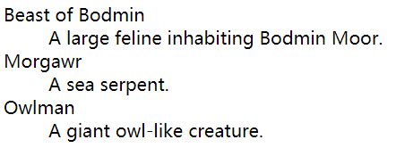
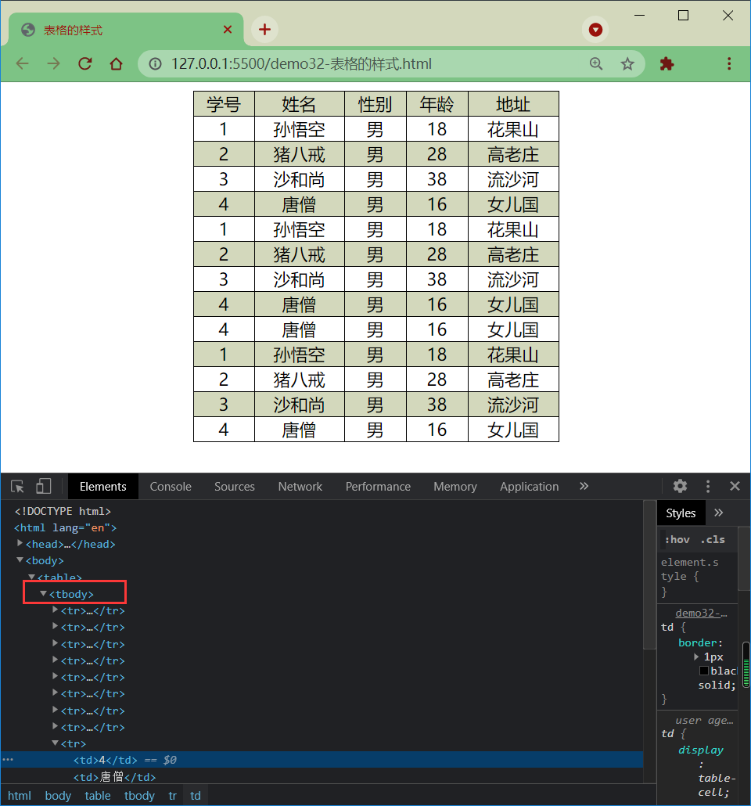
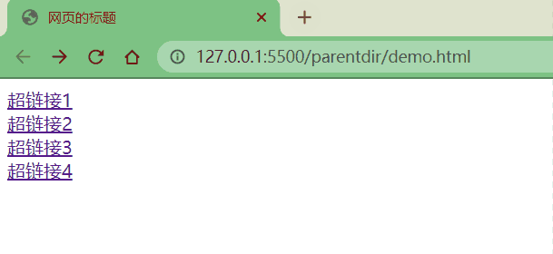
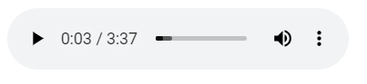
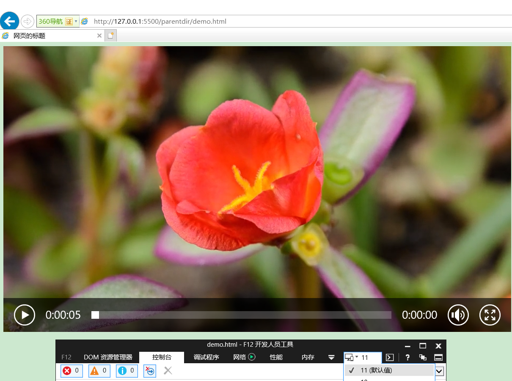

# HTML

## 一、什么是HTML？

HTML(Hypertext Markup Language)**超文本标记语言**，使用**标签**的形式来标识网页中不同的组成部分，超文本指的就是**超链接**，使用超链接的形式来实现页面间的跳转

HTML是不严格的语言，不区分大小写；不需要编译，通过浏览器个直接运行，更多可参考[菜鸟教程](https://www.runoob.com/html/html-tutorial.html)

## 二、HTML5基本架构

```html
<!DOCTYPE html><!--文档声明，声明当前网页的版本-->
<html><!--html容器根标签，网页中的所有内容都要写根标签里边-->
	<head><!--网页头部标签：设置网页相关信息，头部的内容不会在网页中出现，用于帮助浏览器或搜索引擎解析网页-->
		<mate charset="utf-8"><!--mate标签用于规定网页元数据，此处是规定编码格式，防止乱码-->
		<meta name="keywords" content="gg,hh" /><!--搜索时的关键字-->
		<title>标题</title><!--title中的内容会显示在浏览器的标题栏，搜索引擎会主要根据title中的内容来判断网页的主要内容-->
	</head>
	<body><!--body是htm1的子元素，表示网页的主体，网页中所有的可见内容都应该写在body里-->
		<i><b>hello word</b></i>
	</body>
</html>
```

## 三、字符实体

有些时候在HTML中不能直接书写一些特殊符号，如多个连续的空格，如果我们需要在网页中书写这些特殊的符号，则需要使用HTML中的实体，即转义字符，实体的语法是`&实体的名字`

|  实体名称  | 显示结果 |   描述   |
| :--------: | :------: | :------: |
|  `&nbsp;`  |   ` `    |   空格   |
|   `&gt;`   |    >     |  大于号  |
|   `&lt;`   |    <     |  小于号  |
|  `&amp;`   |    &     |    与    |
|  `&copy;`  |    ©     |   版权   |
|  `&reg;`   |    ®     | 注册商标 |
| `&trade;`  |    ™     |   商标   |
| `&times;`  |    ×     |   乘号   |
| `&divide;` |    ÷     |   除号   |
| `&iquest;` |    ¿     |  倒问号  |

更多的字符实体可参考[菜鸟教程](https://www.runoob.com/html/html-tutorial.html)

## 四、meta

以京东网站为例，右键单击选择`查看网页源代码`，看到`head`标签下的`meta`标签如下

```html
<meta charset="utf8" version='1'/>
<meta name="viewport" content="width=device-width, initial-scale=1.0, maximum-scale=1.0, user-scalable=yes"/>
<meta name="description" content="京东JD.COM-专业的综合网上购物商城,销售家电、数码通讯、电脑、家居百货、服装服饰、母婴、图书、食品等数万个品牌优质商品.便捷、诚信的服务，为您提供愉悦的网上购物体验!"/>
<meta name="Keywords" content="网上购物,网上商城,手机,笔记本,电脑,MP3,CD,VCD,DV,相机,数码,配件,手表,存储卡,京东"/>
```

`meta`主要用于设置网页中的一些**元数据**，元数据并不是给用户看的，可设置的元数据内容如下\

* `charset`：网页的字符集

* `name`：数据的名称

  * `keywords`：网站的关键字，可以同时指定多个关键字，关键字间使用`,`隔开

  * `description`：网站的描述信息

    

* `content`：数据的内容，会作为搜索结果的超链接上的文字显示

* `http-equiv`：提供的信息相当于一个类似名称的HTTP头所能提供的信息

  * `content-security-policy`：为当前页面定义一个内容策略，**内容策略主要指定允许的服务器来源和脚本端点**，助于防范跨站脚本攻击

  * `content-type`：声明文档的MIME类型和字符编码，如果指定则`content`属性必须有`text/html; charset=utf-8`的值，相当于指定`charset`属性的`<meta>`元素，注意只能在使用`text/html`的文档中使用

  * `default-style`：设置默认的CSS样式表集的名称

  * `x-ua-compatible`： 如果指定则内容属性必须有`IE=edge`的值，用户代理被要求忽略这个pragma

  * `refresh`：指定页面重新加载及重定向的方式，直到页面应该被重新加载的秒数，秒数是在`content`标签中设置的正整数，跳转位置是在`content`中设置的`url`

    ```html
    <meta charset="utf-8">
    <!-- Redirect page after 3 seconds -->
    <meta http-equiv="refresh" content="3;url=https://www.mozilla.org">
    ```

    

更多的可参考[菜鸟教程](https://www.runoob.com/html/html-tutorial.html)

## 五、语义标签

### 1.块元素(换行)

在网页中一般通过块元素来对页面进行布局

|                      标签                      |  作用  |                             描述                             |
| :--------------------------------------------: | :----: | :----------------------------------------------------------: |
| `<h1>`、`<h2>`、`<h3>`、`<h4>`、`<h5>`、`<h6>` |  标题  | 一共六级标题，从`h1~h6`重要性递减，`h1`在网页中的重要性仅次于`title`标签，一般情况下一个页面中只会有一个`h1` |
|                   `<hgroup>`                   | 标题组 |          多层次的标题，它将一组`<h1>~<h6>`元素分组           |
|                     `<p>`                      |  段落  |             由空行或第一行缩进将相邻的文本块分开             |
|                 `<blockquote>`                 | 长引文 | 用缩进表示所包含文本，可以用`cite`属性表示引文来源，用`<cite>`元素表示来源的文本表述 |

### 2.行内元素(不换行)

行内元素主要用来包裹文字，一般情况下会在块元素中放行内元素，而不会在行内元素中放块元素

|    标签    |  作用  |                             描述                             |
| :--------: | :----: | :----------------------------------------------------------: |
|   `<q>`    | 短引文 |                 用于不需要段落分隔的短引文；                 |
|   `<br>`   |  换行  |                                                              |
|   `<em>`   |  强调  | `<em>`元素可以嵌套，每一级嵌套表示更高的强调程度，`<i>`元素效果与它相同，不过`<i>`不属于语义标签 |
| `<strong>` |  重要  | 表示重要性、严肃性或紧迫性，浏览器通常以粗体字呈现内容，`<b>`元素效果与它相同，不过`<b>`不属于语义标签 |

更多的可参考[菜鸟教程](https://www.runoob.com/html/html-tutorial.html)

## 六、布局标签

|    标签     |                        描述                        |
| :---------: | :------------------------------------------------: |
| `<header>`  |                  网页的头部，页眉                  |
| `<footer>`  |                  网页的底部，页脚                  |
|  `<main>`   |     网页的主体部分，一个页面中只会有一个`main`     |
|   `<nav>`   |                    网页中的导航                    |
|  `<aside>`  |             主体相关的其他内容，侧边栏             |
| `<article>` |                     独立的文章                     |
| `<section>` |   独立的区块，以上标签都无法表示时使用`section`    |
|   `<div>`   |     块元素，没有任何的语义，就用来表示一个区块     |
|  `<span>`   | 行内元素，没有任何的语义，一般用于在网页中选中文字 |


## 七、列表

### 1.有序列表

使用`ol`标签来创建有序列表，使用`li`表示列表项，例如

```html
<ol>
    <li>Mix flour, baking powder, sugar, and salt.</li>
    <li>In another bowl, mix eggs, milk, and oil.</li>
    <li>Stir both mixtures together.</li>
    <li>Fill muffin tray 3/4 full.</li>
    <li>Bake for 20 minutes.</li>
</ol>
```


### 2.无序元素

使用`ul`标签来创建无序列表，使用`li`表示列表项

```html
<ul>
    <li>Milk</li>
    <li>Cheese
        <ul>
            <li>Blue cheese
                <ul>
                    <li>Sweet blue cheese</li>
                    <li>Sour blue cheese</li>
                </ul>
            </li>
            <li>Feta</li>
        </ul>
    </li>
</ul>
```


### 3.定义列表

使用`dl`标签来创建定义列表，使用`dt`表示定义的内容，使用`dd`来对内容进行解释说明

```html
<dl>
    <dt>Beast of Bodmin</dt>
    <dd>A large feline inhabiting Bodmin Moor.</dd>

    <dt>Morgawr</dt>
    <dd>A sea serpent.</dd>

    <dt>Owlman</dt>
    <dd>A giant owl-like creature.</dd>
</dl>
```



## 八、表格

### 1.表格

`table`中使用`tr`表示表格中的一行，在`tr`中使用`td`表示一个单元格，`rowspan`表示纵向的合并单元格，`colspan`横向的合并单元格

```html
<table border="1">：表格  border：有表格线
	<tr>：行
		<td bgcolor="单元格颜色 " rowspan="合并行的数量" colspan="合并列的数量"></td>：行内的列
	</tr>

	<tr>：行
		<td></td>：行内的列
	</tr>
</table>
```

### 2.长表格

可以将一个表格分成三个部分，即头部`thead`、主体`tbody`、底部`tfoot`，`th`表示头部的单元格

```html
<table>
    <thead>
        <tr>
            <td>日期</td>
            <td>收入</td>
            <td>支出</td>
            <td>合计</td>
        </tr>
    </thead>
    <tbody>
        <tr>
            <td>2000.1.1</td>
            <td>500</td>
            <td>200</td>
            <td>300</td>
        </tr>
        <tr>
            <td>2000.1.1</td>
            <td>500</td>
            <td>200</td>
            <td>300</td>
        </tr>
        <tr>
            <td>2000.1.1</td>
            <td>500</td>
            <td>200</td>
            <td>300</td>
        </tr>
    </tbody>
    <tfoot>
        <tr>
            <td></td>
            <td></td>
            <td>合计</td>
            <td>1200</td>
        </tr>
    </tfoot>
</table>
```

### 3.表格的样式

```html
<table>
    <tr>
        <td>学号</td>
        <td>姓名</td>
        <td>性别</td>
        <td>年龄</td>
        <td>地址</td>
    </tr>
    <tr>
        <td>1</td>
        <td>孙悟空</td>
        <td>男</td>
        <td>18</td>
        <td>花果山</td>
    </tr>
    <tr>
        <td>2</td>
        <td>猪八戒</td>
        <td>男</td>
        <td>28</td>
        <td>高老庄</td>
    </tr>
    <tr>
        <td>3</td>
        <td>沙和尚</td>
        <td>男</td>
        <td>38</td>
        <td>流沙河</td>
    </tr>
    <tr>
        <td>4</td>
        <td>唐僧</td>
        <td>男</td>
        <td>16</td>
        <td>女儿国</td>
    </tr>
    <tr>
        <td>1</td>
        <td>孙悟空</td>
        <td>男</td>
        <td>18</td>
        <td>花果山</td>
    </tr>
    <tr>
        <td>2</td>
        <td>猪八戒</td>
        <td>男</td>
        <td>28</td>
        <td>高老庄</td>
    </tr>
    <tr>
        <td>3</td>
        <td>沙和尚</td>
        <td>男</td>
        <td>38</td>
        <td>流沙河</td>
    </tr>
    <tr>
        <td>4</td>
        <td>唐僧</td>
        <td>男</td>
        <td>16</td>
        <td>女儿国</td>
    </tr>
    <tr>
        <td>4</td>
        <td>唐僧</td>
        <td>男</td>
        <td>16</td>
        <td>女儿国</td>
    </tr>
    <tr>
        <td>1</td>
        <td>孙悟空</td>
        <td>男</td>
        <td>18</td>
        <td>花果山</td>
    </tr>
    <tr>
        <td>2</td>
        <td>猪八戒</td>
        <td>男</td>
        <td>28</td>
        <td>高老庄</td>
    </tr>
    <tr>
        <td>3</td>
        <td>沙和尚</td>
        <td>男</td>
        <td>38</td>
        <td>流沙河</td>
    </tr>
    <tr>
        <td>4</td>
        <td>唐僧</td>
        <td>男</td>
        <td>16</td>
        <td>女儿国</td>
    </tr>
</table>
```

```css
table {
    width: 50%;
    margin: 0 auto;
    border: 1px black solid;

    /* border-spacing：指定边框之间的距离；边框之间虽然没有距离了，但是实际上是两条边框的和，看起来是变粗了 */
    /* border-spacing: 0; */

    /*border-collapse:collapse；设置边框的合并；真正的将两条边框合并成一条边框 */
    border-collapse: collapse;
    
    /* 默认情况下元素在td中是垂直居中的，可以通过vectical-align来修改 */
    vertical-align: middle;
    text-align: center;
}

/* 如果表格中没有使用tbody而是直接使用tr，那么浏览器会自动创建一个tbody，并且将tr全都放到tbody中
   所以说，tr不是table的子元素 */
tbody tr:nth-child(odd) {
    background-color: rgb(211, 216, 188);
}

td {
    border: 1px black solid;
}
```



## 九、超链接

**超链接可以让我们从一个页面跳转到其他页面，或者是当前页面的其他的位置**；使用`a`标签来定义超链接，`href`属性指定跳转的目标路径；值可以是一个外部网站的地址，也可以写一个内部页面的地址；超链接是也是一个行内元素，在`a`标签中可以嵌套除它自身外的任何元素

### 1.外部地址

```html
<ul>
  <li><a href="https://www.baidu.com">Website</a></li>
  <li><a href="mailto:example@outlook.com">Email</a></li>
  <li><a href="tel:+123456789">Phone</a></li>
</ul>
```


### 2.内部地址

当我们需要跳转一个服务器内部的页面时，一般我们都会使用相对路径，会以`./`或`../`开头

- `./` 表示当前文件所在目录，可以省略不写
- `../`表示当前文件所在目录的上一级目录

```html
<a href="./test1.html">超链接1</a><br>
<a href="../test2.html">超链接2</a><br>
<a href="./test3/test3.html">超链接3</a><br>
<a href="../test4/test4.html">超链接4</a>
```



### 3.新建页面

`target`属性用来指定超链接打开的位置可选值

- `_self`在当前页面中打开超链接，默认值
- `_blank`在新建页面中打开超链接

```html
<a href="./test1.html">超链接1——默认</a><br>
<a href="./test1.html" target="_self">超链接1——当前页面</a><br>
<a href="./test1.html" target="_blank">超链接1——新建页面</a><br>
```


### 4.锚点跳转

可以使用`javascript:void(0);`来作为`href`的属性，此时点击这个超链接什么也不会发生

可以将`#`作为超链接的路径的占位符使用

可以直接将超链接的`href`属性设置为`#`，这样点击超链接以后页面不会发生跳转，而是转到当前页面的顶部的位置

可以跳转到页面的指定位置(锚点)，只需将`href`属性设置`#`目标元素的`id`属性值(唯一不重复)

```html
<p> 汉皇重色思倾国，御宇多年求不得。</p>
<p> 杨家有女初长成，养在深闺人未识。 </p>
<p> 天生丽质难自弃，一朝选在君王侧。 </p>
<p><a id="Anchor1" href="#Anchor2"> 回眸一笑百媚生，六宫粉黛无颜色。</a></p>
<p> 春寒赐浴华清池，温泉水滑洗凝脂。 </p>
<p> 侍儿扶起娇无力，始是新承恩泽时。 </p>
<p> 云鬓花颜金步摇，芙蓉帐暖度春宵。 </p>
<p> 春宵苦短日高起，从此君王不早朝。 </p>
<p> 承欢侍宴无闲暇，春从春游夜专夜。 </p>
<p><a id="Anchor2" href="#Anchor3"> 后宫佳丽三千人，三千宠爱在一身。</a></p>
<p> 金屋妆成娇侍夜，玉楼宴罢醉和春。 </p>
<p> 姊妹弟兄皆列土，可怜光彩生门户。 </p>
<p> 遂令天下父母心，不重生男重生女。 </p>
<p> 骊宫高处入青云，仙乐风飘处处闻。 </p>
<p> 缓歌慢舞凝丝竹，尽日君王看不足。 </p>
<p> 渔阳鼙鼓动地来，惊破霓裳羽衣曲。 </p>
<p> 九重城阙烟尘生，千乘万骑西南行。 </p>
<p> 翠华摇摇行复止，西出都门百余里。 </p>
<p> 六军不发无奈何，宛转蛾眉马前死。 </p>
<p> 花钿委地无人收，翠翘金雀玉搔头。 </p>
<p> 君王掩面救不得，回看血泪相和流。 </p>
<p> 黄埃散漫风萧索，云栈萦纡登剑阁。 </p>
<p> 峨嵋山下少人行，旌旗无光日色薄。 </p>
<p> 蜀江水碧蜀山青，圣主朝朝暮暮情。 </p>
<p> 行宫见月伤心色，夜雨闻铃肠断声。 </p>
<p> 天旋地转回龙驭，到此踌躇不能去。 </p>
<p> 马嵬坡下泥土中，不见玉颜空死处。 </p>
<p> 君臣相顾尽沾衣，东望都门信马归。 </p>
<p> 归来池苑皆依旧，太液芙蓉未央柳。 </p>
<p> 芙蓉如面柳如眉，对此如何不泪垂。 </p>
<p> 春风桃李花开夜，秋雨梧桐叶落时。 </p>
<p> 西宫南苑多秋草，落叶满阶红不扫。 </p>
<p> 梨园弟子白发新，椒房阿监青娥老。 </p>
<p> 夕殿萤飞思悄然，孤灯挑尽未成眠。 </p>
<p><a id="Anchor3" href="#Anchor4"> 迟迟钟鼓初长夜，耿耿星河欲曙天。 </a></p>
<p> 鸳鸯瓦冷霜华重，翡翠衾寒谁与共。 </p>
<p> 悠悠生死别经年，魂魄不曾来入梦。 </p>
<p> 临邛道士鸿都客，能以精诚致魂魄。 </p>
<p> 为感君王辗转思，遂教方士殷勤觅。 </p>
<p> 排空驭气奔如电，升天入地求之遍。 </p>
<p> 上穷碧落下黄泉，两处茫茫皆不见。 </p>
<p> 忽闻海上有仙山，山在虚无缥渺间。 </p>
<p> 楼阁玲珑五云起，其中绰约多仙子。 </p>
<p> 中有一人字太真，雪肤花貌参差是。 </p>
<p> 金阙西厢叩玉扃，转教小玉报双成。 </p>
<p> 闻道汉家天子使，九华帐里梦魂惊。 </p>
<p> 揽衣推枕起徘徊，珠箔银屏迤逦开。 </p>
<p> 云鬓半偏新睡觉，花冠不整下堂来。 </p>
<p><a id="Anchor4" href="#Anchor5"> 风吹仙袂飘飖举，犹似霓裳羽衣舞。 </a></p>
<p> 玉容寂寞泪阑干，梨花一枝春带雨。 </p>
<p> 含情凝睇谢君王，一别音容两渺茫。 </p>
<p> 昭阳殿里恩爱绝，蓬莱宫中日月长。 </p>
<p> 回头下望人寰处，不见长安见尘雾。 </p>
<p> 惟将旧物表深情，钿合金钗寄将去。 </p>
<p> 钗留一股合一扇，钗擘黄金合分钿。 </p>
<p> 但令心似金钿坚，天上人间会相见。 </p>
<p> 临别殷勤重寄词，词中有誓两心知。 </p>
<p> 七月七日长生殿，夜半无人私语时。 </p>
<p><a id="Anchor5" href="#Anchor6"> 在天愿作比翼鸟，在地愿为连理枝。 </a></p>
<p> 天长地久有时尽，此恨绵绵无绝期。 </p>

<!-- Heading to link to -->
<a href="#">回到顶部</a>
```


## 十、图片

`img`标签是一个自结束标签，这种元素属于替换元素，即块和行内元素之间，具有两种元素的特点，属性主要有`src`属性指定的是外部图片的路径、`alt`图片的描述、`width`图片的宽度、`height`图片的高度(宽度和高度中如果只修改了一个则另一个会等比例缩放)

```html

```

> 图片的格式主要与如下几类
>
> * `jpeg(jpg)`：支持的颜色比较丰富、不支持透明效果、不支持动图、一般用来显示照片
> * `gif`：支持的颜色比较单一、支持简单透明、支持动图
> * `png`：支持的颜色丰富、支持复杂透明、不支持动图、专为网页而生
> * `webp`：谷歌新推出的专门用来表示网页中的图片的一种格式，具备其他图片格式的所有优点，而且文件还特别的小，缺点是兼容性不好
> * `base64`：图片使用`base64`编码，这样可以将图片转换为字符，通过字符的形式来引入图片
>
> 图片效果一样的，选文件小的；图片效果不一样的，选图片效果好的；**尽可能的兼顾和平衡图片效果和文件大小**

## 十一、内联格式

内联框架`iframe`，用于向当前页面中引入一个其他页面

- `src`指定要引入的网页的路径
- `frameborder`指定内联框架的边框

```html
<iframe src="https://www.qq.com" width="800" height="600" frameborder="0"></iframe>
```


## 十二、音视频

### 1.音频

`audio`标签用来向页面中引入一个外部的音频文件，音视频文件引入时，默认情况下不允许用户自己控制播放停止

* `controls`是否允许用户控制播放
* `autoplay`音频文件是否自动播放，如果设置了`autoplay`，则音乐在打开页面时会自动播放，但是目前来讲大部分浏览器都不会自动对音乐进行播放
* `loop`音乐是否循环播放

```html
<audio src="./source/audio.mp3" controls autoplay loop></audio>
```



除了通过`src`属性来指定外部文件的路径以外，还可以通过`<source>`元素来指定文件的路径

```html
<audio controls autoplay loop>
    对不起，您的浏览器不支持播放音频！请升级浏览器！
	<source src="./source/audio.mp3">
	<source src="./source/audio.ogg">
</audio>
```

IE11下能够正常播放，IE8下出现我们自定义的提示信息


IE8下不支持`audio`元素，但是可以使用`<embed>`元素在文档中的指定位置嵌入外部内容，这个内容是由外部应用程序或其他互动内容的来源提供的，如浏览器插件

```html
<embed src="./source/audio.mp3">
```


### 2.视频

使用`video`标签来向网页中引入一个视频，使用方式和`audio`基本上是一样的

```html
<video controls>
    <source src="https://interactive-examples.mdn.mozilla.net/media/cc0-videos/flower.webm" type="video/webm">
    <source src="https://interactive-examples.mdn.mozilla.net/media/cc0-videos/flower.mp4" type="video/mp4">
    <embed src="https://interactive-examples.mdn.mozilla.net/media/cc0-videos/flower.mp4" type="video/mp4">
</video>
```



## 十三、表单

表单用于将本地的数据提交给远程的服务器，与后端控制层相关，表示一个整体，一个页面可含多个表单

```html
<form action="表单要提交的服务器的地址" method="get默认，post...">

	<label for="input的名字，用来表示这个label是那个input的"></label> for：

	<span style="color: red;font-size: 10px;">***</span>：在某行内部设置文字

	<input name="h1" type="hidden" value="" />：隐藏域，不显示在网页中
	<input name="t1" type="text" value="默认值" maxlength="文本输入的最大长度" placeholder="" />：普通文本框，显示默认值value，最多可以输入maxlength，输入时自动消失的默认值
	<input name="p1" type="password" maxlength="文本输入的最大长度" />：隐藏输入的文本框（密码），最多可以输入maxlength
	
	<input name="r1" type="radio" value="男" checked="true" />
	<input name="r1" type="radio" value="女" />
	单选按钮（注意按钮的name要一样，一样表示在同一个分组中，否则可以多选）  checked：默认选择

	<input name="c1" type="checkbox" value="11" />
	<input name="c1" type="checkbox" value="22" />
	多选按钮（name一样表示在同一个分组中）

	<input type="reset" value="重置" />：重置按钮，点击后所有内容重置
	<input type="submit" value="提交" />：提交按钮，点击后所有内容提交
	<input type="button" value="普通" />：普通按钮，功能可通过js自己写

	<input name="f1" type="file" />：选择文件

	<textarea name="ar1" rows="行数" cols="列数"></textarea>：多行文本

	<select name="s1">：下拉列表
		<option value=""></option>：下拉选项
	</select>
</form>
```

## 十四、其他

斜体：`<i></i>`

加粗：`<b></b>`

水平线：`<hr />`


> 更多的可参考[菜鸟教程](https://www.runoob.com/html/html-tutorial.html)


