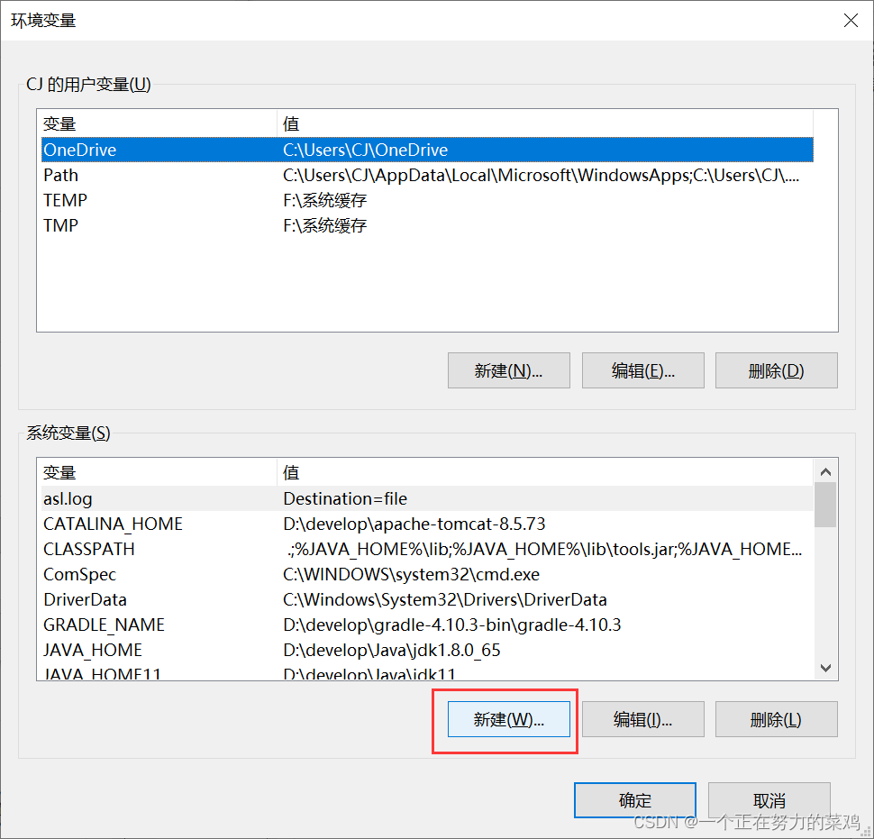

# HDFS与Java

## 一、IDEA插件Big Data Tools

### 1.下载Big Data Tools插件


### 2.尝试连接

#### 2.1.连接


#### 2.2.解决报错





#### 2.3.再次连接


#### 2.4.再次解决报错


#### 2.5.再次连接


### 3.配置HA后连接改变


## 二、引入jar包

```java
<properties>
    <hadoop.version>2.7.1</hadoop.version>
</properties>

<dependency>
    <groupId>org.apache.hadoop</groupId>
    <artifactId>hadoop-client</artifactId>
    <version>${hadoop.version}</version>
</dependency>
<dependency>
    <groupId>org.apache.hadoop</groupId>
    <artifactId>hadoop-common</artifactId>
    <version>${hadoop.version}</version>
</dependency>
<dependency>
    <groupId>org.apache.hadoop</groupId>
    <artifactId>hadoop-hdfs</artifactId>
    <version>${hadoop.version}</version>
</dependency>
```

## 三、连接Hadoop客户端

### 1.SNN配置连接方式

①`application.yml`

```java
hdfs:
    path: hdfs://node1:9000
    username: root
```

②Java API

```java
@Value("${hdfs.path}")
private String path;
@Value("${hdfs.username}")
private String username;

//获取HDFS配置信息
public Configuration getConf() {
    Configuration conf = new Configuration();
    conf.set("fs.defaultFS", path);
    return conf;
}
```

### 2.HA配置连接方式

①`application.yml`

```java
hdfs:
    path: hdfs://yc #hdfs://node1:9000
    username: root
    nameservices: yc
    namenodes: nn1,nn2
    node1: node1:8020
    node2: node2:8020
    provider: org.apache.hadoop.hdfs.server.namenode.ha.ConfiguredFailoverProxyProvider
```

②Java API

```java
@Value("${hdfs.path}")
private String path;
@Value("${hdfs.username}")
private String username;
@Value("${hdfs.nameservices}")
private String nameservices;
@Value("${hdfs.namenodes}")
private String namenodes;
@Value("${hdfs.node1}")
private String node1;
@Value("${hdfs.node2}")
private String node2;
@Value("${hdfs.provider}")
private String provider;

//获取HDFS配置信息
public Configuration getConf() {
    Configuration conf = new Configuration();
    conf.set("fs.defaultFS", path);
    conf.set("dfs.nameservices", nameservices);
    conf.set("dfs.ha.namenodes.yc", namenodes);
    conf.set("dfs.namenode.rpc-address.yc.nn1", node1);
    conf.set("dfs.namenode.rpc-address.yc.nn2", node2);
    conf.set("dfs.client.failover.proxy.provider.yc", provider);
    return conf;
}
```

## 四、API工具类

### 1.HdfsService

```java
import org.apache.hadoop.fs.BlockLocation;
import org.springframework.core.io.InputStreamResource;
import org.springframework.http.ResponseEntity;
import org.springframework.web.multipart.MultipartFile;

import java.io.IOException;
import java.net.URISyntaxException;
import java.util.List;
import java.util.Map;

public interface HdfsService {
    //获取配置文件,以map形式返回
    public Map<String, String> getConfInfoAsMap() throws InterruptedException, IOException, URISyntaxException;

    //在HDFS新建文件夹
    public boolean mkdir(String path) throws InterruptedException, IOException, URISyntaxException;

    //判断HDFS文件是否存在
    public boolean existFile(String path) throws InterruptedException, IOException, URISyntaxException;

    //读取HDFS目录信息
    public List<Map<String, Object>> readPathInfo(String path) throws InterruptedException, IOException, URISyntaxException;

    //HDFS创建文件夹
    public void createFile(String path, MultipartFile file) throws IOException, URISyntaxException, InterruptedException;

    //读取HDFS文件内容
    public String readFile(String path) throws InterruptedException, IOException, URISyntaxException;

    //在整个磁盘搜索所有的某类型的文件
    public List<Map<String, String>> listStatus(int type) throws InterruptedException, IOException, URISyntaxException;

    public List<Map<String, String>> listStatus(String type) throws InterruptedException, IOException, URISyntaxException;

    //获取某个文件的信息
    public Map<String, String> getFileInfo(String path) throws InterruptedException, IOException, URISyntaxException;

    //读取HDFS文件列表
    public List<Map<String, String>> listFile(String path) throws InterruptedException, IOException, URISyntaxException;

    //HDFS重命名文件
    public boolean renameFile(String oldName, String newName) throws InterruptedException, IOException, URISyntaxException;

    //删除HDFS文件
    public boolean deleteFile(String path) throws InterruptedException, IOException, URISyntaxException;

    //上传HDFS文件
    public void uploadFile(String path, String uploadpath) throws InterruptedException, IOException, URISyntaxException;

    //下载HDFS文件
    public ResponseEntity<InputStreamResource> downloadFile(String path, String fileName) throws InterruptedException, IOException, URISyntaxException;

    //压缩打包目录
    public ResponseEntity<byte[]> downloadDirectory(String path, String fileName) throws IOException;

    //HDFS文件复制
    public void copyFile(String sourcePath, String targetPath) throws InterruptedException, IOException, URISyntaxException;

    //打开HDFS上的文件并返回byte数组
    public byte[] openFileToBytes(String path) throws InterruptedException, IOException, URISyntaxException;

    //获取某个文件在HDFS集群的位置
    public BlockLocation[] getFileBlockLocations(String path) throws InterruptedException, IOException, URISyntaxException;
}
```

### 2.HdfsServiceImpl

```java
import com.yc.util.MyFileUtil;
import org.apache.hadoop.conf.Configuration;
import org.apache.hadoop.fs.FileSystem;
import org.apache.hadoop.fs.*;
import org.apache.zookeeper.common.IOUtils;
import org.springframework.beans.factory.annotation.Value;
import org.springframework.core.io.InputStreamResource;
import org.springframework.http.ResponseEntity;
import org.springframework.stereotype.Service;
import org.springframework.util.StringUtils;
import org.springframework.web.multipart.MultipartFile;

import java.io.*;
import java.net.URI;
import java.net.URISyntaxException;
import java.util.*;
import java.util.regex.Pattern;
import java.util.zip.ZipEntry;
import java.util.zip.ZipOutputStream;

/**
 * @program: Hadoop_yunpan
 * @description:
 * @author: 作者
 * @create: 2022-06-14 19:27
 */
@Service
public class HdfsServiceImpl implements HdfsService {
    @Value("${hdfs.path}")
    private String path;
    @Value("${hdfs.username}")
    private String username;
    @Value("${hdfs.nameservices}")
    private String nameservices;
    @Value("${hdfs.namenodes}")
    private String namenodes;
    @Value("${hdfs.node1}")
    private String node1;
    @Value("${hdfs.node2}")
    private String node2;
    @Value("${hdfs.provider}")
    private String provider;

    private final int bufferSize = 1024 * 1024 * 64;

    //获取HDFS配置信息
    public Configuration getConf() {
        Configuration conf = new Configuration();
        conf.set("fs.defaultFS", path);
        conf.set("dfs.nameservices", nameservices);
        conf.set("dfs.ha.namenodes.yc", namenodes);
        conf.set("dfs.namenode.rpc-address.yc.nn1", node1);
        conf.set("dfs.namenode.rpc-address.yc.nn2", node2);
        conf.set("dfs.client.failover.proxy.provider.yc", provider);
        return conf;
    }

    //获取HDFS文件系统对象
    public FileSystem getFileSystem() throws URISyntaxException, IOException, InterruptedException {
        //客户端操作hdfs需要一个用户身份，默认hdfs客户端API会从JVM中获取一个参数作为自己的用户身份
        //1.在Windows环境变量中添加一个变量 HADOOP_USER_NAME=root
        //2.创建fs对象时，通过参数传递
        FileSystem fs = FileSystem.get(new URI(path), getConf(), username);
        return fs;
    }

    //获取配置文件,以map形式返回
    @Override
    public Map<String, String> getConfInfoAsMap() throws InterruptedException, IOException, URISyntaxException {
        FileSystem fs = getFileSystem();
        Configuration conf = getConf();
        Iterator<Map.Entry<String, String>> ite = conf.iterator();

        Map<String, String> map = new HashMap<>();
        while (ite.hasNext()) {
            Map.Entry<String, String> entry = ite.next();
            map.put(entry.getKey(), entry.getValue());
        }
        return map;
    }

    //判断HDFS文件是否存在
    @Override
    public boolean existFile(String path) throws InterruptedException, IOException, URISyntaxException {
        if (StringUtils.isEmpty(path)) {
            return false;
        }
        FileSystem fs = getFileSystem();
        Path srcpath = new Path(path);
        return fs.exists(srcpath);
    }

    //新建HDFS目录
    @Override
    public boolean mkdir(String path) throws InterruptedException, IOException, URISyntaxException {
        if (StringUtils.isEmpty(path)) {
            return false;
        }
        if (existFile(path)) {//文件已经存在，返回true
            return true;
        }
        FileSystem fs = getFileSystem();
        Path srcpath = new Path(path);
        return fs.mkdirs(srcpath);
    }

    //读取HDFS目录信息
    @Override
    public List<Map<String, Object>> readPathInfo(String path) throws InterruptedException, IOException, URISyntaxException {
        if (StringUtils.isEmpty(path)) {
            return null;
        }
        if (!existFile(path)) {
            return null;
        }

        FileSystem fs = getFileSystem();
        Path srcpath = new Path(path);
        FileStatus[] statusList = fs.listStatus(srcpath);//读取出来的状态信息
        List<Map<String, Object>> res = new ArrayList<>();
        if (statusList != null && statusList.length > 0) {
            for (FileStatus status : statusList) {
                Map<String, Object> map = new HashMap<>();
                map.put("filePath", status.getPath());
                map.put("fileStatus", status.toString());
                res.add(map);
            }
            return res;
        }
        return null;
    }

    //创建HDFS文件
    @Override
    public void createFile(String path, MultipartFile file) throws IOException, URISyntaxException, InterruptedException {
        if (StringUtils.isEmpty(path) || file.getBytes() == null) {
            return;
        }
        FileSystem fs = getFileSystem();
        String fileName = file.getOriginalFilename();
        Path newpath = null;
        if ("/".equals(path)) {
            newpath = new Path(path + fileName);
        } else {
            newpath = new Path(path + "/" + fileName);
        }
        //打开一个输出流
        FSDataOutputStream outputStream = fs.create(newpath);
        outputStream.write(file.getBytes());
        outputStream.close();
        fs.close();
    }

    //读取HDFS文件内容
    @Override
    public String readFile(String path) throws InterruptedException, IOException, URISyntaxException {
        if (StringUtils.isEmpty(path)) {
            return null;
        }
        if (!existFile(path)) {
            return null;
        }
        FileSystem fs = getFileSystem();
        Path srcpath = new Path(path);
        //打开一个输入流
        FSDataInputStream inputStream = fs.open(srcpath);
        //防止中文乱码
        BufferedReader reader = new BufferedReader(new InputStreamReader(inputStream));

        String lineTxt = "";
        StringBuffer sb = new StringBuffer();
        while ((lineTxt = reader.readLine()) != null) {
            sb.append(lineTxt);
        }
        return sb.toString();
    }

    //读取HDFS文件列表
    @Override
    public List<Map<String, String>> listFile(String path) throws InterruptedException, IOException, URISyntaxException {
        if (StringUtils.isEmpty(path)) {
            return null;
        }
        if (!existFile(path)) {
            return null;
        }
        FileSystem fs = getFileSystem();
        Path srcpath = new Path(path);

        //递归找到所有文件
        RemoteIterator<LocatedFileStatus> filesList = fs.listFiles(srcpath, true);
        List<Map<String, String>> resList = new ArrayList<>();
        while (filesList.hasNext()) {
            LocatedFileStatus next = filesList.next();
            Map<String, String> map = new HashMap<>();
            map.put("fileName", next.getPath().getName());
            map.put("filePath", next.getPath().toString());
            resList.add(map);
        }
        fs.close();
        return resList;
    }

    //获取某个文件的信息
    @Override
    public Map<String, String> getFileInfo(String path) throws InterruptedException, IOException, URISyntaxException {
        if (StringUtils.isEmpty(path)) {
            return null;
        }
        if (!existFile(path)) {
            return null;
        }
        FileSystem fs = getFileSystem();
        Path srcpath = new Path(path);
        FileStatus fileStatus = fs.getFileStatus(srcpath);
        return fileStatusToMap(fileStatus);
    }

    //HDFS重命名文件
    @Override
    public boolean renameFile(String oldName, String newName) throws InterruptedException, IOException, URISyntaxException {
        if (StringUtils.isEmpty(oldName) || StringUtils.isEmpty(newName)) {
            return false;
        }
        FileSystem fs = getFileSystem();
        Path oldpath = new Path(oldName);
        Path newpath = new Path(newName);
        return fs.rename(oldpath, newpath);
    }

    //删除HDFS文件
    @Override
    public boolean deleteFile(String path) throws InterruptedException, IOException, URISyntaxException {
        if (StringUtils.isEmpty(path)) {
            return false;
        }
        if (!existFile(path)) {
            return false;
        }
        FileSystem fs = getFileSystem();
        Path srcpath = new Path(path);
        return fs.delete(srcpath, true);
    }

    //上传HDFS文件
    @Override
    public void uploadFile(String path, String uploadpath) throws InterruptedException, IOException, URISyntaxException {
        if (StringUtils.isEmpty(path) || StringUtils.isEmpty(uploadpath)) {
            return;
        }
        FileSystem fs = getFileSystem();
        Path oldpath = new Path(path);
        Path newpath = new Path(uploadpath);
        fs.copyFromLocalFile(false, oldpath, newpath);
        fs.close();
    }

    //下载HDFS文件
    @Override
    public ResponseEntity<InputStreamResource> downloadFile(String path, String fileName) throws InterruptedException, IOException, URISyntaxException {
        FileSystem fs = getFileSystem();
        Path srcpath = new Path(path);
        FSDataInputStream in = fs.open(srcpath);
        return MyFileUtil.downloadFile(in,fileName);
    }

    //将fileStatus转为map
    public Map<String, String> fileStatusToMap(FileStatus fileStatus) {
        Map<String, String> map = new HashMap<>();
        Path path = fileStatus.getPath();
        map.put("fileName", path.getName());//a
        map.put("filePath", path.toUri().toString());// hdfs://node1:9000/idea/a.txt
        map.put("relativePath", path.toUri().toString().substring(this.path.length()));// /idea/a.txt
        map.put("parenPath", path.getParent().toUri().toString().substring(this.path.length())); // /idea
        map.put("owner", fileStatus.getOwner());
        map.put("group", fileStatus.getGroup());
        map.put("isFile", fileStatus.isFile() + "");
        map.put("duplicates", fileStatus.getReplication() + "");
        map.put("size", MyFileUtil.formatFileSize(fileStatus.getLen()));
        map.put("rights", fileStatus.getPermission().toString());
        map.put("modifyTime", MyFileUtil.formatTime(fileStatus.getModificationTime()));
        return map;
    }

    public void search(Path srcpath, List<Map<String, String>> list, Pattern pattern) throws InterruptedException, IOException, URISyntaxException {
        FileSystem fs = getFileSystem();
        FileStatus[] fileStatuses = fs.listStatus(srcpath);
        if (fileStatuses != null && fileStatuses.length > 0) {
            for (FileStatus fileStatus : fileStatuses) {
                boolean res = fileStatus.isFile();
                if (!res) {//是目录则递归
                    search(fileStatus.getPath(), list, pattern);
                } else {
                    boolean bool = pattern.matcher(fileStatus.getPath().getName()).find();
                    if (bool) {
                        Map<String, String> map = this.fileStatusToMap(fileStatus);
                        list.add(map);
                    }
                }
            }
        }
    }

    //在整个磁盘搜索所有的某类型的文件
    @Override
    public List<Map<String, String>> listStatus(int type) throws InterruptedException, IOException, URISyntaxException {
        String path = "/";//查找全盘所有文件
        Path srcpath = new Path(path);//目标路径
        List<Map<String, String>> resList = new ArrayList<>();
        String reg = null;
        if (type == 1) {
            reg = ".+(.jpeg|.jpg|.png|.bmp|.gif)$";
        } else if (type == 2) {
            reg = ".+(.txt|.rtf|.doc|.docx|.xls|.xlsx|.html|.htm|.xml)$";
        } else if (type == 3) {
            reg = ".+(.mp4|.avi|.wmv)$";
        } else if (type == 4) {
            reg = ".+(.mp3|.wav)$";
        } else if (type == 5) {
            reg = "^\\S+\\.*$";
        }
        Pattern pattern = Pattern.compile(reg, Pattern.CASE_INSENSITIVE);
        search(srcpath, resList, pattern);
        return resList;
    }

    //在给定路径下搜索文件status，并统计在list
    @Override
    public List<Map<String, String>> listStatus(String path) throws InterruptedException, IOException, URISyntaxException {
        if (StringUtils.isEmpty(path)) {
            return null;
        }
        if (!existFile(path)) {
            return null;
        }
        FileSystem fs = getFileSystem();
        Path srcpath = new Path(path);

        FileStatus[] fileStatuses = fs.listStatus(srcpath);
        if (fileStatuses == null || fileStatuses.length <= 0) {
            return null;
        }

        List<Map<String, String>> resList = new ArrayList<>();
        for (FileStatus fileStatus : fileStatuses) {
            Map<String, String> map = fileStatusToMap(fileStatus);
            resList.add(map);
        }
        fs.close();
        return resList;
    }

    public void compress(String baseDir, ZipOutputStream zipOutputStream, FileSystem fs) {
        try {
            FileStatus[] fileStatuses = fs.listStatus(new Path(baseDir));
            String[] strs = baseDir.split("/");
            //lastName代表路径最后的单词
            String lastName = strs[strs.length - 1];
            for (int i = 0; i < fileStatuses.length; i++) {//循环baseDir路径下每一个文件
                String name = fileStatuses[i].getPath().toString();//文件path
                name = name.substring(name.indexOf("/" + lastName));//文件名
                if (fileStatuses[i].isFile()) {
                    Path path = fileStatuses[i].getPath();
                    FSDataInputStream in = fs.open(path);
                    zipOutputStream.putNextEntry(new ZipEntry(name.substring(1)));
                    IOUtils.copyBytes(in, zipOutputStream, this.bufferSize);
                    in.close();
                } else {
                    zipOutputStream.putNextEntry(new ZipEntry(fileStatuses[i].getPath().getName() + "/"));
                    compress(fileStatuses[i].getPath().toString(), zipOutputStream, fs);
                }
            }
        } catch (IOException e) {
            e.printStackTrace();
        }
    }

    //压缩打包目录
    @Override
    public ResponseEntity<byte[]> downloadDirectory(String path, String fileName) throws IOException {
        //1.获取对象
        ByteArrayOutputStream out = null;
        try {
            FileSystem fs = this.getFileSystem();
            out = new ByteArrayOutputStream();
            ZipOutputStream zos = new ZipOutputStream(out);
            compress(path, zos, fs);
            zos.close();
        } catch (Exception e) {
            e.printStackTrace();
        }
        byte[] bs = out.toByteArray();
        out.close();
        return MyFileUtil.downloadFile(in, fileName);
    }

    //HDFS文件复制
    @Override
    public void copyFile(String sourcePath, String targetPath) throws InterruptedException, IOException, URISyntaxException {
        if (StringUtils.isEmpty(sourcePath) || StringUtils.isEmpty(targetPath)) {
            return;
        }
        FileSystem fs = getFileSystem();
        Path oldpath = new Path(sourcePath);
        Path newpath = new Path(targetPath);

        FSDataInputStream in = null;
        FSDataOutputStream out = null;
        try {
            in = fs.open(oldpath);
            out = fs.create(newpath);
            IOUtils.copyBytes(in, out, bufferSize, false);
        } finally {
            in.close();
            out.close();
            fs.close();
        }
    }

    //打开HDFS上的文件并返回byte数组
    @Override
    public byte[] openFileToBytes(String path) throws InterruptedException, IOException, URISyntaxException {
        if (StringUtils.isEmpty(path)) {
            return null;
        }
        if (!existFile(path)) {
            return null;
        }
        FileSystem fs = getFileSystem();
        //目标路径
        Path srcpath = new Path(path);
        byte[] res = null;
        try {
            FSDataInputStream in = fs.open(srcpath);
            InputStream iss = in.getWrappedStream();
            ByteArrayOutputStream baos = new ByteArrayOutputStream();
            byte[] bs = new byte[10 * 1024];
            int len = 0;
            while ((len = iss.read(bs, 0, bs.length)) != -1) {
                baos.write(bs, 0, len);
            }
            baos.flush();
            res = baos.toByteArray();
        } finally {
            fs.close();
        }
        return res;
    }

    //获取某个文件在HDFS集群的位置
    @Override
    public BlockLocation[] getFileBlockLocations(String path) throws InterruptedException, IOException, URISyntaxException {
        if (StringUtils.isEmpty(path)) {
            return null;
        }
        if (!existFile(path)) {
            return null;
        }
        FileSystem fs = getFileSystem();
        //目标路径
        Path srcpath = new Path(path);
        FileStatus fileStatus = fs.getFileStatus(srcpath);
        return fs.getFileBlockLocations(fileStatus, 0, fileStatus.getLen());
    }
}
```

### 3.MyFileUtil

```java
import org.springframework.core.io.InputStreamResource;
import org.springframework.http.HttpHeaders;
import org.springframework.http.MediaType;
import org.springframework.http.ResponseEntity;

import java.io.InputStream;
import java.text.DateFormat;
import java.text.DecimalFormat;
import java.text.SimpleDateFormat;
import java.util.Date;

/**
 * @program: Hadoop_yunpan
 * @description:
 * @author: 作者
 * @create: 2022-06-14 20:29
 */
public class MyFileUtil {
    public static String formatTime(long time) {
        SimpleDateFormat simpleDateFormat = new SimpleDateFormat("yyyy-MM-dd hh:mm:sss");
        Date date = new Date(time);
        return simpleDateFormat.format(date);
    }

    public static String formatFileSize(long fileS) {
        DecimalFormat df = new DecimalFormat("#.00");
        String fileSizeString = "";
        String wrongSize = "0B";
        if (fileS == 0) {
            return wrongSize;
        }
        if (fileS < 1024) {
            fileSizeString = df.format((double) fileS) + "B";
        } else if (fileS < 1048576) {
            fileSizeString = df.format((double) fileS / 1024) + "KB";
        } else if (fileS < 1073741824) {
            fileSizeString = df.format((double) fileS / 1048576) + "MB";
        } else {
            fileSizeString = df.format((double) fileS / 1073741824) + "GB";
        }
        return fileSizeString;
    }

    public static ResponseEntity<InputStreamResource> downloadFile(InputStream in, String fileName) {
        try {
            byte[] bytes = new byte[in.available()];
            //http响应协议
            HttpHeaders httpHeaders = new HttpHeaders();
            httpHeaders.add("Cache-Control", "no-cache, no-store, must-revalidate");
            //下载文件的方式
            httpHeaders.add("Content-Disposition", String.format("attachment; filename=\"%s\"", fileName));
            httpHeaders.add("Pragma", "no-cache");
            httpHeaders.add("Expires", "0");
            httpHeaders.add("Content-Language", "UTF-8");
            //文件内容以流的形式输出
            return ResponseEntity.ok().headers(httpHeaders).contentLength(bytes.length)
                    .contentType(MediaType.parseMediaType("application/octet-stream")).body(new InputStreamResource(in));
        } catch (Exception e) {
            e.printStackTrace();
        }
        return null;
    }

    public static ResponseEntity<byte[]> downloadDirectory(byte[] bytes, String fileName) {
        try {
            HttpHeaders httpHeaders = new HttpHeaders();
            httpHeaders.add("Cache-Control", "no-cache, no-store, must-revalidate");
            //下载文件的方式
            httpHeaders.add("Content-Disposition", String.format("attachment; filename=\"%s\"", fileName));
            httpHeaders.add("Pragma", "no-cache");
            httpHeaders.add("Expires", "0");
            httpHeaders.add("Content-Language", "UTF-8");
            //文件内容以流的形式输出
            return ResponseEntity.ok().headers(httpHeaders).contentLength(bytes.length)
                    .contentType(MediaType.parseMediaType("application/octet-stream")).body(bytes);
        } catch (Exception e) {
            e.printStackTrace();
        }
        return null;
    }

    public static String getFileName() {
        Date d = new Date();
        DateFormat format = new SimpleDateFormat("yyyyMMddHHmmss");
        return format.format(d) + ".zip";
    }
}
```

