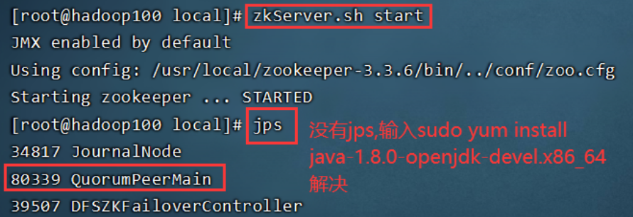
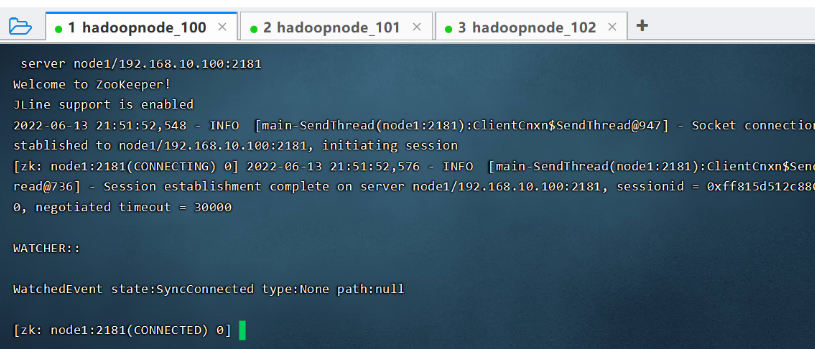
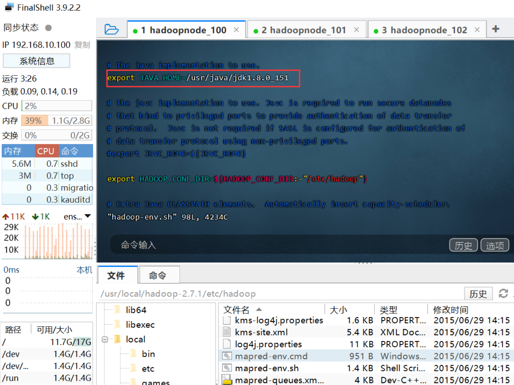
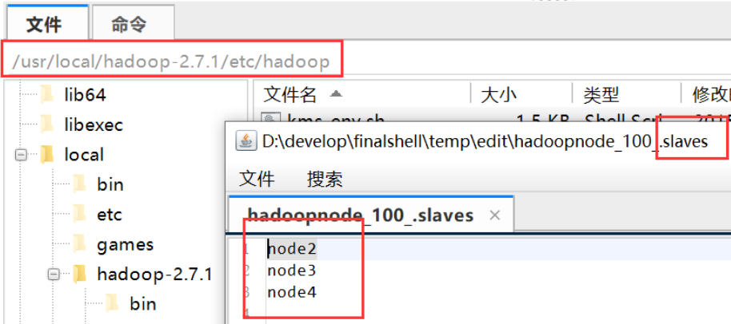
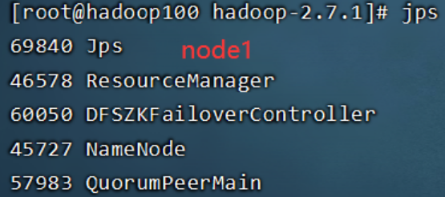
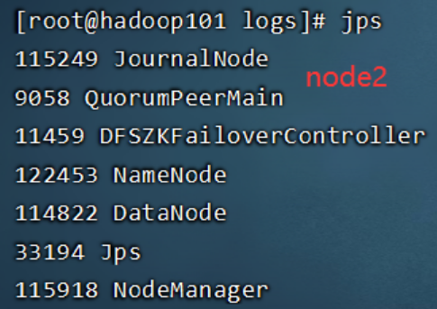
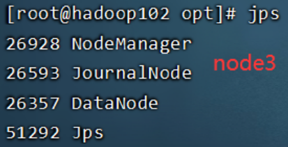
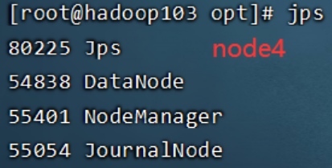
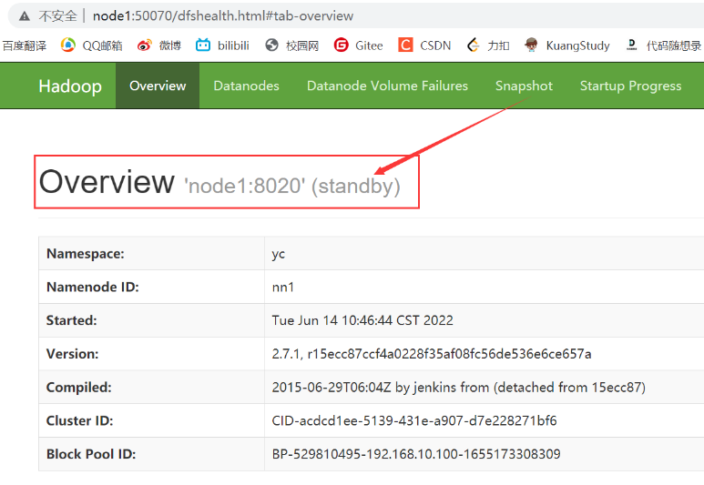
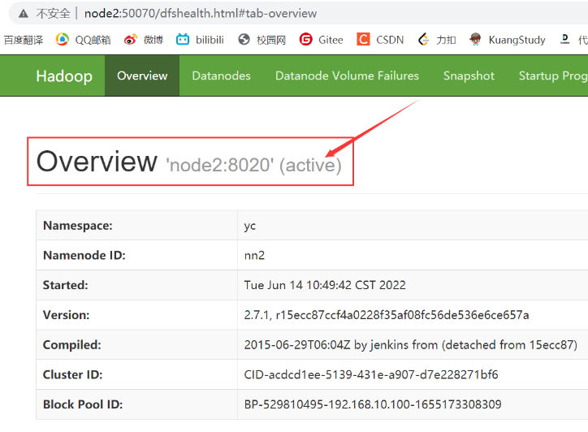

# HDFS配置之高可用HA

## 一、HA架构图


## 二、配置图解


**JN(JournalNode)**：两个NN间的共享存储系统，Active状态的NN有修改告知JN，Standby状态的NN读取JN，以保证两个NN完全同步

**ZK**：zookeeper

**ZKFC(Zookeeper Failover Controller)**：故障切换控制器，当Active状态的NN宕机，ZKFC将切换到Standby状态的NN

## 三、高可用配置

高可用配置在[HDFS配置之NN&SNN&DN](/大数据/2.Hadoop/HDFS配置之NN&SNN&DN)基础上进行

### 1.免密钥登录集群

在[HDFS配置之NN&SNN&DN](/大数据/2.Hadoop/HDFS配置之NN&SNN&DN)中配置过node1免密钥登录其他节点，当node1宕机时，为了使接管的节点可以免密登录其他节点，请一步到位，设置其他节点也可以相互免密登录

- 生成公私密钥对，该步骤在[HDFS配置之NN&SNN&DN](/大数据/2.Hadoop/HDFS配置之NN&SNN&DN)中配置过，可省略：`ssh-keygen -t rsa -P '' -f ~/.ssh/id_rsa`
- 这步灵活选取指令，在需要免密登录的节点上发送公钥到其他三个节点
  - `scp ~/.ssh/id_rsa.pub     node1:/tmp/`
  - `scp ~/.ssh/id_rsa.pub     node2:/tmp/`
  - `scp ~/.ssh/id_rsa.pub     node3:/tmp/`
  - `scp ~/.ssh/id_rsa.pub     node4:/tmp/`
- 将需要免密登录本机的主机的公钥加到受信列表中：`cat /tmp/id_rsa.pub >> ~/.ssh/authorized_keys`
- 设置权限：`chmod 0600 ~/.ssh/authorized_keys`

### 2.安装配置Zookeeper

#### 2.1.安装Zookeeper

[官网](zookeeper.apache.org)下载ZK压缩包，压缩包上传到`/usr/local`，并解压、重命名以及配置环境变量

```java
tar -xvf zookeeper-3.3.6.tar.gz
mv zookeeper-3.3.6 zk336
vim /etc/profile
	JAVA_HOME=/usr/java/jdk1.8.0_152
    JRE_HOME=/usr/java/jdk1.8.0_151/jre
    HADOOP_HOME=/usr/local/hadoop-2.7.1
    ZOOKEEPER_HOME=/usr/local/zookeeper-3.3.6

    CLASSPATH=.:$JAVA_HOME/lib/dt.jar:$JAVA_HOME/lib/tools.jar:$JRE_HOME/lib
    PATH=$PATH:$JAVA_HOME/bin:$JRE_HOME/bin:$HADOOP_HOME/bin:$HADOOP_HOME/sbin:$ZOOKEEPER_HOME/bin
    export PATH CLASSPATH JAVA_HOME JRE_HOME HADOOP_HOME ZOOKEEPER_HOME
source /etc/profile
```

#### 2.2.修改配置文件zoo.cfg

```java
cd /usr/local/zookeeper-3.3.6/conf
cp zoo_sample.cfg zoo.cfg
vim zoo.cfg
    tickTime=2000
    dataDir=/opt/zookeeper
    clientPort=2181
    initLimit=5 
    syncLimit=2 
    server.1=node1:2888:3888 
    server.2=node2:2888:3888
    server.3=node3:2888:3888
```

#### 2.3.创建myid写入这台服务器的id

```java
cd /opt/zookeeper
mkdir zookeeper
vim myid
	1
```

#### 2.4.同步node1配置到node2与node3

```java
scp  -r zookeeper-3.3.6/   node2:/usr/local/
scp  -r zookeeper-3.3.6/   node3:/usr/local/
```

#### 2.5.在node2与node3配置环境变量

```java
vim /etc/profile
	JAVA_HOME=/usr/java/jdk1.8.0_152
	JRE_HOME=/usr/java/jdk1.8.0_151/jre
	HADOOP_HOME=/usr/local/hadoop-2.7.1
	ZOOKEEPER_HOME=/usr/local/zookeeper-3.3.6
	
	CLASSPATH=.:$JAVA_HOME/lib/dt.jar:$JAVA_HOME/lib/tools.jar:$JRE_HOME/lib
	PATH=$PATH:$JAVA_HOME/bin:$JRE_HOME/bin:$HADOOP_HOME/bin:$HADOOP_HOME/sbin:$ZOOKEEPER_HOME/bin
	export PATH CLASSPATH JAVA_HOME JRE_HOME HADOOP_HOME ZOOKEEPER_HOME
source /etc/profile
```

#### 2.6.创建myid写入这台服务器的id

node2与node3在`/opt/zookeeper`下创建myid文件，分别写入编号2与3

#### 2.7.同时启动node123的ZK，并在node1上启动ZK客户端

启动ZK：`zkServer.sh start`



启动ZK客户端：`zkCli.sh   -server   node1:2181`



### 3.修改配置文件

修改配置文件之前先关闭集群：`stop-all.sh`

#### 3.1.删除SNN配置

①删除`masters`文件

```java
cd /usr/local/hadoop-2.7.1/etc/hadoop
rm -f masters
```

②删除`hadoopdata`目录

```java
cd /opt
rm -rf hadoopdata
```

#### 3.2.hadoop-env.sh中配置JAVA_HOME



#### 3.3.修改core-site.xml

```java
<property>
  <name>fs.defaultFS</name>
  <value>hdfs://yc</value>  //yc是一个服务名，HA有两台NN，所以不能写node1或node2
</property>
<property>
   <name>hadoop.tmp.dir</name>
   <value>/opt/hadoopdata</value>  //保证每台服务器/opt/hadoopdata目录为空,将来是NN,DN,JN等存数据的公共目录 
</property>
```

#### 3.4.修改hdfs-site.xml

```java
<configuration>
	//1.副本数
	<property>
		<name>dfs.replication</name>
		<value>3</value>
	</property>
	//2.权限配置，可以控制各用户之间的权限，这里先关掉 
	<property>
	   <name>dfs.permissions</name>
	   <value>false</value> 
	</property>
	<property>
	   <name>dfs.permissions.enabled</name>
	   <value>false</value> 
	</property>
	//3.配置服务名--hdfs://yc
	<property>
		<name>dfs.nameservices</name>
		<value>yc</value>
	</property>
	//4.两个NN的逻辑名,注意yc与上面的一样
	<property>
		<name>dfs.ha.namenodes.yc</name>
		<value>nn1,nn2</value>
	</property>
	//4.client访问HDFS的RPC请求的端口(以前的是9000)注意修改eclipse插件配置
	<property>
		<name>dfs.namenode.rpc-address.yc.nn1</name>
		<value>node1:8020</value>
	</property>
	<property>
		<name>dfs.namenode.rpc-address.yc.nn2</name>
		<value>node2:8020</value>
	</property>
	//5.node1和node2访问地址
	<property>
		<name>dfs.namenode.http-address.yc.nn1</name>
		<value>node1:50070</value>
	</property>
	<property>
		<name>dfs.namenode.http-address.yc.nn2</name>
		<value>node2:50070</value>
	</property>
	//6.指定JN(hadoop自带的共享存储系统),主要用于两个NN间数据的共享和同步
	<property>
		<name>dfs.namenode.shared.edits.dir</name>
		<value>qjournal://node2:8485;node3:8485;;node4:8485</value>
	</property>
	//7.自动故障迁移负责执行的类
	<property>
		<name>dfs.client.failover.proxy.provider.yc</name>
		<value>org.apache.hadoop.hdfs.server.namenode.ha.ConfiguredFailoverProxyProvider</value>
	</property>
	//8.需要NN切换时,使用sshfence方式,所以要配置免密钥
	<property>
		<name>dfs.ha.fencing.methods</name>
		<value>sshfence</value>
	</property>
	//9.指定JN集群对NN的目录进行共享时，自己存储数据的磁盘路径,它会生成一个journal目录到此位置
	<property>
		<name>dfs.ha.fencing.ssh.private-key-files</name>
		<value>/root/.ssh/id_rsa</value>//配置私钥位置
	</property>
</configuration>
```

#### 3.5.slaves指定DN



### 4.配置automatic failover

#### 4.1.修改core-site.xml

```java
<property>
	<name>ha.zookeeper.quorum</name>
	<value>node1:2181,node2:2181,node3:2181</value>
</property>
```

#### 4.2.修改hdfs-site.xml

```java
<property>
	<name>dfs.ha.automatic-failover.enabled</name>
	<value>true</value>
</property>
```

### 5.将node1配置同步给node234

```java
scp ./*.xml  node2:`pwd`
scp ./*.xml  node3:`pwd`
scp ./*.xml  node4:`pwd`
```

### 6.按步骤走

①分别在node234执行`hadoop-daemon.sh start journalnode`启动JN

②在其中一台NN中执行`hdfs namenode -format`命令格式化NN

③输入`hadoop-daemon.sh start namenode`命令启动格式化的NN

④在没有格式化的NN上执行同步命令`hdfs namenode -bootstrapStandby`

⑤输入`hadoop-daemon.sh start namenode`命令启动没有格式化的NN

⑥在一台NN上执行`hdfs zkfc -formatZK`命令格式化ZK，测试是否成功`zkCli.sh   -server   node1:2181`，格式化ZK的目的是在ZK上建立HA的Hadoop-HA节点

⑦启动HDFS`start-dfs.sh`

### 7.检查测试

①jps命令检查一下各服务启动的情况

|  |  |
| :----------------------------------------: | :----------------------------------------: |
|  |  |

②采用Web访问分别node12，注意两个节点处于不同状态






