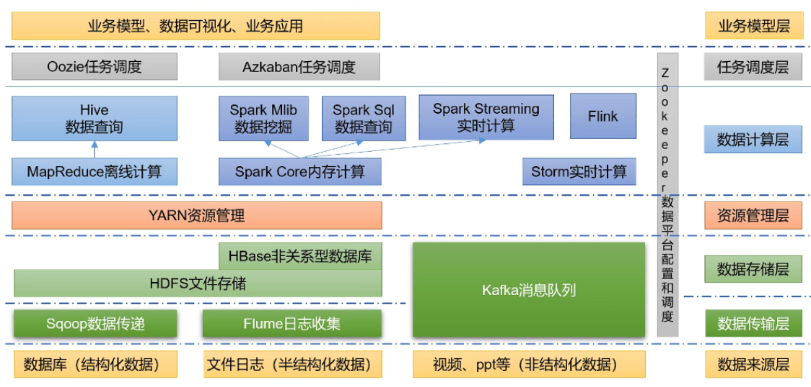
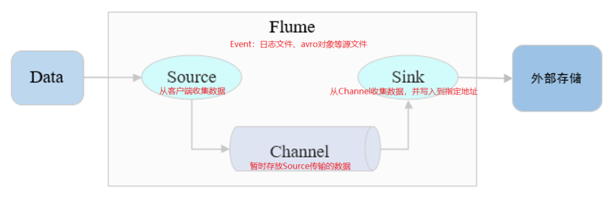
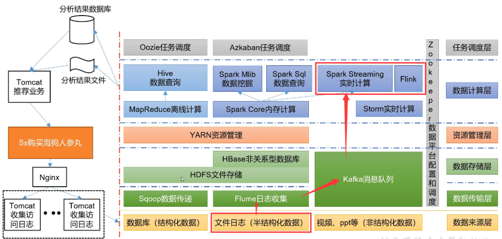

# Hadoop生态圈

## 一、图解

## 二、Zookeeper(分布式协调服务)

源自Google的Chubby论文，发表于2006年11月，Zookeeper是Chubby克隆版，**解决分布式环境下的数据管理问题**，Hadoop的许多组件依赖于Zookeeper，它运行在计算机集群上面，用于管理Hadoop操作

## 三、Sqoop

Sqoop是SQL-to-Hadoop的缩写，主要用于**传统数据库和Hadoop之前传输数据**，数据的导入和导出**本质上是Mapreduce程序**，充分利用了MR的并行化和容错性，Sqoop利用数据库技术描述数据架构，用于在关系数据库、数据仓库和Hadoop之间转移数据

## 四、Flume(日志采集)

Cloudera开源的日志收集系统，具有分布式、高可靠、高容错、易于定制和扩展的特点，Flume适合**复杂环境的海量日志收集**系统，也可以用于收集其他类型数据

Flume将数据从产生、传输、处理并最终写入目标的路径的过程抽象为**数据流**，在具体的数据流中，数据源支持在Flume中定制数据发送方，从而支持收集各种不同协议数据

Flume以Agent为最小的独立运行单位，一个Agent就是一个JVM，**单个Agent由Source、Sink和Channel三大组件构成**

## 五、Kafka(分布式消息队列)

Kafka是Linkedin于2010年12月份开源的消息系统，它主要用于处理**活跃的流式数据**，活跃的流式数据在Web网站应用中非常常见，这些数据包括网站的PV、用户访问了什么内容，搜索了什么内容等，这些数据通常以日志的形式记录下来，然后每隔一段时间进行一次统计处理

Kafka是一种**高吞吐量的分布式发布订阅消息系统**，可以处理消费者规模的网站中的所有动作流数据，实现了主题、分区、队列模式及生产者、消费者架构模式

生产者组件和消费者组件均可以连接到KafKa集群，而KafKa被认为是组件通信之间所使用的一种消息中间件

KafKa内部氛围很多Topic(一种高度抽象的数据结构)，每个Topic又被分为很多分区(Partition)，每个分区中的数据按队列模式进行编号存储，被编号的日志数据称为此日志数据块在队列中的偏移量(Offest)，偏移量越大的数据块越新，即越靠近当前时间，生产环境中的最佳实践架构是Flume+KafKa+Spark Streaming

## 六、HDFS(分布式文件系统)

HDFS是Hadoop Distributed File System的缩写，是Hadoop体系中数据存储管理的基础

HDFS是高度容错性的系统，能检测和应对硬件故障，用于**在低成本的通用硬件上运行**；HDFS通过**流式数据访问**，提供高吞吐量应用程序数据访问功能，适合带有大型数据集的应用程序；HDFS提供**一次写入多次读取**的机制，数据以**块**的形式同时分布在集群不同物理机器上

Hadoop 2为HDFS引入了两个重要的新功能，**Federation**允许集群中出现多个NameNode，之间相互独立且不需要互相协调，各自分工，管理自己的区域，DataNode被用作通用的数据块存储设备，每个DataNode要向集群中所有NameNode注册并发送心跳报告，执行所有Namenode的命令；HDFS的**HA高可用**性提供故障转移功能，备用节点从失败的主NameNode接管工作，实现自动化，消除单点故障

## 七、HBase(分布式列存储数据库)

**HBase建立在HDFS之上，面向列的针对结构化数据的可伸缩、高可靠、高性能、分布式和面向列的动态模式数据库**，采用**BigTable**的数据模型，即增强的稀疏排序映射表，其中键由行关键字、列关键字和时间戳构成，提供对大规模数据的随机、实时读写访问，同时HBase中保存的数据可以使用MapReduce来处理，它将数据存储和并行计算完美地结合在一起

## 八、Yarn(分布式资源管理器）

Yarn是下一代MapReduce，即MRv2，是在第一代MapReduce基础上演变而来的，主要是为了解决原始Hadoop扩展性较差，不支持多计算框架而提出的，用户可以编写自己的计算框架在该运行环境中运行

## 九、Mesos(分布式资源管理器)

Berkeley的一个研究项目，现已成为Apache项目，当前有一些公司使用Mesos管理集群资源，比如Twitter
Mesos与Yarn类似，是一个**资源统一管理和调度的平台**，同样支持比如MR、steaming等多种运算框架

## 十、Mapreduce(分布式计算框架)

MapReduce是**基于磁盘的分布式并行批处理计算模型**，用以进行大数据量的计算，它屏蔽了分布式计算框架细节，将计算抽象成Map+Reduce两部分，Map阶段并行处理输入数据，生成键-值对形式中间结果，Reduce阶段对Map结果进行汇总，以得到最终结果，MapReduce非常适合在大量计算机组成的分布式并行环境里进行数据处理，由下列组件组成

* **JobTracker**：Master节点，只有一个，将任务分解成一系列任务并分派给Tasktracker
* **TaskTracker**：Slave节点，运行MapTask和，并与JobTracker交互汇报任务状态
  * **MapTask**：解析每条数据记录传递给用户编写的Map()函数并执行
  * **ReduceTask**：远程读取输入数据，对数据进行排序，将数据分组传递给用户编写的Reduce()函数执行

## 十一、Hive / Impala(基于Hadoop的数据仓库)

由Facebook开源，**最初用于解决海量结构化的日志数据统计问题**，Hive定义了一种类似SQL的查询语言HQL，将SQL转化为MapReduce任务在Hadoop上执行，通常用于离线分析，HQL用于运行存储在Hadoop上的查询语句，Hive让不熟悉MapReduce开发人员也能编写数据查询语句，然后这些语句被翻译为Hadoop上面的MapReduce任务

Impala是用于处理存储在Hadoop集群中的大量数据的MPP(大规模并行处理)SQL查询引擎，用C ++和Java编写的开源软件，与Apache Hive不同，Impala不基于MapReduce算法，实现了一个**基于守护进程的分布式架构**，它负责在同一台机器上运行的查询执行的所有方面，因此执行效率高于Apache Hive

## 十二、Pig(ad-hoc脚本)

设计动机是提供一种基于MapReduce的ad-hoc(计算在query时发生)数据分析工具，Pig定义了一种**数据流语言PigLatin**，它是MapReduce编程复杂性的抽象，Pig平台包括运行环境和用于分析Hadoop数据集的脚本语言(Pig Latin)，其编译器将Pig Latin翻译成MapReduce程序序列将脚本转换为MapReduce任务在Hadoop上执行，通常用于进行离线分析

## 十三、.Spark(分布式计算框架)

最早Spark是UC BerkeleyAMP lab所开源的类Hadoop MapReduce的一种**基于内存的分布式并行计算框架**
，Spark提供了一个更快、更通用的数据处理平台，和Hadoop相比，Spark可以让你的程序在内存中运行时速度提升100倍，或者在磁盘上运行时速度提升10倍；不同于MapReduce的是Job中间输出结果可以保存在内存中，从而**不再需要读写HDFS**，因此Spark能更好地适用于数据挖掘与机器学习等需要迭代的MapReduce的算法

## 十四、Flink(分布式计算框架)

Flink是一个**基于内存的分布式并行处理框架**，类似于Spark，但在部分设计思想有较大出入，对Flink而言，其所要**处理的主要场景就是流数据**，批数据只是流数据的一个极限特例而已

## 十五、Oozie(工作流调度器)

Oozie是一个可扩展的工作体系，集成于Hadoop的堆栈，用于协调多个MapReduce作业的执行。Oozie能够管理一个复杂的系统，基于外部事件来执行，外部事件包括数据的定时和数据的出现

Oozie工作流是放置在控制依赖DAG(有向无环图 DirectAcyclic Graph)中的一组动作(例如Hadoop的Map/Reduce作业、Pig作业等)，其中指定了动作执行的顺序，Oozie使用hPDL(一种XML流程定义语言)来描述这个图

## 十六、Ambari(安装部署配置管理工具)

Ambari的作用是**创建、管理、监视Hadoop的集群**，为了让Hadoop以及相关的大数据软件更容易使用的一个web工具

## 十七、推荐系统架构

