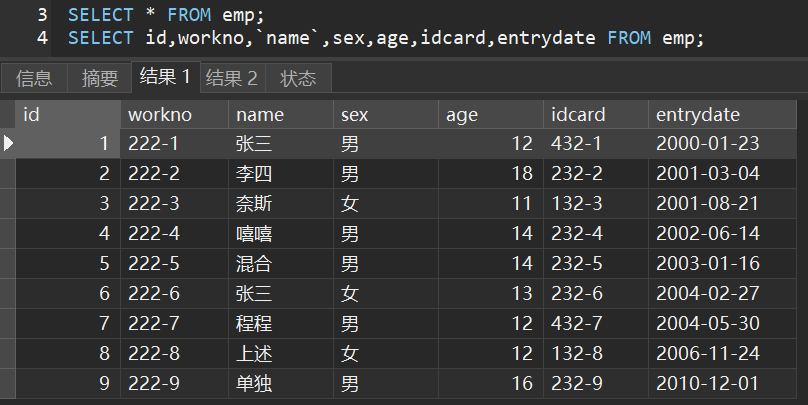
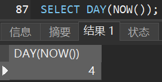

# MySQL基础

> 前言：是不是觉得啃官方文档很难受？但其实官网文档才是最最精华的资料！平时开发过程中记得查询官方
>
> * [MySQL 5.7参考文档](https://dev.mysql.com/doc/refman/5.7/en/preface.html)

## 一、MySQL下载及安装

下载地址为[https://www.mysql.com/downloads/](https://www.mysql.com/downloads/)


下载完成后点击得到的`.msi`文件，直接无脑`next`，其中密码可以设置得简单一点，这个密码一定要记得，之后会经常使用

------

MySQL服务默认开机自启，想要停止则去到服务中手动关闭


## 二、MySQL升级

### 1.备份数据库

`cmd`进入数据库中的`bin`，输入命令`mysqldump -u root -p --all-databases > D:\Backup.sql`，其中`root`是用户名，`>`后是输出路径，`.sql`不需要新建

```cmd
C:\Users\CJ>e:

C:\Users\CJ>cd E:\shujuku\bin

E:\shujuku\bin>mysqldump -u root -p --all-databases > D:\Backup.sql
Enter password: ********
```

> 忘记数据库安装路径解决办法：在服务中，右键MySQL服务点击属性
>
> 

### 2.卸载原来的Mysql


## 三、MySQL概述

### 1.MySQL客户端连接

#### 2.1.MySQL提供的客户端命令行工具


#### 2.2.系统自带得命令行工具

>  想要在任意位置使用MySQL命令则需要配置环境变量，配置环境变量请参考JDK配置方案

进入命令提示符，输入命令`mysql -u root -p`即可


#### 2.3.图形化界面工具Navicat

### 2.MySQL的数据模型

当我们在自己的电脑上安装过数据库后，我们的电脑就成为了数据库服务器。客户端可通过数据库管理系统创建数据库


## 四、SQL语句

### 1.SQL通用语法

SQL语句可单行或多行书写，**以分号结尾**，可通过空格或缩进来增强语句的可读性

SQL语句不区分大小写，但关键字建议大写

### 2.SQL分类

| 分类  |                          说明                          |
| :---: | :----------------------------------------------------: |
| `DDL` |   数据库定义语言，用于定义数据库对象，即库、表、字段   |
| `DML` |       数据库操作语言，用于对数据库中的数据增删改       |
| `DQL` |         数据库查询语言，用于查询数据库中的记录         |
| `DCL` | 数据库控制语言，用于创建数据库用户和控制数据库访问权限 |

### 3.DDL数据定义语言

#### 3.1.库的DDL

查询所有数据库：`show databases;`

创建数据库：`create databese [if not exists] 库名 [default charset 字符集] [collate 排序规则];`

> 字符集建议`utf8mb4`

删除数据库：`drop database [if exists] 库名;`

使用数据库：`use 库名;`

查询当前数据库：`select database();`

#### 3.2.表的DDL

> 前提：需要先进入某个数据库，即`use 库名;`

查询数据库的所有表：`show tables;`

创建表：

```mysql
create table 表名(
	字段1 类型1 [comment 注释1],	/* 类型的介绍放在四中 */
    字段2 类型2 [comment 注释2]	/* 注意最后一句不用, */
) [comment 表注释];
```

查询表结构：`desc 表名;`

查询指定表的建表语句：`show create table 表名;`

修改表名：`alter table 表名 rename to 新表名;`

删除表：`drop table [if exists] 表名;`

删除表后重新创建该表：`truncate table 表名;`，这样使表中的数据全部被删除，只留下表结构


#### 3.3.字段的DDL

添加字段(列)：`alter table 表名 add 新字段名 数据类型 [comment 注解] [约束 ];`

修改字段名和字段类型：`alter table 表名 change 旧字段名 新字段名 新数据类型 [comment 注解] [约束 ];`

删除字段：`alter table 表名 drop 字段名;`

### 4.DML数据操作语言

#### 4.1.添加数据

给指定字段添加数据：`insert into 表名(字段名1,字段名2..) values (值1,值2..);`

批量给指定字段添加数据：`insert into 表名(字段名1,字段名2..) values (值1,值2..),(值1,值2..);`

给所有字段添加数据：`insert into 表名 values (值1,值2..);`

批量给所有字段添加数据：`insert into 表名 values (值1,值2..),(值1,值2..);`

> 添加数组时注意值得顺序和字段得顺序一一对应，字符串型和日期型数组包含在引号中，插入的数据大小应该在数据类型范围内

#### 4.2.删除数据

删除数据：`delete from 表名 [where 过滤条件];`

#### 2.3.更新数据	

修改数据：`update 表名 set 字段1=值1,字段2=值2.. [where 过滤条件];`

### 5.DQL数据查询语言

> 创建数据作为操作数据
>
> ```mysql
> create table emp(
> 	id int comment '编号',
>     workno varchar(10) comment '员工工号',
>     name varchar(10) comment '员工姓名',
>     sex char(1) comment '性别',
>     age tinyint unsigned comment '年龄',
>     idcard char(18) comment '身份证',
>     entrydate date comment '入职时间'
> ) comment '员工信息表';
> 
> use mytest;
> 
> truncate table emp;
> 
> insert into emp values (1,'222-1','张三','男',12,'432-1','2000-01-23');
> insert into emp values (2,'222-2','李四','男',18,'232-2','2001-03-04');
> insert into emp values (3,'222-3','奈斯','女',11,'132-3','2001-08-21');
> insert into emp values (4,'222-4','嘻嘻','男',14,'232-4','2002-06-14');
> insert into emp values (5,'222-5','混合','男',14,'232-5','2003-01-16');
> insert into emp values (6,'222-6','张三','女',13,'232-6','2004-02-27');
> insert into emp values (7,'222-7','程程','男',12,'432-7','2004-05-30');
> insert into emp values (8,'222-8','上述','女',12,'132-8','2006-11-24');
> insert into emp values (9,'222-9','单独','男',16,'232-9','2010-12-01');
> ```

#### 5.1.基本查询

查询多个字段：`select 字段名1,字段名2... from 表名;`或`select * from 表名;`



设置别名查询：`select 字段名1 as 别名1,字段名2 as 别名2... from 表名;`


去除重复记录：`select distinct 字段名1,字段名2... from 表名;`


#### 5.2.条件查询

条件查询：`select 字段名1,字段名2... from 表名 where 条件列表;`

条件内可使用到的运算符分为比较运算符和逻辑运算符

|    比较运算符     |                             说明                             |                    案例                    |
| :---------------: | :----------------------------------------------------------: | :----------------------------------------: |
|   `> >= < <= =`   |                                                              |                                            |
|    `<>`或`!=`     |                            不等于                            |  |
| `between A and B` |          `[A,B]`范围内，相当于`name>=A and name<=B`          |  |
|     `in(A,B)`     |                           `A`或`B`                           |  |
|    `like 'xx'`    | 模糊匹配，`like 'X%'`表示X后匹配任意个字符，`like 'X_'`表示X后匹配一个字符 |  |
|  `is [not] null`  |                         [不]是`null`                         |  |

| 逻辑运算符  | 说明 |                    案例                    |
| :---------: | :--: | :----------------------------------------: |
| `and`或`&&` |  与  |  |
| `or`或`||`  |  或  |  |
| `not`或`!`  |  非  |                                            |

#### 5.3.分组查询

分组查询常常与聚合函数一起使用，故此处介绍聚合函数，**注意所有的`null`值不参与聚合函数的运算**

| 聚合函数 |                    案例                    |
| :------: | :----------------------------------------: |
|  `max`   |  |
|  `min`   |  |
|  `avg`   |  |
|  `sum`   |  |
| `count`  |  |

------

分组查询：`select 字段名1,字段名2... from 表名 [where 条件] group by 分组字段名 [having 分组后条件];`

在上述语句中发现`where`和`having`后都是条件，那么二者存在什么样的区别？

|     区别     |                             说明                             |
| :----------: | :----------------------------------------------------------: |
| 执行时机不同 | `where`在分组前过滤，不满足`where`条件的数据不参与分组，`having`在分组后过滤 |
| 判断条件不同 |           `where`不能使用聚合函数，但`having`可以            |

讲解到此分组的效果是怎样的呢？让我们通过以下几个例题学习

* 根据性别分组，统计男性员工和女性员工的数量

  

* 根据性别分组，统计男性员工和女性员工的平均年龄

  

* 查询年龄小于16岁的员工，根据地址进行分组，获取员工数量大于1的工作地址

  

#### 5.4.排序查询

排序查询：`select 字段名1,字段名2... from 表名 order by 字段1 排序方式1,字段2 排序方式2;`

排序方式有**ASC升序和DESC降序**两种，默认升序；若多个字段排序，则第一个字段值相同时，按照第二个字段排序

查询的效果是怎样的呢？让我们通过以下几个例题学习

* 根据年龄升序排序

  

* 根据年龄降序排序，若年龄相同则按入职时间升序排序

  

#### 5.5.分页查询

分页查询：`select 字段名1,字段名2... from 表名 limit 起始索引,查询记录数;`

* **起始索引从`0`开始，按照公式`[(当前页-1)*每页记录数]`来计算起始索引**；若查询的是第一页，起始索引可省略；分页语言是数据库的方言，不同的数据库有不同的分页命令

分页的效果是怎样的呢？让我们通过以下几个例题学习

* 查询第一页员工数据，每页展示3条记录

  

* 查询第三页员工数据，每页展示3条记录

  

#### 5.6.小结

DQL的编写顺序如下，若不按顺序则SQL语句报错

```mysql
select [distinct] <column1 [as newname],colimn2...>
  from <table>
    [where <条件>]
      [group by xx]
        [having <条件>]
          [order by xx asc/desc]
          	[limit xx,xx]
```

其实DQL的执行顺序是`from -> where -> group by -> having -> select -> order by -> limit`

### 6.DCL数据控制语言

#### 6.1.用户管理

数据库的所有用户信息都放在`mysql`库的`user`表中，查询用户语句如下

```mysql
USE mysql;
SELECT * FROM user;
```

创建用户：`create user '用户名'@'主机名' identified by '密码';`，**创建用户后没有任何权限**，主机名写成`%`表示任意主机

修改用户密码：`alter user '用户名'@'主机名' identified with mysql_native_password by '新密码';`

删除用户：`drop user '用户名'@'主机名';`

#### 6.2.权限控制

MySQL中设置了很多权限，但常用的是如下几种

|          权限           |       说明       |
| :---------------------: | :--------------: |
| `all`或`all privileges` |     所有权限     |
|        `insert`         |     插入数据     |
|        `delete`         |     删除数据     |
|        `update`         |     修改数据     |
|        `select`         |     查询数据     |
|         `alter`         |      修改表      |
|         `drop`          | 删除库、表、视图 |
|        `create`         |    创建库、表    |

查询权限：`show grants for '用户名'@'主机名';`

授予权限：`grant 权限列表 on 库名.表名 to '用户名'@'主机名';`

撤销权限：`revoke 权限列表 on 库名.表名 from '用户名'@'主机名';`

> 权限之间使用`,`分割，库名和表名可以使用`*`通配符

## 五、SQL数据类型

建表语句中我们发现了需要数据类型，那么以下就是数据类型的介绍

### 1.数值类型

|    类型     | 大小(字节) |        说明        |     有符号范围(signed)     |  无符号范围(unsigned)  |
| :---------: | :--------: | :----------------: | :------------------------: | :--------------------: |
|  `tinyint`  |     1      |      小整数值      |        `(-128,127)`        |       `(0,255)`        |
| `smallint`  |     2      |      大整数值      |      `(-32768,32767)`      |      `(0,65535)`       |
| `mediumint` |     3      |      大整数值      |    `(-8388608,8388607)`    |     `(0,16777215)`     |
|   `int`👀    |     4      |      大整数值      | `(-2147483648,2147483647)` |    `(0,4294967295)`    |
|  `bigint`   |     8      |     极大整数值     |      `(-2^63,2^63-1)`      |      `(0,2^64-1)`      |
|   `float`   |     4      |    单精度浮点数    |                            |                        |
|  `double`👀  |     8      |    双精度浮点数    |                            |                        |
|  `dectmal`  |            | 小数值，精确定点数 |   依赖于M(精度)和D(标度)   | 依赖于M(精度)和D(标度) |

例如年龄可以设计成`age tinyint unsigned`；成绩可以设计成`score double(4,1)`，4表示精度，即数字总位数`100.0`，1表示标度，即小数部分位数

### 2.字符串类型

|     类型     |   大小(字节)    |      说明      |
| :----------: | :-------------: | :------------: |
|   `char`👀    |      0~255      |   定长字符串   |
|  `varchar`👀  |     0~65535     |   变长字符串   |
|  `tinyblob`  |      0~255      |  短二进制数据  |
|  `tinytext`  |      0~255      |  短文本字符串  |
|    `blob`    |    0~65 535     |  长二进制数据  |
|    `text`    |    0~65 535     |  长文本字符串  |
| `mediumblob` |  0~16 777 215   | 中等二进制数据 |
| `mediumtext` |  0~16 777 215   | 中等文本字符串 |
|  `longblob`  | 0~4 294 967 295 | 超长二进制数据 |
|  `longtext`  | 0~4 294 967 295 | 超长文本字符串 |

二进制数据就比如图片、音频、视频、软件的安装包等，但是开发过程中并不这么做，因为性能不高且不方便管理

`char(10)`使用时，若只存储一个字符的空间，那么其他9个空间会使用空格补位；`varchar(10)`使用时，若只存储一个字符的空间，那么就只占一个字符的空间

**`char`的性能更好**，因为`varchar`在使用时还需要计算空间

* 若存在`username`，已知其长度不能超过50，使用`varchar(50)`会更好，因为用户输入的用户名长度不确定
* 若存在`sex`，已知其只有男和女，所占空间是确定的，使用`char(1)`更好

### 3.日期时间类型

|    类型     | 大小(字节) |       说明       |         格式          |
| :---------: | :--------: | :--------------: | :-------------------: |
|   `date`👀   |     3      |      日期值      |     `yyyy-MM-dd`      |
|   `time`👀   |     3      |      时间值      |      `HH:mm:ss`       |
|   `year`    |     1      |       年份       |        `yyyy`         |
| `datetime`👀 |     8      | 混合日期和时间值 | `yyyy-MM-dd HH:mm:ss` |
| `timestamp` |     4      | 混合日期、时间值 | `yyyy-MM-dd HH:mm:ss` |

### 4.案例练习


```mysql
create table emp(
	id int comment '编号',
    workno varchar(10) comment '员工工号',
    name varchar(10) comment '员工姓名',
    sex char(1) comment '性别',
    age tinyint unsigned comment '年龄',
    idcard char(18) comment '身份证',
    entrydate date comment '入职时间'
) comment '员工信息表';
```


## 六、SQL函数

> 只讲比较常用的

### 1.字符串函数

|            函数            |                     说明                      |                    案例                    |
| :------------------------: | :-------------------------------------------: | :----------------------------------------: |
|      `concat(s1,s2)`       |                  字符串拼接                   |  |
|        `lower(str)`        |              将`str`全部转成小写              |  |
|        `upper(str)`        |              将`str`全部转成大写              |  |
|     `lpad(str,n,pad)`      | 使用字符串`pad`在`str`左边填充，直到长度为`n` |  |
|     `rpad(str,n,pad)`      | 使用字符串`pad`在`str`右边填充，直到长度为`n` |  |
|        `trim(str)`         |          去除字符串头部和尾部的空格           |  |
| `substring(str,start,len)` |  从`start`开始截取`str`内`len`个长度的字符串  |  |

### 2.数值函数

|     函数     |           说明            |
| :----------: | :-----------------------: |
|  `ceil(x)`   |         向上取整          |
|  `floor(x)`  |         向下取整          |
| `round(x,y)` |  四舍五入，保留`y`位小数  |
|  `mod(x,y)`  | 返回`x/y`的模，模就是余数 |
|   `rand()`   |     返回`0~1`内随机数     |

案例：通过数据库的函数，生成一个六位数的随机验证码


### 3.日期函数

|                函数                 |                        说明                         |                    案例                    |
| :---------------------------------: | :-------------------------------------------------: | :----------------------------------------: |
|             `curdate()`             |                    获取当前日期                     |  |
|             `curtime()`             |                    获取当期时间                     |  |
|               `now()`               |                 获取当前日期和时间                  |  |
|            `year(date)`             |                获取指定`date`的年份                 |  |
|            `month(date)`            |                获取指定`date`的月份                 |  |
|             `day(date)`             |                获取指定`date`的日期                 |  |
| `date_add(date,interval expr type)` | 返回`date`加上单位为`type`的时间间隔`expr`后的时间  |  |
|       `datediff(date1,date2)`       | 返回`date1`到`date2`之间的天数，注意是`date1-date2` |  |

### 4.流程函数

|                           函数                           |                           说明                            |                    案例                    |
| :------------------------------------------------------: | :-------------------------------------------------------: | :----------------------------------------: |
|                     `if(value,t,f)`                      |          若`value`为`true`，返回`t`，否则返回`f`          |  |
|                 `ifnull(value1,value2)`                  |     若`value1`不为空，返回`value1`，否则返回`value2`      |  |
|    `case when [val1] then [res1] else [default] end`     |   若`val1`为`true`，返回`res1`，否则返回`default`默认值   |  |
| `case [expr] when [val1] then [res1] elsc [default] end` | 若`expr`值等于`val1`，返回`res1`，否则返回`default`默认值 |  |

> 聚合函数请看[四、5.3.分组查询]

## 七、约束

### 1.约束是什么？


#### 5.1.主键约束

主键约束的主键唯一且非空，语法格式为`alter table 表名 add constraint 主键约束名 primary key(列名..)`

#### 5.2.外键约束

外键约束可以预防破环表之间连接的动作，防止非法数据插入外键列，语法格式为`alter table 表名 add constraint 外键约束名 foreign key(列名) references 主表名(主键名)`

#### 5.3.唯一约束

唯一约束顾名思义，语法格式为`alter table 表名 add constraint 唯一约束名称 unique(列名)`

#### 5.4.检查约束

检查约束用于约束字段值范围，语法格式为`alter table 表名 add constraint 检查约束名 check(检查条件)`

#### 5.5.非空约束

非空约束顾名思义，语法格式为`alter table 表名 modify 列名 not null`

#### 5.6.默认约束

语法格式为`alter table 表名 modify 列名 default 值`

> 行级约束
>
> 
>
> 表级约束
>
> 


## 八、多表查询


**连接查询通过两张表中符合连接关系的字段来建立两张表的关联**

#### 4.1.内连接Inner Join

内连接保证查询出的两个表**所有的行都满足条件**，语法格式为`select 列名  from 表1 inner join 表2 on 表1.字段=表2.字段;`，当两个表中存在相同字段时可通过内连接查询，此时相同的字段值可以被查询出来

#### 4.2.外连接

**左外连接Left Join**：以左表为主，优先查出左表中满足条件的行，右表不满足条件的行使用`null`填充，语法格式为`select 列名 from 表名1 left join 表名2 on 表1.字段=表2.字段;`

**右外连接Right Join**：以右表为主，优先查出右表中满足条件的行，左表不满足条件的行使用`null`填充，语法格式为`select 列名 from 表名1 right join 表名2 on 表1.字段=表2.字段;`

**完整外连接Full Join**：左右两个表中的数据都显示，但不满足条件的行使用`null`填充，语法格式为`select 列名 from 表名1 full join 表名2 on 表1.字段=表2.字段;`

**交叉连接Cross Join**：左右两表每一行都组合，返回的行数为笛卡尔积，即`左表行数*右表行数`，语法格式为`select 列名 from 表名1 cross join 表名2 on 表1.字段=表2.字段;`

## 九、事务


**建索引**：`alter table 表名 add index 索引名;`或`create index 索引名 on 表名(字段名);`

**建唯一索引**：`create unique index 索引名 on 表名(字段名);`

**删索引**：`alter table 表名 drop index 索引名;`或`drop index 索引名 on 表名;`


## 二、视图

视图是虚拟的表，与包含的数据表不同，视图只包含使用时动态检索数据的查询，不包含任何列或数据

**视图：**

是一种虚拟的表，具有和物理表相同的功能。可以对视图进行增，改，查，操作，试图通常是有一个表或者多个表的行或列的子集。对视图的修改会影响基本表。它使得我们获取数据更容易，相比多表查询。

**游标：**

是对查询出来的结果集作为一个单元来有效的处理。游标可以定在该单元中的特定行，从结果集的当前行检索一行或多行。可以对结果集当前行做修改。一般不使用游标，但是需要逐条处理数据的时候，游标显得十分重要。

**优点：**

1对数据库的访问，因为视图可以有选择性的选取数据库里的一部分。

2)用户通过简单的查询可以从复杂查询中得到结果。

3)维护数据的独立性，试图可从多个表检索数据。

4)对于相同的数据可产生不同的视图。

**缺点：**

性能：查询视图时，必须把视图的查询转化

视图
视图的作用，视图可以更改么？
创建视图： create view xxx as xxx

使用视图可以简化复杂的sql操作，隐藏具体的细节，保护数据;
视图创建后，可以使用与表相同的方式利用它们；
视图不能被索引，也不能有关联的触发器或默认值，如果视图本身内有order by则对视图再次order by将被覆盖。
对于某些视图，例如，未使用联结子查询分组聚集函数Distinct Union等，是可以对其更新的，对视图的更新将对基表进行更新；但是视图主要用于简化检索，保护数据，并不用于更新，而且大部分视图都不可以更新


1.2 数据库设计
1、什么是三大范式？
第一范式（1NF）：字段（或属性）是不可分割的最小单元，即不会有重复的列，体现原子性

第二范式（2NF）：满足 1NF 前提下，存在一个候选码，非主属性全部依赖该候选码，即存在主键，体现唯一性，专业术语则是消除部分函数依赖

第三范式（3NF）：满足 2NF 前提下，非主属性必须互不依赖，消除传递依赖

ref：如何理解关系型数据库的常见设计范式？

除了三大范式外，还有BC范式和第四范式，但其规范过于严苛，在生产中往往使用不到。

2、什么是范式和反范式，以及各自优缺点？
范式是符合某一种级别的关系模式的集合。构造数据库必须遵循一定的规则。在关系数据库中，这种规则就是范式。

名称	优点	缺点
范式	范式化的表减少了数据冗余，数据表更新操作快、占用存储空间少。	查询时通常需要多表关联查询，更难进行索引优化
反范式	反范式的过程就是通过冗余数据来提高查询性能，可以减少表关联和更好进行索引优化	存在大量冗余数据，并且数据的维护成本更高
所以在平时工作中，我们通常是将范式和反范式相互结合使用。
