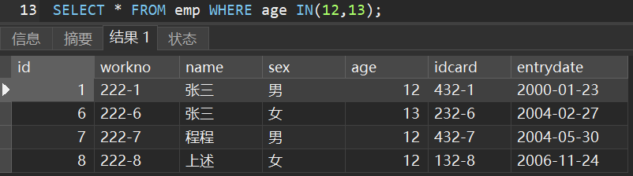

# MySQL基础

> 前言：是不是觉得啃官方文档很难受？但其实官网文档才是最最精华的资料！平时开发过程中记得查询官方
>
> * [MySQL 5.7参考文档](https://dev.mysql.com/doc/refman/5.7/en/preface.html)

## 一、MySQL下载及安装

下载地址为[https://www.mysql.com/downloads/](https://www.mysql.com/downloads/)


下载完成后点击得到的`.msi`文件，直接无脑`next`，其中密码可以设置得简单一点，这个密码一定要记得，之后会经常使用

------

MySQL服务默认开机自启，想要停止则去到服务中手动关闭


## 二、MySQL升级

### 1.备份数据库

`cmd`进入数据库中的`bin`，输入命令`mysqldump -u root -p --all-databases > D:\Backup.sql`，其中`root`是用户名，`>`后是输出路径，`.sql`不需要新建

```cmd
C:\Users\CJ>e:

C:\Users\CJ>cd E:\shujuku\bin

E:\shujuku\bin>mysqldump -u root -p --all-databases > D:\Backup.sql
Enter password: ********
```

> 忘记数据库安装路径解决办法：在服务中，右键MySQL服务点击属性
>
> 

### 2.卸载原来的Mysql


## 三、MySQL概述

### 1.MySQL客户端连接

#### 2.1.MySQL提供的客户端命令行工具


#### 2.2.系统自带得命令行工具

>  想要在任意位置使用MySQL命令则需要配置环境变量，配置环境变量请参考JDK配置方案

进入命令提示符，输入命令`mysql -u root -p`即可


#### 2.3.图形化界面工具Navicat

### 2.MySQL的数据模型

当我们在自己的电脑上安装过数据库后，我们的电脑就成为了数据库服务器。客户端可通过数据库管理系统创建数据库


## 四、SQL语句

### 1.SQL通用语法

SQL语句可单行或多行书写，**以分号结尾**，可通过空格或缩进来增强语句的可读性

SQL语句不区分大小写，但关键字建议大写

### 2.SQL分类

| 分类  |                          说明                          |
| :---: | :----------------------------------------------------: |
| `DDL` |   数据库定义语言，用于定义数据库对象，即库、表、字段   |
| `DML` |       数据库操作语言，用于对数据库中的数据增删改       |
| `DQL` |         数据库查询语言，用于查询数据库中的记录         |
| `DCL` | 数据库控制语言，用于创建数据库用户和控制数据库访问权限 |

### 3.DDL数据定义语言

#### 3.1.库的DDL

查询所有数据库：`show databases;`

创建数据库：`create databese [if not exists] 库名 [default charset 字符集] [collate 排序规则];`

> 字符集建议`utf8mb4`

删除数据库：`drop database [if exists] 库名;`

使用数据库：`use 库名;`

查询当前数据库：`select database();`

#### 3.2.表的DDL

> 前提：需要先进入某个数据库，即`use 库名;`

查询数据库的所有表：`show tables;`

创建表：

```mysql
create table 表名(
	字段1 类型1 [comment 注释1],	/* 类型的介绍放在四中 */
    字段2 类型2 [comment 注释2]	/* 注意最后一句不用, */
) [comment 表注释];
```

查询表结构：`desc 表名;`

查询指定表的建表语句：`show create table 表名;`

修改表名：`alter table 表名 rename to 新表名;`

删除表：`drop table [if exists] 表名;`

删除表后重新创建该表：`truncate table 表名;`，这样使表中的数据全部被删除，只留下表结构


#### 3.3.字段的DDL

添加字段(列)：`alter table 表名 add 新字段名 数据类型 [comment 注解] [约束];`

修改字段名和字段类型：`alter table 表名 change 旧字段名 新字段名 新数据类型 [comment 注解] [约束];`

删除字段：`alter table 表名 drop 字段名;`

### 4.DML数据操作语言

#### 4.1.添加数据

给指定字段添加数据：`insert into 表名(字段名1,字段名2..) values (值1,值2..);`

批量给指定字段添加数据：`insert into 表名(字段名1,字段名2..) values (值1,值2..),(值1,值2..);`

给所有字段添加数据：`insert into 表名 values (值1,值2..);`

批量给所有字段添加数据：`insert into 表名 values (值1,值2..),(值1,值2..);`

> 添加数组时注意值得顺序和字段得顺序一一对应，字符串型和日期型数组包含在引号中，插入的数据大小应该在数据类型范围内

#### 4.2.删除数据

删除数据：`delete from 表名 [where 过滤条件];`

#### 2.3.更新数据	

修改数据：`update 表名 set 字段1=值1,字段2=值2.. [where 过滤条件];`

### 5.DQL数据查询语言

> 创建数据作为操作数据
>
> ```mysql
> create table emp(
> 	id int comment '编号',
>     workno varchar(10) comment '员工工号',
>     name varchar(10) comment '员工姓名',
>     sex char(1) comment '性别',
>     age tinyint unsigned comment '年龄',
>     idcard char(18) comment '身份证',
>     entrydate date comment '入职时间'
> ) comment '员工信息表';
> 
> use mytest;
> 
> truncate table emp;
> 
> insert into emp values (1,'222-1','张三','男',12,'432-1','2000-01-23');
> insert into emp values (2,'222-2','李四','男',18,'232-2','2001-03-04');
> insert into emp values (3,'222-3','奈斯','女',11,'132-3','2001-08-21');
> insert into emp values (4,'222-4','嘻嘻','男',14,'232-4','2002-06-14');
> insert into emp values (5,'222-5','混合','男',14,'232-5','2003-01-16');
> insert into emp values (6,'222-6','张三','女',13,'232-6','2004-02-27');
> insert into emp values (7,'222-7','程程','男',12,'432-7','2004-05-30');
> insert into emp values (8,'222-8','上述','女',12,'132-8','2006-11-24');
> insert into emp values (9,'222-9','单独','男',16,'232-9','2010-12-01');
> ```

#### 5.1.基本查询

查询多个字段：`select 字段名1,字段名2... from 表名;`或`select * from 表名;`


设置别名查询：`select 字段名1 as 别名1,字段名2 as 别名2... from 表名;`


去除重复记录：`select distinct 字段名1,字段名2... from 表名;`


#### 5.2.条件查询

条件查询：`select 字段名1,字段名2... from 表名 where 条件列表;`

条件内可使用到的运算符分为比较运算符和逻辑运算符

|    比较运算符     |                             说明                             |                    案例                    |
| :---------------: | :----------------------------------------------------------: | :----------------------------------------: |
|   `> >= < <= =`   |                                                              |                                            |
|    `<>`或`!=`     |                            不等于                            |  |
| `between A and B` |          `[A,B]`范围内，相当于`name>=A and name<=B`          |  |
|     `in(A,B)`     |                           `A`或`B`                           |  |
|    `like 'xx'`    | 模糊匹配，`like 'X%'`表示X后匹配任意个字符，`like 'X_'`表示X后匹配一个字符 |  |
|  `is [not] null`  |                         [不]是`null`                         |  |

| 逻辑运算符  | 说明 |                    案例                    |
| :---------: | :--: | :----------------------------------------: |
| `and`或`&&` |  与  |  |
| `or`或`||`😂 |  或  |  |
| `not`或`!`  |  非  |                                            |

#### 5.3.分组查询

分组查询常常与聚合函数一起使用，故此处介绍聚合函数，**注意所有的`null`值不参与聚合函数的运算**

| 聚合函数 |                    案例                    |
| :------: | :----------------------------------------: |
|  `max`   |  |
|  `min`   |  |
|  `avg`   |  |
|  `sum`   |  |
| `count`  |  |

------

分组查询：`select 字段名1,字段名2... from 表名 [where 条件] group by 分组字段名 [having 分组后条件];`

在上述语句中发现`where`和`having`后都是条件，那么二者存在什么样的区别？

|     区别     |                             说明                             |
| :----------: | :----------------------------------------------------------: |
| 执行时机不同 | `where`在分组前过滤，不满足`where`条件的数据不参与分组，`having`在分组后过滤 |
| 判断条件不同 |           `where`不能使用聚合函数，但`having`可以            |

讲解到此分组的效果是怎样的呢？让我们通过以下几个例题学习

* 根据性别分组，统计男性员工和女性员工的数量

  

* 根据性别分组，统计男性员工和女性员工的平均年龄

  

* 查询年龄小于16岁的员工，根据地址进行分组，获取员工数量大于1的工作地址

  

#### 5.4.排序查询

排序查询：`select 字段名1,字段名2... from 表名 order by 字段1 排序方式1,字段2 排序方式2;`

排序方式有**ASC升序和DESC降序**两种，默认升序；若多个字段排序，则第一个字段值相同时，按照第二个字段排序

查询的效果是怎样的呢？让我们通过以下几个例题学习

* 根据年龄升序排序

  

* 根据年龄降序排序，若年龄相同则按入职时间升序排序

  

#### 5.5.分页查询

分页查询：`select 字段名1,字段名2... from 表名 limit 起始索引,查询记录数;`

* **起始索引从`0`开始，按照公式`[(当前页-1)*每页记录数]`来计算起始索引**；若查询的是第一页，起始索引可省略；分页语言是数据库的方言，不同的数据库有不同的分页命令

分页的效果是怎样的呢？让我们通过以下几个例题学习

* 查询第一页员工数据，每页展示3条记录

  

* 查询第三页员工数据，每页展示3条记录

  

#### 5.6.小结

DQL的编写顺序如下，若不按顺序则SQL语句报错

```mysql
select [distinct] <column1 [as newname],colimn2...>
  from <table>
    [where <条件>]
      [group by xx]
        [having <条件>]
          [order by xx asc/desc]
          	[limit xx,xx]
```

其实DQL的执行顺序是`from -> where -> group by -> having -> select -> order by -> limit`

### 6.DCL数据控制语言

#### 6.1.用户管理

数据库的所有用户信息都放在`mysql`库的`user`表中，查询用户语句如下

```mysql
USE mysql;
SELECT * FROM user;
```

创建用户：`create user '用户名'@'主机名' identified by '密码';`，**创建用户后没有任何权限**，主机名写成`%`表示任意主机

修改用户密码：`alter user '用户名'@'主机名' identified with mysql_native_password by '新密码';`

删除用户：`drop user '用户名'@'主机名';`

#### 6.2.权限控制

MySQL中设置了很多权限，但常用的是如下几种

|          权限           |       说明       |
| :---------------------: | :--------------: |
| `all`或`all privileges` |     所有权限     |
|        `insert`         |     插入数据     |
|        `delete`         |     删除数据     |
|        `update`         |     修改数据     |
|        `select`         |     查询数据     |
|         `alter`         |      修改表      |
|         `drop`          | 删除库、表、视图 |
|        `create`         |    创建库、表    |

查询权限：`show grants for '用户名'@'主机名';`

授予权限：`grant 权限列表 on 库名.表名 to '用户名'@'主机名';`

撤销权限：`revoke 权限列表 on 库名.表名 from '用户名'@'主机名';`

> 权限之间使用`,`分割，库名和表名可以使用`*`通配符

## 五、SQL数据类型

建表语句中我们发现了需要数据类型，那么以下就是数据类型的介绍

### 1.数值类型

|    类型     | 大小(字节) |        说明        |     有符号范围(signed)     |  无符号范围(unsigned)  |
| :---------: | :--------: | :----------------: | :------------------------: | :--------------------: |
|  `tinyint`  |     1      |      小整数值      |        `(-128,127)`        |       `(0,255)`        |
| `smallint`  |     2      |      大整数值      |      `(-32768,32767)`      |      `(0,65535)`       |
| `mediumint` |     3      |      大整数值      |    `(-8388608,8388607)`    |     `(0,16777215)`     |
|   `int`👀    |     4      |      大整数值      | `(-2147483648,2147483647)` |    `(0,4294967295)`    |
|  `bigint`   |     8      |     极大整数值     |      `(-2^63,2^63-1)`      |      `(0,2^64-1)`      |
|   `float`   |     4      |    单精度浮点数    |                            |                        |
|  `double`👀  |     8      |    双精度浮点数    |                            |                        |
|  `dectmal`  |            | 小数值，精确定点数 |   依赖于M(精度)和D(标度)   | 依赖于M(精度)和D(标度) |

例如年龄可以设计成`age tinyint unsigned`；成绩可以设计成`score double(4,1)`，4表示精度，即数字总位数`100.0`，1表示标度，即小数部分位数

### 2.字符串类型

|     类型     |   大小(字节)    |      说明      |
| :----------: | :-------------: | :------------: |
|   `char`👀    |      0~255      |   定长字符串   |
|  `varchar`👀  |     0~65535     |   变长字符串   |
|  `tinyblob`  |      0~255      |  短二进制数据  |
|  `tinytext`  |      0~255      |  短文本字符串  |
|    `blob`    |    0~65 535     |  长二进制数据  |
|    `text`    |    0~65 535     |  长文本字符串  |
| `mediumblob` |  0~16 777 215   | 中等二进制数据 |
| `mediumtext` |  0~16 777 215   | 中等文本字符串 |
|  `longblob`  | 0~4 294 967 295 | 超长二进制数据 |
|  `longtext`  | 0~4 294 967 295 | 超长文本字符串 |

二进制数据就比如图片、音频、视频、软件的安装包等，但是开发过程中并不这么做，因为性能不高且不方便管理

`char(10)`使用时，若只存储一个字符的空间，那么其他9个空间会使用空格补位；`varchar(10)`使用时，若只存储一个字符的空间，那么就只占一个字符的空间

**`char`的性能更好**，因为`varchar`在使用时还需要计算空间

* 若存在`username`，已知其长度不能超过50，使用`varchar(50)`会更好，因为用户输入的用户名长度不确定
* 若存在`sex`，已知其只有男和女，所占空间是确定的，使用`char(1)`更好

### 3.日期时间类型

|    类型     | 大小(字节) |       说明       |         格式          |
| :---------: | :--------: | :--------------: | :-------------------: |
|   `date`👀   |     3      |      日期值      |     `yyyy-MM-dd`      |
|   `time`👀   |     3      |      时间值      |      `HH:mm:ss`       |
|   `year`    |     1      |       年份       |        `yyyy`         |
| `datetime`👀 |     8      | 混合日期和时间值 | `yyyy-MM-dd HH:mm:ss` |
| `timestamp` |     4      | 混合日期、时间值 | `yyyy-MM-dd HH:mm:ss` |

### 4.案例练习


```mysql
create table emp(
	id int comment '编号',
    workno varchar(10) comment '员工工号',
    name varchar(10) comment '员工姓名',
    sex char(1) comment '性别',
    age tinyint unsigned comment '年龄',
    idcard char(18) comment '身份证',
    entrydate date comment '入职时间'
) comment '员工信息表';
```


## 六、SQL函数

> 只讲比较常用的

### 1.字符串函数

|            函数            |                     说明                      |                    案例                    |
| :------------------------: | :-------------------------------------------: | :----------------------------------------: |
|      `concat(s1,s2)`       |                  字符串拼接                   |  |
|        `lower(str)`        |              将`str`全部转成小写              |  |
|        `upper(str)`        |              将`str`全部转成大写              |  |
|     `lpad(str,n,pad)`      | 使用字符串`pad`在`str`左边填充，直到长度为`n` |  |
|     `rpad(str,n,pad)`      | 使用字符串`pad`在`str`右边填充，直到长度为`n` |  |
|        `trim(str)`         |          去除字符串头部和尾部的空格           |  |
| `substring(str,start,len)` |  从`start`开始截取`str`内`len`个长度的字符串  |  |

### 2.数值函数

|     函数     |           说明            |
| :----------: | :-----------------------: |
|  `ceil(x)`   |         向上取整          |
|  `floor(x)`  |         向下取整          |
| `round(x,y)` |  四舍五入，保留`y`位小数  |
|  `mod(x,y)`  | 返回`x/y`的模，模就是余数 |
|   `rand()`   |     返回`0~1`内随机数     |

案例：通过数据库的函数，生成一个六位数的随机验证码


### 3.日期函数

|                函数                 |                        说明                         |                    案例                    |
| :---------------------------------: | :-------------------------------------------------: | :----------------------------------------: |
|             `curdate()`             |                    获取当前日期                     |  |
|             `curtime()`             |                    获取当期时间                     |  |
|               `now()`               |                 获取当前日期和时间                  |  |
|            `year(date)`             |                获取指定`date`的年份                 |  |
|            `month(date)`            |                获取指定`date`的月份                 |  |
|             `day(date)`             |                获取指定`date`的日期                 |  |
| `date_add(date,interval expr type)` | 返回`date`加上单位为`type`的时间间隔`expr`后的时间  |  |
|       `datediff(date1,date2)`       | 返回`date1`到`date2`之间的天数，注意是`date1-date2` |  |

### 4.流程函数

|                           函数                           |                           说明                            |                    案例                    |
| :------------------------------------------------------: | :-------------------------------------------------------: | :----------------------------------------: |
|                     `if(value,t,f)`                      |          若`value`为`true`，返回`t`，否则返回`f`          |  |
|                 `ifnull(value1,value2)`                  |     若`value1`不为空，返回`value1`，否则返回`value2`      |  |
|    `case when [val1] then [res1] else [default] end`     |   若`val1`为`true`，返回`res1`，否则返回`default`默认值   |  |
| `case [expr] when [val1] then [res1] elsc [default] end` | 若`expr`值等于`val1`，返回`res1`，否则返回`default`默认值 |  |

> 聚合函数请看[四、5.3.分组查询]

## 七、约束

### 1.约束是什么？

约束作用于表的字段，可以在创建表或修改表时添加约束，用于**限制存储在表中的数组**，保证数据库中数据的正确性、有效性、完整性

### 2.分类

|          约束          |                        说明                        |    关键字     |
| :--------------------: | :------------------------------------------------: | :-----------: |
|        主键约束        |      主键是一行数据的唯一标识，要求非空且唯一      | `primary key` |
|        外键约束        | 外键使两张表之间建立联系，保证数据的一致性和完整性 | `foreign key` |
|        唯一约束        |            保证某字段的数据唯一，不重复            |   `unique`    |
|        非空约束        |                保证某字段的数据非空                |  `not null`   |
|        默认约束        |          保存数据时未指定值，则使用默认值          |   `default`   |
| 检查约束(MySQL5不支持) |               保证某字段满足一个条件               |    `check`    |

### 3.语句

行级约束用的最多，其他的需要能看得懂

#### 3.1.行级约束

```mysql
CREATE TABLE user(
	id INT PRIMARY KEY auto_increment COMMENT '编号',	-- 主键(唯一且非空)，auto_increment表示自增
	name VARCHAR(10) NOT NULL UNIQUE COMMENT '姓名',	-- 非空，唯一
	age INT CHECK(age>0 && age<=120) COMMENT '年龄',	-- (0,120]范围内
	status CHAR(1) DEFAULT '1' COMMENT '状态',	-- 默认1
	sex CHAR(1) COMMENT '性别'
) COMMENT '用户表';
```

#### 3.2.表级约束

```mysql
CREATE TABLE user(
	id INT auto_increment COMMENT '编号',
	`name` VARCHAR(10) COMMENT '姓名',
	age INT COMMENT '年龄',
	`status` CHAR(1) COMMENT '状态',
	sex CHAR(1) COMMENT '性别',
	CONSTRAINT id_primary PRIMARY KEY(id)
    -- constraint 外键约束名 foreign key(列名) references 主表名(主键名)
) COMMENT '用户表';
```

#### 3.3.添加约束

主键约束：`alter table 表名 add constraint 主键约束名 primary key(列名..)`

外键约束：`alter table 表名 add constraint 外键约束名 foreign key(列名) references 主表名(主键名)`

唯一约束：`alter table 表名 add constraint 唯一约束名称 unique(列名)`

非空约束：`alter table 表名 modify 列名 not null`

默认约束：`alter table 表名 modify 列名 default 值`

检查约束：`alter table 表名 add constraint 检查约束名 check(检查条件)`

> 删除约束：`alter table 表名 drop foreign key 约束名称`

### 4.外键约束

外键约束可建立两张表之间的联系，从而保证数据的一致性和完整性，防止非法数据插入外键列


当使用语句`alter table emp add constraint dept_id_foreign foreign key(dept_id) references dept(id)`为员工表添加外键后，再次删除部门表的第一条数据时，该数据删除失败！**必须先删除子表的外键后才可删除父表**，这其实和外键约束的删除更新行为有关，外键约束的删除更新行为如下

|     行为     |                             说明                             |
| :----------: | :----------------------------------------------------------: |
|  `noaction`  | 当在父表中删除/更新对应记录时，首先检查该记录是否有对应外键，如果有则不允许删除/更新(默认) |
|  `restrict`  | 当在父表中删除/更新对应记录时，首先检查该记录是否有对应外键，如果有则不允许删除/更新(默认) |
|  `cascade`   | 当在父表中删除/更新对应记录时，首先检查该记录是否有对应外键，如果有则也删除/更新外键在子表中的记录 |
|  `set null`  | 当在父表中删除对应记录时，首先检查该记录是否有对应外键，如果有则设置子表中该外键值为`null`，这要求该外键允许取`null` |
| `setdefault` | 当在父表中删除对应记录时，首先检查该记录是否有对应外键，如果有则设置子表中该外键值为默认值，`Innodb`不支持 |

具体的语法为`alter table 表名 add constraint 外键约束名 foreign key(列名) references 主表名(主键名) on update 更新行为 on delete 删除行为`

## 八、多表查询

### 1.多表关系

项目开发中进行数据库表结构设计时，会根据业务需求及业务模块之间的关系分析并设计表结构，由于业务之间相互关联，所以各个表结构之间也存在着各种联系，表之间的关系基本上分为三种，即一对多、多对多、一对一

* 一对多：在员工和部门之间，一个员工只能属于一个部分，但一个部门可以有多个员工，**一般在多的一方设置外键**

  

* 多对多：在学生和课程之间，一个学生可学习多个课程，一个课程可以被多个学生学习，**一般建立一张中间表，中间表包含两个外键，分别关联两方主键**

  

* 一对一：在用户和用户详情之间就是一对一的关系，**多用于单表拆分，将表的基础字段放在一张表中，其他详情字段放在另一张表，以提升效率，一般在任意一张表中加入外键即可，并且设置外键唯一**

  

### 2.多表查询概述

多表查询顾名思义就是从多张表中查询数据，例如`select * from emp,dept;`查出来的结果的数量是**笛卡尔积**，笛卡尔积指的是集合A和集合B所有组合的情况，所有组合内存在许多无效的数据，所以出现了接下来的各种连接查询


### 3.连接查询

> ```mysql
> create table emp(
> 	id int auto_increment primary key comment 'ID',
> 	name varchar(50) not null comment '姓名',
> 	age int comment '年龄',
> 	job varchar(20) comment '职位',
> 	salary int comment '薪资',
> 	entrydate date comment '入职时间',
> 	managerid int comment '直属领导ID',
> 	dept_id int comment '部门ID'
> )comment '员工表';
> 
> INSERT INTO emp(id, name, age, job,salary, entrydate, managerid, dept_id)
> 	VALUES
> 		(null,'金庸',66,'总裁',20000,'2000-01-01',null,5),
> 		(null,'张无忌',20,'项目经理',12500, '2005-12-05',1,1),
> 		(null,'杨逍',33,'开发', 8400,'2000-11-03',2,1),
> 		(null,'韦一笑',48,'开发',11000,'2002-02-05',2,1),
> 		(null,'常遇春',43,'开发',10500,'2004-09-07',3,1),
> 		(null,'小昭',19,'程序员鼓励师',6600,'2004-10-12',2,1),
> 		(null,'灭绝',60,'财务总监',8500,'2002-09-12',1,3),
> 		(null,'周芷若',19,'会计',48000,'2006-06-02',7,3),
> 		(null,'丁敏君',23,'出纳',5250,'2009-05-13',7,3),
> 		(null,'赵敏',20,'市场部总监',12500,'2004-10-12',1,2),
> 		(null,'鹿杖客',56,'职员',3750,'2006-10-03',10,2),
> 		(null,'鹤笔翁',19,'职员',3750,'2007-05-09',10,2),
> 		(null,'方东白',19,'职员',5500,'2009-02-12',10,2),
> 		(null,'张三丰',88,'销售总监',14000,'2004-10-12',1,4),
> 		(null,'俞莲舟',38,'销售',4600,'2004-10-12',14,4),
> 		(null,'宋远桥',40,'销售',4600,'2004-10-12',14,4),
> 		(null,'陈友谅',42,null,2000,'2011-10-12',1,null);
> 
> create table dept(
> 	id int auto_increment primary key comment 'ID',
> 	name varchar(50) not null comment '部门名称'
> )comment '部门表';
> 
> INSERT INTO dept (id, name) 
> 	VALUES 
> 		(null,'研发部'),
> 		(null,'市场部'),
> 		(null,'财务部'),
> 		(null,'销售部'),
> 		(null,'总经办'),
> 		(null,'人事部');
> 
> -- 添加外键
> alter table emp add constraint fk_emp_dept_id foreign key (dept_id) references dept(id);
> ```

#### 3.1.内连接

内连接相当于查询AB的**交集**部分，保证查询出的两个表**所有的行都满足条件**，语法格式有两种，字段使用`表名.字段名`的格式使用，也可通过`表别名.字段名`的格式使用

* 隐式：`select 字段列表 from 表1,表2 where 条件;`
* 显示：`select 字段列表 from 表1 [inner] join 表2 on 连接条件;`，

请完成需求查询员工的姓名以及部门名称，完成它！


#### 3.2.外连接

**左外连接Left Join**：以左表为主，优先查出左表中满足条件的行，右表不满足条件的行使用`null`填充，语法格式为`select 字段列表 from 表名1 left join 表名2 on 表1.字段=表2.字段;`，请完成需求查询每个员工的姓名以及部门名称


**右外连接Right Join**：以右表为主，优先查出右表中满足条件的行，左表不满足条件的行使用`null`填充，语法格式为`select 字段列表 from 表名1 right join 表名2 on 表1.字段=表2.字段;`，请完成需求查询每个部门的名字和部门内所有的员工


#### 3.3.自连接

自连接查询就是自己连接自己，可以是内连接，也可以是外连接，语法格式为`select 字段列表 from 表1 别名1 join 表1 别名2 on 条件;`，

请完成以下需求

* 查询员工及其领导的名称

  

* 查询员工及其领导的名称，若员工没有领导也要查询出来

  

### 4.联合查询

联合查询就是将多次查询的结果联合起来，形成一个新的查询结果，语法格式如下

```mysql
select 字段列表 from 表1
联合关键字
select 字段列表 from 表2;
```

联合关键字如下

|   关键字    |            说明            |                    案例                    |
| :---------: | :------------------------: | :----------------------------------------: |
|   `union`   | 自动剔除**完全重复**的信息 |  |
| `union all` | 显示所有的信息，包括重复的 |  |

### 5.子查询

嵌套查询又称子查询，语法格式是`select * from 表1 where 列 = (select 列 from 表2);`，子查询外可以是增删改查的任何一个

根据子查询的结果不同，分成如下几类

|    分类    |         说明         |             常用操作符              |                    案例                    |
| :--------: | :------------------: | :---------------------------------: | :----------------------------------------: |
| 标量子查询 |  子查询结果为单个值  |   `=`、`<>`、`>`、`>=`、`<`、`<=`   |  |
|  列子查询  |   子查询结果为一列   | `in`、`notin`、`any`、`some`、`all` |  |
|  行子查询  |   子查询结果为一行   |      `=`、`<>`、`in`、`not in`      |  |
|  表子查询  | 子查询结果为多行多列 |                `in`                 |  |

## 九、事务

### 1.事务是什么？

事务是一组操作的集合，是一个**不可分割的单位**，事务会将所有操作作为一个整体一起向系统提交或撤销操作请求，这些操作**要么同时成功，要么同时失败**

MySQL的事务默认是自动提交的，也就是说当执行一条DML语句时，MySQL会立即隐式的提交事务

### 2.事务操作

#### 2.1.引入

模拟转账的场景，首先创建数据如下

```mysql
CREATE TABLE account(
	id int auto_increment PRIMARY KEY COMMENT '主键',
	name VARCHAR(10) COMMENT '姓名',
	money INT COMMENT '余额'
);

INSERT INTO account VALUES(null,'张三',2000),(null,'李四',2000);
```

正常情况下转账分为如下三步

```mysql
-- 1.查询张三账户余额
SELECT * FROM account WHERE `name`='张三';

-- 2.将张三账户余额-1000
UPDATE account SET money=money-1000 WHERE `name`='张三';

-- 3.将李四账户余额+1000
UPDATE account SET money=money+1000 WHERE `name`='李四';
```

但是到达第三步前出现故障，转账是否还能成功？


观察上图发现，张三转出1k，但李四并没有收到，难道这是两个大冤种？！为了防止这种事情发生，我们需要将转账的三个步骤看成是一个事务，需要同时成功或失败！

> 转账步骤内其实是有事务的，只不过此时每条SQL语句一个事务，三个步骤不在同一个事务内

#### 2.2.设置事务方式一

查看和设置事务的方式如下

```mysql
SELECT @@autocommit;
SET @@autocommit=0;
```

将事务设置成显示提交后，需要手动提交事务`commit;`，一旦事务发生错误，需要回滚`rollback;`

------

继续上述案例，设置事务

```mysql
SELECT @@autocommit;
SET @@autocommit=0;

-- 1.查询张三账户余额
SELECT * FROM account WHERE `name`='张三';
-- 2.将张三账户余额-1000
UPDATE account SET money=money-1000 WHERE `name`='张三';
-- 3.将李四账户余额+1000
UPDATE account SET money=money+1000 WHERE `name`='李四';

-- 此时事务还未提交，刷新表发现数据并未改变

-- commit;提交事务以后，发现数组更新
COMMIT;
```

```mysql
SELECT @@autocommit;
SET @@autocommit=0;

-- 1.查询张三账户余额
SELECT * FROM account WHERE `name`='张三';
-- 2.将张三账户余额-1000
UPDATE account SET money=money-1000 WHERE `name`='张三';

模拟故障，因为这不是一条SQL语句

-- 3.将李四账户余额+1000
UPDATE account SET money=money+1000 WHERE `name`='李四';

-- 此时事务还未提交，刷新表发现数据并未改变

-- rollback;回滚后，发现数据恢复
ROLLBACK;
```

#### 2.3.设置事务方式二

开启事务的命令为`start transaction 或 begin;`

开启事务后，需要手动提交事务`commit;`，一旦事务发生错误，需要回滚`rollback;`

------

继续上述案例，设置事务

```mysql
-- 开启事务
START TRANSACTION;

-- 1.查询张三账户余额
SELECT * FROM account WHERE `name`='张三';
-- 2.将张三账户余额-1000
UPDATE account SET money=money-1000 WHERE `name`='张三';
-- 3.将李四账户余额+1000
UPDATE account SET money=money+1000 WHERE `name`='李四';

-- 此时事务还未提交，刷新表发现数据并未改变

-- commit;提交事务以后，发现数组更新
COMMIT;
```

```mysql
-- 开启事务
START TRANSACTION;

-- 1.查询张三账户余额
SELECT * FROM account WHERE `name`='张三';
-- 2.将张三账户余额-1000
UPDATE account SET money=money-1000 WHERE `name`='张三';

模拟故障，因为这不是一条SQL语句

-- 3.将李四账户余额+1000
UPDATE account SET money=money+1000 WHERE `name`='李四';

-- 此时事务还未提交，刷新表发现数据并未改变

-- rollback;回滚后，发现数据恢复
ROLLBACK;
```

### 3.事务四大特性

**原子性A**：事务是不可分割的最小单元，要么同时成功，要么同时失败

**一致性C**：事务完成时，必须使所有数据保持一致状态

**隔离性I**：数据库提供的隔离机制，保证事务在不受外部并发操作影响的独立环境下运行

**持久性D**：事务一旦提交或回滚，他对数据库中数据的改变是持久的

原子性
同时成功，同时失败，将事务中进行的操作捆绑成一个不可分割的单元

数字库：rollback+savepoint+commit
java：connection.setAutoCommit()
		cinnection.commit()
		connection.rollback()
1
2
3
4
5
6
一致性
事务完成时，所有数据必须都保持一致状态
1
隔离性
一个事务的执行不能被其他事务干扰，
并发的事务之间是隔离的，不能相互干扰
1
2
持久性
事务一旦提交，数据库中数据的改变是持久的
————————————————
版权声明：本文为CSDN博主「ChenJieYaYa」的原创文章，遵循CC 4.0 BY-SA版权协议，转载请附上原文出处链接及本声明。
原文链接：https://blog.csdn.net/weixin_51699336/article/details/123139460


### 4.并发事务问题

**脏读**：一个事务读到另一个事务还未提交的数据

**不可重复读**：一个事务先后读取同一条记录，但两次读到的数据不同

**幻读**：一个事务在查询数据时没有对应的行，但在插入数据时发现该行数据已经存在

**丢失更新**：两个事务同时更新一行数据，后提交(或撤销)的事务覆盖先提交的数据

> 不好理解就去看看[视频](https://www.bilibili.com/video/BV1Kr4y1i7ru/?p=54&spm_id_from=pageDriver&vd_source=8811945bf338927db8b1ca45a8f75a87)昂

### 5.事务隔离级别

|    隔离级别    | 说明 | 脏读 | 不可重复读 | 幻读 |
| :------------: | :--: | :--: | :--------: | :--: |
|    读未提交    |      |  ✔   |     ✔      |  ✔   |
|    读已提交    |      |  ❌   |     ✔      |  ✔   |
| 可重复读(默认) |      |  ❌   |     ❌      |  ✔   |
|    可串行化    |      |  ❌   |     ❌      |  ❌   |

**从上到下性能依次降低，但隔离级别越来越高，数据越安全**

------

查看隔离级别的语句为`select @@tx_isolation;`或`select @@transaction_isolation`

设置事务隔离级别语句为`set [session|global] transaction isolation level {read uncommitted|read committed|repeatable read|serializable}`

* `session`表示仅对当前客户端窗口有效，`global`表示对所有客户端窗口有效

> 验证各种隔离级别是否可以解决并发事务问题，请移步[视频6:14](https://www.bilibili.com/video/BV1Kr4y1i7ru/?p=55&spm_id_from=pageDriver&vd_source=8811945bf338927db8b1ca45a8f75a87)


